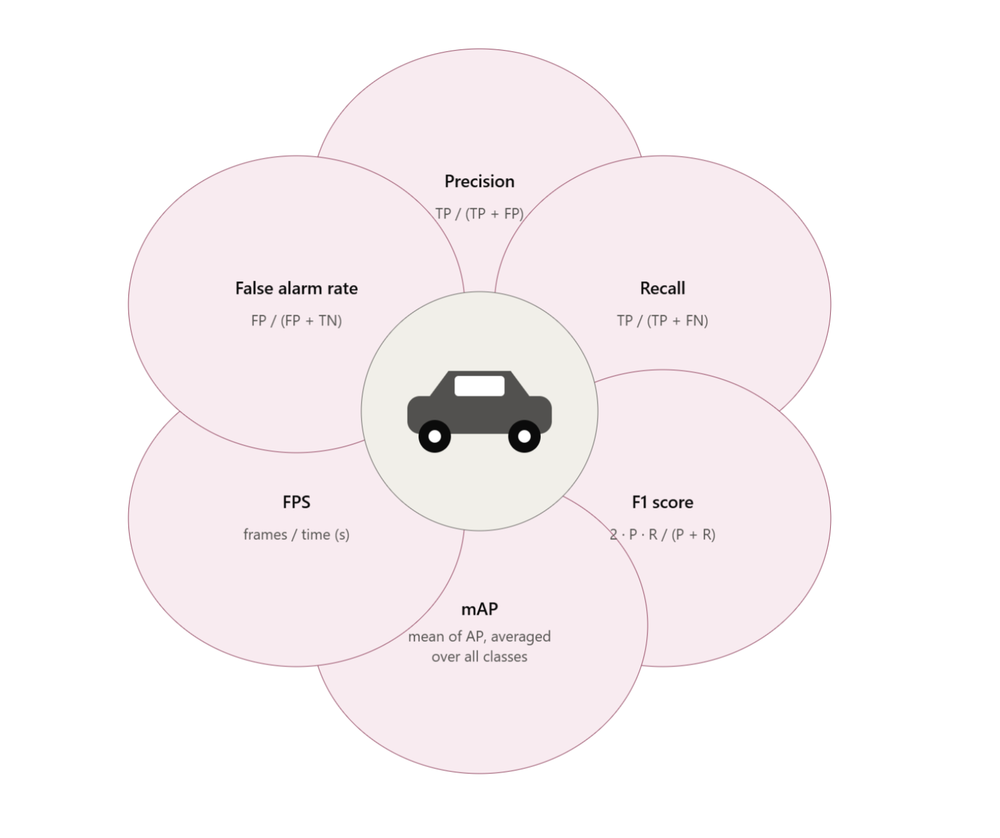
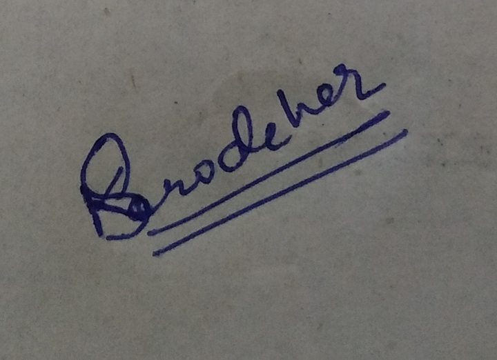

# AI-Powered Driver Drowsiness Detection System **Milestone 1**

---

## 1. Introduction

Driver fatigue is an important road safety problem, especially during night travel, long-distance driving, and commercial vehicle operations. When a driver continues driving for a long time without proper rest, there is a higher chance of slow reaction time, reduced attention, frequent yawning, eye closure, and head nodding. These signs may look small initially, but they can become dangerous if they are not detected at the right time.

With the rapid development of road infrastructure in India, the usage of cabs, commercial vehicles, private cars, and long-distance transport services is increasing. Along with this, many vehicles are also getting more advanced features such as infotainment systems, driver assistance, and in some cases self-driving or semi-automated driving support. However, one important area that still needs attention is automated driver alertness monitoring.

The need for such a system can be understood from different practical viewpoints:

- Cab owners may want to ensure that their vehicles are being driven safely, especially during late-night or long-distance rides.
- Truck agencies may want to check whether driver rotation and rest breaks are being followed properly.
- Bus operators may want to improve passenger safety during long routes and night travel.
- Private car owners may also benefit from timely alerts during their own long-distance drives.
- Even with experienced drivers, fatigue can still affect attention and reaction time.

In this project, we aim to build an **AI-Powered Driver Drowsiness Detection System** that can monitor the driver using camera input and detect signs of drowsiness in real time. Initially, the system will focus on detecting yawning, eye closure, and head position. Based on these inputs, the system will classify the driver’s state and generate alerts when required.

The goal is not to replace driver responsibility, but to provide an additional safety layer that can warn the driver before fatigue becomes dangerous.

---

## 2. Problem Statement

Driver fatigue is a leading cause of road accidents, particularly during night travel, long-distance driving, and commercial operations. Existing drowsiness detection systems often depend on only one cue, such as eye closure or yawning. Such systems may fail in real-world situations where lighting is poor, the driver is wearing glasses, the face is partially occluded, or the camera angle is not ideal.

Another practical issue is that many simple solutions use smartphone cameras. This may not be suitable for actual driving because phones are commonly used for navigation, calls, payments, and other travel-related activities. Keeping the phone camera active continuously can also cause battery drain and inconvenience for the driver.

### Clear Problem Definition

The problem is:

> How can we detect driver drowsiness in real time by combining multiple visual cues instead of depending on only one signal?

The proposed system should:

- Capture driver video input through a camera.
- Detect visual signs such as eye closure, yawning, and head movement.
- Use MediaPipe/OpenCV for facial landmark-based feature extraction.
- Use a YOLO-based model trained on a driver drowsiness dataset.
- Apply temporal logic so that single-frame errors do not trigger false alerts.
- Classify driver state into **Alert**, **Mild Fatigue**, and **Drowsy**.
- Generate audio or visual alerts according to severity.

This project aims to design and implement a real-time driver drowsiness detection system that uses multiple visual and behavioral signals. The planned system will combine facial landmark estimation using MediaPipe/OpenCV with a YOLO-based model trained on a driver drowsiness dataset. The system will focus on signals such as Eye Aspect Ratio, Mouth Aspect Ratio, blink behavior, yawning, and head-pose/nodding behavior.

A temporal sliding-window logic layer will be used so that a single incorrect frame does not immediately trigger an alert. Instead, the system will check whether fatigue-related signs continue across multiple frames or for a specific duration.

---

## 3. Motivation

As a team, multiple project ideas were discussed, and after internal discussion and voting, this problem statement was selected. One main reason for choosing this topic is that vehicle and road safety is a practical area where a working prototype can be demonstrated clearly. Unlike some topics that may remain mostly theoretical, this project gives us a chance to build something that can be shown using a camera-based setup.

Driver fatigue is a real-world issue and can affect private drivers, cab drivers, bus drivers, and truck drivers. In many cases, people may not realize that they are becoming tired while driving. A system that can detect early signs like eye closure, yawning, or head movement and warn the driver can be useful in such situations.

Another motivation behind choosing this project is that one of the team members has already worked with vision models. Since this project is based on computer vision and deep learning, that experience can help while working on face detection, facial landmark estimation, YOLO-based detection, and real-time video processing. This project also gives the team a good learning opportunity to explore MediaPipe, OpenCV, YOLO training, and alert generation logic in one system.

---

## 4. Scope and Boundaries

The current scope of the project is to build an initial prototype of a driver drowsiness detection system. For study and development purposes, the system will mainly use laptop camera or webcam input. However, in a practical implementation, the system is expected to work using a dedicated dashboard camera or embedded camera setup rather than depending on a mobile phone.

A mobile-phone-based setup is not preferred as the main deployment idea because drivers usually use phones for maps, calls, payments, and other travel-related activities. Keeping the phone camera continuously active can also create battery drain and usability issues. Therefore, the project direction is more suitable for a dashboard camera or in-vehicle camera setup.

### What this project covers

- Studying and understanding the selected driver drowsiness dataset.
- Using MediaPipe for facial landmark estimation.
- Using OpenCV for camera input and frame processing.
- Training or fine-tuning a YOLO-based model using the selected dataset.
- Detecting fatigue-related signs such as eye closure, yawning, and head position.
- Calculating indicators such as Eye Aspect Ratio and Mouth Aspect Ratio.
- Generating a fatigue score based on detected signs.
- Classifying driver state into **Alert**, **Mild Fatigue**, and **Drowsy**.
- Triggering audio or visual alerts based on severity level.

Initially, the main focus will be on yawning, eye closure, and head position. As the project progresses, additional safety-related features such as seat belt detection, mobile phone usage detection, and continuous driving duration may be explored depending on time and feasibility.

Edge deployment is also being explored. As of now, the team does not have strong prior experience with Edge AI deployment, but its feasibility is being checked. If possible, the model will be kept lightweight so that the system can later be optimized for edge devices.

### What this project does not cover

- Actual deployment inside a real car.
- Production-level hardware implementation.
- Mobile application development.
- Cloud-based driver monitoring dashboard.
- Automatic vehicle control, braking, or steering actions.
- Fully certified commercial safety system.

This project should be considered as an academic prototype and not a production-ready safety system. The main aim is to design, implement, and evaluate the detection pipeline and alert mechanism.

---

## 5. Stakeholders

| Stakeholder                                    | Relevance / Benefit                                                                                                                       |
| ---------------------------------------------- | ----------------------------------------------------------------------------------------------------------------------------------------- |
| **Cab Owners / Cab Agencies**            | Can use the system to check whether drivers are alert while handling customer trips, especially during late-night or long-duration rides. |
| **Truck Agencies / Logistics Companies** | Can use fatigue monitoring to ensure that driver rotation or rest breaks are followed properly during long-distance transport.            |
| **Government and Private Bus Operators** | Can improve passenger safety by monitoring driver drowsiness during long routes and night travel.                                         |
| **Drivers**                              | Can receive real-time alerts when signs of fatigue are detected, helping them take breaks before the situation becomes risky.             |
| **Passengers**                           | Benefit indirectly because the system can reduce the risk caused by sleepy or inattentive driving.                                        |
| **Fleet Owners**                         | Can reduce safety risks and improve monitoring of commercial vehicles by using driver alertness information.                              |

The direct benefit of the system is that drivers get timely alerts, while the indirect benefit is improved safety for passengers, vehicle owners, and transport operators.

---

## 6. Project Objectives

The following objectives are measurable and directly aligned with solving the problem described above:

1. **Study existing approaches** for driver drowsiness detection and identify their strengths and limitations.
2. **Understand the selected dataset** and verify its suitability for training a YOLO-based model.
3. **Use MediaPipe/OpenCV** for facial landmark-based analysis of eye closure, mouth opening, and head movement.
4. **Train or fine-tune a YOLO-based object detection model** on the selected drowsiness dataset.
5. **Combine multiple signals** such as eye closure, yawning, blink behavior, and head position.
6. **Apply temporal logic** so that single-frame errors do not immediately trigger false alerts.
7. **Classify driver state** into Alert, Mild Fatigue, and Drowsy.
8. **Evaluate the system** using precision, recall, F1-score, mAP, FPS, and false alarm rate.

---

## 7. Dataset Description

For this project, the selected dataset is the **Drowsiness Driver Dataset** available on Roboflow Universe.

**Dataset Link:** [https://universe.roboflow.com/ntutee-project/drowsiness-driver/dataset/1](https://universe.roboflow.com/ntutee-project/drowsiness-driver/dataset/1)

The dataset is publicly available and is designed for driver monitoring applications. It contains labeled images representing three important facial behaviors related to driver fatigue:

- Open eyes
- Closed eyes
- Yawning

These visual cues are among the most commonly used indicators for detecting driver alertness and fatigue. Prolonged eye closure and frequent yawning are especially useful signs in drowsiness detection systems.

The dataset is provided in YOLOv8 annotation format. This makes it directly compatible with modern YOLO-based object detection frameworks. Since the dataset already contains annotations, the team can focus more on model training, optimization, and evaluation instead of manually labeling images.

### 7.1 Dataset Source

| Attribute                   | Details                   |
| --------------------------- | ------------------------- |
| **Dataset Name**      | Drowsiness Driver Dataset |
| **Source**            | Roboflow Universe         |
| **Workspace**         | ntutee-project            |
| **Project**           | drowsiness-driver         |
| **Version**           | Version 1                 |
| **License**           | CC BY 4.0                 |
| **Annotation Format** | YOLOv8                    |

The dataset follows the standard YOLO directory structure. It includes separate folders for training, validation, and testing images. Each image has a corresponding label file that contains bounding box information.

### 7.2 Dataset Organization

```text
drowsiness-driver-1
├── train
│   ├── images
│   └── labels
│
├── valid
│   ├── images
│   └── labels
│
├── test
│   ├── images
│   └── labels
│
└── data.yaml
```

The `data.yaml` file contains information such as class names, number of classes, and dataset paths required for YOLO training.

### 7.3 Dataset Statistics

| Dataset Split   | Number of Images |
| --------------- | ---------------: |
| Training Set    |           17,961 |
| Validation Set  |            1,881 |
| Testing Set     |            1,826 |
| **Total** | **21,668** |

The training set contains the majority of the images. Validation and testing sets are used to monitor model performance and evaluate generalization.

### 7.4 Image Characteristics

| Property     | Value      |
| ------------ | ---------- |
| Image Width  | 640 pixels |
| Image Height | 640 pixels |
| Resolution   | 640 x 640  |
| Image Format | JPG        |

All images in the dataset have a uniform resolution of **640 x 640 pixels** and are stored in JPG format. Uniform dimensions simplify preprocessing and make the dataset easier to use with YOLO training pipelines.

The dataset includes images captured under different conditions such as different vehicle interiors, driver appearances, camera viewpoints, lighting conditions, and background environments. This variation can help the model learn more general visual patterns.

### 7.5 Dataset Classes

| Class ID | Class Name | Description               |
| -------- | ---------- | ------------------------- |
| 0        | Close      | Driver’s eyes are closed |
| 1        | Open       | Driver’s eyes are open   |
| 2        | Yawn       | Driver is yawning         |

These classes directly support the initial project goal of detecting eye closure and yawning. Head pose or nodding behavior will be handled separately using MediaPipe/OpenCV-based logic unless an additional dataset is added later.

### 7.6 Class Distribution

| Class           | Number of Objects |
| --------------- | ----------------: |
| Open            |             9,510 |
| Yawn            |             7,196 |
| Close           |             6,804 |
| **Total** |  **23,510** |

The Open class has the highest number of annotations, followed by Yawn and Close. The dataset is not perfectly balanced, but the imbalance is not very severe. Data augmentation or class-aware training can be considered if required.

### 7.7 Strengths of the Dataset

- It contains more than 21,000 images, which is useful for training a deep learning model.
- It is already annotated in YOLOv8 format.
- It contains a standard train/validation/test split.
- All images have the same resolution, which simplifies preprocessing.
- The classes are directly related to important drowsiness indicators.
- It contains diversity in driver appearance, lighting, backgrounds, and camera viewpoints.

### 7.8 Limitations of the Dataset

- It contains only three classes: Open, Close, and Yawn.
- It does not include labels for head pose, gaze direction, mobile phone usage, or seat belt detection.
- It is based on static images rather than continuous video sequences.
- Temporal features such as blink duration and sustained eye closure cannot be learned directly from the dataset.
- Some challenging real-world conditions such as heavy rain, very low light, or nighttime driving may not be sufficiently represented.

Because of these limitations, the dataset will mainly support YOLO-based detection of open eyes, closed eyes, and yawning. Time-based detection and fatigue scoring will be implemented using logic across consecutive video frames.

The team is also exploring additional datasets such as NTHU Driver Drowsiness Dataset and YawDD to check whether they can support video-based or more diverse testing. More clarity about final dataset selection, preprocessing, and any additional datasets will be provided in Milestone 2.

---

## 8. Literature Review and Existing Solutions

Existing driver drowsiness detection systems can broadly be grouped into two categories:

1. Rule-based and computer vision approaches
2. Deep learning and YOLO-based approaches

Both approaches have advantages and limitations. Rule-based methods are fast and interpretable. Deep learning methods can learn visual patterns from data and may perform better in complex environments.

---

## 9. Rule-Based and MediaPipe/OpenCV Approaches

Rule-based drowsiness detection systems use facial landmarks and mathematical formulas to estimate whether a driver is alert or drowsy. These systems do not always require training on large datasets. Instead, they calculate values such as eye openness, mouth opening, blink duration, and head angle using landmark coordinates.

### 9.1 OpenCV-Based Video Processing

OpenCV is commonly used for video stream handling and image processing. In a drowsiness detection system, OpenCV can be used for:

- Capturing frames from a webcam or camera.
- Converting frames into grayscale or other formats.
- Applying image enhancement techniques such as histogram equalization.
- Drawing bounding boxes, landmarks, and alert messages.
- Supporting head pose estimation using geometric methods.

OpenCV is useful because it is lightweight, flexible, and suitable for real-time applications.

### 9.2 MediaPipe Face Mesh

MediaPipe Face Mesh provides detailed facial landmark detection. It can detect hundreds of facial landmarks, including points around the eyes, mouth, nose, and face boundary. These landmarks can be used to calculate ratios such as Eye Aspect Ratio and Mouth Aspect Ratio.

MediaPipe is useful because it can run in real time and can work on normal CPUs without always requiring a GPU. This makes it suitable for a practical driver monitoring prototype.

### 9.3 Eye Aspect Ratio

Eye Aspect Ratio is used to measure how open or closed the eyes are. It is calculated using landmark points around the eyes. When the eyes are open, the vertical distance between eyelids is larger. When the eyes are closed, this distance becomes smaller, and the EAR value drops.

A single closed-eye frame may only represent a normal blink. Therefore, the system should not trigger an alert immediately. Instead, it should check whether the EAR remains below a threshold for several consecutive frames. This helps distinguish normal blinking from possible drowsiness.

### 9.4 Mouth Aspect Ratio

Mouth Aspect Ratio is used to detect yawning. It measures the opening of the mouth using landmarks around the lips. During yawning, the vertical mouth opening increases significantly. If the MAR value remains high for a certain time or if yawning happens repeatedly, it can be treated as a fatigue indicator.

However, mouth opening does not always mean yawning. Talking, laughing, or singing can also increase mouth opening. Therefore, MAR should be combined with other signals such as eye closure and head movement.

### 9.5 Blink Rate and Temporal Processing

Blink behavior is another useful indicator of fatigue. A normal blink usually lasts for a short duration, while drowsiness may cause prolonged eye closure or slower blinking. The system can track eye closure over a short time window to identify whether the driver is showing signs of fatigue.

Temporal processing is important because frame-level predictions can be noisy. A sliding-window approach can reduce false alarms by checking whether a condition continues for a few frames or seconds before triggering an alert.

### 9.6 PERCLOS

PERCLOS stands for Percentage of Eye Closure. It measures the percentage of time the eyes remain closed over a given time period. This is often considered a useful fatigue indicator because it looks at eye closure over time rather than a single frame.

For this project, PERCLOS-like logic can be used as part of the fatigue score. If the driver’s eyes remain closed or partially closed for a significant portion of a time window, the fatigue score can increase.

### 9.7 Head Pose Estimation

Drowsiness can also appear through head movement, especially head nodding or downward tilt. Head pose estimation can be used to measure pitch, yaw, and roll of the head:

- **Pitch:** Up and down movement
- **Yaw:** Left and right movement
- **Roll:** Side tilt of the head

If the driver’s head remains tilted downward for a continuous duration, it may indicate drowsiness. MediaPipe landmarks and OpenCV functions can be used to estimate head pose.

### 9.8 Strengths of Rule-Based Approaches

- Fast and lightweight
- Can work in real time
- Does not require large annotated datasets
- Easy to interpret
- Useful as a baseline implementation
- Can be used along with deep learning models to improve decision logic

### 9.9 Limitations of Rule-Based Approaches

- Fixed thresholds may not work for every driver.
- Low light can affect face and landmark detection.
- Glasses, sunglasses, masks, or partial occlusion can reduce accuracy.
- Extreme head angles can make landmarks unreliable.
- Natural actions like talking, laughing, or squinting may cause false alerts.
- Rule-based systems may not understand visual context as well as trained models.

---

## 10. Deep Learning and YOLO-Based Approaches

Deep learning-based approaches use trained models to learn visual patterns from data. For this project, YOLO is considered because it is widely used for real-time object detection. YOLO can detect multiple objects or states in a single frame.

### 10.1 What YOLO Is Used For

YOLO stands for You Only Look Once. It is an object detection algorithm that detects and classifies objects in a single forward pass of a neural network. Unlike older approaches that first generate candidate regions and then classify them, YOLO performs localization and classification together.

In driver drowsiness detection, YOLO can be trained to detect visual states such as:

- Open eyes
- Closed eyes
- Yawning mouth
- Face or facial regions, if labeled
- Other safety-related objects, if future datasets are added

In the current dataset, the YOLO model will mainly focus on the Open, Close, and Yawn classes.

### 10.2 Why YOLO Is Suitable for Real-Time Detection

YOLO is suitable for real-time driver monitoring because it provides a balance between speed and accuracy. Modern YOLO variants are designed for fast inference and can be integrated with OpenCV-based video pipelines.

Main advantages of YOLO include:

- It is a single-stage detector.
- It can detect multiple classes in one frame.
- It provides bounding boxes and confidence scores.
- It can support real-time inference depending on model size and hardware.
- Lightweight variants such as YOLOv8n or YOLO11n may be suitable for limited-resource systems.

Since this project requires real-time response, model speed is important. A very heavy model may achieve high accuracy but may not be useful if it cannot process video frames fast enough.

### 10.3 How YOLO Supports Drowsiness Detection

YOLO itself does not directly understand fatigue. Instead, it detects visual cues such as closed eyes or yawning. The final drowsiness decision is made by analyzing these detections over time.

| Detection Pattern                         | Possible Meaning       |
| ----------------------------------------- | ---------------------- |
| Open eyes detected                        | Driver is likely alert |
| Closed eyes detected briefly              | Normal blink           |
| Closed eyes detected for sustained frames | Possible drowsiness    |
| Yawn detected repeatedly                  | Fatigue indicator      |

This means YOLO provides the visual detections, while the temporal logic layer decides whether the driver should be classified as Alert, Mild Fatigue, or Drowsy.

### 10.4 Rule-Based vs YOLO-Based Approaches

| Rule-Based Approach                  | YOLO-Based Approach                   |
| ------------------------------------ | ------------------------------------- |
| Uses manually designed rules         | Learns visual features from data      |
| Example: EAR below threshold         | Example: Model detects closed eyes    |
| Does not require training            | Requires labeled dataset and training |
| Lightweight and interpretable        | More flexible in complex scenarios    |
| Sensitive to thresholds and lighting | Depends on dataset quality            |
| Useful as a baseline                 | Useful for object/state detection     |

Rule-based methods are simple and computationally efficient. However, their performance may reduce when lighting, camera angle, or driver appearance changes. YOLO-based methods can learn from data and may become more robust. However, they require proper training, evaluation, and optimization.

### 10.5 Lightweight YOLO Variants

For real-time applications, lightweight YOLO variants are preferred. Larger models may improve accuracy but can increase inference time and memory usage.

| Model   | Speed     | Accuracy | Suitable Use                        |
| ------- | --------- | -------- | ----------------------------------- |
| YOLOv8n | Very fast | Good     | Laptop, low-resource systems        |
| YOLOv8s | Fast      | Better   | Desktop/laptop with better hardware |
| YOLO11n | Very fast | Good     | Edge-oriented experiments           |
| YOLO11s | Fast      | High     | Real-time applications              |

The final model choice will depend on training results, available hardware, FPS, and accuracy trade-offs.

### 10.6 Challenges of YOLO-Based Detection

- Low light can reduce visual clarity.
- Sunglasses or occlusions can hide eyes.
- Small facial features may be hard to detect if the camera is far away.
- Talking or laughing may look similar to yawning.
- Poor annotation quality can affect model performance.
- Larger models may be slow on low-end hardware.
- Real-time systems need low latency.

To reduce these issues, the project may use data augmentation, lightweight models, temporal filtering, and a combination of YOLO with MediaPipe-based landmark measurements.

---

## 11. Proposed Approach

The proposed system will use a hybrid pipeline combining deep learning-based object detection and rule-based facial landmark analysis.

### 11.1 Planned Workflow

1. Capture frames from a webcam or camera input.
2. Process frames using OpenCV.
3. Use MediaPipe to estimate facial landmarks.
4. Calculate geometric indicators such as EAR, MAR, and head pose.
5. Use a YOLO-based model trained on the selected dataset to detect Open, Close, and Yawn classes.
6. Combine outputs from MediaPipe/OpenCV and YOLO.
7. Apply sliding-window logic across consecutive frames.
8. Calculate a composite fatigue score.
9. Classify driver state into Alert, Mild Fatigue, or Drowsy.
10. Trigger visual/audio alerts based on severity.

The hybrid approach is selected because MediaPipe/OpenCV can provide lightweight landmark-based measurements. YOLO can detect drowsiness-related visual states from trained data. Combining both can improve reliability compared to using only one method.

### 11.2 Fatigue Scoring

The fatigue score will be calculated using multiple indicators:

- Eye closure duration
- Frequency of closed-eye detections
- Yawning frequency
- Mouth opening duration
- Head tilt or nodding behavior
- Consecutive frames showing fatigue signs

| Level        | Meaning                          | Possible Action           |
| ------------ | -------------------------------- | ------------------------- |
| Alert        | Driver appears normal            | No alert                  |
| Mild Fatigue | Early fatigue signs detected     | Mild warning              |
| Drowsy       | Sustained fatigue signs detected | Strong audio/visual alert |

### 11.3 Temporal Sliding-Window Logic

A single frame should not decide whether the driver is drowsy. For example, a normal blink may briefly show closed eyes, but that does not mean the driver is sleeping. Similarly, one mouth opening frame may be due to talking.

To avoid such false alerts, the system will use a short time window. If fatigue signs continue for a certain number of frames or seconds, then the fatigue score will increase. This makes the system more stable and reduces single-frame noise.

---

## 12. Evaluation Plan and Metrics

The evaluation plan defines how the performance of the drowsiness detection system will be measured, validated, and tested. Since the system is safety-related, evaluation should not focus only on accuracy. It should also consider how well the system distinguishes real drowsiness from normal behavior, how quickly it responds, and how it performs under different conditions.



*Figure: Evaluation metrics considered for the AI-powered driver drowsiness detection system.*

### 12.1 Precision

**Formula:** `Precision = TP / (TP + FP)`

- **TP:** Drowsy case correctly detected
- **FP:** Alert driver wrongly flagged as drowsy
- **Why it matters:** Too many false alerts can make the driver stop trusting the system.

### 12.2 Recall

**Formula:** `Recall = TP / (TP + FN)`

- **TP:** Drowsy case correctly detected
- **FN:** Real drowsy episode missed by the system
- **Why it matters:** Missing a drowsy case can be dangerous, so recall is very important.

### 12.3 F1-Score

**Formula:** `F1 = 2 x (Precision x Recall) / (Precision + Recall)`

F1-score combines precision and recall into a single balanced score. This is useful because precision and recall can sometimes conflict.

### 12.4 mAP

Mean Average Precision is used for evaluating the YOLO object detection component. It checks how well the model detects and localizes classes such as Open, Close, and Yawn. mAP is important because the drowsiness pipeline depends on correct object detection.

### 12.5 FPS

FPS means Frames Per Second. It measures how many video frames the system can process per second. Since this is a real-time system, FPS is important. A model with good accuracy but very low FPS may not be useful because the alert may come too late.
FPS evaluation will be implemented as an optional enhancement, subject to time availability and system resource constraints. Given that FPS measurement requires real-time video stream processing and adequate hardware capability, this component will be prioritized only after the core detection/alert functionality is completed and validated."

### 12.6 False Alarm Rate

**Formula:** `False Alarm Rate = FP / Total Alerts Triggered`

This metric is useful because a system may perform well on a dataset but still produce many unnecessary alerts during real use. Reducing false alarms is important for user trust.

---

## 13. Expected Output of the System

For each processed frame or short time window, the system is expected to produce:

- Detection around relevant facial regions or facial states.
- Classification of the driver’s state as Alert, Mild Fatigue, or Drowsy.
- A fatigue score based on multiple indicators.
- A visual or audio alert if drowsiness is sustained beyond a threshold.
- A log of detection events with timestamps for later analysis.

The alert should not be triggered from a single noisy frame. It should be triggered only when signs such as closed eyes, yawning, or head nodding continue across a defined time window.

---

## 14. Possible Testing Scenarios

To make evaluation more realistic, testing should include different conditions rather than only clean dataset images.

### 14.1 Input Sources

- Pre-recorded videos from available datasets or sample recordings.
- Live webcam input for checking real-time behavior and FPS.

### 14.2 Lighting Conditions

- Bright daylight or well-lit indoor conditions.
- Low-light or night-like conditions.
- Backlit conditions where light comes from behind the driver.

### 14.3 Head and Camera Angles

- Direct frontal face position.
- Slight side angles when the driver looks at mirrors or dashboard.
- Partial face visibility.

### 14.4 Eyewear and Facial Variation

- No eyewear
- Prescription glasses
- Sunglasses
- Facial hair or partial obstruction

### 14.5 Behavioral Edge Cases

- Normal blinking vs prolonged eye closure
- Yawning without actual drowsiness
- Talking, laughing, or head turning
- Looking away briefly versus actual fatigue

Testing across these cases will help identify the system’s weak points and guide future improvements.

---

## 15. Limitations of Existing Solutions

Existing drowsiness detection systems have several limitations:

- Many systems depend only on eye closure or yawning.
- Smartphone-based systems may not be practical due to battery drain and phone usage during driving.
- Rule-based systems may fail under low light or poor camera angles.
- Fixed thresholds may not work for every driver.
- Glasses, sunglasses, masks, and partial occlusions can reduce accuracy.
- Some systems are tested only on datasets and not in real-world-like scenarios.
- A single-frame decision can cause false alarms.

The proposed system tries to address these issues by combining multiple signals and applying temporal filtering. However, the current project is still an academic prototype and will not claim production-level reliability.

---

## 16. Expected Outcome

The expected outcome of this project is a working prototype that can detect signs of driver fatigue using camera input. The system should be able to identify important visual cues such as closed eyes and yawning, combine them with landmark-based features, and classify the driver’s alertness level.

The final prototype is expected to include:

- A trained YOLO model for detecting selected drowsiness-related classes.
- MediaPipe/OpenCV-based facial landmark processing.
- A fatigue score calculation method.
- Multi-level drowsiness classification.
- Visual or audio alert generation.
- Basic performance evaluation using selected metrics.

The project will help the team understand how computer vision and deep learning can be applied to a real-time safety problem. It will also help compare rule-based and model-based approaches for drowsiness detection.

---

## 17. Team Member Declaration and Signature

We confirm that the work submitted for Milestone 1 has been discussed, reviewed, and contributed to by all team members as per the assigned responsibilities.

| Sr. No. | Team Member Name | Responsibility                                                     | Signature          |
| ------: | ---------------- | ------------------------------------------------------------------ | ------------------ |
|       1 | Kushagra         | Problem Definition, Motivation, Scope, Stakeholders, Documentation |  |
|       2 | Shiwani          | Dataset Research and Dataset Understanding                         |                     |
|       3 | Sohini           | Literature Review: Rule-Based and MediaPipe/OpenCV Methods         |                    |
|       4 | Shubham          | Literature Review: Deep Learning and YOLO-Based Methods            |                    |
|       5 | Ravina           | Evaluation Plan and Metrics                                        |               |

---

## 18. References

1. Roboflow Universe - Drowsiness Driver Dataset: [https://universe.roboflow.com/ntutee-project/drowsiness-driver/dataset/1](https://universe.roboflow.com/ntutee-project/drowsiness-driver/dataset/1)
2. MediaPipe Face Mesh Documentation: [https://developers.google.com/mediapipe](https://developers.google.com/mediapipe)
3. OpenCV Documentation: [https://opencv.org/](https://opencv.org/)
4. Ultralytics YOLO Documentation: [https://docs.ultralytics.com/](https://docs.ultralytics.com/)
5. Soukupova, T., and Cech, J. - Real-Time Eye Blink Detection using Facial Landmarks.
6. PERCLOS-based fatigue detection research references.
7. Driver drowsiness detection research papers using EAR, MAR, head pose estimation, and YOLO-based approaches.

