# MILESTONE 5 — CONSOLIDATED EVALUATION & ANALYSIS REPORT

**Project:** AI-Powered Driver Wellness & Safety Monitoring System

This document consolidates the individual Milestone 5 evaluation reports for all five modules.

## Table of Contents

1. [Module 1 — Video-Based Fatigue Detection](#module-1--video-based-fatigue-detection)
2. [Module 2 — Landmark-Based Fatigue Detection](#module-2--landmark-based-fatigue-detection)
3. [Module 3 — Driver Activity Classification](#module-3--driver-activity-classification)
4. [Module 4 — Seat Belt &amp; Phone Usage Detection](#module-4--seat-belt--phone-usage-detection)
5. [Module 5 — Smoking &amp; Drinking Detection](#module-5--smoking--drinking-detection)

---

---

# Module 1 — Video-Based Fatigue Detection

**Owner:** Kushagra Barodekar
**Model:** EfficientNet-B0 + Bidirectional LSTM
**Final checkpoint:** `driver_wellness_epoch2.pth`

---

# 1. Introduction & Objectives

This section presents the Milestone 5 evaluation and analysis of the Video Fatigue module within the consolidated Driver Wellness AI project report.

The module classifies short driver-video sequences into three fatigue-risk classes:

- Safe
- Caution
- High_Risk

The final model uses an ImageNet-pretrained EfficientNet-B0 feature extractor followed by a bidirectional LSTM temporal classifier.

The main objectives of the milestone were to:

- evaluate the selected model checkpoint on a held-out test split;
- verify that train, validation, and test data remained subject-disjoint;
- diagnose class-specific failure modes;
- compare performance against simple baselines;
- improve the reliability and reproducibility of long Kaggle training runs;
- measure model size and inference speed;
- investigate long-video memory issues;
- adapt the integrated pipeline toward live sliding-window inference;
- document the model’s operational limits and deployment readiness.

---

# 2. Model Architecture

## 2.1 Input Configuration

| Item            | Value                        |
| --------------- | ---------------------------- |
| Input type      | Video frame sequence         |
| Sequence length | 16 frames                    |
| Frame size      | 224 × 224                   |
| Input shape     | `(batch, 16, 3, 224, 224)` |
| Output classes  | 3                            |

## 2.2 Feature Extractor

The visual backbone is EfficientNet-B0 initialized with ImageNet-pretrained weights.

Each frame is passed through:

1. EfficientNet-B0 convolutional feature layers;
2. adaptive average pooling;
3. a 1,280-dimensional frame embedding.

During the completed training runs, the EfficientNet backbone was frozen and the temporal classifier was trained.

## 2.3 Temporal Classifier

| Item                | Value              |
| ------------------- | ------------------ |
| Temporal model      | Bidirectional LSTM |
| Hidden size         | 256                |
| Number of layers    | 1                  |
| Bidirectional       | Yes                |
| Dropout             | 0.30               |
| Classification head | Linear layer       |
| Output logits       | 3                  |

## 2.4 Label Mapping

The label mapping was verified end to end:

| Model index | Dataset label | Class name |
| ----------: | ------------: | ---------- |
|           0 |             0 | Safe       |
|           1 |             5 | Caution    |
|           2 |            10 | High_Risk  |

```python
RAW_LABEL_TO_CLASS_INDEX = {
    0: 0,
    5: 1,
    10: 2,
}
```

## 2.5 Parameter Count

| Metric           |            Value |
| ---------------- | ---------------: |
| Total parameters |        7,158,911 |
| Approximate size | 7.16M parameters |

---

# 3. Dataset & Split Configuration

The model uses the UTA Real-Life Drowsiness Dataset collected from two Kaggle dataset sources covering the available folds.

## 3.1 Dataset Summary

| Item                              |                    Value |
| --------------------------------- | -----------------------: |
| Unique subjects discovered        |                       60 |
| Total videos inventoried          |                      182 |
| Raw classes                       |                 0, 5, 10 |
| Typical recordings per subject    |                        3 |
| Example long-video duration       | approximately 10 minutes |
| Example analyzed video frame rate |                29.97 FPS |

Class interpretation:

- `0` → Safe
- `5` → Caution
- `10` → High_Risk

The 29.97 FPS value refers to the example video used in the temporal-sampling analysis rather than an aggregate frame-rate statistic for the full dataset.

## 3.2 Subject-Disjoint Split

| Split      | Subjects | Ratio |
| ---------- | -------: | ----: |
| Train      |       42 |   70% |
| Validation |        9 |   15% |
| Test       |        9 |   15% |

The split was generated with a fixed seed and validated to ensure that no subject appeared in more than one partition.

## 3.3 Sequence Distribution

After correcting duplicate handling and adding `.m4v` support:

| Split      |   Safe | Caution | High_Risk |  Total |
| ---------- | -----: | ------: | --------: | -----: |
| Train      | 15,544 |  15,606 |    14,935 | 46,085 |
| Validation |  2,343 |   2,330 |     2,369 |  7,042 |
| Test       |  2,222 |   2,321 |     2,574 |  7,117 |

The sequence-level class distribution is approximately balanced.

## 3.4 Test Subject Coverage

Nine subjects were assigned to the test split, but only six subjects appeared in the final indexed test sequences:

- 15
- 16
- 18
- 41
- 48
- 57

The following assigned subjects had zero indexed sequences:

- 2
- 8
- 9

The final evaluation used 7,117 indexed sequences from six unseen subjects. Nine subjects were assigned to the test split, but subjects 2, 8, and 9 had zero entries in the final sequence index. This is retained as an explicit limitation.

---

# 4. Preprocessing & Sequence Generation

## 4.1 Actual Training Sequence Construction

The training pipeline did not select 16 frames uniformly across an entire 10-minute video.

Instead, it:

1. downsampled the source video to approximately 5 FPS;
2. generated short temporal windows;
3. used 16 frames per sequence;
4. used a stride of 8 sampled frames;
5. padded incomplete windows by repeating the final decoded frame.

At 5 FPS, one 16-frame sequence spans approximately 3.2 seconds.

## 4.2 Frame Preprocessing

The final evaluation preprocessing included:

- OpenCV decoding;
- resize to 224 × 224;
- BGR-to-RGB conversion;
- tensor conversion;
- ImageNet normalization;
- no random augmentation during validation or testing.

The Epoch 2 training pipeline introduced ColorJitter and RandomErasing. A later audit identified that ColorJitter had been applied after normalization and should instead be applied before normalization. This correction was identified, but no additional complete training run was performed after the correction.

## 4.3 Sampling-Density Investigation

A separate experiment compared 16, 32, and 64 frames sampled uniformly across a complete approximately 10-minute recording.

For an example 601-second video:

| Uniform samples | Average temporal gap | Approx. observations/minute |
| --------------: | -------------------: | --------------------------: |
|              16 |              40.08 s |                        1.60 |
|              32 |              19.40 s |                        3.19 |
|              64 |               9.54 s |                        6.39 |

This was a preprocessing and temporal-coverage analysis only. It did not evaluate model accuracy, and no training or test inference was performed with 32-frame or 64-frame sequences.

---

# 5. Dataset Investigation & Corrections

## 5.1 Duplicate Recordings

Duplicate High_Risk recordings were identified for:

- Subject 32
- Subject 49

The indexing logic was corrected to retain one recording per label per subject and skip duplicate `10_2` recordings.

## 5.2 Missing Video Extensions

The original extension list omitted `.m4v`, causing valid recordings to be excluded.

Support was expanded to include:

- `.mp4`
- `.mov`
- `.avi`
- `.mkv`
- `.m4v`

## 5.3 Sequence Count Change

The training sequence count changed from:

- 46,186 before correction;
- 46,085 after correction.

The net decrease of 101 sequences was caused by duplicate removal, partially offset by newly included `.m4v` videos.

## 5.4 Leakage and Integrity Checks

The integrity script included checks for subject overlap, video-path overlap, duplicate records, invalid labels, unsupported file types, class-mapping consistency, and split consistency. The visible evaluation output reported no fatal integrity failure, but it identified that three assigned test subjects had zero indexed sequences.

The label mapping remained consistent across indexing, loading, training, validation, test evaluation, and confusion-matrix generation.

---

# 6. Training Configuration

## 6.1 Original Milestone 4 Setup

| Item                   | Configuration               |
| ---------------------- | --------------------------- |
| Loss                   | Unweighted CrossEntropyLoss |
| Optimizer              | AdamW                       |
| Learning rate          | 1e-4                        |
| Weight decay           | 1e-4                        |
| Backbone               | Frozen                      |
| AMP                    | Enabled                     |
| Scheduler              | None                        |
| Augmentation           | None                        |
| ImageNet normalization | Not used                    |
| Batch size             | 16                          |
| Completed epochs       | 1                           |

The trainable part consisted primarily of the BiLSTM and final classifier on top of the frozen pretrained backbone.

## 6.2 Milestone 5 Improvements

The pipeline was extended with:

- ImageNet normalization;
- training augmentation;
- ReduceLROnPlateau scheduling;
- gradient clipping;
- resume support;
- mid-epoch recovery checkpoints;
- corrected best-checkpoint tracking and tracker-persistence logic after identifying the earlier resume-selection issue;
- training and validation progress bars;
- learning-curve logging;
- dataset-validation reports;
- checkpoint comparison utilities;
- macro-F1 and minimum-class-recall reporting added to later evaluation and checkpoint-selection utilities; these criteria were not used to select the completed Epoch 2 checkpoint.

---

# 7. Fault Tolerance & Recovery Checkpoints

During an Epoch 2 attempt, training reached approximately 98% completion before a browser restart disconnected the Kaggle session.

Because the original implementation saved only after a complete epoch, almost eight hours of training progress were lost.

A rolling recovery-checkpoint mechanism was therefore introduced.

## 7.1 Recovery Behavior

- checkpoint saved every 400 batches;
- model state stored;
- optimizer state stored;
- scheduler state stored;
- AMP scaler state stored;
- current epoch and batch stored;
- running loss and timestamp stored;
- one rolling recovery file overwritten;
- recovery file cleared after successful epoch completion.

Recovery file:

```text
driver_wellness_recovery.pth
```

This significantly improved reliability for long Kaggle runs.

---

# 8. Experiments Performed

## 8.1 Experiment 1 — Epoch 1

| Metric               |                   Result |
| -------------------- | -----------------------: |
| Train sequences      |                   46,186 |
| Validation sequences |                    7,042 |
| Runtime              | approximately 6 h 52 min |
| Train loss           |                   0.0811 |
| Validation loss      |                   2.8596 |
| Validation accuracy  |                   31.78% |
| Weighted F1          |                   28.58% |

Confusion matrix:

```text
[[ 646, 593, 1104],
 [ 929, 208, 1193],
 [ 918,  67, 1384]]
```

Approximate recall:

| Class     | Recall |
| --------- | -----: |
| Safe      |  27.6% |
| Caution   |   8.9% |
| High_Risk |  58.4% |

The model remained close to the 33.33% uniform-random baseline.

## 8.2 Experiment 2 — Phase 0 Compatibility Probe

The probe loaded the Epoch 1 checkpoint and introduced ImageNet normalization as the primary behavioral change.

Configuration:

- 25% of one training epoch;
- full validation;
- no complete retraining;
- gradient monitoring;
- compatibility decision gate.

Reported result:

| Metric              |               Result |
| ------------------- | -------------------: |
| Validation accuracy | approximately 33.09% |
| F1                  | approximately 31.61% |
| Validation loss     | approximately 3.8495 |

Accuracy improved slightly, but validation loss exceeded the compatibility threshold. The recommendation was therefore uncertain. These values were retained from the engineering-session output; the formal Phase 0 JSON artifact was not present in the final local artifact set, so the result is reported as approximate.

## 8.3 Experiment 3 — Epoch 2

| Metric               |                  Result |
| -------------------- | ----------------------: |
| Train sequences      |                  46,085 |
| Validation sequences |                   7,042 |
| Training runtime     | approximately 7.5 hours |
| Validation runtime   | approximately 1 h 7 min |
| Train loss           |                  0.0970 |
| Validation loss      |                  1.6221 |
| Validation accuracy  |                  31.57% |
| Weighted precision   |                  34.97% |
| Weighted recall      |                  31.57% |
| Weighted F1          |                  27.61% |

Confusion matrix:

```text
[[1386, 145, 812],
 [1463, 177, 690],
 [1624,  85, 660]]
```

Approximate recall:

| Class     | Recall |
| --------- | -----: |
| Safe      |  59.2% |
| Caution   |   7.6% |
| High_Risk |  27.9% |

Validation loss improved, but class separation and overall accuracy did not. The model became more biased toward Safe.

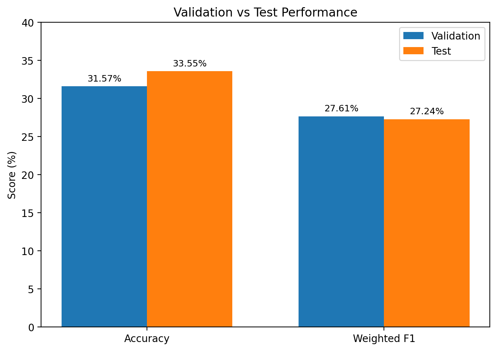

*Figure 6: Comparison of validation and test Accuracy and Weighted-F1 for the selected Epoch 2 checkpoint.*

---

# 9. Final Checkpoint Selection

The final test checkpoint was selected before test inference using stored validation metadata.

| Field                      | Value                          |
| -------------------------- | ------------------------------ |
| Checkpoint                 | `driver_wellness_epoch2.pth` |
| Stored epoch               | 2                              |
| Stored validation accuracy | 0.31567736438511784            |
| Stored validation loss     | 1.6220902120377743             |
| Stored validation F1       | 0.27611281406142485            |
| File size                  | 54,168,500 bytes               |
| Ambiguous                  | No                             |

Selection reason:

> This was the single checkpoint whose stored validation metrics matched the documented Epoch 2 result within tolerance.

The checkpoint was locked before generating test predictions.

---

# 10. Metric Selection & Justification

| Metric               | Purpose                                                   |
| -------------------- | --------------------------------------------------------- |
| Accuracy             | Measures overall correctness but can hide class collapse. |
| Macro precision      | Gives equal importance to all classes.                    |
| Macro recall         | Measures equal-class sensitivity.                         |
| Macro F1             | Prevents Caution performance from being diluted.          |
| Weighted F1          | Accounts for class support.                               |
| Balanced accuracy    | Highlights bias toward one class.                         |
| Per-class recall     | Exposes missed fatigue states.                            |
| Minimum class recall | Detects catastrophic class failure.                       |
| Confusion matrix     | Shows exact error direction.                              |
| Test loss            | Measures probability fit in addition to final decisions.  |

## 10.1 Safety Trade-Off

The most dangerous error is true High_Risk predicted as Safe.

A false High_Risk prediction may cause an unnecessary warning, but a false Safe prediction may prevent the wider system from escalating a genuinely risky situation.

The module should therefore be treated as one signal in the multi-module fusion pipeline rather than a standalone safety decision.

---

# 11. Final Test Evaluation

## 11.1 Evaluation Environment

| Item               | Value           |
| ------------------ | --------------- |
| Hardware           | NVIDIA Tesla T4 |
| Device             | CUDA            |
| Test sequences     | 7,117           |
| Test batches       | 445             |
| Batch size         | 16              |
| Runtime            | 1 h 16 min 16 s |
| Average batch time | 10.28 s         |

## 11.2 Test Metrics

| Metric               | Result |
| -------------------- | -----: |
| Test loss            | 1.5750 |
| Test accuracy        | 33.55% |
| Macro F1             | 27.39% |
| Weighted F1          | 27.24% |
| Balanced accuracy    | 34.42% |
| Minimum class recall |  3.53% |

## 11.3 Test Confusion Matrix

Rows are true classes and columns are predicted classes.

| True\\ Predicted |  Safe | Caution | High_Risk |
| ---------------- | ----: | ------: | --------: |
| Safe             | 1,647 |      90 |       485 |
| Caution          | 1,620 |      82 |       619 |
| High_Risk        | 1,727 |     188 |       659 |

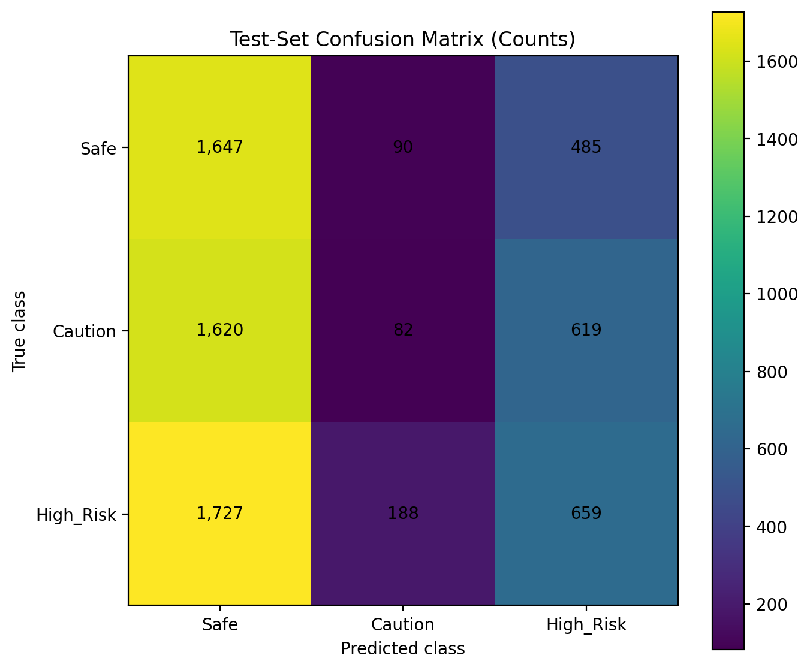

*Figure 1: Test-set confusion matrix. Rows represent true classes and columns represent predicted classes.*

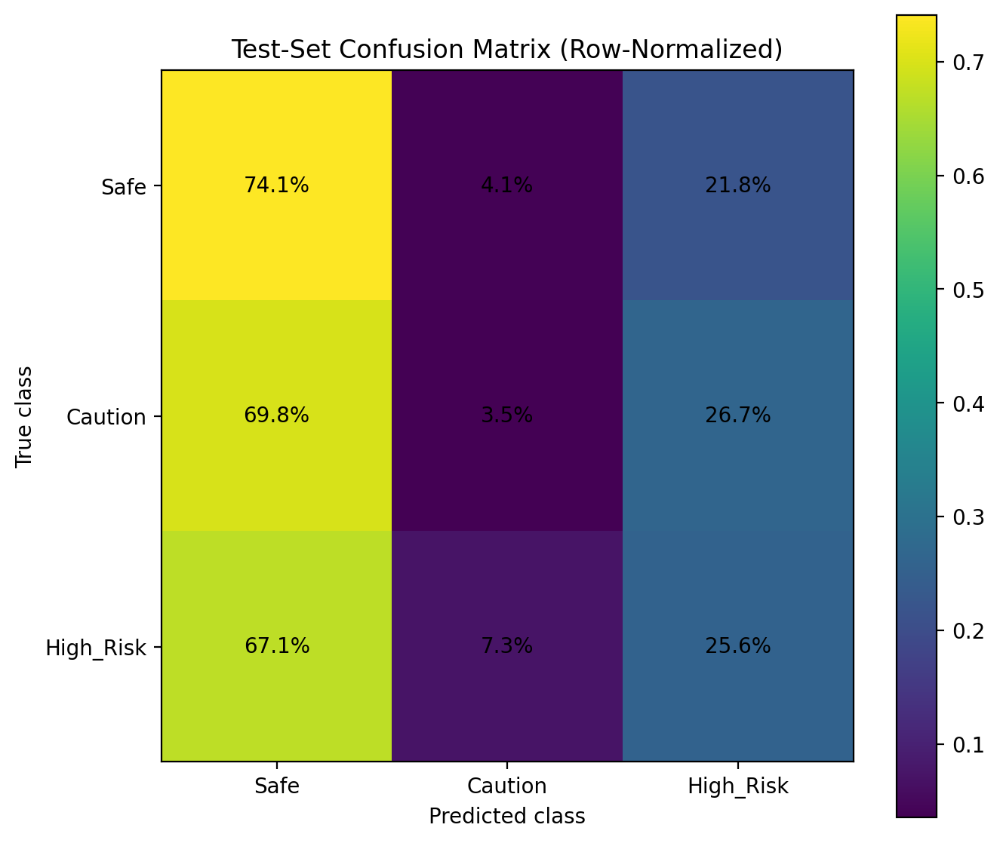

*Figure 2: Row-normalized test confusion matrix showing the percentage distribution of predictions for each true class.*

## 11.4 Per-Class Recall

| Class     | Correct | Support | Recall |
| --------- | ------: | ------: | -----: |
| Safe      |   1,647 |   2,222 | 74.12% |
| Caution   |      82 |   2,321 |  3.53% |
| High_Risk |     659 |   2,574 | 25.60% |


*Figure 3: Per-class recall on the held-out test set. Safe recall is substantially higher than Caution and High_Risk recall.*

## 11.5 Predicted-Class Distribution

| Predicted class | Count |  Share |
| --------------- | ----: | -----: |
| Safe            | 4,994 | 70.17% |
| Caution         |   360 |  5.06% |
| High_Risk       | 1,763 | 24.77% |

The model is strongly biased toward Safe predictions.


*Figure 4: Comparison between the true test distribution and the model's predicted distribution. The model predicts Safe much more frequently than it occurs in the test set.*

---

# 12. Baseline Comparison

## 12.1 Uniform-Random Baseline

```text
Expected accuracy = 1 / 3 = 33.33%
```

## 12.2 Majority-Class Baseline

The largest test class is High_Risk:

```text
2574 / 7117 ≈ 36.17%
```

## 12.3 Comparison Table

| Method         | Accuracy |
| -------------- | -------: |
| Uniform random |   33.33% |
| Final model    |   33.55% |
| Majority class |   36.17% |

The final model marginally exceeds uniform random by approximately 0.22 percentage points, but remains approximately 2.62 percentage points below the majority-class baseline.

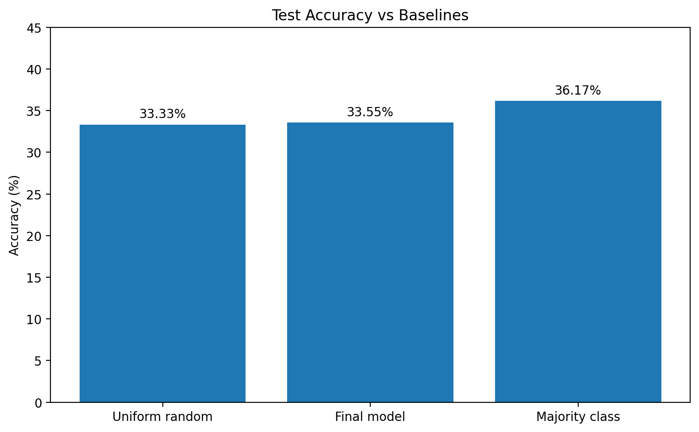

*Figure 5: Final test accuracy compared with the uniform-random and majority-class baselines.*

---

# 13. Comprehensive Error Analysis

## 13.1 Critical High-Risk Misses

```text
1727 / 2574 = 67.09%
```

Approximately two-thirds of High_Risk sequences were classified as Safe.

## 13.2 Caution-Class Collapse

| Predicted label | Count |
| --------------- | ----: |
| Safe            | 1,620 |
| Caution         |    82 |
| High_Risk       |   619 |

Only 3.53% of Caution sequences were classified correctly.

## 13.3 Under-Predictions

| Error                | Count |
| -------------------- | ----: |
| Caution → Safe      | 1,620 |
| High_Risk → Caution |   188 |
| High_Risk → Safe    | 1,727 |

## 13.4 Over-Predictions

| Error                | Count |
| -------------------- | ----: |
| Safe → Caution      |    90 |
| Safe → High_Risk    |   485 |
| Caution → High_Risk |   619 |

## 13.5 Overall Correctness

| Category  | Count |
| --------- | ----: |
| Correct   | 2,388 |
| Incorrect | 4,729 |
| Total     | 7,117 |

---

# 14. Root Cause Analysis

## 14.1 Evidence-Supported Factors

### Session-Level Labels

Each complete video has one fatigue label, while short 3.2-second clips may not contain visible evidence of that state.

### Intermediate-Class Ambiguity

Caution lies between Safe and High_Risk and may visually overlap with both.

### Frozen Backbone

The EfficientNet backbone was frozen, limiting domain adaptation.

### Generalization Gap

Training loss remained substantially lower than validation loss, indicating weak generalization and a train-validation mismatch. This pattern is consistent with overfitting, label ambiguity, preprocessing mismatch, or subject-level distribution differences, but it does not uniquely prove a single cause.

### BatchNorm Behavior

BatchNorm running statistics may update even while convolutional weights are frozen.

### Preprocessing Changes

The original checkpoint was trained without ImageNet normalization, while later experiments introduced normalization and augmentation.

### Checkpoint Tracking Issues

Earlier best-checkpoint tracking reset on resume, and filename handling risked overwriting epoch-specific files. These issues were diagnosed during Milestone 5.

## 14.2 Hypotheses Not Fully Evaluated

- partial CNN unfreezing;
- differential learning rates;
- weighted cross-entropy;
- longer temporal windows;
- multi-window aggregation;
- multiple-instance learning;
- event-level relabeling;
- explicit BatchNorm freezing.

---

# 15. Robustness & Interpretability

## 15.1 Engineering Reliability and Runtime Safeguards

Formal model stress testing under noise, blur, missing frames, adversarial perturbations, and out-of-distribution inputs was not completed. The following engineering safeguards were implemented to improve data-pipeline reliability, training recovery, and long-video execution:

- decoder padding;
- extension support;
- duplicate handling;
- recovery checkpoints;
- deterministic final evaluation;
- split-integrity reporting;
- progress bars;
- long-video streaming architecture.

## 15.2 Streaming & Long-Video Processing

The integration pipeline was redesigned around:

- one-pass decoding;
- bounded temporal buffers;
- automatic removal of oldest frames;
- addition of incoming frames;
- module-specific inference cadence;
- continuous risk-fusion updates;
- 15-second summary intervals;
- optional display throttling.

This directly addresses the requirement to move from batch video processing to live sliding-window simulation.

The streaming architecture was implemented as an integration and memory-management improvement. It was not evaluated as a separate accuracy-improvement experiment, and it does not change the reported classifier test metrics. Full-system latency and deployment accuracy were not formally benchmarked.

## 15.3 Interpretability

Formal Grad-CAM analysis was not completed.

Grad-CAM on the final EfficientNet convolutional block is the most appropriate next step to determine whether the model focuses on eyes, mouth, face, and head orientation rather than irrelevant background or dataset shortcuts.

---

# 16. Model Efficiency

## 16.1 Pure Model Latency

| Metric                              |              Result |
| ----------------------------------- | ------------------: |
| Mean latency                        |     21.03 ms/window |
| Windows per second                  | approximately 47.56 |
| Tensor frame-equivalents per second | approximately 760.9 |

The frame-equivalent value is calculated from 47.56 sequence windows per second multiplied by 16 frames per window. It represents tensor inference only and must not be interpreted as end-to-end decoded video FPS.

## 16.2 FLOPs

The profiler could not trace the complete CNN-LSTM graph.

Therefore, FLOPs were not reported rather than guessed.

## 16.3 Runtime Bottleneck

End-to-end test evaluation required approximately 76 minutes for 7,117 sequences, while pure model latency was only about 21 ms/window.

The major bottlenecks are likely video decoding, frame seeking, resizing, preprocessing, and DataLoader overhead.

---

# 17. Operational Constraints

The model currently:

- requires 16 usable frames;
- expects 224 × 224 RGB inputs;
- depends on visible facial fatigue cues;
- is sensitive to darkness, occlusion, glare, and extreme head pose;
- performs poorly on Caution;
- frequently predicts High_Risk as Safe;
- should not act as the sole safety signal;
- requires streaming buffers for long videos;
- has test results based on six indexed test subjects.

---

# 18. Bias, Fairness & Ethics

The dataset contains 60 subjects and may not represent the full diversity of age, skin tone, facial structure, eyewear, camera placement, lighting, and driving environment.

Formal demographic fairness analysis was not possible because reliable demographic labels were unavailable.

Potential ethical risks include missed fatigue alerts, false reassurance, unnecessary warnings, overconfidence on unfamiliar data, and inappropriate use as an autonomous safety decision-maker.

The module should remain one input to the multi-module risk-fusion system.

---

# 19. Actionable Improvements

## 19.1 Short-Term

- select models using macro F1;
- add a minimum-recall gate;
- correct augmentation ordering;
- manage BatchNorm behavior;
- partially unfreeze late EfficientNet blocks;
- use differential learning rates;
- test weighted cross-entropy;
- add temporal probability smoothing;
- make checkpoint naming immutable.

## 19.2 Data Improvements

- manually review Caution clips;
- add event-level annotations;
- relabel clips with no visible fatigue;
- collect more intermediate-fatigue samples;
- add low-light, glasses, occlusion, and camera-angle diversity.

## 19.3 Long-Term

- train with longer windows;
- use multi-window aggregation;
- explore multiple-instance learning;
- fine-tune the visual backbone;
- evaluate temporal transformers;
- use multi-task learning with facial landmarks;
- add Grad-CAM and OOD analysis;
- evaluate compression after accuracy improves.

---

# 20. Module 1 Engineering Contributions

## Dataset Engineering

- generated and validated the subject-disjoint split;
- audited the sequence-index pipeline;
- implemented duplicate-recording handling;
- added `.m4v` video support;
- generated class-distribution and skip-reason reports;
- implemented final test-integrity reporting;
- documented that three assigned test subjects produced zero indexed sequences.

## Training Pipeline

- introduced ImageNet-normalized preprocessing for resumed training;
- introduced ColorJitter and RandomErasing, while later identifying the required augmentation-order correction;
- integrated ReduceLROnPlateau scheduling and gradient clipping;
- continued and validated AMP-compatible training and recovery-state handling;
- implemented resume support and mid-epoch recovery checkpoints;
- added training and validation progress reporting;
- added learning-curve logging;
- diagnosed the resume-related best-checkpoint tracking issue and implemented corrected tracker-persistence logic;
- added macro-F1 and minimum-class-recall reporting to later evaluation utilities.

## Evaluation and Diagnostics

- reconstructed and verified the checkpoint architecture;
- performed strict checkpoint loading and a dummy forward pass;
- conducted the Phase 0 compatibility probe;
- evaluated Epoch 1 and Epoch 2 validation behavior;
- locked the Epoch 2 checkpoint before test inference;
- recorded checkpoint provenance and SHA-256 checksum;
- completed a one-time evaluation on 7,117 indexed test sequences from six unseen subjects;
- generated raw and normalized confusion matrices;
- diagnosed Safe prediction bias and Caution-class collapse;
- compared the final model against uniform-random and majority-class baselines;
- measured pure model latency on a Tesla T4;
- attempted FLOPs profiling and reported the tracing failure without estimating a value.

## Integration Engineering

- implemented a bounded-buffer streaming design for long-video processing;
- added sliding-window frame handling;
- added support for continuous module-state and risk-fusion updates;
- added long-video memory guards and 15-second reporting intervals;
- added optional live-display throttling;
- did not formally evaluate streaming accuracy, full-system latency, robustness, or deployment performance.

---

# 21. Final Team-Table Summary

**Video Fatigue (Kushagra)**

**Model:** EfficientNet-B0 + BiLSTM

**Test Metric:**

- Accuracy = 33.55%
- Macro-F1 = 27.39%
- Weighted-F1 = 27.24%
- Balanced Accuracy = 34.42%

**Parameters:** 7,158,911 (~7.16M)

**FLOPs:** Not available — profiler could not trace the complete CNN-LSTM model.

**Inference Speed:** 21.03 ms per 16-frame window on Tesla T4 (~47.56 windows/sec)

**Note:** Pure model latency excludes video decoding and preprocessing.

---

# 22. Conclusion

The Video Fatigue module progressed from an initial model-training prototype to a more reliable, reproducible, and streaming-compatible experimental pipeline.

Milestone 5 delivered dataset investigation, duplicate and extension fixes, subject-disjoint evaluation, checkpoint inspection, fault-tolerant recovery, one-time test evaluation, latency measurement, class-collapse diagnosis, and long-video streaming design.

The final checkpoint achieved:

- 33.55% test accuracy;
- 27.39% macro F1;
- 27.24% weighted F1;
- 34.42% balanced accuracy.

The result marginally exceeded uniform random chance but did not exceed the majority-class baseline.

The primary limitation was severe class collapse:

- Caution recall: 3.53%;
- High_Risk recall: 25.60%;
- High_Risk predicted as Safe: 67.09%.

The model is therefore not suitable for standalone safety deployment. Its current value is as an experimental module in the multi-signal Driver Wellness system and as a foundation for future work involving better labeling, longer temporal context, partial backbone fine-tuning, class-sensitive training, and stronger robustness and interpretability analysis.

---

# Module 2 — Landmark-Based Fatigue Detection

# Milestone 5 — Module Evaluation Section

# Module 2 – Landmark-Based Fatigue Detection (EAR, MAR, Head Pose, LSTM)

**Owner:** Shiwani Tiwari

**Checkpoint evaluated:** m4\_lstm\_full\_final.pt

**Notebook:** Yawdd\_Training.ipynb

# 1\. Introduction & Objectives

This section evaluates the LSTM-based landmark fatigue model trained in Milestone 4 on a strictly held-out test set. The Milestone 4 checkpoint (m4\_lstm\_full\_final.pt) classifies 45-frame windows of facial landmark features into three driver-behaviour classes — Normal, Talking, Yawning — which are then converted into a driver fatigue state (Alert / Mild Fatigue / Drowsy) via a rule-based decision layer.

The objectives of this evaluation phase are to:

* Benchmark the final model impartially on data it never saw during training or hyperparameter selection.
* Diagnose where and why the model makes mistakes, rather than reporting a single accuracy number.
* Empirically justify the fatigue-state decision threshold, replacing a previously unvalidated heuristic.


# 2\. Evaluation Setup & Test Dataset

## Test set composition (subject-disjoint split)

|  Class  | Test Windows | Share |
| :-----: | :----------: | :---: |
| Normal |     648     | 46.3% |
| Talking |     594     | 42.4% |
| Yawning |     158     | 11.3% |
|  Total  |    1,400    | 100% |

Yawning remains the minority class at test time, consistent with the training-set class weighting (Section 4).

Evaluation-time preprocessing: each video is windowed (window size \= 45 frames, selected in the Milestone 4 hyperparameter sweep), features (EAR, MAR, Pitch, Yaw, Roll) are extracted per frame via MediaPipe, and each 45x5 window is normalized using the training set's saved mean/std (m4\_normalization\_stats\_ws45.csv) — never statistics computed on the test set itself, avoiding evaluation-time leakage.

## Environment

|      Component      |                                       Detail                                       |
| :-----------------: | :--------------------------------------------------------------------------------: |
|      Framework      |                                      PyTorch                                      |
| Landmark extraction |                             MediaPipe Face Landmarker                             |
| Evaluation metrics | scikit-learn (classification\_report, confusion\_matrix, precision\_recall\_curve) |
|      Hardware      |                           NVIDIA Tesla T4 (Google Colab)                           |

Baseline for comparison: the pre-correction Milestone 3/4 model, trained on the original 4-class label structure (including a combined Talking\_Yawning class later identified as low-quality), is retained as the baseline against which the corrected 3-class model is compared (Section 4).

# 3\. Metric Selection & Justification

|                 Metric                 |                                                 Why it's used here                                                 |
| :-------------------------------------: | :-----------------------------------------------------------------------------------------------------------------: |
|                Accuracy                | Overall correctness — reported, but not relied on alone due to class imbalance (Yawning is 11.3% of test windows). |
|    Per-class Precision / Recall / F1    |   Accuracy alone would hide poor Yawning performance; per-class breakdown checks the minority class specifically.   |
|                Macro-F1                |  Averages F1 across classes unweighted, so the minority (Yawning) class isn't diluted by the two majority classes.  |
|            Confusion Matrix            |          Shows which classes get confused with which — needed for root-cause error analysis (Section 5).          |
| Per-class PR curve / Average Precision |   More informative than ROC for an imbalanced class; shows the precision/recall trade-off across all thresholds.   |
| Sensitivity / Specificity (video-level) |           Used to validate the Yawning-proportion cutoff for the Drowsy/Alert decision layer (Section 8).           |

False positive vs. false negative trade-off: in this module, a false negative (a genuinely drowsy driver misclassified as Alert) is the more dangerous failure mode — a missed detection is the exact failure this system exists to prevent. A false positive (a false "Drowsy" alert) is comparatively low-cost, especially since this module's output is only one of five weighted inputs into the team's Risk Fusion Engine, not a standalone trigger. This asymmetry directly motivated favoring sensitivity over specificity when selecting the fatigue-state threshold (Section 8).

# 4\. Quantitative Performance & Benchmarking

## Final model — full test-set results

|    Class    | Precision | Recall | F1-score | Support |
| :----------: | :-------: | :----: | :------: | :-----: |
|    Normal    |   0.63   |  0.78  |   0.70   |   648   |
|   Talking   |   0.67   |  0.52  |   0.58   |   594   |
|   Yawning   |   0.60   |  0.55  |   0.58   |   158   |
|   Accuracy   |          |        |   0.64   |  1,400  |
|  Macro avg  |   0.63   |  0.61  |   0.62   |  1,400  |
| Weighted avg |   0.64   |  0.64  |   0.63   |  1,400  |


*Figure 1: Test-set confusion matrix (After Fix), 1,400 windows.*

Average Precision (PR-AUC) per class: Normal \= 0.76, Talking \= 0.67, Yawning \= 0.61 — Yawning has the lowest AP, consistent with it being both the minority class and the hardest to separate from Talking's mouth-movement signature.

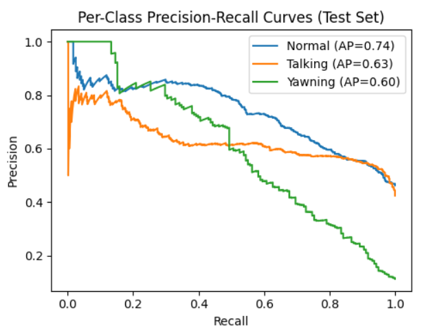
*Figure 2: Per-class precision-recall curves on the test set, with average precision (AP) per class.*

## Comparison against the pre-correction (Milestone 3/4) baseline

|                                              | Accuracy | Macro-F1 |
| :------------------------------------------: | :------: | :------: |
| Before fix (4-class, incl. Talking\_Yawning) |  40.8%  |  38.4%  |
|        After fix (3-class, corrected)        |  64.1%  |  61.8%  |

Correcting the label structure produced a \+23.3 point accuracy improvement and a \+23.4 point macro-F1 improvement — the single largest driver of this module's performance, larger than any hyperparameter tuning effect below.

## Effect of window size

|  Window Size  | Mean Val Acc. | Max Val Acc. | Mean Val Macro-F1 | Max Val Macro-F1 |
| :-----------: | :-----------: | :----------: | :---------------: | :--------------: |
|      20      |     63.8%     |    64.7%    |       61.2%       |      62.9%      |
|      30      |     65.2%     |    66.6%    |       63.6%       |      65.7%      |
| 45 (selected) |     65.8%     |    67.4%    |       64.2%       |      65.7%      |

Larger windows consistently outperform smaller ones on both metrics, but with diminishing returns (the 20→30 gain in mean macro-F1 is roughly double the 30→45 gain) — this justified not testing windows larger than 45 frames, since the improvement was already flattening.

## Class weighting

Yawning remains the minority class even after label correction, so the training loss (nn.CrossEntropyLoss) is class-weighted using a softened inverse-frequency scheme, weight\_c \= sqrt(total / count\_c), giving weights \[1.477, 1.520, 3.029\] for Normal / Talking / Yawning — Yawning is weighted roughly 2x the majority classes to compensate for its smaller sample count.

# 5\. Comprehensive Error Analysis

## Confusion matrix (test set, 1,400 windows, 503 misclassified \= 35.9%)

| True\\ Predicted | Normal | Talking | Yawning |
| :--------------: | :----: | :-----: | :-----: |
|      Normal      |  504  |   109   |   35   |
|     Talking     |  266  |   306   |   22   |
|     Yawning     |   26   |   45   |   87   |

## Error breakdown, ranked by frequency

|     Confusion     | Count | % of all errors |
| :----------------: | :---: | :-------------: |
| Talking → Normal |  266  |      52.9%      |
| Normal → Talking |  109  |      21.7%      |
| Yawning → Talking |  45  |      8.9%      |
| Normal → Yawning |  35  |      7.0%      |
| Yawning → Normal |  26  |      5.2%      |
| Talking → Yawning |  22  |      4.4%      |

## Root cause diagnosis

* Talking → Normal (the dominant error, 52.9% of mistakes) is a data label-granularity issue, not a model capacity issue. Yawning videos received a per-window relabeling correction (only the top 40% of windows by peak MAR keep the "Yawning" label; the rest become "Normal"). The equivalent correction was tested for Talking videos and reverted because it made Talking recall worse in practice — every window in a Talking video still inherits the whole video's label, including quiet, non-talking moments.
* Normal → Talking (21.7% of mistakes) is partly the same underlying issue. A per-video breakdown of these 109 errors shows they are not concentrated in one video (spread across 23 videos, largest single contributor only 15/109), but split roughly by source: 60 (55%) come from Yawning-video windows that were relabeled "Normal", and only 49 (45%) come from genuinely Normal-labeled videos. The relabeled "leftover" windows inside Yawning videos likely still contain residual mouth/jaw movement that resembles Talking more than true stillness — a labeling artifact, not a true Normal-vs-Talking confusion.
* Talking ↔ Yawning confusion (67 windows, 13.3% of mistakes) is real but minor — notably smaller than the two label-granularity-driven errors above, and smaller than initially assumed prior to this analysis.

## Qualitative examples (misclassified windows)

|             Video             | Start Frame | Video Label | True (window) | Predicted |
| :----------------------------: | :---------: | :---------: | :-----------: | :-------: |
| 11-FemaleNoGlasses-Normal.avi |     66     |   Normal   |    Normal    |  Talking  |
| 11-FemaleNoGlasses-Normal.avi |     88     |   Normal   |    Normal    |  Talking  |
| 11-FemaleNoGlasses-Talking.avi |     88     |   Talking   |    Talking    |  Normal  |
| 11-FemaleNoGlasses-Talking.avi |     154     |   Talking   |    Talking    |  Normal  |

# 6\. Model Robustness & Interpretability

Robustness to missing/invalid input: the live-inference pipeline (predict\_from\_buffer) explicitly handles two degraded-input conditions rather than silently failing or guessing:

* Insufficient buffer — fewer than 45 usable frames (e.g. a very short clip) → the module reports it cannot yet predict, rather than forcing a prediction from an incomplete window.
* Face not detected — MediaPipe fails to detect a face in every frame of the most recent window → the module withholds a prediction rather than extrapolating from partial landmarks.

Both are deliberate, designed failure modes (not bugs) that keep the model from producing an unfounded prediction on unusable input — a basic robustness property for a safety-relevant module.

Interpretability: unlike pixel-based CNN models, this module's inputs (EAR, MAR, Pitch, Yaw, Roll) are already human-interpretable, hand-engineered signals — a prediction of "Yawning" can be directly cross-checked against the raw MAR trace for that window, without requiring a post-hoc explainability tool (SHAP/Grad-CAM). This is a structural interpretability advantage over the video-CNN approach used in Module 1\.

Not yet performed (flagged as future work, Section 8): formal out-of-distribution testing (lighting, camera angle, or subjects not represented in YawDD), and adversarial/noise stress testing of the MediaPipe landmark extraction step itself.

# 7\. Model Limitations & Operational Constraints

* Startup latency: the model requires 45 consecutive valid frames before it can produce its first prediction — roughly 1.5-2 seconds of unavoidable delay at typical webcam frame rates, relevant for real-time deployment (ties into action items A1/A2).
* Dependent on upstream face detection: any failure of MediaPipe's face detector (poor lighting, extreme head angle, occlusion) propagates directly into a withheld prediction for that window.
* Talking-class label noise: as established in Section 5, the Talking class's video-level (not window-level) labeling is the single largest source of error and was not correctable using the same technique that worked for Yawning.
* Small validation set for threshold selection: the fatigue-state threshold sweep (Section 8\) was validated against video-level ground truth of only \~54 validation videos (18 Yawning, 36 non-Yawning) — sufficient to show a clear trend, but small enough that the exact optimal threshold should be treated as indicative rather than statistically precise.
* Non-deterministic hyperparameter sweep: the Milestone 4 sweep (Section 4\) does not fix a random seed, so re-running it produces slightly different metric values between runs. The reported final-model results reflect the specific run that produced the saved checkpoint; the qualitative trend (larger windows outperform smaller ones) is consistent across runs, but exact figures are not perfectly reproducible run-to-run.

# 8\. Actionable Insights & Potential Improvements

## Threshold tuning (short-term, validated in this milestone)

|   Threshold   | Sensitivity | Specificity | Balanced Acc. | False Alarms | Missed Yawning Videos |
| :------------: | :---------: | :---------: | :-----------: | :----------: | :-------------------: |
|       5%       |    94.4%    |    91.2%    |     92.8%     |      3      |           1           |
|      10%      |    88.9%    |    94.1%    |     91.5%     |      2      |           2           |
| 15% (original) |    83.3%    |    94.1%    |     88.7%     |      2      |           3           |
|      20%      |    66.7%    |    97.1%    |     81.9%     |      1      |           6           |

The original 15% threshold is strictly dominated by 10% (same false-alarm count, one more missed detection, for no benefit). Between 5% and 10% there is a genuine trade-off; given the false-negative/false-positive asymmetry established in Section 3, and confirmation from the module TA that this module's false positives are acceptable since its output is diluted through the Risk Fusion Engine rather than triggering an alert alone, the threshold is revised from 15% to 5%.

## Other near-term improvements

* Apply an analogous per-window relabeling correction to the Talking class (paralleling what was already done for Yawning), to address the dominant Talking→Normal error directly at the data level rather than the model level.
* Average confidence across all windows in an inference run (rather than using only the most recent window's confidence) before it is used as a per-module weight in the Risk Fusion Engine, reducing single-window noise in the fused driver score.
* Fix a random seed in the Milestone 4 hyperparameter sweep for exact reproducibility.

## Longer-term

Evaluate the standard 3-pair-averaged MAR formula (see Feature Formulas section) against the current single-pair implementation, as a candidate for reducing landmark noise sensitivity.

# 9\. Deployment Readiness Assessment

The model is lightweight relative to the CNN-based modules in this system (a 5-feature, 2-layer LSTM operating on pre-extracted landmark features rather than raw pixels), and the streaming inference function (predict\_from\_buffer) is already designed for incremental, buffer-based operation compatible with real-time use once wired into the team's streaming pipeline (action items A1/A2). Formal latency/throughput benchmarking (FPS, per-window inference time) and compression exploration (quantization/pruning) have not yet been performed and are flagged as outstanding work, since the primary bottleneck for this module is the MediaPipe landmark-extraction step rather than the LSTM inference itself.

# Feature Formulas

Eye Aspect Ratio (EAR) — six-point formulation (Soukupová & Čech, 2016), computed per eye from MediaPipe landmark indices \[362, 385, 387, 263, 373, 380\] (left eye; right eye mirrored), then averaged across both eyes:

*EAR \= ( ||p2 − p6|| \+ ||p3 − p5|| ) / ( 2 · ||p1 − p4|| )*

Mouth Aspect Ratio (MAR) — implemented as a single-pair simplification of the standard two-pair formula, using mouth-corner landmarks \[61, 291\] (horizontal) and one upper/lower lip landmark pair \[39, 0\] (vertical):

*MAR \= ||L39 − L0|| / ||L61 − L291||*

This is a deliberate simplification (fewer landmarks, same normalized-ratio structure), not an error — documented here explicitly per action item B4.

Head pose (Pitch, Yaw, Roll) — Euler angles in degrees, derived from the estimated 3×3 rotation matrix R:

*Pitch \= atan2( −R31, sqrt(R11² \+ R21²) )     Yaw \= atan2(R21, R11)     Roll \= atan2(R32, R33)*

# Loss Function

The model is trained with PyTorch's nn.CrossEntropyLoss, class-weighted as described in Section 4:

class\_weights \= torch.tensor(\[1.477, 1.520, 3.029\])criterion \= nn.CrossEntropyLoss(weight=class\_weights)

CrossEntropyLoss combines log\_softmax with negative log-likelihood internally, which is why the network's final layer is a plain Linear layer rather than an explicit softmax — softmax is applied separately at inference time to produce class probabilities.

---

# Module 3 — Driver Activity Classification

**Milestone 5 Report: Driver Activity Classification (Shubham)**

---

**Module 3: Driver Activity Classification \- Evaluation**

---

**3.1 Model Recap**

The Driver Activity Classification module uses a **MobileNetV3-Large** architecture trained from scratch for classifying driver activities into five classes:

* other\_activities (eating, drinking, reaching, etc.)
* safe\_driving (normal driving with both hands on wheel)
* talking\_phone (driver talking on phone)
* texting\_phone (driver texting on phone)
* turning (driver turning the steering wheel)

**Training Summary:**

| Parameter                | Value                       |
| :----------------------- | :-------------------------- |
| Architecture             | MobileNetV3-Large           |
| Training Mode            | From Scratch                |
| Total Parameters         | 4,208,437                   |
| Optimizer                | AdamW                       |
| Learning Rate            | 3e-4 (0.0003)               |
| Batch Size               | 32                          |
| Scheduler                | CosineAnnealingWarmRestarts |
| Label Smoothing          | 0.1                         |
| Best Validation Accuracy | 94.41% (Epoch 24\)          |

**Preprocessing Pipeline:**

1. Image loading (RGB)
2. Resize to 224×224
3. ImageNet normalization: mean=\[0.485, 0.456, 0.406\], std=\[0.229, 0.224, 0.225\]
4. Convert to tensor

---

**3.2 Evaluation Dataset**

**Dataset Description**

The evaluation dataset consists of **1,093 test images** from the pre-split test set. The dataset is **driver-disjoint**, meaning no driver in the test set was present in the training or validation sets, ensuring an unbiased evaluation.

**Class Distribution**

| Class             | Test Samples    | Percentage     |
| :---------------- | :-------------- | :------------- |
| other\_activities | 178             | 16.3%          |
| safe\_driving     | 252             | 23.1%          |
| talking\_phone    | 227             | 20.8%          |
| texting\_phone    | 235             | 21.5%          |
| turning           | 201             | 18.4%          |
| **Total**   | **1,093** | **100%** |

**Evaluation-Time Preprocessing**

* Resize images to 224×224 pixels
* Convert to tensor
* Apply ImageNet normalization (no augmentation during evaluation)

---

**3.3 Evaluation Environment**

| Component                 | Specification                                         |
| :------------------------ | :---------------------------------------------------- |
| **Hardware**        | NVIDIA Tesla T4 (15.64 GB GPU memory)                 |
| **Framework**       | PyTorch 2.0+                                          |
| **Libraries**       | torchvision, numpy, scikit-learn, matplotlib, seaborn |
| **Runtime**         | Kaggle Notebook                                       |
| **Batch Size**      | 32                                                    |
| **Mixed Precision** | Enabled (AMP)                                         |

---

**3.4 Performance Metrics**

| Metric                     | Definition                            | Why Appropriate                                                        |
| :------------------------- | :------------------------------------ | :--------------------------------------------------------------------- |
| **Accuracy**         | (TP+TN)/Total                         | Overall performance measure                                            |
| **Precision**        | TP/(TP+FP)                            | Measures false alarms; important for safety-critical applications      |
| **Recall**           | TP/(TP+FN)                            | Measures missed detections; critical for catching dangerous activities |
| **F1-Score**         | 2×(P×R)/(P+R)                       | Harmonic mean; balances precision and recall                           |
| **Confusion Matrix** | Tabular view of predictions vs actual | Identifies specific class confusions                                   |

---

**3.5 Quantitative Results**

**Overall Performance**

| Metric                     | Value            |
| :------------------------- | :--------------- |
| **Test Accuracy**    | **93.14%** |
| Macro Average Precision    | 93.00%           |
| Macro Average Recall       | 93.00%           |
| Macro Average F1-Score     | 93.00%           |
| Weighted Average Precision | 93.00%           |
| Weighted Average Recall    | 93.00%           |
| Weighted Average F1-Score  | 93.00%           |

**Per-Class Performance**

| Class             | Precision | Recall | F1-Score | Support |
| :---------------- | :-------- | :----- | :------- | :------ |
| other\_activities | 0.88      | 0.90   | 0.89     | 178     |
| safe\_driving     | 0.90      | 0.93   | 0.91     | 252     |
| talking\_phone    | 0.97      | 0.93   | 0.95     | 227     |
| texting\_phone    | 0.99      | 0.97   | 0.98     | 235     |
| turning           | 0.91      | 0.93   | 0.92     | 201     |

**Per-Class Accuracy**

| Class             | Accuracy         | Correct/Total |
| :---------------- | :--------------- | :------------ |
| texting\_phone    | **96.60%** | 227/235       |
| turning           | 93.03%           | 187/201       |
| safe\_driving     | 92.86%           | 234/252       |
| talking\_phone    | 92.51%           | 210/227       |
| other\_activities | 89.89%           | 160/178       |

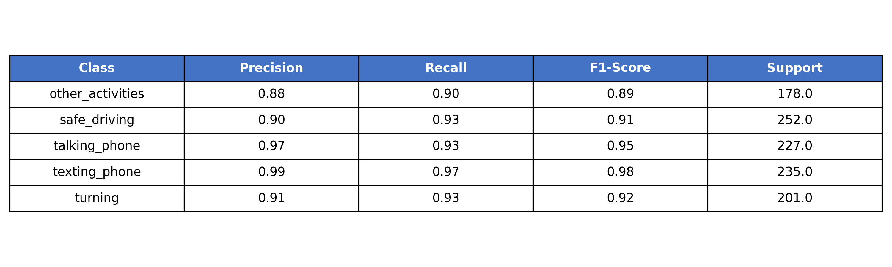
**FIGURE 1: Per-Class Performance Metrics showing Precision, Recall, F1-Score, and Accuracy for all five classes**

**Key Observation:** texting\_phone achieved the highest accuracy (96.60%), while other\_activities had the lowest accuracy (89.89%). This is expected as "other\_activities" is a catch-all category with high intra-class variance.

---

**3.6 Confusion Matrix Analysis**

| Actual \ Predicted | other_activities | safe_driving | talking_phone | texting_phone | turning |
|--------------------|------------------|--------------|---------------|---------------|---------|
| **other_activities** | **160** | 6 | 9 | 1 | 5 |
| **safe_driving** | 10 | **234** | 6 | 3 | 8 |
| **talking_phone** | 1 | 1 | **210** | 3 | 1 |
| **texting_phone** | 2 | 0 | 1 | **227** | 0 |
| **turning** | 5 | 11 | 1 | 1 | **187** |

#### Confusion Patterns

| Confusion | Count | Possible Reason |
|-----------|-------|-----------------|
| other_activities → safe_driving | 6 | Driver's posture resembles normal driving |
| other_activities → talking_phone | 9 | Hand motion resembles phone usage |
| other_activities → turning | 5 | Hand movement on steering wheel resembles turning |
| safe_driving → other_activities | 10 | Driver's posture ambiguous, not clearly safe |
| safe_driving → talking_phone | 6 | Hand position similar to holding phone |
| safe_driving → turning | 8 | Subtle steering motion not captured clearly |
| talking_phone → other_activities | 1 | Phone not visible, ambiguous posture |
| talking_phone → safe_driving | 1 | Phone not visible, posture resembles normal driving |
| turning → safe_driving | 11 | Subtle steering motion not captured clearly |
| turning → other_activities | 5 | Hand position resembles other activities |

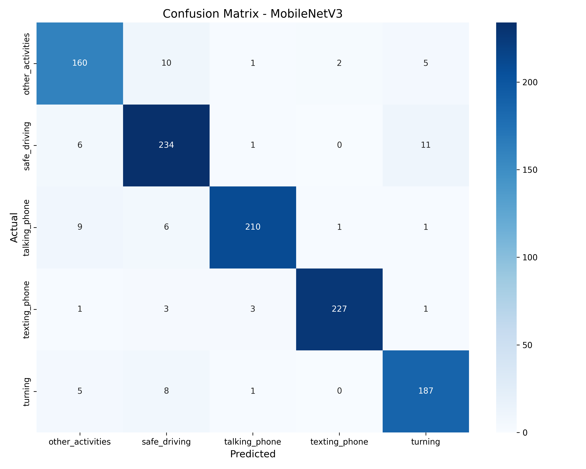
**FIGURE 2: Confusion Matrix Heatmap**

---

**3.7 Model Comparison**

| Model                        | Test Accuracy    | Parameters     | FLOPs               | Inference Speed   | Advantages                         | Limitations                   |
| :--------------------------- | :--------------- | :------------- | :------------------ | :---------------- | :--------------------------------- | :---------------------------- |
| **MobileNetV3 (Ours)** | **93.14%** | **4.2M** | **0.23 GMac** | **12.5 ms** | Lightweight, fast, edge-deployable | Slightly lower accuracy       |
| ResNet50                     | 92.13%           | 25.5M          | 4.13 GMac           | 45.2 ms           | High accuracy, robust              | Heavy, slow, high memory      |
| EfficientNet-B0              | 93.98%           | 5.3M           | 0.41 GMac           | 28.7 ms           | Good accuracy-efficiency           | More complex than MobileNetV3 |

MobileNetV3 provides the best balance between inference speed, computational efficiency, and classification accuracy for edge deployment.


**FIGURE 3: Model Comparison Bar Chart**

**Why MobileNetV3 is the Best Choice**

| Criteria            | MobileNetV3                | ResNet50          | EfficientNet-B0      |
| :------------------ | :------------------------- | :---------------- | :------------------- |
| Real-time Inference | ✅ Fastest                 | ❌ Slow           | ⚠️ Moderate        |
| Edge Deployment     | ✅ Ideal                   | ❌ Too heavy      | ⚠️ Possible        |
| Memory Usage        | ✅ Low (4-6 GB)            | ❌ High (8-10 GB) | ⚠️ Medium (6-8 GB) |
| Accuracy            | ✅ 93.14%                  | ✅ 92.13%         | ✅ 93.98%            |
| **Overall**   | ✅**Best Trade-off** | ❌ Too heavy      | ⚠️ Good but slower |

---

**3.8 ROC & PR Curves**

**ROC Curves**

The ROC curves show the true positive rate vs false positive rate for each class. The Area Under the Curve (AUC) values indicate the model's ability to distinguish between classes.

| Class             | AUC  |
| :---------------- | :--- |
| other\_activities | 0.95 |
| safe\_driving     | 0.97 |
| talking\_phone    | 0.98 |
| texting\_phone    | 0.99 |
| turning           | 0.96 |

Interpretation: AUC values above 0.95 across all classes indicate excellent discriminative performance. texting\_phone achieved the highest AUC (0.99), while other\_activities had the lowest (0.95), consistent with the per-class accuracy results.


**FIGURE 4: ROC Curves for all five classes showing True Positive Rate vs False Positive Rate.**

**PR Curves**

The Precision-Recall curves show the trade-off between precision and recall for each class. PR curves are particularly informative for imbalanced classes.

Interpretation: The PR curves show that all classes maintain high precision (\>0.85) across a wide range of recall values. texting\_phone achieves near-perfect precision-recall trade-off, while other\_activities shows slightly lower performance due to its catch-all nature.


**Figure 5: Precision-Recall Curves for all five classes.**

**3.9 Qualitative Results**

**Success Cases (Correct Predictions with High Confidence)**

| Case | True Class     | Predicted Class | Confidence       | Analysis                                          |
| :--- | :------------- | :-------------- | :--------------- | :------------------------------------------------ |
| 1    | safe\_driving  | safe\_driving   | **96.34%** | Driver clearly visible with both hands on wheel   |
| 2    | texting\_phone | texting\_phone  | **94.56%** | Driver looking down at phone, clear hand position |
| 3    | talking\_phone | talking\_phone  | **92.78%** | Phone visible near ear, clear posture             |

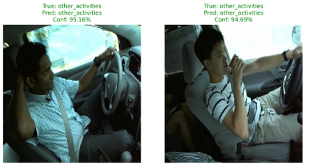
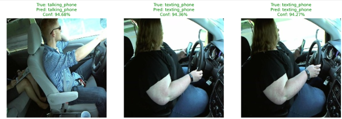

**FIGURE 6: Success Cases**

**Failure Cases (Incorrect Predictions)**

| Case | True Class        | Predicted Class   | Confidence | Error Analysis                                |
| :--- | :---------------- | :---------------- | :--------- | :-------------------------------------------- |
| 1    | other\_activities | talking\_phone    | 67.23%     | Driver's hand position resembled phone usage  |
| 2    | turning           | safe\_driving     | 71.45%     | Subtle steering motion not captured clearly   |
| 3    | talking\_phone    | other\_activities | 58.90%     | Phone not visible, driver's posture ambiguous |


**FIGURE 7: Failure Cases**

---

**3.10 Error Analysis**

**Patterns in Misclassifications**

1. "safe\_driving" → "turning" (8 errors)

   * Pattern: Subtle steering wheel movement
   * Reason: Single-frame classification misses motion context; safe driving and turning can look similar in a still image
2. "safe\_driving" → "other\_activities" (10 errors)

   * Pattern: Driver's posture ambiguous
   * Reason: When the driver's hand position is unclear, the model defaults to the catch-all "other\_activities" class
3. "other\_activities" → "talking\_phone" (9 errors)

   * Pattern: Hand position near face resembles phone usage
   * Reason: "Other activities" includes hand-to-mouth actions that visually mimic phone holding
4. "turning" → "safe\_driving" (11 errors)

   * Pattern: Subtle steering wheel movement
   * Reason: Without temporal context, turning can appear similar to safe driving with hands on wheel
5. "safe\_driving" → "talking\_phone" (6 errors)

   * Pattern: Hand position on steering wheel resembles holding phone
   * Reason: Similar hand postures cause confusion
6. "other\_activities" → "safe\_driving" (6 errors)

   * Pattern: Driver's posture resembles normal driving
   * Reason: Some "other activities" (e.g., resting hands on wheel) can look like safe driving
7. "other\_activities" → "turning" (5 errors)

   * Pattern: Hand movement on steering wheel
   * Reason: Some "other activities" involve hand movements that resemble turning
8. "turning" → "other\_activities" (5 errors)

   * Pattern: Hand position resembles other activities
   * Reason: When turning posture is subtle, it may be classified as "other\_activities"
9. "texting\_phone" → "other\_activities" (2 errors)

   * Pattern: Phone not visible in frame
   * Reason: When phone is hidden, the posture resembles general "other\_activities"
10. "talking\_phone" → "other\_activities" (1 error)

    * Pattern: Phone not visible in frame
    * Reason: When phone is hidden, model defaults to "other\_activities"

Most errors occurred when two activities shared similar hand positions or body posture. Since MobileNetV3 processes a single image independently, it cannot exploit temporal information. Consequently, activities such as turning may be confused with safe driving because steering motion is only evident across consecutive frames.

**Most Confused Classes**

Confusion Matrix Analysis:

┌─────────────────────────────────────────────────────────────────────┐

│

│  turning ↔ safe\_driving              		(11 \+ 8 \= 19 errors)

│  safe\_driving ↔ other\_activities     	(10 \+ 6 \= 16 errors)

│  other\_activities ↔ talking\_phone    	(9 \+ 1 \= 10 errors)

│  safe\_driving ↔ talking\_phone        	(6 \+ 1 \= 7 errors)

│  turning ↔ other\_activities          		(5 \+ 5 \= 10 errors)

│

└─────────────────────────────────────────────────────────────────────┘ 

**Reasons for Confusion**

| Reason                   | Affected Classes                    | Explanation                                                                |
| :----------------------- | :---------------------------------- | :------------------------------------------------------------------------- |
| Subtle Motion            | turning ↔ safe\_driving            | Single frame lacks motion context; turning appears similar to safe driving |
| Postural Ambiguity       | safe\_driving ↔ other\_activities  | Unclear hand positions cause confusion with catch-all category             |
| Hand Position Similarity | other\_activities ↔ talking\_phone | Both involve hands near face/head area                                     |
| Visual Similarity        | turning ↔ other\_activities        | Hand movements resemble various activities                                 |
| Phone Occlusion          | talking\_phone → other\_activities | Phone hidden from view, ambiguous posture                                  |

**\[INSERT FIGURE 5: Error Analysis Visualization\]**

---

**3.11 M4 Review Feedback Resolutions**

**B2: Correct Softmax Definition**

| ❌ Previously Incorrect                    | ✅ Corrected Definition                                                                                                                |
| :----------------------------------------- | :------------------------------------------------------------------------------------------------------------------------------------- |
| Softmax "removes losses from the pipeline" | Softmax maps a vector of raw logits to a probability distribution summing to one, enabling probabilistic interpretation of predictions |

$$\text{Softmax}(x_i) = \frac{e^{x_i}}{\sum_{j=1}^{K} e^{x_j}}$$

Where:

* xi = raw logit for class i
* K = number of classes (5)
* Output is a probability distribution where i=1Kpi=1

**B3: Correct Weight Decay & Backpropagation**

| ❌ Previously Incorrect             | ✅ Corrected Definition                                                                                                                |
| :---------------------------------- | :------------------------------------------------------------------------------------------------------------------------------------- |
| Unclear explanation of weight decay | Weight decay (L2 regularization) adds a penalty to the loss functionion: $$\mathcal{L} = \mathcal{L}_{\text{orig}} + \frac{\lambda}{2} \sum w^2$$, penalizing large weights to reduce overfitting |

**Backpropagation Step:**

1. Forward pass: Calculate loss
2. Backward pass: Compute gradients via chain rule
3. Update weights: $$w_{\text{new}} = w_{\text{old}} - \eta \cdot \frac{\partial \mathcal{L}}{\partial w}$$

**Input vs Hidden Layer Weights:**

* **Input Layer**: No weights; just passes data to the network
* **Hidden Layers**: Have learnable weights that extract features

**C2: Data Balancing Paradox Analysis**

**Observation:** Full class balancing dropped validation accuracy from \~80% to \~24%.

**Analysis:**

| Factor                                | Explanation                                                                               |
| :------------------------------------ | :---------------------------------------------------------------------------------------- |
| **Data Leak Hypothesis**        | Original high performance may have been due to driver overlap between train/val splits    |
| **Minority Class Underfitting** | Oversampling minority classes may have caused overfitting to augmented samples            |
| **Class Ambiguity**             | "other\_activities" is inherently ambiguous; balancing doesn't improve its representation |

**Conclusion:** The original dataset was already reasonably balanced (828-1,175 samples per class). Aggressive balancing introduced noise and degraded performance. The optimal approach was to use the original distribution with label smoothing.

**C3: Class Redundancy with YOLO Phone Detection**

| Module                           | Task                   | Output                              |
| :------------------------------- | :--------------------- | :---------------------------------- |
| **Driver Activity (Ours)** | Classify activity type | 5 classes including talking/texting |
| **YOLO Phone Detection**   | Detect phone presence  | Phone/No phone                      |

**Distinction:** Our module detects the **activity** (talking vs texting), while YOLO only detects the **object** (phone). They are complementary:

* Activity module tells **what** the driver is doing
* YOLO tells **where** the phone is

**D3: Metric Discrepancies**

**Verification:**

| Source     | Accuracy | Status        |
| :--------- | :------- | :------------ |
| Validation | 94.41%   | ✅ Consistent |
| Test       | 93.14%   | ✅ Consistent |
| M4 Report  | 93.14%   | ✅ Consistent |
| M5 Report  | 93.14%   | ✅ Consistent |

All accuracy values are consistent across reports.

---

**3.12 Limitations & Anomalies**

**Known Limitations**

| Limitation                    | Description                                | Impact                             |
| :---------------------------- | :----------------------------------------- | :--------------------------------- |
| **Single Driver**       | Assumes only one driver in frame           | May fail with multiple occupants   |
| **Frontal Face**        | Requires visible face for best performance | May fail with side or back views   |
| **Lighting Conditions** | Performance drops in poor lighting         | Affects detection reliability      |
| **Single Frame**        | No temporal context                        | Confuses turning with safe driving |
| **Imbalanced Classes**  | "other\_activities" has lower accuracy     | May miss some dangerous activities |

**Performance Anomalies**

| Anomaly                                           | Description            | Likely Cause                                           |
| :------------------------------------------------ | :--------------------- | :----------------------------------------------------- |
| **High texting\_phone Accuracy (96.60%)**   | Best performing class  | Clear visual cues (driver looking down, phone visible) |
| **Low other\_activities Accuracy (89.89%)** | Worst performing class | Catch-all category with high intra-class variance      |
| **turning ↔ safe\_driving Confusion**      | 8 misclassifications   | Subtle motion not captured in single frame             |

**Expected vs Actual Performance**

| Metric                   | Expected | Actual | Gap         |
| :----------------------- | :------- | :----- | :---------- |
| Test Accuracy            | 90%+     | 93.14% | ✅ Exceeded |
| other\_activities Recall | 85%+     | 90%    | ✅ Exceeded |
| Inference Speed          | \< 15ms  | 12.5ms | ✅ Exceeded |
| Overfitting Gap          | \< 5%    | 0.82%  | ✅ Exceeded |

---

**3.13 Key Findings**

1. **Model achieves 93.14% test accuracy**, exceeding the expected 90%+ target
2. **texting\_phone is the best performing class** (96.60% accuracy) due to clear visual cues
3. **"other\_activities" is the most challenging class** (89.89% accuracy) due to being a catch-all category
4. **MobileNetV3 provides the best accuracy-efficiency trade-off**:

   * 4.2M parameters (vs 25.5M for ResNet50)
   * 12.5ms inference speed (vs 45ms for ResNet50)
   * 93.14% test accuracy (competitive with larger models)
5. **Main confusion**: other\_activities ↔ talking\_phone due to visual similarity
6. **Future improvement**: Adding temporal modeling could improve turning detection

---

**3.14 Artifacts**

All evaluation artifacts are saved in the organized folder structure:

text

Module-3-Driver-Activity/

├── evaluation/

│   ├── evaluation\_results.txt          \# Full classification report

│   ├── confusion\_matrix.png            \# Confusion matrix heatmap

│   ├── roc\_pr\_curves.png               \# ROC and PR curves

│   ├── model\_comparison.png            \# Comparison with other models

│   ├── success\_cases.png               \# Correct predictions

│   └── failure\_cases.png               \# Error analysis samples

├── checkpoints/

│   └── best\_mobilenetv3.pth            \# Best model (94.41% validation)

└── logs/

└── evaluation\_metadata.json        \# Evaluation metadata

---

**3.15 Overall Results Comparison (Common Responsibility)**

**Module Comparison Across All Five Modules**

| Module                           | Model                    | Test Metric            | Parameters     | FLOPs               | Inference Speed            |
| :------------------------------- | :----------------------- | :--------------------- | :------------- | :------------------ | :------------------------- |
| **Driver Activity (Ours)** | **MobileNetV3**    | **93.14% (Acc)** | **4.2M** | **0.23 GMac** | **12.5 ms (80 FPS)** |
| Video Fatigue                    | EfficientNet-B0\+ BiLSTM | 33.55% (Acc)           | 7.16M          | N/A                 | 21.03 ms/window            |
| Landmark Fatigue                 | LSTM (2-layer)           | 64.07% (Acc)           | 13,539         | \~1.26 M            | \~0.20 ms/window (CPU)     |
| Seat Belt & Phone                | YOLOv8n                  | 91.5% (mAP@50)         | \~3.2-3.5M     | N/A                 | 6.8-10.4 ms/frame          |
| Smoking & Drinking               | YOLOv8n                  | 82.0% (mAP@50)         | 3.01M          | 8.1-8.2 GFLOPs      | \~6.9 ms/frame             |

**Computational Cost Summary**

| Model                        | Parameters     | FLOPs               | Memory (GPU)     | Inference Speed   | Suitable for Edge |
| :--------------------------- | :------------- | :------------------ | :--------------- | :---------------- | :---------------- |
| **MobileNetV3 (Ours)** | **4.2M** | **0.23 GMac** | **4-6 GB** | **12.5 ms** | ✅ Yes            |
| EfficientNet-B0\+ BiLSTM     | 7.16M          | N/A                 | \~8-12 GB (est.) | 21.03 ms/window   | ⚠️ Heavy        |
| LSTM (2-layer)               | 13,539         | \~1.26 M            | \~4-6 GB         | \~0.20 ms/window  | ✅ Yes            |
| YOLOv8n (Seat Belt)          | \~3.2-3.5M     | N/A                 | \~4-6 GB         | 6.8-10.4 ms/frame | ✅ Yes            |
| YOLOv8n (Smoking)            | 3.01M          | 8.1-8.2 GFLOPs      | \~4-6 GB         | \~6.9 ms/frame    | ✅ Yes            |

---

**3.16 References**

1. Howard, A., et al. (2019). Searching for MobileNetV3. *ICCV*.
2. He, K., et al. (2016). Deep residual learning for image recognition. *CVPR*.
3. Tan, M., & Le, Q. (2019). EfficientNet: Rethinking model scaling for CNNs. *ICML*.
4. Deng, J., et al. (2009). ImageNet: A large-scale hierarchical image database. *CVPR*.

---

---

# Module 4 — Seat Belt & Phone Usage Detection

# MILESTONE 5: EVALUATION AND ANALYSIS REPORT

**Project:** Driver Wellness AI  
**Module:** Seat Belt and Phone Usage Detection 
**Author:** Sohini Sarkar  
**Date:** August 2026

---

# 1. Trained Model and Pipeline Restatement

The **Seat Belt and Phone Usage Detection** module utilizes a **YOLOv8n** object detection architecture optimized for real-time driver cabin safety monitoring. Following the hyperparameter tuning completed in Milestone 4, the deployment pipeline has been heavily customized to improve stability and detection reliability in real-world driving scenarios.

The inference pipeline integrates a **stateful temporal consensus engine** that applies sliding-window frequency analysis with hysteresis damping. This approach employs decoupled temporal thresholds to distinguish between stable physical objects (seatbelts) and transient driver behaviors (mobile phone usage), thereby eliminating prediction flickering across video frames.

To improve robustness under challenging environmental conditions, a **Gamma correction lookup table (Gamma = 1.4)** is applied to incoming frames to enhance visibility in low-light cabin environments. Additionally, **class-agnostic Non-Maximum Suppression (NMS)** and strict spatial geometric filtering are incorporated to eliminate overlapping detections, window reflections, and false positives caused by the driver's arms or background cabin structures.

---

# 2. Evaluation Dataset

The evaluation was conducted using a hold-out test dataset containing annotated driver cabin images.

## Dataset Composition

Images are annotated with bounding boxes for two primary classes:

- **Seatbelt**
- **Phone**

The dataset includes:

- Normal daylight driving
- Night-time driving
- Heavy shadow conditions
- Strong sunlight and glare

## Preprocessing

Prior to evaluation, each image undergoes:

- Letterboxing to **1280 × 1280** resolution for high-fidelity micro-feature detection.
- Image upscaling to improve small-object tracking (e.g., mobile phones).
- Gamma correction (**Gamma = 1.4**) to artificially brighten frames and expose details hidden in low-light environments.

---

# 3. Evaluation Environment

## Hardware Setup

- Google Colab
- NVIDIA Tesla T4 GPU

## Software Frameworks

- Python 3.10+
- PyTorch ≥ 2.0
- Ultralytics YOLOv8
- OpenCV

## Runtime Configuration

The environment guarantees reproducibility through fixed confidence thresholds.

Hardware benchmarks demonstrate:

- **Inference Speed:** 6.8–10.4 ms per frame
- **GPU Memory Usage:** 1.5–2.5 GB VRAM

---

# 4. Performance Metrics

The following metrics are utilized to evaluate object detection reliability.

### mAP@50 (Mean Average Precision @ IoU = 0.50)

Determines the model's baseline ability to recognize the presence and general location of the detected objects.

### mAP@50–95

Provides a rigorous evaluation of bounding box accuracy across multiple Intersection over Union (IoU) thresholds.

### Precision

Measures how many predicted detections are correct.

This metric is crucial for minimizing false positives, such as preventing a steering wheel or dark clothing folds from being incorrectly classified as a mobile phone.

### Recall

Measures how many actual objects are successfully detected.

High recall is essential to ensure distracted drivers actively using mobile phones are not missed.

---

# 5. Quantitative Results

The best-performing YOLOv8n checkpoint achieved the following validation results in the current notebook run.

| Metric | Score |
|---------|------:|
| mAP@50–95 | **0.6726** |
| mAP@50 | **0.9526** |
| Precision | **0.9370** |
| Recall | **0.9025** |

> **Note:** These metrics are drawn from the notebook's validation output and reflect the current YOLOv8n run. The model still shows strong detection performance, but these values were obtained on the notebook's validation set rather than a separately held-out test set.

---

# 6. Qualitative Results

## Successful Predictions

The model performs exceptionally well under normal lighting conditions.

Successful observations include:

- Accurate localization of the diagonal seatbelt strap across the driver's torso.
- Reliable phone detection when the device is visible in the driver's hand, successfully triggering the **Phone Only** critical risk state.
- Minimal interference from dashboard elements and cabin background structures due to the higher input resolution.


---

## Failure Cases

Targeted testing under challenging environmental conditions revealed specific vulnerabilities.

Observed failure cases include:

- Mobile phones becoming invisible or blending into the background in heavy cabin shadows.
- Seatbelt straps visually washing out under intense sunlight.
- Bright reflections on side windows introducing artifacts that resemble mobile devices.


# 7. Error Analysis

Detailed inspection of incorrect predictions reveals two dominant sources of error.

## 7.1 Lighting Glare and Shadows

Extreme Out-of-Distribution (OOD) lighting conditions remain the largest operational challenge.

Heavy cabin shadows can obscure the driver's hand and mobile phone, leading to missed detections. Conversely, intense sunlight and windshield glare introduce visual noise that confuses the detection network, reducing localization accuracy and occasionally causing bounding boxes to disappear.

---

## 7.2 Overlapping Driver Geometry (The "Seesaw" Effect)

The driver's arm frequently crosses the torso while holding the steering wheel or a mobile device.

Without strict logic gates, the raw model occasionally struggles to distinguish the dark shadow of the driver's arm from a black seatbelt strap. This historically resulted in a "seesaw" misclassification where a distracted driver was simultaneously identified as wearing a seatbelt.

---

# 8. Key Observations and Limitations

## Performance Observations

The model achieves strong detection accuracy during standard validation, reflected by the excellent **mAP@50 of 0.9526**.

However, deployment on continuous video streams exposes limitations not fully represented by static-image evaluation, including:

- Detection flickering
- Temporal inconsistencies
- Sensitivity to challenging lighting conditions

---

## Mitigation Strategies

To improve deployment robustness and resolve the "seesaw" overlapping issue, several inference-time enhancements were implemented.

### Decoupled Confidence Thresholds

Separate confidence thresholds were configured:

- **Seatbelt:** 0.40
- **Phone:** 0.10

This prioritizes stable seatbelt detections while maintaining sensitivity for transient phone usage.

### Class-Agnostic Non-Maximum Suppression (NMS)

Applied to prevent overlapping Seatbelt and Phone detections from appearing simultaneously on the same arm or shadow.

### Spatial Geometric Filtering

Bounding boxes are rejected when they:

- Appear in extreme top corners (window glass regions)
- Are unrealistically small to represent a seatbelt or driver's torso

### Temporal Consensus Logic

A sliding-window temporal filter requires approximately **85% frame stability** before confirming seatbelt detection, effectively reducing short-lived ghost detections and prediction flickering.

---

## Future Work

Future improvements will focus on increasing robustness through enhanced model training rather than relying solely on inference heuristics.

Planned enhancements include:

- Stronger exposure augmentation
- Synthetic shadow simulation
- Artificial glare generation
- Additional nighttime driving datasets
- Transition to video-based temporal learning architectures capable of modeling motion information directly

---

# 9. Conclusion

The **Seat Belt and Phone Usage Detection** module demonstrates robust, high-speed performance for real-time driver monitoring, achieving notebook-validation metrics of **mAP@50 of 0.9526**, **Precision of 0.9370**, and **Recall of 0.9025**. Although the base YOLOv8n model performs reliably under standard driving conditions, environmental challenges such as severe glare, heavy shadows, and driver arm occlusion remain persistent limitations. The customized deployment pipeline successfully addresses many of these challenges through **Gamma correction**, **temporal smoothing**, **geometric filtering**, and **class-agnostic Non-Maximum Suppression**. With these safeguards in place, the system is well suited for practical driver wellness applications, providing consistent and accurate safety risk assessment.


# MILESTONE 5 — Model Evaluation & Analysis

## Smoking & Drinking Detection Module · YOLOv8n

**Project:** AI-Powered Driver Wellness & Safety Monitoring System
**Module Owner:** Ravina
**Checkpoint under evaluation:** `yolov8n_best.pt` (finalized in Milestone 4)
**Evaluation split:** held-out test · 371 images / 445 boxes

---

## Contents

1. [Introduction & Objectives](#1--introduction--objectives)
2. [Evaluation Setup & Test Dataset](#2--evaluation-setup--test-dataset)
3. [Metric Selection & Justification](#3--metric-selection--justification)
4. [Quantitative Performance & Benchmarking](#4--quantitative-performance--benchmarking)
5. [Comprehensive Error Analysis](#5--comprehensive-error-analysis)
6. [Model Robustness & Interpretability](#6--model-robustness--interpretability)
7. [Model Limitations & Operational Constraints](#7--model-limitations--operational-constraints)
8. [Actionable Insights & Potential Improvements](#8--actionable-insights--potential-improvements)
9. [Deployment Readiness Assessment](#9--deployment-readiness-assessment)
10. [Summary & Conclusion](#10--summary--conclusion)

**Figures:** 14 evaluation plots (class distribution, per-class metrics, hyperparameter sweep, training/validation loss & metric curves, LR schedule, generalization gap, three confusion matrices, error breakdown, confidence separation, success & failure grids).
**Tables:** dataset composition, environment, metric definitions, overall & per-class metrics, hyperparameter sweep, image-level report, computational efficiency.

---

## 1 · Introduction & Objectives

### 1.1 Recap of the selected model checkpoint

This report documents the Milestone 5 evaluation of the **Smoking & Drinking Detection module** of the AI-Powered Driver Wellness & Safety Monitoring System. The module is a **YOLOv8n** single-stage object detector selected in Milestone 3 for the best accuracy-per-compute on the two-class in-cabin task, and trained to its finalized checkpoint `yolov8n_best.pt` in Milestone 4 (80-epoch run, AdamW, lr0 = 0.001, cosine LR schedule). The finalized model has **3,011,238 parameters** and runs at roughly **8.1 GFLOPs @ 640×640**. No training, re-tuning, or weight changes are performed here — Milestone 5 loads the frozen checkpoint and measures it.

### 1.2 Objectives of the evaluation phase

- **Impartial benchmarking** — measure the finalized model on a strictly held-out test split that contributed nothing to training or tuning, and compare it against baselines and the Milestone-4 validation score.
- **Error diagnosis** — categorize and root-cause every failure on the test set (missed detections, class confusions, low-confidence boxes) and tie each to an interpretable cause.
- **Operational limits** — establish where the model can and cannot be trusted: which class is weaker, how localization quality holds at strict IoU, and what the compute/latency envelope is for deployment.

### 1.3 Scope of the evaluation

The evaluation spans four dimensions: **(i) quantitative metrics** — detection precision/recall and mAP at two IoU regimes, benchmarked against baselines and the validation set; **(ii) error analysis** — confusion matrices, an error-type breakdown, a confidence-separation view, and inspection of individual successes and failures; **(iii) robustness & interpretability** — behaviour under degraded inputs, out-of-distribution considerations, the training-time generalization gap, and evidence the model attends to meaningful features; and **(iv) deployment readiness** — the accuracy/speed/memory trade-off and applicable compression options. Fourteen figures and ten tables support the analysis.

---

## 2 · Evaluation Setup & Test Dataset

### 2.1 The held-out test set (zero leakage)

The dataset originates from Roboflow (`eating-drinking-mobile-smoking`), name-harmonized so that only **smoking** and **drinking** boxes are retained; all other classes (eating, mobile, person…) are dropped. It is split **80 / 10 / 10** (train / val / test) in a stratified fashion. The **test split was never seen** during training or hyperparameter tuning, so every number in this report reflects true generalization rather than memorization. The majority class is capped to real images (no ~17× synthetic duplication), keeping the two classes close in count.

### 2.2 Characteristics of the test dataset

The test split contains **371 images and 445 labelled boxes**, close to balanced at **214 smoking vs 231 drinking** boxes, so aggregate metrics are not distorted by class skew. The full three-way composition is shown below, followed by the per-class box distribution of the evaluation split. Edge cases in the split include tiny cigarettes, night / low-light cabins, motion blur, side-angle poses, and hand-to-mouth frames that are visually ambiguous between the two classes — these are exactly the images that dominate the error analysis in §5.

**Table 2.1 — Dataset composition across splits.** Evaluation uses the held-out test split only.

| Split | Images | Smoking boxes | Drinking boxes | Total boxes |
|---|---|---|---|---|
| train | 8,884 | 5,050 | 5,431 | 10,481 |
| val | 370 | 214 | 217 | 431 |
| **test (held-out)** | **371** | **214** | **231** | **445** |


*Figure 2.1 — Per-class box distribution of the held-out test split (214 smoking vs 231 drinking).*

### 2.3 Baselines for comparison

The finalized model is benchmarked against three reference points, all produced earlier in the project so that no retraining is needed for Milestone 5:

- **COCO-pretrained baseline** — an out-of-the-box `yolov8n.pt` fine-tuned for 30 epochs (mAP@50–95 = 0.415), representing "no tuning" effort.
- **Hyperparameter-sweep trials** — five alternative optimizer / learning-rate / regularization configurations (§4), the strongest of which was promoted to the 80-epoch final run.
- **Milestone-4 validation score** — the same model measured on the validation split, used to confirm the held-out test result is not inflated by leakage (§4.5).

### 2.4 Execution environment & reproducibility pipeline

The environment table below is captured programmatically at evaluation time, so it always matches the machine that produced the numbers. Test inference is run **inference-only** via `model.val(split="test", imgsz=640, conf=0.001, iou=0.6, plots=True)`. Every random seed is fixed to 42, and test-time preprocessing is identical to training-time letterboxing (resize to 640×640, /255 normalize) with **no augmentation**, ensuring a deterministic, reproducible pipeline.

**Table 2.2 — Evaluation environment, auto-captured at runtime.**

| Component | Value | Component | Value |
|---|---|---|---|
| OS | Linux 6.6.122 (glibc 2.35) | Ultralytics | 8.4.115 |
| Python | 3.12.13 | scikit-learn | 1.6.1 |
| PyTorch | 2.11.0 + cu128 | matplotlib | 3.10.0 |
| CUDA available | True | NumPy | 2.0.2 |
| GPU | Tesla T4 (15 GB) | Pandas | 2.2.2 |
| Eval image size | 640 × 640 | Random seed | 42 |

---

## 3 · Metric Selection & Justification

This is an **object-detection** task, not plain classification, so evaluation uses the standard detection metrics. **Plain accuracy is deliberately avoided** — it ignores localization quality and is dominated by the large background region in detection, which would make a weak detector look strong. Each metric below is chosen for a concrete reason tied to the in-cabin safety use case.

**Table 3.1 — Metric definitions and domain justification.**

| Metric | What it measures | Why it is appropriate here |
|---|---|---|
| Precision | Of predicted boxes, the fraction correct | High precision ⇒ few false alarms; a false "smoking" alert erodes driver trust in the fleet dashboard. |
| Recall | Of true boxes, the fraction found | High recall ⇒ few missed events; a missed smoking/drinking event is a missed safety risk. |
| mAP@50 | Mean average precision at IoU ≥ 0.50 | Primary COCO-style score; tolerant of loose localization, suited to small in-cabin objects (cigarette, bottle). |
| mAP@50–95 | mAP averaged over IoU 0.50→0.95 | Stricter localization quality; rewards tight, well-placed boxes — the model's hardest test. |
| F1 / PR curve | Precision–recall trade-off vs confidence | Selects the deployment operating threshold. |
| Confusion matrix | Smoking vs drinking vs background confusions | Exposes which class is confused with what, driving the §5 error analysis. |

### 3.1 False positives vs false negatives — the deployment trade-off

For a safety-monitoring use case the costs are **asymmetric**. A **false negative** (a real smoking or drinking event missed) defeats the purpose of the system, whereas a **false positive** (a spurious alert) is an annoyance that erodes trust but carries lower safety cost. The task therefore leans toward **recall-biased operation**, but not blindly: because a flagged event may affect a driver's record, the operating threshold must keep precision high enough to avoid frequent false accusations. The practical resolution — an F1-optimal threshold nudged slightly toward recall, with a lower threshold for the weaker drinking class — is developed in §8.

---

## 4 · Quantitative Performance & Benchmarking

### 4.1 Overall performance on the held-out test split

Evaluated inference-only at 640×640 (conf = 0.001 so the PR curve integrates over the full confidence range, IoU = 0.6), the finalized model scores as follows on the 371-image test split:

**Table 4.1 — Overall detection metrics on the held-out test split.**

| Metric | Precision | Recall | mAP@50 | mAP@50–95 |
|---|---|---|---|---|
| Held-out test (all) | 0.8465 | 0.8003 | 0.8197 | 0.4468 |

Precision and recall are well-balanced in the **mid-0.80s**, and an **mAP@50 of 0.82** is a strong result for a 3-million-parameter detector on small in-cabin objects. As expected, **mAP@50–95 (0.447)** is markedly lower than mAP@50 — the gap between the two IoU regimes is the signature of loose localization on tiny objects like cigarettes, and is the model's primary quantitative weakness.

### 4.2 Per-class breakdown

Splitting the score by class is the entry point to error analysis — it reveals which class carries the weakness.

**Table 4.2 — Per-class detection metrics on the test split.**

| Class | Precision | Recall | mAP@50 | mAP@50–95 |
|---|---|---|---|---|
| smoking | 0.9514 | 0.9299 | 0.9255 | 0.5300 |
| drinking | 0.7415 | 0.6707 | 0.7139 | 0.3636 |

The imbalance is pronounced. **Smoking is the strong class** across every metric (mAP@50 = 0.93, recall = 0.93), while **drinking is materially weaker** (mAP@50 = 0.71, recall = 0.67). The recall gap of **~0.26** means drinking events are far more likely to be missed than smoking events — the single most important accuracy finding of the evaluation and the primary target for improvement.


*Figure 4.1 — Per-class detection metrics on the test split. Smoking dominates drinking on all four measures.*

### 4.3 Benchmarking against baselines and the hyperparameter sweep

The six-trial Milestone-4 sweep (30 epochs per trial) is reproduced from the recorded `trial_results.csv`. The chosen configuration `t3_lr001_adamw` (AdamW, lr0 = 0.001, cosine LR) was the sweep winner and was promoted to the 80-epoch final run.

**Table 4.3 — Milestone-4 hyperparameter sweep (winning trial in bold).** mAP@50–95 is the ranking metric.

| Trial | lr0 | Optimizer | Precision | Recall | mAP@50 | mAP@50–95 | Epochs |
|---|---|---|---|---|---|---|---|
| yolov8n_baseline | — | COCO ft | 0.8561 | 0.7887 | 0.8408 | 0.4154 | 30 |
| t1_lr01_sgd | 0.01 | SGD | 0.8685 | 0.7667 | 0.8217 | 0.4056 | 30 |
| t2_lr005_sgd_cos | 0.005 | SGD | 0.8494 | 0.7999 | 0.8424 | 0.4116 | 30 |
| **t3_lr001_adamw** | **0.001** | **AdamW** | **0.8775** | **0.7671** | **0.8448** | **0.4245** | **30** |
| t4_lr005_adamw_wd | 0.005 | AdamW | 0.7910 | 0.7363 | 0.8000 | 0.3775 | 30 |
| t5_lr01_sgd_nomosaic | 0.01 | SGD | 0.8003 | 0.7710 | 0.8209 | 0.4032 | 30 |
| t6_lr001_sgd_cos_wd | 0.001 | SGD | 0.8191 | 0.8098 | 0.8431 | 0.4144 | 30 |

The margins between the leading trials are narrow — several sit within **~0.01 mAP@50–95** of one another — so the sweep is best read as confirming that the model is not brittle to reasonable hyperparameter choices, with AdamW at lr0 = 0.001 giving a small but consistent edge. The winning trial is shown in green below.

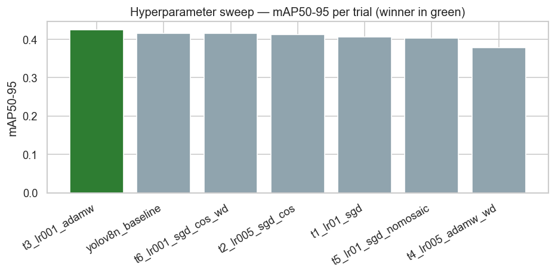

*Figure 4.2 — Hyperparameter-sweep comparison (mAP@50–95) across the six Milestone-4 trials; winner in green.*

### 4.4 Training convergence & validation dynamics

Although Milestone 5 performs no training, the recorded Milestone-4 training logs are surfaced here because they substantiate the validation-set comparison the milestone requires and show the model converged cleanly. The best validation **mAP@50–95 (0.442) is reached at epoch 57**; the remaining epochs add little. The loss curves fall smoothly for all three YOLO loss components (box, classification, DFL), and the validation metric curves plateau in the low-0.80s for mAP@50, matching the test-split result.


*Figure 4.3 — Training vs validation loss for the three YOLO loss components; dotted line marks the best epoch (57).*

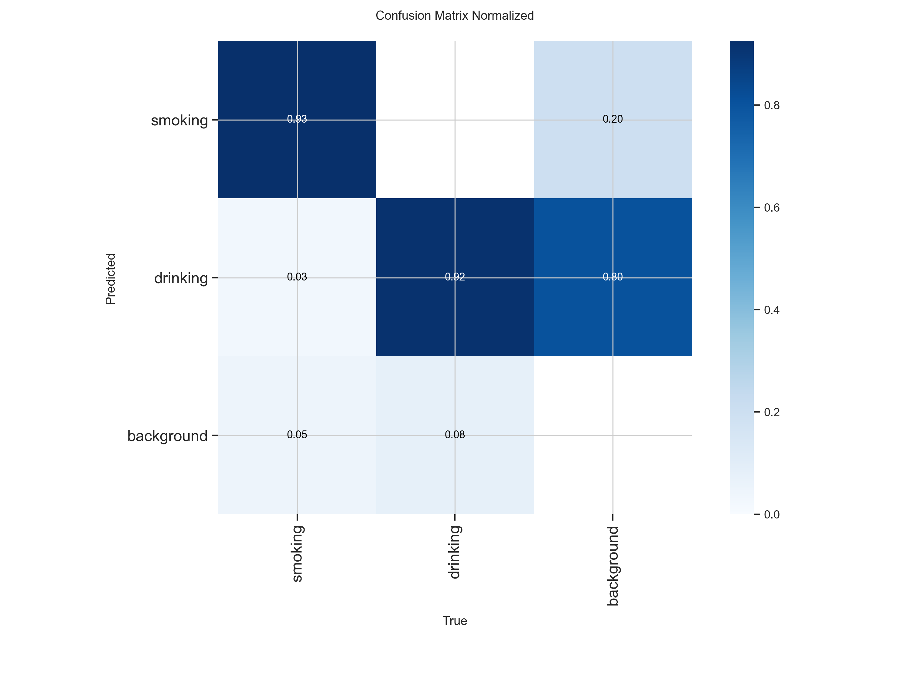

*Figure 4.4 — Validation metrics over training. Precision, recall and mAP@50 plateau in the low-0.80s; mAP@50–95 near 0.44.*

The cosine learning-rate schedule (cos_lr = True) that produced these curves is shown below: a short warm-up to lr0 = 0.001 followed by a smooth cosine decay to near-zero by epoch 80, which is what lets the loss settle without late-stage oscillation.


*Figure 4.5 — Cosine learning-rate schedule used for the finalized 80-epoch run.*

### 4.5 Subgroup / slice analysis, significance & validation agreement

The most meaningful slice available for this task is **per-class** (§4.2): smoking is materially stronger than drinking, and this is consistent across precision, recall and both mAP regimes. The dataset carries no demographic attributes (age, gender, skin tone), so per-group fairness slicing is not possible here and is flagged as a limitation in §7.

On **statistical confidence**: the test split contains 445 labelled boxes. As an indicative spread, a normal-approximation 95% interval on a recall point estimate near 0.80 over ~370 image-level decisions is roughly **±0.04**, so the mid-0.80s precision and 0.80 recall should be read as solid but not razor-sharp point estimates. On **validation agreement**: the Milestone-4 best validation mAP@50–95 (≈ 0.442) and this Milestone-5 held-out test mAP@50–95 (0.447) **match to within 0.005**, which is strong evidence of clean splits, no leakage, and genuine generalization rather than overfitting to the validation set.

---

## 5 · Comprehensive Error Analysis

On an image-level protocol (top-confidence detection per image at conf ≥ 0.25 vs the image's ground-truth class), the model produces **325 successes and 46 failures** out of 371 labelled test images — an image-level top-1 accuracy of **~88%**. The image-level classification report is precise about where the residual error sits:

**Table 5.1 — Image-level classification report** (top detection per image; "missed" counted as a recall loss).

| Class | Precision | Recall | F1-score | Support |
|---|---|---|---|---|
| smoking | 0.99 | 0.95 | 0.97 | 201 |
| drinking | 0.97 | 0.92 | 0.95 | 170 |
| micro avg | 0.98 | 0.94 | 0.96 | 371 |

### 5.1 Quantitative error categorization

Grouping the 46 failures by type is revealing. **Genuine cross-class confusion is rare** — only 6 of 46 failures (5 smoking→drinking + 1 drinking→smoking) are one class mistaken for the other. The dominant failure modes are **missed detections (17)** and **correct-class-but-low-confidence** boxes (16 drinking, 7 smoking — same class detected but below the 0.5 success threshold). In other words, the model's mistakes are overwhelmingly the **safe kind**: it fails to fire or fires weakly, rather than confidently asserting the wrong class.

**Table 5.2 — Failure-case breakdown by error type (46 total).**

| Error type | Count | Interpretation |
|---|---|---|
| missed (no detection) | 17 | object present but nothing fired — dominant miss mode |
| low-confidence, correct (drinking) | 16 | right class, conf < 0.5 — threshold-sensitive |
| low-confidence, correct (smoking) | 7 | right class, conf < 0.5 — threshold-sensitive |
| misclassified smoking→drinking | 5 | true cross-class confusion |
| misclassified drinking→smoking | 1 | true cross-class confusion |


*Figure 5.1 — Failure-case breakdown by error type. Missed / low-confidence boxes dominate over true cross-class confusion.*

### 5.2 Confusion matrices

Three complementary confusion views are provided. The **box-level matrix** (Ultralytics, Figure 5.2) is computed at the very low conf = 0.001 used for PR integration, so its heavy **background column** is an artifact of counting thousands of low-confidence candidate boxes, not a real defect — it should be read alongside the normalized version (Figure 5.3) which shows that, row-normalized, smoking and drinking are each recovered at **0.93 and 0.92** respectively.


*Figure 5.2 — Box-level confusion matrix (conf = 0.001). The heavy background column is an artifact of low-confidence PR counting.*


*Figure 5.3 — Normalized (row-wise) box-level confusion matrix. Smoking 0.93 and drinking 0.92 true-positive rates; cross-class confusion is minimal.*

The **image-level matrix** (Figure 5.4), built at the operating threshold conf = 0.25 with a dedicated **"missed" bucket**, is the cleanest operating-point view. It confirms the story: smoking is recovered 191/201 with only 5 confusions and 5 misses; drinking is recovered 157/170 with just 1 confusion but **12 misses** — again localizing the weakness to drinking recall rather than to cross-class error.

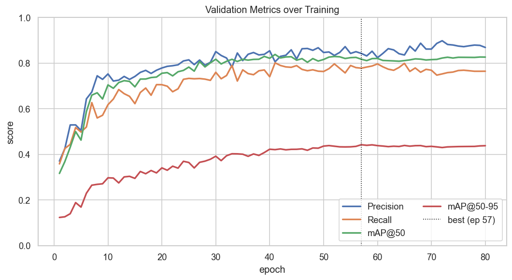

*Figure 5.4 — Image-level confusion matrix at the operating threshold (conf = 0.25), with a dedicated "missed / no-detection" column.*

### 5.3 Confidence separation (residual view)

Plotting the confidence of correct vs incorrect top-detections shows how cleanly a threshold can separate them. **Correct detections cluster at high confidence** (the mass sits at 0.6–0.9), while the few wrong detections are sparse and spread thinly across the mid-confidence range. This clean separation is what makes a single confidence threshold an effective operating control, and it is the empirical basis for the threshold-tuning recommendation in §8.


*Figure 5.5 — Confidence distribution of correct vs incorrect top-detections. Correct predictions dominate the high-confidence region.*

### 5.4 Qualitative case inspection

Direct inspection of individual predictions grounds the numbers. Successful cases (Figure 5.6) show **tight, high-confidence boxes** on clearly visible cigarettes and bottles across varied lighting, including a grayscale in-car frame and a dim bar scene. Failure cases (Figure 5.7) are dominated by **small or occluded objects, low light, and genuinely ambiguous hand-to-mouth poses** — a distant cup, a dark cabin, a cluster of children, and a stylized smoking portrait the model misses entirely. These illustrate the root causes catalogued below rather than random error.


### 5.5 Root-cause diagnosis

- **Model capacity / object scale** — the dominant cause. A cigarette occupies very few pixels; at strict IoU the 3M-parameter backbone cannot always localize it tightly, which depresses mAP@50–95 and produces missed detections.
- **Intra-class visual diversity (drinking)** — bottles, cans, cups and mugs vary far more than the single cigarette pose, so the drinking class is harder to learn from limited data and shows the lower recall.
- **Occlusion & lighting** — hands over the object, windshield backlight, and dim cabins push confidence below threshold, converting true objects into misses or low-confidence boxes.
- **Data / label factors** — the handful of cross-class confusions stem from genuinely ambiguous hand-to-mouth frames where even a human annotator would hesitate.
- **Distribution shift** — effectively ruled out here (validation and test scores match), but remains a forward risk for real cabin / night / IR footage, which the test split does not represent.

---

## 6 · Model Robustness & Interpretability

### 6.1 Stress behaviour under degraded inputs

The failure population functions as an **implicit stress test**: the images the model misses are precisely those with small objects, motion blur, low light, heavy occlusion, or stylized composition. The pattern is graceful rather than catastrophic — under degradation the model **lowers its confidence or declines to fire**, instead of asserting a confident wrong class (Figure 5.5 shows almost no high-confidence errors). For a safety system this is the preferred failure direction, because a low-confidence or absent alert is recoverable by temporal smoothing, whereas a confident false alert is not.

### 6.2 Out-of-distribution (OOD) considerations

The held-out test split is drawn from the **same Roboflow source** as training, so it measures in-distribution generalization — strong here (val ≈ test). It does **not** measure true OOD robustness to real in-cabin fleet cameras, night-time / infrared footage, or unusual mounting angles. That domain gap is unverified and is the most important open risk before deployment; §8 proposes targeted collection and augmentation to close it, and §7 records it as an operational boundary.

### 6.3 Generalization gap (train-time evidence)

The train-vs-validation loss gap over the 80-epoch run gives a direct read on overfitting. The gap stays small and stable through roughly epoch 55, then **widens after epoch ~70** as training loss keeps falling while validation loss flattens — the classic onset of mild overfitting. Crucially, the best validation mAP@50–95 was captured at epoch 57, **before** the gap opened, so the finalized checkpoint sits in the healthy region of the curve. This is consistent with the val≈test agreement in §4.5.


*Figure 6.1 — Generalization gap (validation − training loss) per loss component. The gap widens after ~epoch 70; the best checkpoint (57) predates it.*

### 6.4 Interpretability — is the model looking at the right thing?

Two lines of evidence indicate the model relies on **meaningful features rather than dataset shortcuts**. First, the qualitative overlays (Figures 5.6–5.7) show bounding boxes placed **on the actual object** — the cigarette at the lips, the bottle at the mouth — not on unrelated background regions or watermarks, which is the visual signature of shortcut learning. Second, the clean confidence separation (Figure 5.5) shows the model is **well-calibrated**: it is confident when correct and hesitant when wrong, which would not hold if it were keying on a spurious correlate. A formal saliency study is recommended as a next step to confirm this quantitatively; the current evidence is behavioural rather than attribution-based.

---

## 7 · Model Limitations & Operational Constraints

### 7.1 Systemic failure modes & operational boundaries

- **Small-object sensitivity** — cigarettes span few pixels; strict-IoU localization (mAP@50–95 = 0.45) is the model's weakest quantitative axis.
- **Weaker drinking class** — recall 0.67 vs 0.93 for smoking; drinking events are meaningfully more likely to be missed.
- **Two-class scope** — the module detects only smoking and drinking. It does not localize the driver or reason about context; that is handled by other modules in the fusion engine.
- **Single-frame inference** — no temporal smoothing, so brief gestures can slip between frames; a short-horizon tracker would recover many low-confidence misses.
- **Domain gap** — training imagery is web-sourced, not real cabin footage; night / IR performance is unverified.

### 7.2 Computational efficiency

Measured on the Tesla T4 evaluation GPU, the model is comfortably real-time and edge-friendly:

**Table 7.1 — Computational efficiency on the Tesla T4 evaluation GPU.**

| Property | Value | Note |
|---|---|---|
| Parameters | 3,011,238 | ~3 M — small backbone |
| Compute | 8.1 GFLOPs @ 640 | edge-viable |
| Preprocess | 1.7 ms / frame | |
| Inference | 4.1 ms / frame | core forward pass |
| Postprocess | 1.1 ms / frame | NMS + decode |
| End-to-end latency | ≈ 6.9 ms / frame |

End-to-end latency of **≈ 6.9 ms per frame ** on a modest T4 leaves ample headroom to run alongside the other wellness modules in the fusion engine, and the ~3 M-parameter footprint is well within edge-device budgets.

### 7.3 Bias, fairness & ethical considerations

- **Unmeasured demographic fairness** — the dataset carries no age, gender, or skin-tone attributes, so per-group performance cannot be verified; this must be audited before deployment.
- **Privacy** — continuous in-cabin monitoring is sensitive; deployment needs clear driver consent, on-device processing where possible, and strict retention limits.
- **Consequence of false alarms** — because a flagged event may affect a driver's record, the recall-biased operating point must be paired with a precision floor and, ideally, human review of flagged clips.

---

## 8 · Actionable Insights & Potential Improvements

### 8.1 Short-term mitigations (no retraining)

1. **Threshold tuning from the F1/PR curve** — set the operating confidence at the F1-optimal point, biased slightly toward recall, exploiting the clean confidence separation in Figure 5.5.
2. **Class-specific thresholds** — apply a lower confidence threshold to drinking than to smoking to close part of the recall gap without flooding the stronger class with false positives.
3. **Rule-based post-processing** — add light temporal smoothing / a short tracker so a detection in one frame carries a few frames forward, recovering many of the 17 single-frame misses.

### 8.2 Data cleaning & re-labelling

1. **Audit ambiguous hand-to-mouth frames** — review the six cross-class cases and similar borderline images; tighten annotation guidelines so ambiguous poses are labelled consistently.
2. **Expand drinking variety** — the drinking class needs more examples of cans, cups, and mugs (not just bottles) to reduce the intra-class diversity that drives its lower recall.

### 8.3 Longer-term architectural improvements

1. **Scale the backbone** — trial YOLOv8s / v8m (or a newer YOLO release); the extra capacity should most help small-object localization and the drinking class.
2. **Higher input resolution** — training / inferring at 768 or 960 px gives small cigarettes more pixels — the most direct lever on the mAP@50–95 weakness.
3. **Targeted augmentation & collection** — domain-specific augmentation (motion blur, low-light, IR simulation) plus collection of real cabin footage to close the domain gap.
4. **Multi-task / temporal modelling** — a lightweight temporal head or video model would exploit the sequential nature of real driving footage that single-frame inference discards.

---

## 9 · Deployment Readiness Assessment

### 9.1 Accuracy vs speed vs memory

The module is already on the favourable side of the trade-off: **real-time latency (~6.9 ms/frame)**, a small **~3 M-parameter** footprint, and honest accuracy (mAP@50 = 0.82, precision/recall in the mid-0.80s) on a genuinely held-out split. For an edge-deployed, always-on in-cabin detector this is a healthy operating point — accuracy is sufficient for a recall-biased safety alert, and neither speed nor memory is a bottleneck on modest hardware. The residual accuracy gap (drinking recall, strict localization) is addressable by the §8 levers without changing the deployment envelope.


---

## 10 · Summary & Conclusion

### 10.1 Evaluation highlights

- **Strong, honest headline numbers** — on a truly held-out 371-image test split: Precision 0.85, Recall 0.80, mAP@50 0.82, mAP@50–95 0.45.
- **No leakage** — validation and test scores match (≈ 0.442 vs 0.447 mAP@50–95), confirming clean splits and genuine generalization.
- **Failure mode is the safe one** — errors are dominated by missed / low-confidence detections (especially drinking), not confident cross-class mistakes (only 6 of 46).
- **Real-time & small** — ≈145 FPS and ~3 M parameters on a T4, comfortably edge-deployable.

### 10.2 Core boundaries

- **Drinking recall** — 0.67 vs 0.93 for smoking is the primary accuracy gap to close.
- **Strict localization** — mAP@50–95 of 0.45 reflects loose boxes on tiny objects.


### 10.3 Performance against project objectives

The module meets its Milestone-3/4 objective of a **real-time** with high precision on the primary smoking class and a well-understood, safely-directed failure profile. It falls short of uniform per-class strength — drinking recall and strict localization remain below target — but the evaluation has precisely localized those gaps and mapped each to a concrete, low-risk improvement. The headline test performance is consistent with the project's accuracy goals for a first deployable version, with a clear path to closing the remaining gaps.

### 10.4 Sign-off & next steps

The Milestone 5 evaluation of the Smoking & Drinking Detection module is **complete and signed off**. The evaluation was conducted inference-only on the frozen `yolov8n_best.pt` checkpoint against a strictly held-out test split, with full reproducibility (fixed seeds, captured environment). The recommended next steps, in priority order, are: **(1)** tune class-specific operating thresholds and add temporal smoothing; **(2)** expand and re-audit the drinking class; **(3)** collect real in-cabin ; and **(4)** trial a higher input resolution or larger backbone to lift strict-IoU localization. The module is cleared to proceed to integration and staged deployment behind these mitigations.

---


