# AI-Powered Driver Wellness & Safety Monitoring System

# Final Technical Report — Milestones M1 to M6

**Submission document:** Final Technical Report
**Project:** AI-Powered Driver Wellness & Safety Monitoring System
**Development record covered:** M1 Problem Definition & Literature Review → M2 Dataset Preparation → M3 Model Architecture → M4 Model Training → M5 Model Evaluation & Analysis → M6 Integration, Deployment & Final Documentation
**Source basis:** All milestone reports supplied in the project materials, plus the official DS & AI Lab Project Guidelines document.

## Document Control and Source-Fidelity Statement

This final report is intentionally comprehensive. It consolidates the supplied milestone material into one submission-oriented document while retaining the detailed technical development record from M1 through M5. Where the supplied reports contain different configurations, terminology, results, or versions, the report preserves those distinctions rather than silently reconciling them. The M1 source set contains two materially different versions: an initial drowsiness-focused direction and a later expanded driver-wellness direction. Both are retained below to document the evolution of the project.

No technical result, metric, experiment, deployment claim, or implementation detail has been invented to fill a gap in the milestone documentation. Where a required item is not supported by the supplied source material, it is explicitly identified as not reported.

## Executive Summary

The project developed an AI-powered, video-based driver wellness and safety monitoring framework using multiple specialized deep-learning modules. The development progressed from an initial driver-drowsiness problem definition into a broader multi-module system covering video fatigue, landmark-based temporal fatigue/behaviour analysis, driver activity classification, seat-belt and phone detection, and smoking/drinking detection. The system is designed around an in-cabin camera stream, independent model pipelines, and a centralized Risk Fusion Engine intended to combine module-level outputs into an overall driver wellness assessment.

Across M1–M5, the team completed problem definition and literature/solution analysis, dataset identification and preparation, architecture selection, model implementation and training, and detailed evaluation/error analysis. The supplied M5 material also documents runtime safeguards, streaming behaviour, efficiency measurements, operational constraints, ethics/fairness considerations, and concrete improvement priorities.

The final report therefore records not only the final model metrics but also the reasoning and engineering decisions that led to them: dataset cleaning, leakage prevention, temporal sequence construction, architecture selection, transfer learning, hyperparameter experimentation, checkpoint selection, evaluation methodology, failure analysis, and deployment-oriented safeguards.

## Project Development Timeline

| Milestone | Focus | Outcome documented in supplied reports |
|---|---|---|
| M1 | Problem Definition & Literature Review | Problem scope, stakeholders, objectives, existing approaches, candidate datasets/models, evaluation plan and proposed system direction |
| M2 | Dataset Preparation | Dataset verification, EDA, quality checks, preprocessing, split strategy, leakage prevention and model-ready structures |
| M3 | Model Architecture | Five-module architecture, input/output specifications, candidate comparison, selected models, loss/metrics, computational requirements and Risk Fusion design |
| M4 | Model Training | Training environment, model implementation, optimization, checkpoints, module-level training/evaluation results and artifacts |
| M5 | Model Evaluation & Analysis | Held-out evaluation, confusion/error analysis, robustness, runtime behaviour, efficiency, ethics, limitations and improvement roadmap |

## Requirements Traceability to the Official Project Guidelines

| Guideline requirement | Where addressed in this final report | Evidence status |
|---|---|---|
| M1: clear problem statement, scope, stakeholders, measurable objectives | M1 detailed record and project evolution | Documented |
| M1: existing solutions, baselines, gaps, benchmarks and references | M1 literature/solution sections | Documented where present in source |
| M2: dataset sources, ownership/format/constraints | M2 dataset sections | Documented where reported |
| M2: dataset size, feature/class distribution and quality | M2 EDA/data-quality sections | Documented |
| M2: train/validation/test strategy and leakage prevention | M2 split/leakage sections | Documented |
| M2: reproducible preprocessing | M2 preprocessing/reproducibility sections | Documented |
| M3: dataset organization and preprocessing | M2 + M3 detailed records | Documented |
| M3: architecture, data flow, input shapes, losses and metrics | M3 detailed record | Documented |
| M3: end-to-end pipeline verification | M3 source material and subsequent M4/M5 pipeline evidence | Reported where present; gaps explicitly retained |
| M4: full training configuration | M4 detailed record | Documented where reported |
| M4: hyperparameter experiments and optimization | M3/M4 detailed records | Documented where reported |
| M4: generalization/stability techniques | M4 detailed record | Documented |
| M4: artifacts, checkpoints and findings | M4 detailed record | Documented |
| M5: evaluation dataset/environment/metrics | M5 detailed record | Documented |
| M5: quantitative/qualitative results and visualizations | M5 detailed record | Documented where supplied |
| M5: error analysis, limitations and anomalies | M5 detailed record | Documented in depth |
| M6: deployment & final documentation | M6 integration/deployment reports plus verified `app.py` and `requirements.txt` | Documented; hosted runtime remains blocked by reported ZeroGPU quota |

## Final-System Architecture at a Glance

```text
Driver Camera / In-Cabin Video Stream
                │
                ▼
       ┌───────────────────────┐
       │  Parallel ML Modules  │
       └───────────────────────┘
          │     │      │     │
          ▼     ▼      ▼     ▼
      Video   Landmark Activity Object Detection
     Fatigue  Fatigue
          \      |       /
           \     |      /
            ▼    ▼     ▼
         Risk Fusion Engine
                │
                ▼
       Driver Wellness Score
                │
                ▼
       Safety / Fleet Report
```

The exact architecture, model choices, module outputs, risk weights, and implementation evolution are retained in the milestone records below.

## Consolidated Module Inventory

| Module | Main task | Architecture reported across M3–M5 | Primary data form |
|---|---|---|---|
| Video-Based Fatigue | Temporal fatigue classification | CNN-LSTM in M3; EfficientNet-B0 + BiLSTM in M4/M5 | Video sequences |
| Landmark-Based Fatigue | Temporal facial behaviour/fatigue analysis | LSTM | EAR/MAR/head-pose sequences |
| Driver Activity | Driver distraction/activity classification | MobileNetV3 | RGB images |
| Seat Belt / Phone | Safety compliance/object detection | YOLO-based / YOLOv8n | Annotated RGB images |
| Smoking / Drinking | Unsafe activity detection | YOLOv8n | Annotated RGB images |

## Important Source-Consistency Note

The milestone reports represent an evolving development process. Consequently, some architectural and dataset details change between milestones. Examples include the transition from the M3 planned CNN-LSTM video-fatigue architecture to the M4 EfficientNet-B0 + BiLSTM implementation, and differences between planned and actual sequence/window configurations. These are not treated as errors in this final report; they are recorded as part of the engineering progression from proposed design to implemented system.

---

# Part I — Detailed Development Record

# MILESTONE 1 — Problem Definition, Motivation, Scope and Literature Review

The following two M1 source reports are retained because the supplied project materials contain two materially different versions. The first records the later expanded driver-wellness direction; the second records the earlier drowsiness-focused direction. Together they document how the project scope evolved.

## M1-A — Expanded Driver Wellness Direction

---

## 1. Introduction

Driver safety is not limited to detecting whether a driver is sleepy or not. In real-world driving, driver safety depends on multiple factors such as fatigue, distraction, unsafe behavior, seat belt compliance, phone usage, smoking or drinking while driving, head movement, gaze direction, and long-duration driving behavior. A driver may look normal in a single image frame, but their actual condition can be understood more accurately by observing continuous video behavior over time. Fatigue is especially a time-based condition. It usually appears through patterns such as slow blinking, prolonged eye closure, repeated yawning, head nodding, unstable posture, or reduced attention. Therefore, a system that checks only a single image or one frame at a time may not be reliable enough for driver monitoring. Our updated project direction is titled **AI-Powered Driver Wellness and Safety Monitoring System**. 

The system aims to monitor the overall driver state using video-based deep learning, temporal modeling, object detection, landmark-based feature extraction, and driver behavior analysis. After the Milestone 1 discussion and TA suggestions, we explored a broader driver-monitoring direction that focuses not only on drowsiness, but also on overall driver wellness and safety. The proposed system will process live or recorded driver video and detect fatigue-related behavior, distraction, seat belt usage, phone usage, smoking or drinking activity, head pose, and gaze-away behavior. The outputs from these modules will be combined into a driver wellness score. The system will also generate trip-level or weekly/monthly driver reports using structured event logs. This makes the project more useful for drivers, fleet owners, cab agencies, logistics companies, and transport operators.

---

## 2. Problem Statement

The problem is to design and implement a real-time, video-based driver wellness and safety monitoring system that can identify fatigue, distraction, unsafe driving behavior, and safety compliance using multiple machine learning and deep learning models. Our initial exploration started with frame-level drowsiness cues using YOLO and simple temporal checks. After the TA's suggestions, we explored the problem more deeply and understood that driver fatigue needs stronger video-based temporal modeling rather than only frame-level detection. Driver fatigue cannot be reliably identified using only isolated images. For example, a normal blink, talking, singing, laughing, or briefly looking down can cause false alerts if the system depends only on a single frame or hardcoded conditions. The proposed system will process continuous driver video and learn temporal patterns. The fatigue detection module will use video sequences rather than static images. Models such as CNN-LSTM, CNN-GRU, Temporal Convolutional Networks, or lightweight 3D CNNs will be explored to learn how fatigue develops across time. MediaPipe/OpenCV will be used only as auxiliary tools for extracting interpretable features such as EAR, MAR, head pose, and gaze-related signals. These features will be passed to trainable temporal models instead of using fixed static threshinitials as the final decision logic. YOLO will be used for object-level safety tasks such as seat belt detection, phone detection, smoking detection, and drinking detection. The final driver state will be generated using model fusion and a wellness scoring layer. The system will classify driver condition as **Safe**, **Caution**, or **High Risk**.

---

## 3. Motivation

The motivation behind the updated project is to address driver safety in a broader and more realistic way. Fatigue is a major road safety issue, especially during night driving, long-distance travel, commercial transport, cab driving, and logistics operations. However, drowsiness is not the only reason a driver may become unsafe. A driver may also be distracted by phone usage, may not be wearing a seat belt, may be smoking or drinking while driving, or may frequently look away from the road. A complete driver monitoring system should consider these different factors together. This expanded direction also better matches the learning goals of a machine learning and deep learning course. After reviewing the TA feedback, we explored a more complete ML workflow that includes dataset collection, EDA, video preprocessing, sequence creation, feature extraction, model training, model evaluation, and local deployment. This gives the team a chance to work through the complete ML project lifecycle. The project also has strong practical relevance. Fleet owners can use such a system to monitor driver wellness and risky behavior. Cab agencies can use it for passenger safety. Logistics companies can use it for long-distance transport monitoring. Individual drivers can use it as an early warning system. Transport operators can use generated trip reports to identify safety trends.

---

## 4. Scope and Boundaries

The current scope is to build an academic prototype of a driver wellness and safety monitoring system using video input. For development and demonstration, the system can use recorded video datasets, uploaded videos, and local webcam input. The practical deployment idea is a dashboard camera or embedded in-vehicle camera rather than a smartphone-only solution. The system will focus on software-based detection and analysis.

### What this project covers

- Video-based fatigue detection using temporal deep learning models.
- Landmark-based temporal feature extraction using MediaPipe/OpenCV.
- Driver distraction and activity classification.
- Seat belt detection using object detection.
- Phone, smoking, and drinking detection using object detection.
- Head pose and gaze-away monitoring.
- Driver wellness score calculation.
- Trip-level report generation using structured logs.
- Local dashboard or OpenCV-based demonstration.
- Dataset collection, EDA, preprocessing, sequence creation, model training, and evaluation.

### What this project does not cover

- Real-car mechanical braking integration.
- Automatic steering or vehicle control.
- Certified commercial driver safety product.
- Production hardware deployment.
- Cloud fleet management platform.
- Full mobile application development.
- Medical diagnosis of the driver.
- Use of ECG, EEG, or other physiological sensors.
  The project is strictly video-based and computer-vision-based. It should be treated as an academic prototype and not a certified safety system.

---

## 5. Stakehinitialers

| Stakehinitialer                                                                                                                                          | Relevance / Benefit                                                                 |
| -------------------------------------------------------------------------------------------------------------------------------------------------------- | ----------------------------------------------------------------------------------- |
| **Drivers**                                                                                                                                        | Receive warnings about fatigue, distraction, seat belt issues, and unsafe behavior. |
| **Passengers**                                                                                                                                     | Benefit indirectly from safer driving behavior and initial warnings.                |
| **Cab Owners / Cab Agencies**                                                                                                                      | Can monitor safety patterns during customer rides and night operations.             |
| **Truck Agencies / Logistics Companies**                                                                                                           | Can track fatigue and risky driver behavior during long-distance transport.         |
| **Bus Operators**                                                                                                                                  | Can improve passenger safety during long routes and night travel.                   |
| **Fleet Owners**                                                                                                                                   | Can use wellness scores and trip reports to identify risky driving trends.          |
| **Transport Safety Reviewers**                                                                                                                     | Can use system logs to understand repeated driver safety issues.                    |
| The direct users are drivers and vehicle operators. The indirect beneficiaries are passengers, fleet owners, agencies, and road safety stakehinitialers. |                                                                                     |

---

## 6. Project Objectives

The project objectives are:

1. **Collect and study multiple datasets** related to video-based fatigue, distracted driving, object-level safety, and driver activity monitoring.
2. **Perform EDA** on selected datasets to understand class distribution, video duration, frame quality, lighting variation, annotation types, and dataset limitations.
3. **Preprocess video datasets** by extracting frames, face crops, upper-body crops, and fixed-length video sequences.
4. **Develop a temporal fatigue detection module** using CNN-LSTM, CNN-GRU, TCN, or lightweight 3D CNN.
5. **Use MediaPipe/OpenCV as auxiliary feature extractors** for EAR, MAR, head pose, and gaze-related features.
6. **Train supporting object detection modules** for seat belt, phone, smoking, and drinking detection using YOLO-based models.
7. **Train or fine-tune a driver distraction classifier** using lightweight CNN models such as MobileNetV3, EfficientNet-B0, or ResNet18.
8. **Combine model outputs** into a driver wellness score using a fusion layer or scoring logic.
9. **Generate trip reports** using structured logs and an LLM-based report generation module.
10. **Evaluate the system** using accuracy, precision, recall, F1-score, mAP, FPS, false alarm rate, and sequence-level classification metrics.

---

## 7. Dataset Collection and Understanding

Based on the expanded project direction, more than one dataset is required because the system is not limited to only drowsiness detection. Different features require different types of data. For fatigue detection, video datasets are needed. For seat belt and phone detection, object detection datasets are useful. For distracted driving, activity classification datasets are required. For trip reports, no separate raw video dataset is needed; structured logs generated by the system can be used.

### 7.1 Planned Dataset Sources

| Feature Area                                                                                               | Dataset Type                        | Example Dataset / Source                        | Purpose                                                                    |
| ---------------------------------------------------------------------------------------------------------- | ----------------------------------- | ----------------------------------------------- | -------------------------------------------------------------------------- |
| Video-based fatigue detection                                                                              | Driver video dataset                | NTHU Driver Drowsiness Detection Dataset        | Learn drowsiness and fatigue patterns from video sequences.                |
| Yawning and fatigue behavior                                                                               | Driver yawning video dataset        | YawDD Dataset                                   | Study continuous yawning and mouth movement patterns.                      |
| Driver distraction                                                                                         | Driver activity image/video dataset | State Farm Distracted Driver Dataset            | Classify activities such as texting, drinking, reaching, and safe driving. |
| Fine-grained driver action recognition                                                                     | Multi-modal/video dataset           | Drive&Act Dataset                               | Understand driver activities and action recognition.                       |
| Driver monitoring                                                                                          | Video / multi-modal dataset         | DMD Driver Monitoring Dataset                   | Study distraction, gaze, drowsiness, and driver monitoring scenarios.      |
| Seat belt detection                                                                                        | Object detection dataset            | Seat belt datasets from Kaggle / Roboflow       | Detect seat belt presence or absence.                                      |
| Phone/smoking/drinking detection                                                                           | Object detection dataset            | Driver behavior datasets from Roboflow / Kaggle | Detect unsafe objects or activities.                                       |
| Trip report generation                                                                                     | Structured logs                     | Generated by our system                         | Generate driver wellness and safety summaries.                             |
| The final dataset selection will depend on access, size, license, format, and feasibility on Google Colab. |                                     |                                                 |                                                                            |

### 7.2 Why Video Datasets Are Needed

Fatigue is temporal. A single frame can show closed eyes, but it cannot confirm whether the driver is blinking normally or becoming drowsy. A single frame can show an open mouth, but it cannot confirm whether the driver is yawning, talking, laughing, or singing. Video datasets allow the model to observe behavior across time. This helps capture slow blinking, repeated yawning, head nodding, and long eye closure patterns. Therefore, video datasets are essential for the updated fatigue detection module.

### 7.3 Dataset EDA Plan

The following EDA steps will be performed:

- Count number of videos and images in each dataset.
- Identify available classes and labels.
- Check class distribution and imbalance.
- Check video duration and frame rate.
- Extract sample frames from each class.
- Compare lighting conditions such as day, night, low light, and backlight.
- Check driver variations such as eyewear, face angle, and occlusion.
- Check annotation quality and missing labels.
- Identify duplicate, blurry, or unusable samples.
- Understand whether the dataset supports train/validation/test splitting.
  EDA will help decide which datasets are suitable for final training and which are only useful for testing or comparison.

### 7.4 Preprocessing Plan

The preprocessing pipeline will include:

- Reading videos using OpenCV.
- Extracting frames at selected FPS.
- Detecting and cropping face or upper-body region.
- Resizing frames to a fixed resolution.
- Normalizing pixel values.
- Creating fixed-length clips or frame sequences.
- Extracting MediaPipe features per frame.
- Saving processed clips and features in structured finitialers.
- Creating train/validation/test splits.
- Handling class imbalance using sampling or augmentation.
  This preprocessing step is important because raw videos cannot be directly passed into most models without conversion into a consistent format.

### 7.5 Sequence Creation

Instead of treating each frame independently, the system will create fixed-length sequences. For example:

```text
Video → frames → sequence of 16 / 32 / 64 frames → temporal model
```

Each sequence will represent a short time window of driver behavior. The model will learn whether that time window shows alert driving, fatigue risk, or drowsiness. This avoids depending on a static rule-based approach. The sequence length will be treated as a model input design choice, not as a hardcoded drowsiness rule.

### 7.6 Dataset Limitations

The datasets may have some limitations:

- Some datasets may be large and difficult to train fully on Colab.
- Some datasets may have licensing or access restrictions.
- Some datasets may have image data but not video data.
- Some video datasets may have limited subjects.
- Real-world conditions such as rain, night driving, or heavy occlusion may still be underrepresented.
- Object detection datasets may have different annotation formats.
- Driver behavior datasets may not perfectly match our dashboard-camera view.
  These limitations will be documented during Milestone 2.

---

## 8. Literature Review and Existing Solutions

Existing driver monitoring systems can be divided into several categories:

1. Rule-based facial landmark systems.
2. Image-based object detection systems.
3. Video-based temporal deep learning systems.
4. Driver activity recognition systems.
5. Driver wellness and reporting systems.
   Rule-based systems are fast and interpretable but depend heavily on threshinitials. Image-based systems such as YOLO are good for object detection but do not understand temporal behavior by themselves. Video-based deep learning systems can learn motion and behavior patterns across frames. Driver activity recognition systems can identify unsafe actions like texting, drinking, or reaching behind. Reporting systems convert detection outputs into useful summaries for drivers or fleet owners. The proposed project combines these ideas into a multi-module system.

---

## 9. Video-Based Fatigue Detection

Video-based fatigue detection will be the core deep learning component of the proposed project. The model will take video sequences as input instead of isolated images. The system will try to learn patterns such as:

- Slow blinking.
- Prolonged eye closure.
- Repeated yawning.
- Head nodding.
- Looking down for long periods.
- Reduced facial motion.
- Fatigue-related posture changes.

### 9.1 Why Frame-Level Detection Is Not Enough

A single frame can be misleading. Closed eyes may be a normal blink. An open mouth may be talking or yawning. Looking down may be checking the dashboard. Therefore, the model needs to understand time-based behavior. Temporal models can observe how the driver’s face and posture change across multiple frames.

### 9.2 Possible Models

| Model                                                                                                                                                                               | Input                                    | Use Case                                                |
| ----------------------------------------------------------------------------------------------------------------------------------------------------------------------------------- | ---------------------------------------- | ------------------------------------------------------- |
| **CNN-LSTM**                                                                                                                                                                  | Frame sequence                           | CNN extracts frame features, LSTM learns time behavior. |
| **CNN-GRU**                                                                                                                                                                   | Frame sequence                           | Similar to LSTM but usually lighter and faster.         |
| **TCN**                                                                                                                                                                       | Time-series features or frame embeddings | Captures temporal patterns efficiently.                 |
| **Lightweight 3D CNN**                                                                                                                                                        | Short video clips                        | Learns spatial and temporal features together.          |
| **CNN + Attention**                                                                                                                                                           | Frame sequence                           | Focuses on important frames in a sequence.              |
| For the first implementation, CNN-LSTM or CNN-GRU is the most feasible option on Google Colab. A lightweight 3D CNN can be explored if dataset size and compute resources allow it. |                                          |                                                         |

---

## 10. Landmark-Based Temporal Feature Analysis

MediaPipe and OpenCV will still be useful, but only as feature extraction tools. They will not be used as the final decision-making system.

### 10.1 Features Extracted

The following features can be extracted from each video frame:

| Feature                    | Meaning                                                    |
| -------------------------- | ---------------------------------------------------------- |
| **EAR**              | Eye Aspect Ratio for eye openness.                         |
| **MAR**              | Mouth Aspect Ratio for mouth opening.                      |
| **Head Pitch**       | Up/down head movement.                                     |
| **Head Yaw**         | Left/right head movement.                                  |
| **Head Roll**        | Side tilt of the head.                                     |
| **Blink Pattern**    | Eye closure and reopening behavior over time.              |
| **Gaze-Away Signal** | Whether the driver is looking away from forward direction. |

### 10.2 Temporal Use of Features

The extracted values will be converted into time-series sequences. For example:

```text
Frame 1: EAR, MAR, pitch, yaw, roll
Frame 2: EAR, MAR, pitch, yaw, roll
Frame 3: EAR, MAR, pitch, yaw, roll
...
```

This sequence can be passed to LSTM, GRU, or TCN models. This makes the system learn patterns instead of using only fixed threshinitials.

### 10.3 Role of MediaPipe

MediaPipe will support explainability. For example, if the model predicts fatigue, we can inspect whether EAR was low over time, MAR increased repeatedly, or head pitch changed frequently. This provides interpretable support for the final prediction.

---

## 11. Driver Distraction and Activity Classification

Driver distraction is another important part of driver wellness. A driver may not be sleepy but may still be unsafe. Examples include texting, talking on phone, drinking, reaching behind, operating radio, or talking to a passenger.

### 11.1 Activity Classes

Possible activity classes include:

- Safe driving.
- Texting with right hand.
- Texting with left hand.
- Talking on phone.
- Drinking.
- Reaching behind.
- Operating dashboard or radio.
- Talking to passenger.
- Hair or makeup related distraction.

### 11.2 Possible Models

| Model                                                                                                                                  | Reason for Use                                     |
| -------------------------------------------------------------------------------------------------------------------------------------- | -------------------------------------------------- |
| **MobileNetV3**                                                                                                                  | Lightweight and suitable for local deployment.     |
| **EfficientNet-B0**                                                                                                              | Good accuracy with manageable size.                |
| **ResNet18**                                                                                                                     | Simple and reliable baseline CNN.                  |
| **CNN-LSTM**                                                                                                                     | Useful if video/action sequence data is available. |
| The first baseline can be an image classifier. If video data is available, the model can be upgraded to temporal activity recognition. |                                                    |

---

## 12. Object-Level Safety Detection Modules

YOLO will still be used, but not as the main fatigue detector. YOLO is suitable for visible object detection tasks.

### 12.1 Seat Belt Detection

Seat belt usage is an important safety compliance feature. The system will detect whether the driver is wearing a seat belt. Possible labels:

- Seat belt detected.
- Seat belt missing.
- Person with seat belt.
- Person without seat belt.
  YOLOv8n or YOLO11n can be used for this task.

### 12.2 Phone Usage Detection

Phone usage while driving is a major distraction. The system can detect a mobile phone near the driver. YOLO can identify visible phone objects in the driver cabin.

### 12.3 Smoking and Drinking Detection

The system can also detect unsafe objects or behaviors such as:

- Cigarette.
- Smoking gesture.
- Bottle.
- Cup.
- Drinking action.
  These detections will contribute to the overall driver wellness score.

### 12.4 Why YOLO Is Suitable Here

YOLO is appropriate for object detection tasks because these features are visible in individual frames. However, YOLO will not be used alone to decide fatigue. Fatigue detection will remain video-sequence based.

---

## 13. Proposed System Architecture

The proposed system uses a multi-branch architecture. The main branch handles video-based fatigue detection. The auxiliary branch handles landmark-based temporal features. Additional modules handle object-level safety and driver activity classification.

### 13.1 Architecture Diagram

```text
Input Source
Live Webcam / Recorded Driver Video
        |
        v
Video Preprocessing
- Frame extraction
- Face crop extraction
- Upper-body crop extraction
- Frame resizing
- Normalization
- Fixed-length sequence creation
        |
        v
Multi-Branch Analysis
        |
        +------------------------------------------------------+
        |                                                      |
        v                                                      v
Visual Temporal Branch                              Landmark Temporal Branch
Input: Face/driver video sequence                   Input: EAR, MAR, head pose, gaze features
Model: CNN-LSTM / CNN-GRU / TCN / 3D CNN            Model: LSTM / GRU / TCN
Purpose: Learn fatigue patterns from video          Purpose: Learn interpretable temporal signals
        |                                                      |
        +----------------------------+-------------------------+
                                     |
                                     v
                              Fusion Layer
              Combines visual features and landmark features
                                     |
                                     v
                         Driver State Classification
                       Alert / Fatigue Risk / Drowsy
                                     |
                                     v
Additional Safety Modules
- Seat belt detection using YOLO
- Phone detection using YOLO
- Smoking/drinking detection using YOLO
- Driver activity classification using CNN/EfficientNet/MobileNet
                                     |
                                     v
Driver Wellness Score Calculation
Safe / Caution / High Risk
                                     |
                                     v
Trip Report and Dashboard
- Event logs
- Weekly/monthly health summary
- Driver wellness score
- LLM-generated trip report
```

### 13.2 Improvement from Initial Exploration

| Initial Exploration                 | Expanded Project Direction                           |
| ----------------------------------- | ---------------------------------------------------- |
| Frame-level YOLO detection          | Video-sequence temporal modeling                     |
| Simple static frame-count logic     | Model learns temporal fatigue patterns               |
| Mainly drowsiness-focused detection | Overall driver wellness and safety monitoring        |
| MediaPipe as main logic             | MediaPipe as auxiliary feature extractor             |
| Limited image-dataset focus         | Multiple video, image, and object detection datasets |
| No reporting layer                  | Trip report and wellness dashboard included          |

---

## 14. Driver Wellness Score

The final system will combine multiple model outputs into a driver wellness score. This score will represent the overall safety state of the driver.

### 14.1 Inputs to Wellness Score

| Input Module                    | Example Signal                                    |
| ------------------------------- | ------------------------------------------------- |
| Fatigue model                   | Alert / Fatigue Risk / Drowsy                     |
| Landmark model                  | Eye closure pattern, MAR trend, head pose pattern |
| Distraction classifier          | Texting, phone call, drinking, reaching           |
| Seat belt detector              | Seat belt detected or missing                     |
| Phone/smoking/drinking detector | Unsafe object detected                            |
| Gaze/head pose module           | Looking forward or away                           |

### 14.2 Output Levels

| Output Level                                                            | Meaning                                                                 |
| ----------------------------------------------------------------------- | ----------------------------------------------------------------------- |
| **Safe**                                                          | Driver behavior appears normal.                                         |
| **Caution**                                                       | Mild fatigue or distraction is detected.                                |
| **High Risk**                                                     | Strong fatigue, unsafe activity, or multiple risk signals are detected. |
| The wellness score can be shown on a dashboard and stored in trip logs. |                                                                         |

---

## 15. Trip Report Generation

Trip report generation is an add-on intelligence layer. It will not replace the ML models. The ML models will detect fatigue, distraction, object-level safety events, and wellness score. The report module will convert structured logs into readable summaries.

### 15.1 Report Inputs

The report generator can use structured data such as:

- Trip duration.
- Average wellness score.
- Number of fatigue events.
- Number of high-risk events.
- Phone usage count.
- Seat belt violations.
- Smoking or drinking events.
- Longest fatigue event.
- Time spent in Safe, Caution, and High Risk states.

### 15.2 LLM Use

An LLM such as Llama 3.3 70B can be used through an API for report generation. For local demo, a smaller model can be used. The LLM will not process raw video. It will process structured JSON or CSV summaries and generate human-readable trip reports.

### 15.3 Example Report Output

The report can include:

- Trip summary.
- Driver wellness score.
- Safety risk summary.
- Fatigue trend.
- Distraction trend.
- Seat belt compliance.
- Weekly or monthly driver wellness summary.
- Suggestions for safer driving.

---

## 16. Evaluation Plan and Metrics

The proposed system requires evaluation at different levels. Each module will have its own metrics, and the complete system will also be evaluated.

### 16.1 Fatigue Detection Metrics

| Metric                                                                                                                                                                        | Purpose                                           |
| ----------------------------------------------------------------------------------------------------------------------------------------------------------------------------- | ------------------------------------------------- |
| Accuracy                                                                                                                                                                      | Overall correct classification of driver state.   |
| Precision                                                                                                                                                                     | Correctness of predicted fatigue alerts.          |
| Recall                                                                                                                                                                        | Ability to catch actual fatigue events.           |
| F1-score                                                                                                                                                                      | Balance between precision and recall.             |
| Confusion Matrix                                                                                                                                                              | Understand class-level errors.                    |
| Sequence-level accuracy                                                                                                                                                       | Measures prediction correctness over video clips. |
| Recall is especially important because missing actual fatigue can be dangerous. Precision is also important because too many false alerts can make drivers ignore the system. |                                                   |

### 16.2 Object Detection Metrics

For YOLO-based modules, metrics include:

- mAP, or Mean Average Precision.
- Precision.
- Recall.
- Class-wise detection accuracy.
- Inference FPS.
  mAP will be used to evaluate seat belt, phone, smoking, and drinking detection.

### 16.3 Real-Time Performance Metrics

The real-time system will be evaluated using:

- FPS.
- Latency.
- Model inference time.
- System response time.
- Local webcam demo performance.
  A system with high accuracy but low FPS may not be useful for real-time monitoring.

### 16.4 False Alarm Analysis

False alarms will be analyzed carefully. Examples of possible false alarms include:

- Talking detected as yawning.
- Normal blink detected as fatigue.
- Looking at mirror detected as distraction.
- Drinking water detected as unsafe behavior depending on context.
  The temporal model and fusion logic should reduce unnecessary warnings.

---

## 17. Expected Output and Testing Scenarios

The final system is expected to produce:

- Driver fatigue state.
- Driver distraction state.
- Seat belt status.
- Phone usage alert.
- Smoking or drinking alert.
- Head pose or gaze-away status.
- Driver wellness score.
- Event log.
- Trip report.
- Dashboard summary.

### 17.1 Testing Scenarios

Testing should include:

- Bright light.
- Low light.
- Night-like conditions.
- Backlight.
- Different camera angles.
- Driver with glasses.
- Driver with sunglasses.
- Normal blinking.
- Prolonged eye closure.
- Yawning.
- Talking.
- Laughing.
- Looking away briefly.
- Phone usage.
- Drinking.
- Seat belt present and missing.
  The system should be tested on both recorded videos and local webcam input.

### 17.2 Local Deployment Plan

The local demo can be implemented using:

- Python.
- OpenCV.
- MediaPipe.
- PyTorch or TensorFlow/Keras.
- Ultralytics YOLO.
- Streamlit or simple OpenCV GUI.
  Google Colab will be used for dataset processing and model training. The trained models will be downloaded and used locally for demonstration.

---

## 18. Team Member Declaration and Initials

We confirm that the updated project direction has been discussed and refined based on the Milestone 1 review feedback and TA suggestions. Instead of official handwritten signatures, initials are used because the repository is public.

| Sr. No. | Team Member Name | Responsibility                                                   | Review Initials |
| ------: | ---------------- | ---------------------------------------------------------------- | --------------- |
|       1 | Kushagra         | Updated scope, architecture, documentation, integration planning | KB              |
|       2 | Shiwani          | Dataset collection, dataset EDA, video data preparation          | ST              |
|       3 | Sohini           | Landmark features, metrics validation, documentation review      | SS              |
|       4 | Shubham          | Deep learning model design, temporal pipeline, YOLO modules      | ST              |
|       5 | Ravina           | Evaluation plan, testing scenarios, reporting review             | R               |

---

## 19. References

1. NTHU Driver Drowsiness Detection Dataset.
2. YawDD: Yawning Detection Dataset.
3. State Farm Distracted Driver Detection Dataset.
4. Drive&Act Driver Activity Recognition Dataset.
5. DMD: Driver Monitoring Dataset.
6. MediaPipe Face Mesh Documentation.
7. OpenCV Documentation.
8. Ultralytics YOLO Documentation.
9. Research papers on CNN-LSTM, GRU, TCN, and 3D CNN for video sequence classification.
10. Research references on Eye Aspect Ratio, Mouth Aspect Ratio, PERCLOS, and head pose estimation.
11. Llama / open-source LLM documentation for report generation from structured logs.

---

## M1-B — Initial Drowsiness-Focused Direction

---

## 1. Introduction

Driver fatigue is an important road safety problem, especially during night travel, long-distance driving, and commercial vehicle operations. When a driver continues driving for a long time without proper rest, there is a higher chance of slow reaction time, reduced attention, frequent yawning, eye closure, and head nodding. These signs may look small initially, but they can become dangerous if they are not detected at the right time.

With the rapid development of road infrastructure in India, the usage of cabs, commercial vehicles, private cars, and long-distance transport services is increasing. Along with this, many vehicles are also getting more advanced features such as infotainment systems, driver assistance, and in some cases self-driving or semi-automated driving support. However, one important area that still needs attention is automated driver alertness monitoring.

The need for such a system can be understood from different practical viewpoints:

- Cab owners may want to ensure that their vehicles are being driven safely, especially during late-night or long-distance rides.
- Truck agencies may want to check whether driver rotation and rest breaks are being followed properly.
- Bus operators may want to improve passenger safety during long routes and night travel.
- Private car owners may also benefit from timely alerts during their own long-distance drives.
- Even with experienced drivers, fatigue can still affect attention and reaction time.

In this project, we aim to build an **AI-Powered Driver Drowsiness Detection System** that can monitor the driver using camera input and detect signs of drowsiness in real time. Initially, the system will focus on detecting yawning, eye closure, and head position. Based on these inputs, the system will classify the driver’s state and generate alerts when required.

The goal is not to replace driver responsibility, but to provide an additional safety layer that can warn the driver before fatigue becomes dangerous.

---

## 2. Problem Statement

Driver fatigue is a leading cause of road accidents, particularly during night travel, long-distance driving, and commercial operations. Existing drowsiness detection systems often depend on only one cue, such as eye closure or yawning. Such systems may fail in real-world situations where lighting is poor, the driver is wearing glasses, the face is partially occluded, or the camera angle is not ideal.

Another practical issue is that many simple solutions use smartphone cameras. This may not be suitable for actual driving because phones are commonly used for navigation, calls, payments, and other travel-related activities. Keeping the phone camera active continuously can also cause battery drain and inconvenience for the driver.

### Clear Problem Definition

The problem is:

> How can we detect driver drowsiness in real time by combining multiple visual cues instead of depending on only one signal?

The proposed system should:

- Capture driver video input through a camera.
- Detect visual signs such as eye closure, yawning, and head movement.
- Use MediaPipe/OpenCV for facial landmark-based feature extraction.
- Use a YOLO-based model trained on a driver drowsiness dataset.
- Apply temporal logic so that single-frame errors do not trigger false alerts.
- Classify driver state into **Alert**, **Mild Fatigue**, and **Drowsy**.
- Generate audio or visual alerts according to severity.

This project aims to design and implement a real-time driver drowsiness detection system that uses multiple visual and behavioral signals. The planned system will combine facial landmark estimation using MediaPipe/OpenCV with a YOLO-based model trained on a driver drowsiness dataset. The system will focus on signals such as Eye Aspect Ratio, Mouth Aspect Ratio, blink behavior, yawning, and head-pose/nodding behavior.

A temporal sliding-window logic layer will be used so that a single incorrect frame does not immediately trigger an alert. Instead, the system will check whether fatigue-related signs continue across multiple frames or for a specific duration.

---

## 3. Motivation

As a team, multiple project ideas were discussed, and after internal discussion and voting, this problem statement was selected. One main reason for choosing this topic is that vehicle and road safety is a practical area where a working prototype can be demonstrated clearly. Unlike some topics that may remain mostly theoretical, this project gives us a chance to build something that can be shown using a camera-based setup.

Driver fatigue is a real-world issue and can affect private drivers, cab drivers, bus drivers, and truck drivers. In many cases, people may not realize that they are becoming tired while driving. A system that can detect early signs like eye closure, yawning, or head movement and warn the driver can be useful in such situations.

Another motivation behind choosing this project is that one of the team members has already worked with vision models. Since this project is based on computer vision and deep learning, that experience can help while working on face detection, facial landmark estimation, YOLO-based detection, and real-time video processing. This project also gives the team a good learning opportunity to explore MediaPipe, OpenCV, YOLO training, and alert generation logic in one system.

---

## 4. Scope and Boundaries

The current scope of the project is to build an initial prototype of a driver drowsiness detection system. For study and development purposes, the system will mainly use laptop camera or webcam input. However, in a practical implementation, the system is expected to work using a dedicated dashboard camera or embedded camera setup rather than depending on a mobile phone.

A mobile-phone-based setup is not preferred as the main deployment idea because drivers usually use phones for maps, calls, payments, and other travel-related activities. Keeping the phone camera continuously active can also create battery drain and usability issues. Therefore, the project direction is more suitable for a dashboard camera or in-vehicle camera setup.

### What this project covers

- Studying and understanding the selected driver drowsiness dataset.
- Using MediaPipe for facial landmark estimation.
- Using OpenCV for camera input and frame processing.
- Training or fine-tuning a YOLO-based model using the selected dataset.
- Detecting fatigue-related signs such as eye closure, yawning, and head position.
- Calculating indicators such as Eye Aspect Ratio and Mouth Aspect Ratio.
- Generating a fatigue score based on detected signs.
- Classifying driver state into **Alert**, **Mild Fatigue**, and **Drowsy**.
- Triggering audio or visual alerts based on severity level.

Initially, the main focus will be on yawning, eye closure, and head position. As the project progresses, additional safety-related features such as seat belt detection, mobile phone usage detection, and continuous driving duration may be explored depending on time and feasibility.

Edge deployment is also being explored. As of now, the team does not have strong prior experience with Edge AI deployment, but its feasibility is being checked. If possible, the model will be kept lightweight so that the system can later be optimized for edge devices.

### What this project does not cover

- Actual deployment inside a real car.
- Production-level hardware implementation.
- Mobile application development.
- Cloud-based driver monitoring dashboard.
- Automatic vehicle control, braking, or steering actions.
- Fully certified commercial safety system.

This project should be considered as an academic prototype and not a production-ready safety system. The main aim is to design, implement, and evaluate the detection pipeline and alert mechanism.

---

## 5. Stakeholders

| Stakeholder                                    | Relevance / Benefit                                                                                                                       |
| ---------------------------------------------- | ----------------------------------------------------------------------------------------------------------------------------------------- |
| **Cab Owners / Cab Agencies**            | Can use the system to check whether drivers are alert while handling customer trips, especially during late-night or long-duration rides. |
| **Truck Agencies / Logistics Companies** | Can use fatigue monitoring to ensure that driver rotation or rest breaks are followed properly during long-distance transport.            |
| **Government and Private Bus Operators** | Can improve passenger safety by monitoring driver drowsiness during long routes and night travel.                                         |
| **Drivers**                              | Can receive real-time alerts when signs of fatigue are detected, helping them take breaks before the situation becomes risky.             |
| **Passengers**                           | Benefit indirectly because the system can reduce the risk caused by sleepy or inattentive driving.                                        |
| **Fleet Owners**                         | Can reduce safety risks and improve monitoring of commercial vehicles by using driver alertness information.                              |

The direct benefit of the system is that drivers get timely alerts, while the indirect benefit is improved safety for passengers, vehicle owners, and transport operators.

---

## 6. Project Objectives

The following objectives are measurable and directly aligned with solving the problem described above:

1. **Study existing approaches** for driver drowsiness detection and identify their strengths and limitations.
2. **Understand the selected dataset** and verify its suitability for training a YOLO-based model.
3. **Use MediaPipe/OpenCV** for facial landmark-based analysis of eye closure, mouth opening, and head movement.
4. **Train or fine-tune a YOLO-based object detection model** on the selected drowsiness dataset.
5. **Combine multiple signals** such as eye closure, yawning, blink behavior, and head position.
6. **Apply temporal logic** so that single-frame errors do not immediately trigger false alerts.
7. **Classify driver state** into Alert, Mild Fatigue, and Drowsy.
8. **Evaluate the system** using precision, recall, F1-score, mAP, FPS, and false alarm rate.

---

## 7. Dataset Description

For this project, the selected dataset is the **Drowsiness Driver Dataset** available on Roboflow Universe.

**Dataset Link:** [https://universe.roboflow.com/ntutee-project/drowsiness-driver/dataset/1](https://universe.roboflow.com/ntutee-project/drowsiness-driver/dataset/1)

The dataset is publicly available and is designed for driver monitoring applications. It contains labeled images representing three important facial behaviors related to driver fatigue:

- Open eyes
- Closed eyes
- Yawning

These visual cues are among the most commonly used indicators for detecting driver alertness and fatigue. Prolonged eye closure and frequent yawning are especially useful signs in drowsiness detection systems.

The dataset is provided in YOLOv8 annotation format. This makes it directly compatible with modern YOLO-based object detection frameworks. Since the dataset already contains annotations, the team can focus more on model training, optimization, and evaluation instead of manually labeling images.

### 7.1 Dataset Source

| Attribute                   | Details                   |
| --------------------------- | ------------------------- |
| **Dataset Name**      | Drowsiness Driver Dataset |
| **Source**            | Roboflow Universe         |
| **Workspace**         | ntutee-project            |
| **Project**           | drowsiness-driver         |
| **Version**           | Version 1                 |
| **License**           | CC BY 4.0                 |
| **Annotation Format** | YOLOv8                    |

The dataset follows the standard YOLO directory structure. It includes separate folders for training, validation, and testing images. Each image has a corresponding label file that contains bounding box information.

### 7.2 Dataset Organization

```text
drowsiness-driver-1
├── train
│   ├── images
│   └── labels
│
├── valid
│   ├── images
│   └── labels
│
├── test
│   ├── images
│   └── labels
│
└── data.yaml
```

The `data.yaml` file contains information such as class names, number of classes, and dataset paths required for YOLO training.

### 7.3 Dataset Statistics

| Dataset Split   | Number of Images |
| --------------- | ---------------: |
| Training Set    |           17,961 |
| Validation Set  |            1,881 |
| Testing Set     |            1,826 |
| **Total** | **21,668** |

The training set contains the majority of the images. Validation and testing sets are used to monitor model performance and evaluate generalization.

### 7.4 Image Characteristics

| Property     | Value      |
| ------------ | ---------- |
| Image Width  | 640 pixels |
| Image Height | 640 pixels |
| Resolution   | 640 x 640  |
| Image Format | JPG        |

All images in the dataset have a uniform resolution of **640 x 640 pixels** and are stored in JPG format. Uniform dimensions simplify preprocessing and make the dataset easier to use with YOLO training pipelines.

The dataset includes images captured under different conditions such as different vehicle interiors, driver appearances, camera viewpoints, lighting conditions, and background environments. This variation can help the model learn more general visual patterns.

### 7.5 Dataset Classes

| Class ID | Class Name | Description               |
| -------- | ---------- | ------------------------- |
| 0        | Close      | Driver’s eyes are closed |
| 1        | Open       | Driver’s eyes are open   |
| 2        | Yawn       | Driver is yawning         |

These classes directly support the initial project goal of detecting eye closure and yawning. Head pose or nodding behavior will be handled separately using MediaPipe/OpenCV-based logic unless an additional dataset is added later.

### 7.6 Class Distribution

| Class           | Number of Objects |
| --------------- | ----------------: |
| Open            |             9,510 |
| Yawn            |             7,196 |
| Close           |             6,804 |
| **Total** |  **23,510** |

The Open class has the highest number of annotations, followed by Yawn and Close. The dataset is not perfectly balanced, but the imbalance is not very severe. Data augmentation or class-aware training can be considered if required.

### 7.7 Strengths of the Dataset

- It contains more than 21,000 images, which is useful for training a deep learning model.
- It is already annotated in YOLOv8 format.
- It contains a standard train/validation/test split.
- All images have the same resolution, which simplifies preprocessing.
- The classes are directly related to important drowsiness indicators.
- It contains diversity in driver appearance, lighting, backgrounds, and camera viewpoints.

### 7.8 Limitations of the Dataset

- It contains only three classes: Open, Close, and Yawn.
- It does not include labels for head pose, gaze direction, mobile phone usage, or seat belt detection.
- It is based on static images rather than continuous video sequences.
- Temporal features such as blink duration and sustained eye closure cannot be learned directly from the dataset.
- Some challenging real-world conditions such as heavy rain, very low light, or nighttime driving may not be sufficiently represented.

Because of these limitations, the dataset will mainly support YOLO-based detection of open eyes, closed eyes, and yawning. Time-based detection and fatigue scoring will be implemented using logic across consecutive video frames.

The team is also exploring additional datasets such as NTHU Driver Drowsiness Dataset and YawDD to check whether they can support video-based or more diverse testing. More clarity about final dataset selection, preprocessing, and any additional datasets will be provided in Milestone 2.

---

## 8. Literature Review and Existing Solutions

Existing driver drowsiness detection systems can broadly be grouped into two categories:

1. Rule-based and computer vision approaches
2. Deep learning and YOLO-based approaches

Both approaches have advantages and limitations. Rule-based methods are fast and interpretable. Deep learning methods can learn visual patterns from data and may perform better in complex environments.

---

## 9. Rule-Based and MediaPipe/OpenCV Approaches

Rule-based drowsiness detection systems use facial landmarks and mathematical formulas to estimate whether a driver is alert or drowsy. These systems do not always require training on large datasets. Instead, they calculate values such as eye openness, mouth opening, blink duration, and head angle using landmark coordinates.

### 9.1 OpenCV-Based Video Processing

OpenCV is commonly used for video stream handling and image processing. In a drowsiness detection system, OpenCV can be used for:

- Capturing frames from a webcam or camera.
- Converting frames into grayscale or other formats.
- Applying image enhancement techniques such as histogram equalization.
- Drawing bounding boxes, landmarks, and alert messages.
- Supporting head pose estimation using geometric methods.

OpenCV is useful because it is lightweight, flexible, and suitable for real-time applications.

### 9.2 MediaPipe Face Mesh

MediaPipe Face Mesh provides detailed facial landmark detection. It can detect hundreds of facial landmarks, including points around the eyes, mouth, nose, and face boundary. These landmarks can be used to calculate ratios such as Eye Aspect Ratio and Mouth Aspect Ratio.

MediaPipe is useful because it can run in real time and can work on normal CPUs without always requiring a GPU. This makes it suitable for a practical driver monitoring prototype.

### 9.3 Eye Aspect Ratio

Eye Aspect Ratio is used to measure how open or closed the eyes are. It is calculated using landmark points around the eyes. When the eyes are open, the vertical distance between eyelids is larger. When the eyes are closed, this distance becomes smaller, and the EAR value drops.

A single closed-eye frame may only represent a normal blink. Therefore, the system should not trigger an alert immediately. Instead, it should check whether the EAR remains below a threshold for several consecutive frames. This helps distinguish normal blinking from possible drowsiness.

### 9.4 Mouth Aspect Ratio

Mouth Aspect Ratio is used to detect yawning. It measures the opening of the mouth using landmarks around the lips. During yawning, the vertical mouth opening increases significantly. If the MAR value remains high for a certain time or if yawning happens repeatedly, it can be treated as a fatigue indicator.

However, mouth opening does not always mean yawning. Talking, laughing, or singing can also increase mouth opening. Therefore, MAR should be combined with other signals such as eye closure and head movement.

### 9.5 Blink Rate and Temporal Processing

Blink behavior is another useful indicator of fatigue. A normal blink usually lasts for a short duration, while drowsiness may cause prolonged eye closure or slower blinking. The system can track eye closure over a short time window to identify whether the driver is showing signs of fatigue.

Temporal processing is important because frame-level predictions can be noisy. A sliding-window approach can reduce false alarms by checking whether a condition continues for a few frames or seconds before triggering an alert.

### 9.6 PERCLOS

PERCLOS stands for Percentage of Eye Closure. It measures the percentage of time the eyes remain closed over a given time period. This is often considered a useful fatigue indicator because it looks at eye closure over time rather than a single frame.

For this project, PERCLOS-like logic can be used as part of the fatigue score. If the driver’s eyes remain closed or partially closed for a significant portion of a time window, the fatigue score can increase.

### 9.7 Head Pose Estimation

Drowsiness can also appear through head movement, especially head nodding or downward tilt. Head pose estimation can be used to measure pitch, yaw, and roll of the head:

- **Pitch:** Up and down movement
- **Yaw:** Left and right movement
- **Roll:** Side tilt of the head

If the driver’s head remains tilted downward for a continuous duration, it may indicate drowsiness. MediaPipe landmarks and OpenCV functions can be used to estimate head pose.

### 9.8 Strengths of Rule-Based Approaches

- Fast and lightweight
- Can work in real time
- Does not require large annotated datasets
- Easy to interpret
- Useful as a baseline implementation
- Can be used along with deep learning models to improve decision logic

### 9.9 Limitations of Rule-Based Approaches

- Fixed thresholds may not work for every driver.
- Low light can affect face and landmark detection.
- Glasses, sunglasses, masks, or partial occlusion can reduce accuracy.
- Extreme head angles can make landmarks unreliable.
- Natural actions like talking, laughing, or squinting may cause false alerts.
- Rule-based systems may not understand visual context as well as trained models.

---

## 10. Deep Learning and YOLO-Based Approaches

Deep learning-based approaches use trained models to learn visual patterns from data. For this project, YOLO is considered because it is widely used for real-time object detection. YOLO can detect multiple objects or states in a single frame.

### 10.1 What YOLO Is Used For

YOLO stands for You Only Look Once. It is an object detection algorithm that detects and classifies objects in a single forward pass of a neural network. Unlike older approaches that first generate candidate regions and then classify them, YOLO performs localization and classification together.

In driver drowsiness detection, YOLO can be trained to detect visual states such as:

- Open eyes
- Closed eyes
- Yawning mouth
- Face or facial regions, if labeled
- Other safety-related objects, if future datasets are added

In the current dataset, the YOLO model will mainly focus on the Open, Close, and Yawn classes.

### 10.2 Why YOLO Is Suitable for Real-Time Detection

YOLO is suitable for real-time driver monitoring because it provides a balance between speed and accuracy. Modern YOLO variants are designed for fast inference and can be integrated with OpenCV-based video pipelines.

Main advantages of YOLO include:

- It is a single-stage detector.
- It can detect multiple classes in one frame.
- It provides bounding boxes and confidence scores.
- It can support real-time inference depending on model size and hardware.
- Lightweight variants such as YOLOv8n or YOLO11n may be suitable for limited-resource systems.

Since this project requires real-time response, model speed is important. A very heavy model may achieve high accuracy but may not be useful if it cannot process video frames fast enough.

### 10.3 How YOLO Supports Drowsiness Detection

YOLO itself does not directly understand fatigue. Instead, it detects visual cues such as closed eyes or yawning. The final drowsiness decision is made by analyzing these detections over time.

| Detection Pattern                         | Possible Meaning       |
| ----------------------------------------- | ---------------------- |
| Open eyes detected                        | Driver is likely alert |
| Closed eyes detected briefly              | Normal blink           |
| Closed eyes detected for sustained frames | Possible drowsiness    |
| Yawn detected repeatedly                  | Fatigue indicator      |

This means YOLO provides the visual detections, while the temporal logic layer decides whether the driver should be classified as Alert, Mild Fatigue, or Drowsy.

### 10.4 Rule-Based vs YOLO-Based Approaches

| Rule-Based Approach                  | YOLO-Based Approach                   |
| ------------------------------------ | ------------------------------------- |
| Uses manually designed rules         | Learns visual features from data      |
| Example: EAR below threshold         | Example: Model detects closed eyes    |
| Does not require training            | Requires labeled dataset and training |
| Lightweight and interpretable        | More flexible in complex scenarios    |
| Sensitive to thresholds and lighting | Depends on dataset quality            |
| Useful as a baseline                 | Useful for object/state detection     |

Rule-based methods are simple and computationally efficient. However, their performance may reduce when lighting, camera angle, or driver appearance changes. YOLO-based methods can learn from data and may become more robust. However, they require proper training, evaluation, and optimization.

### 10.5 Lightweight YOLO Variants

For real-time applications, lightweight YOLO variants are preferred. Larger models may improve accuracy but can increase inference time and memory usage.

| Model   | Speed     | Accuracy | Suitable Use                        |
| ------- | --------- | -------- | ----------------------------------- |
| YOLOv8n | Very fast | Good     | Laptop, low-resource systems        |
| YOLOv8s | Fast      | Better   | Desktop/laptop with better hardware |
| YOLO11n | Very fast | Good     | Edge-oriented experiments           |
| YOLO11s | Fast      | High     | Real-time applications              |

The final model choice will depend on training results, available hardware, FPS, and accuracy trade-offs.

### 10.6 Challenges of YOLO-Based Detection

- Low light can reduce visual clarity.
- Sunglasses or occlusions can hide eyes.
- Small facial features may be hard to detect if the camera is far away.
- Talking or laughing may look similar to yawning.
- Poor annotation quality can affect model performance.
- Larger models may be slow on low-end hardware.
- Real-time systems need low latency.

To reduce these issues, the project may use data augmentation, lightweight models, temporal filtering, and a combination of YOLO with MediaPipe-based landmark measurements.

---

## 11. Proposed Approach

The proposed system will use a hybrid pipeline combining deep learning-based object detection and rule-based facial landmark analysis.

### 11.1 Planned Workflow

1. Capture frames from a webcam or camera input.
2. Process frames using OpenCV.
3. Use MediaPipe to estimate facial landmarks.
4. Calculate geometric indicators such as EAR, MAR, and head pose.
5. Use a YOLO-based model trained on the selected dataset to detect Open, Close, and Yawn classes.
6. Combine outputs from MediaPipe/OpenCV and YOLO.
7. Apply sliding-window logic across consecutive frames.
8. Calculate a composite fatigue score.
9. Classify driver state into Alert, Mild Fatigue, or Drowsy.
10. Trigger visual/audio alerts based on severity.

The hybrid approach is selected because MediaPipe/OpenCV can provide lightweight landmark-based measurements. YOLO can detect drowsiness-related visual states from trained data. Combining both can improve reliability compared to using only one method.

### 11.2 Fatigue Scoring

The fatigue score will be calculated using multiple indicators:

- Eye closure duration
- Frequency of closed-eye detections
- Yawning frequency
- Mouth opening duration
- Head tilt or nodding behavior
- Consecutive frames showing fatigue signs

| Level        | Meaning                          | Possible Action           |
| ------------ | -------------------------------- | ------------------------- |
| Alert        | Driver appears normal            | No alert                  |
| Mild Fatigue | Early fatigue signs detected     | Mild warning              |
| Drowsy       | Sustained fatigue signs detected | Strong audio/visual alert |

### 11.3 Temporal Sliding-Window Logic

A single frame should not decide whether the driver is drowsy. For example, a normal blink may briefly show closed eyes, but that does not mean the driver is sleeping. Similarly, one mouth opening frame may be due to talking.

To avoid such false alerts, the system will use a short time window. If fatigue signs continue for a certain number of frames or seconds, then the fatigue score will increase. This makes the system more stable and reduces single-frame noise.

---

## 12. Evaluation Plan and Metrics

The evaluation plan defines how the performance of the drowsiness detection system will be measured, validated, and tested. Since the system is safety-related, evaluation should not focus only on accuracy. It should also consider how well the system distinguishes real drowsiness from normal behavior, how quickly it responds, and how it performs under different conditions.

### 12.1 Precision

**Formula:** `Precision = TP / (TP + FP)`

- **TP:** Drowsy case correctly detected
- **FP:** Alert driver wrongly flagged as drowsy
- **Why it matters:** Too many false alerts can make the driver stop trusting the system.

### 12.2 Recall

**Formula:** `Recall = TP / (TP + FN)`

- **TP:** Drowsy case correctly detected
- **FN:** Real drowsy episode missed by the system
- **Why it matters:** Missing a drowsy case can be dangerous, so recall is very important.

### 12.3 F1-Score

**Formula:** `F1 = 2 x (Precision x Recall) / (Precision + Recall)`

F1-score combines precision and recall into a single balanced score. This is useful because precision and recall can sometimes conflict.

### 12.4 mAP

Mean Average Precision is used for evaluating the YOLO object detection component. It checks how well the model detects and localizes classes such as Open, Close, and Yawn. mAP is important because the drowsiness pipeline depends on correct object detection.

### 12.5 FPS

FPS means Frames Per Second. It measures how many video frames the system can process per second. Since this is a real-time system, FPS is important. A model with good accuracy but very low FPS may not be useful because the alert may come too late.

### 12.6 False Alarm Rate

**Formula:** `False Alarm Rate = FP / Total Alerts Triggered`

This metric is useful because a system may perform well on a dataset but still produce many unnecessary alerts during real use. Reducing false alarms is important for user trust.

---

## 13. Expected Output of the System

For each processed frame or short time window, the system is expected to produce:

- Detection around relevant facial regions or facial states.
- Classification of the driver’s state as Alert, Mild Fatigue, or Drowsy.
- A fatigue score based on multiple indicators.
- A visual or audio alert if drowsiness is sustained beyond a threshold.
- A log of detection events with timestamps for later analysis.

The alert should not be triggered from a single noisy frame. It should be triggered only when signs such as closed eyes, yawning, or head nodding continue across a defined time window.

---

## 14. Possible Testing Scenarios

To make evaluation more realistic, testing should include different conditions rather than only clean dataset images.

### 14.1 Input Sources

- Pre-recorded videos from available datasets or sample recordings.
- Live webcam input for checking real-time behavior and FPS.

### 14.2 Lighting Conditions

- Bright daylight or well-lit indoor conditions.
- Low-light or night-like conditions.
- Backlit conditions where light comes from behind the driver.

### 14.3 Head and Camera Angles

- Direct frontal face position.
- Slight side angles when the driver looks at mirrors or dashboard.
- Partial face visibility.

### 14.4 Eyewear and Facial Variation

- No eyewear
- Prescription glasses
- Sunglasses
- Facial hair or partial obstruction

### 14.5 Behavioral Edge Cases

- Normal blinking vs prolonged eye closure
- Yawning without actual drowsiness
- Talking, laughing, or head turning
- Looking away briefly versus actual fatigue

Testing across these cases will help identify the system’s weak points and guide future improvements.

---

## 15. Limitations of Existing Solutions

Existing drowsiness detection systems have several limitations:

- Many systems depend only on eye closure or yawning.
- Smartphone-based systems may not be practical due to battery drain and phone usage during driving.
- Rule-based systems may fail under low light or poor camera angles.
- Fixed thresholds may not work for every driver.
- Glasses, sunglasses, masks, and partial occlusions can reduce accuracy.
- Some systems are tested only on datasets and not in real-world-like scenarios.
- A single-frame decision can cause false alarms.

The proposed system tries to address these issues by combining multiple signals and applying temporal filtering. However, the current project is still an academic prototype and will not claim production-level reliability.

---

## 16. Expected Outcome

The expected outcome of this project is a working prototype that can detect signs of driver fatigue using camera input. The system should be able to identify important visual cues such as closed eyes and yawning, combine them with landmark-based features, and classify the driver’s alertness level.

The final prototype is expected to include:

- A trained YOLO model for detecting selected drowsiness-related classes.
- MediaPipe/OpenCV-based facial landmark processing.
- A fatigue score calculation method.
- Multi-level drowsiness classification.
- Visual or audio alert generation.
- Basic performance evaluation using selected metrics.

The project will help the team understand how computer vision and deep learning can be applied to a real-time safety problem. It will also help compare rule-based and model-based approaches for drowsiness detection.

---

## 17. Team Member Declaration and Signature

We confirm that the work submitted for Milestone 1 has been discussed, reviewed, and contributed to by all team members as per the assigned responsibilities.

| Sr. No. | Team Member Name | Responsibility                                                     | Signature          |
| ------: | ---------------- | ------------------------------------------------------------------ | ------------------ |
|       1 | Kushagra         | Problem Definition, Motivation, Scope, Stakeholders, Documentation | Kushagra Barodekar |
|       2 | Shiwani          | Dataset Research and Dataset Understanding                         |                    |
|       3 | Sohin            | Literature Review: Rule-Based and MediaPipe/OpenCV Methods         |                    |
|       4 | Shubham          | Literature Review: Deep Learning and YOLO-Based Methods            |                    |
|       5 | Ravina           | Evaluation Plan and Metrics                                        |                    |

---

## 18. References

1. Roboflow Universe - Drowsiness Driver Dataset: [https://universe.roboflow.com/ntutee-project/drowsiness-driver/dataset/1](https://universe.roboflow.com/ntutee-project/drowsiness-driver/dataset/1)
2. MediaPipe Face Mesh Documentation: [https://developers.google.com/mediapipe](https://developers.google.com/mediapipe)
3. OpenCV Documentation: [https://opencv.org/](https://opencv.org/)
4. Ultralytics YOLO Documentation: [https://docs.ultralytics.com/](https://docs.ultralytics.com/)
5. Soukupova, T., and Cech, J. - Real-Time Eye Blink Detection using Facial Landmarks.
6. PERCLOS-based fatigue detection research references.
7. Driver drowsiness detection research papers using EAR, MAR, head pose estimation, and YOLO-based approaches.


---

# MILESTONE 2 — Dataset Preparation and Data Engineering

Milestone 2 focuses on identifying, verifying, cleaning, preprocessing, and organizing the datasets required for the **AI-Powered Driver Wellness and Safety Monitoring System**. In Milestone 1, the project direction was expanded from a narrow drowsiness detection system to a broader driver wellness and safety monitoring system. Based on that direction, Milestone 2 concentrates on making the datasets ready for model development in Milestone 3.

The system is divided into multiple driver monitoring modules. Each module requires a different type of dataset and preprocessing pipeline. Video-based fatigue detection needs continuous driver videos, landmark-based temporal analysis needs extracted face and head-pose features, driver distraction classification needs activity images, and object detection modules need annotated image-label pairs in YOLO format.

The main goal of this milestone is not model training yet. The goal is to prove that the selected datasets are available, understandable, properly cleaned, split without leakage, and structured in a format that can be directly used in Milestone 3.

---

## 2. Milestone 2 Objective

The objective of Milestone 2 is to prepare model-ready datasets for the selected project modules. The submission addresses the following requirements:

- Identify and verify dataset sources.
- Document dataset ownership, format, classes, and usage constraints.
- Understand dataset size, class distribution, and metadata.
- Perform EDA and quality checks.
- Remove or handle corrupted, duplicate, invalid, or irrelevant samples.
- Prepare train, validation, and test splits.
- Prevent data leakage between splits.
- Create processed folder structures.
- Document preprocessing steps for reproducibility.
- Prepare hosted processed dataset links where available.
- Confirm readiness for model experiments in Milestone 3.

---

## 3. System Modules Covered

The project uses multiple datasets because the driver wellness system has multiple responsibilities.

| Team Member | Module | Dataset / Source Type | Target Task |
|---|---|---|---|
| Shiwani | Landmark-Based Temporal Features | YawDD | EAR, MAR, head pose temporal sequence modeling |
| Kushagra | Video-Based Fatigue Detection | UTA-RLDD | Safe / Caution / High Risk fatigue classification |
| Shubham | Driver Activity Classification | AUC Distracted Driver Dataset | Driver distraction image classification |
| Sohini | Seat Belt and Phone Usage Detection | DMS Dataset | YOLO object detection |
| Ravina | Smoking and Drinking Detection | YOLO-format smoking/drinking dataset | Object detection |

Each dataset was processed according to the model type planned for that module. Image classification datasets were organized into class-wise folders. Object detection datasets were converted into YOLO-compatible structures. Temporal feature datasets were stored as sequence arrays and metadata files. Video fatigue data was prepared as class-wise frame samples with a plan to extend it into frame sequences in Milestone 3.

---

## 4. Dataset Selection Summary

### 4.1 Landmark-Based Temporal Features

The landmark feature module uses the **YawDD dataset**. This dataset contains yawning and driver face videos and supports extraction of facial landmarks, eye features, mouth features, and head-pose signals. These signals are useful for temporal fatigue analysis because they can represent behavioral changes across time.

The extracted features include:

- Eye Aspect Ratio (EAR)
- Mouth Aspect Ratio (MAR)
- Head pitch
- Head yaw
- Head roll

The final processed feature format is a temporal window of 30 frames with 5 features per frame.

### 4.2 Video-Based Fatigue Detection

The video fatigue detection module uses the **UTA Real-Life Drowsiness Dataset / UTA-RLDD**. For Milestone 2, the processed subset includes `Fold1_part1` and `Fold1_part2`, covering 12 subjects and 36 videos.

The original UTA-RLDD labels were mapped to the project classes:

| Original Label | Dataset Meaning | Project Class |
|---|---|---|
| `0` | Alert / Awake | Safe |
| `5` | Low Vigilance | Caution |
| `10` | Drowsy | High Risk |

This dataset was selected because fatigue is a temporal condition. A single frame may not clearly show whether the driver is tired, blinking normally, talking, or yawning. Therefore, video data is more appropriate for learning behavior over time.

### 4.3 Driver Activity Classification

The driver activity module uses the **AUC Distracted Driver Dataset**. This dataset supports image-based classification of driver activities.

The final selected classes are:

- other_activities
- safe_driving
- talking_phone
- texting_phone
- turning

This dataset supports a CNN-based activity classifier using models such as ResNet50, MobileNetV3, and EfficientNet-B0.

### 4.4 Seat Belt and Phone Usage Detection

The seat belt and phone usage module uses a filtered **DMS Driver Monitoring System** dataset. The dataset was processed into a clean two-class YOLO object detection dataset.

The final classes are:

| Class ID | Class Name |
|---:|---|
| 0 | Phone |
| 1 | Seatbelt |

This module is intended to detect visible safety-related objects and compliance signals from driver cabin images.

### 4.5 Smoking and Drinking Detection

The smoking and drinking module uses a YOLO-format object detection dataset organized into images, labels, and a `data.yaml` file. The processed dataset follows the standard YOLO train, validation, and test structure.

This module supports detection of unsafe driving behaviors involving smoking and drinking objects or actions.

---

## 5. Common Dataset Inspection and EDA

Across all modules, the team followed a common dataset inspection process before preprocessing.

The inspection process included:

1. Verifying folder structure.
2. Verifying class names and labels.
3. Counting samples in each class.
4. Checking for missing files.
5. Checking whether images or videos could be loaded.
6. Generating class distribution charts.
7. Visualizing sample images or frames.
8. Reviewing resolution, FPS, duration, brightness, or feature distributions depending on the dataset.
9. Identifying duplicates, corrupt files, invalid annotations, or inconsistent labels.
10. Confirming that each dataset could be split into train, validation, and test sets.

This common inspection step helped ensure that all datasets were suitable for the planned model pipelines.

---

## 6. Data Quality Assessment

### 6.1 Landmark-Based Temporal Features

For the landmark module, MediaPipe FaceLandmarker was used to extract features from the YawDD dataset. The pipeline verified landmark detection across 349 videos and 288,174 frames. Landmark extraction achieved a 99.35% success rate. Frames where landmarks could not be extracted were removed, resulting in 1,885 invalid frames being discarded and 286,289 frames being retained.

Additional checks included:

- head-pose stability validation
- EAR and MAR range validation
- landmark jitter review
- manual inspection of representative success and failure frames

The final output was considered reliable enough for temporal sequence modeling.

### 6.2 Video-Based Fatigue Detection

For the UTA-RLDD fatigue dataset, the downloaded subset contained 12 subjects and 36 videos. Automated scripts verified that all expected videos were present and readable.

| Check | Result |
|---|---:|
| Subjects processed | 12 |
| Videos found | 36 |
| Missing videos | 0 |
| Corrupt / unreadable videos | 0 |
| Safe videos | 12 |
| Caution videos | 12 |
| High Risk videos | 12 |

The dataset contained both `.mov` and `.mp4` files, so the preprocessing scripts were updated to support both formats. Video metadata such as FPS, duration, frame count, resolution, and file size was extracted using OpenCV.

Manual visual checks showed that individual frames from different fatigue classes can look similar. This confirms that temporal modeling is needed instead of relying only on isolated frames.

### 6.3 Driver Activity Classification

For the AUC distracted driver dataset, duplicate, corrupted, and blurry image checks were performed.

| Quality Issue | Count | Action |
|---|---:|---|
| Duplicate images | 2,969 | Removed |
| Corrupted images | 10 | Removed |
| Blurry images | 31 | Manually inspected and retained |

Duplicate detection was performed using perceptual hashing. Corrupted images were detected using OpenCV loading checks. Blurry images were identified using Laplacian variance. The blurry samples were retained because they represented realistic driving conditions and the count was small.

After cleaning, the dataset contained 4,307 clean images across the selected driver activity classes.

### 6.4 Seat Belt and Phone Detection

For the DMS seat belt and phone detection dataset, the team verified image-label parity and YOLO annotation validity.

Key checks included:

- every image had a corresponding annotation file
- YOLO bounding boxes followed the expected format
- normalized coordinate values stayed within valid bounds
- irrelevant classes were removed
- remaining classes were remapped to Phone and Seatbelt
- unannotated background frames were filtered out

The final dataset contained 6,140 images and 6,140 label files. A total of 6,701 bounding boxes were validated.

### 6.5 Smoking and Drinking Detection

The smoking and drinking dataset was organized in YOLO format with train, validation, and test folders. It includes images, labels, and a `data.yaml` file. The dataset was prepared using class harmonization, deduplication, augmentation, and split verification. The processed structure is compatible with YOLO-based training in Milestone 3.

---

## 7. Preprocessing Summary

Different preprocessing methods were used depending on the dataset type.

### 7.1 Common Preprocessing Steps

Across modules, the following preprocessing steps were performed:

- folder and label verification
- missing file checks
- corrupt file checks
- duplicate detection where applicable
- class distribution analysis
- sample visualization
- resizing
- normalization
- augmentation where applicable
- train/validation/test split creation
- processed folder or feature file generation

### 7.2 Image Classification Preprocessing

The driver activity images were cleaned, resized, normalized, and augmented. Images were resized to 224 × 224 pixels to support CNN-based models such as ResNet50, MobileNetV3, and EfficientNet-B0. Pixel values will be normalized during model training.

Augmentations included:

- horizontal flip
- random brightness and contrast
- random rotation

### 7.3 Video Fatigue Preprocessing

The fatigue detection videos were scanned and converted into a lightweight processed sample dataset. Five frames were extracted from each video at fixed timeline positions:

```text
10%, 30%, 50%, 70%, 90%
```

The final processed sample contains 180 frames. In Milestone 3, these frames will be extended into fixed-length sequences such as 16-frame, 32-frame, or 64-frame clips.

### 7.4 Landmark Feature Preprocessing

The landmark module extracted EAR, MAR, pitch, yaw, and roll from each frame. Invalid frames were removed. Features were normalized using statistics computed only from the training split. Fixed-length temporal windows of 30 frames with stride 15 were then generated.

### 7.5 YOLO Object Detection Preprocessing

For the object detection modules, datasets were organized into YOLO-compatible folder structures. This includes train, validation, and test folders containing images and labels. Each dataset also includes a `data.yaml` file.

For the seat belt and phone detection dataset, images were resized to 640 × 640 pixels, annotations were validated, and classes were remapped to a two-class schema.

---

## 8. Train / Validation / Test Split Strategy

The team used different split strategies depending on dataset type and available metadata.

| Feature | Split Strategy |
|---|---|
| Landmark Features | Subject-wise split |
| Video Fatigue Detection | Subject-wise split |
| Driver Activity Classification | 70% / 15% / 15% |
| Seat Belt & Phone Detection | 70% / 20% / 10% |
| Smoking & Drinking Detection | 80% / 10% / 10% |

Subject-wise splitting was used wherever subject IDs or video identity could cause leakage. For video and temporal modules, the same subject or video sequence must not appear in multiple splits. For image and object detection datasets, duplicate removal, class-wise splitting, original split boundary preservation, and stratification were used to reduce leakage risk.

---

## 9. Leakage Prevention

Leakage prevention was treated as a major Milestone 2 requirement because several datasets contain similar frames, video sequences, or repeated subjects.

### 9.1 Landmark Module

For the landmark module, all videos from one subject were assigned to only one split. All 30-frame temporal windows remained within their native video’s assigned split. Z-score normalization statistics were computed only from the training set and then applied to validation and test sets.

### 9.2 Fatigue Detection Module

For the fatigue module, a strict subject-level split was used.

| Split | Subject IDs | Videos | Processed Frames |
|---|---|---:|---:|
| Train | 01–08 | 24 | 120 |
| Validation | 09–10 | 6 | 30 |
| Test | 11–12 | 6 | 30 |

All three videos from a subject stayed in the same split. Frames were extracted only after the split was finalized. This prevents frames from the same video or same subject from appearing in multiple splits.

### 9.3 Driver Activity Module

For the distracted driver dataset, duplicate images were removed before splitting. A post-split hash check found possible near-duplicate images from consecutive sequences, so the team recommends using sequence-wise or subject-wise splitting if driver IDs become available later.

### 9.4 Seat Belt and Phone Module

For the seat belt and phone dataset, original split boundaries were preserved. Random frame-level migration was avoided because consecutive driving frames can contain nearly identical backgrounds. This helps prevent the model from memorizing scene-specific information.

### 9.5 Smoking and Drinking Module

For the smoking and drinking detection dataset, deduplication was performed before splitting, and augmentation was applied only to the training set. This avoids augmented versions of the same image appearing in validation or test data.

---

## 10. Processed Dataset Structure

Each module has a processed dataset structure based on its model requirements.

### 10.1 Landmark-Based Temporal Features

```text
processed_dataset/
├── raw_features_all_videos.csv
├── normalized_features_all_videos.csv
├── train_windows.npy
├── val_windows.npy
├── test_windows.npy
├── train_meta.csv
├── val_meta.csv
└── test_meta.csv
```

### 10.2 Video-Based Fatigue Detection

```text
data/
└── processed/
    └── fatigue_detection/
        ├── train/
        │   ├── Safe/
        │   ├── Caution/
        │   └── High_Risk/
        ├── val/
        │   ├── Safe/
        │   ├── Caution/
        │   └── High_Risk/
        └── test/
            ├── Safe/
            ├── Caution/
            └── High_Risk/
```

### 10.3 Driver Activity Classification

```text
processed_dataset/
├── train/
│   ├── other_activities/
│   ├── safe_driving/
│   ├── talking_phone/
│   ├── texting_phone/
│   └── turning/
├── validation/
│   └── class folders
└── test/
    └── class folders
```

### 10.4 Seat Belt and Phone Detection

```text
dms_processed_yolo/
├── data.yaml
├── train/
│   ├── images/
│   └── labels/
├── valid/
│   ├── images/
│   └── labels/
└── test/
    ├── images/
    └── labels/
```

### 10.5 Smoking and Drinking Detection

```text
smoking_drinking_yolo/
├── data.yaml
├── train/
│   ├── images/
│   └── labels/
├── val/
│   ├── images/
│   └── labels/
└── test/
    ├── images/
    └── labels/
```

---

## 11. Final Processed Dataset Summary

| Team Member | Feature Type | Final Format | Train / Validation / Test Split | Leakage Prevention |
|---|---|---|---|---|
| Shiwani | Landmark temporal features | `.npy` + `.csv` | Subject-wise | Subject-wise split, no shared windows, training-only normalization |
| Kushagra | Video fatigue detection | Class-wise image folders | Subject-wise | Subject-level split before frame extraction |
| Shubham | Driver activity classification | Image folders | 70% / 15% / 15% | Duplicate removal before split |
| Sohini | Seat belt and phone detection | YOLO images + labels + `data.yaml` | 70% / 20% / 10% | Sequence-based stratified split |
| Ravina | Smoking and drinking detection | YOLO images + labels + `data.yaml` | 80% / 10% / 10% | Deduplication before split and augmentation only on training set |

---

## 12. Hosted Dataset Links

The processed datasets are hosted or prepared for hosting through Google Drive.

| Team Member | Feature | Hosted Dataset Status |
|---|---|---|
| Shiwani | Landmark Features | Google Drive link provided |
| Kushagra | Video Fatigue Detection | Google Drive link provided |
| Shubham | Driver Activity Classification | Link pending / to be updated |
| Sohini | Seat Belt and Phone Detection | Google Drive link provided |
| Ravina | Smoking and Drinking Detection | Google Drive link provided |

Where a hosted link is not yet available, the dataset can be regenerated using the preprocessing scripts and documentation included with the project.

---

## 13. Model Input Format Summary

| Feature | Planned Model | Input Shape | Format | Status |
|---|---|---|---|---|
| Driver Activity Classification | ResNet50, MobileNetV3, EfficientNet-B0 | `(batch, 3, 224, 224)` | RGB image | Ready |
| Video Fatigue Detection | CNN-LSTM, CNN-GRU, TCN, lightweight 3D CNN | `(16, 224, 224, 3)` | Video sequence | Ready for sequence creation |
| Landmark Features | LSTM | `(30, 5)` | Temporal feature sequence | Ready |
| Seat Belt / Phone Detection | YOLOv8n, YOLO11n | `(640, 640, 3)` | RGB image + YOLO labels | Ready |
| Smoking / Drinking Detection | YOLO-based model | `(640, 640, 3)` | RGB image + YOLO labels | Ready |

The datasets are aligned with their intended Milestone 3 models. Classification datasets are ready for CNN training, temporal features are ready for LSTM training, and object detection datasets are ready for YOLO training.

---

## 14. Reproducibility

The team documented preprocessing steps and generated scripts or notebooks for dataset preparation. The reproducibility plan is:

1. Download the raw dataset from the documented source.
2. Run the dataset inventory script or notebook.
3. Validate missing files, corrupt files, and annotation format.
4. Generate metadata and EDA charts.
5. Apply cleaning steps such as duplicate removal or invalid frame removal.
6. Create train, validation, and test splits.
7. Save processed files into the final folder structure.
8. Use the hosted processed dataset where available.

This ensures that the processed datasets can be recreated if required.

---

## 15. Dataset Adequacy and Limitations

The selected datasets are adequate for Milestone 3 because each planned model has a corresponding processed dataset.

However, some limitations remain:

- Some datasets are based on controlled or limited environments.
- Real-world night, rain, glare, and occlusion cases may still be underrepresented.
- Video fatigue detection currently uses a subset of UTA-RLDD because the full dataset is large.
- Driver activity data may contain near-duplicate images from consecutive frames.
- Some datasets do not provide subject IDs, which limits perfect leakage prevention.
- Hosted links should be verified before final submission.
- Smoking and drinking detection details should be expanded further if additional dataset statistics become available.

These limitations will be considered during model training and evaluation in Milestone 3.

---

## 16. Connection to Milestone 3

Milestone 3 will focus on training and comparing models using the processed datasets prepared in this milestone.

Planned next steps include:

- Train image classification models for driver distraction.
- Train or fine-tune YOLO models for seat belt, phone, smoking, and drinking detection.
- Train LSTM-based models on landmark temporal features.
- Convert fatigue frames into fixed-length sequences and test CNN-LSTM, CNN-GRU, TCN, or lightweight 3D CNN models.
- Compare model accuracy, precision, recall, F1-score, mAP, FPS, and false alarm behavior.
- Integrate module outputs into a driver wellness score.

The current processed datasets are organized to directly support these next steps.

---

## 17. Team Member Contribution Summary

| Team Member | Milestone 2 Contribution |
|---|---|
| Kushagra | Prepared UTA-RLDD fatigue detection dataset, EDA, split strategy, processed sample frames, report section, and GitHub organization. |
| Shiwani | Prepared landmark temporal feature dataset, processed sequence files, and processed dataset hosting summary. |
| Shubham | Prepared driver activity preprocessing, model-readiness summary, input format details, and related dataset preparation. |
| Sohini | Prepared seat belt and phone detection dataset processing, data quality checks, leakage prevention summary, and YOLO structure. |
| Ravina | Prepared smoking and drinking detection dataset structure, hosting details, presentation/work-log support, and final review items. |

---

## 18. Team Review and Initials

Instead of handwritten signatures, initials are used because the repository is public.

| Sr. No. | Team Member Name | Responsibility | Review Initials |
|---:|---|---|---|
| 1 | Kushagra | Video fatigue dataset, final report assembly, GitHub structure | KB |
| 2 | Shiwani | Landmark temporal features, processed dataset hosting summary | ST |
| 3 | Shubham | Driver activity classification, preprocessing/model-readiness summary | ST |
| 4 | Sohini | Seat belt and phone detection, quality/leakage summary | SS |
| 5 | Ravina | Smoking and drinking detection, presentation and final review | R |

---

## 19. Conclusion

Milestone 2 establishes the dataset foundation for the AI-Powered Driver Wellness and Safety Monitoring System. The team identified datasets for all major modules, performed EDA and quality checks, created train/validation/test splits, prevented leakage where possible, and organized the processed outputs into model-ready structures.

The datasets are now prepared for Milestone 3 model development. The next milestone will focus on training, comparing, and evaluating the planned models for driver fatigue, landmark-based temporal signals, driver distraction, seat belt and phone usage, and smoking/drinking detection.

---

# MILESTONE 3 — Model Architecture Design and End-to-End Pipeline

Team Members: Kushagra, Shiwani, Shubham, Sohini, Ravina

## **1. Introduction**

### **1.1 Overview**

The objective of Milestone 3 is to finalize the deep learning architectures for all modules of the AI-Powered Driver Wellness & Safety Monitoring System. Unlike Milestone 2, which focused on dataset preparation and preprocessing, this milestone defines the complete model design that will be implemented and trained in Milestone 4.

The proposed system consists of five independent deep learning modules that work together to monitor the driver's behavior and estimate an overall driver wellness score. Each module is responsible for detecting a specific safety-related event. The outputs from all modules are fused by a centralized risk assessment engine to generate a comprehensive driver safety report suitable for fleet management platforms such as Uber, Ola, and Rapido.

### **1.2 Objectives**

The objectives of Milestone 3 are:

- Select appropriate deep learning architectures for each module

- Justify the selection of each model

- Define the input and output specifications

- Select suitable loss functions and evaluation metrics

- Plan the hyperparameters for future training

- Estimate computational requirements

- Design the end-to-end inference pipeline

- Prepare the system for implementation in Milestone 4

## **2. Overall System Architecture**

The proposed Driver Wellness and Safety Monitoring System receives video streams captured from an in-vehicle camera. Different deep learning models analyze various aspects of driver behavior in parallel. Each model generates an independent prediction, which is forwarded to a centralized Risk Fusion Engine. The fusion engine combines all predictions to estimate the driver's overall wellness score and generate a detailed safety report.

```text
                     Driver Camera
                          │
                          ▼
                  Video Stream Input
                          │
      ┌───────────────────┼────────────────────┐
      │                   │                    │
      ▼                   ▼                    ▼
Driver Activity      Seatbelt & Phone      Smoking/Drinking
 MobileNetV3            YOLOv8n               YOLOv8n
      │                   │                    │
      └──────────────┬────┴─────────────┐
                     │                  │
                     ▼                  ▼
          Video Fatigue         Landmark Fatigue
           CNN-LSTM                  LSTM
                     │
                     ▼
              Risk Fusion Engine
                     │
                     ▼
          Driver Wellness Score
                     │
                     ▼
      Driver Report / Uber Dashboard
```

**FIGURE 1: End-to-End System Architecture Diagram**

## **3. Module 1 – Video-Based Fatigue Detection**

### **3.1 Objective**

Detect fatigue levels from temporal driver video sequences.

### **3.2 Candidate Models**

- CNN-LSTM

- CNN-GRU

- Temporal Convolutional Network (TCN)

- Lightweight 3D CNN

### **3.3 Final Model Selection**

**Selected Model:** CNN-LSTM

**Justification**

Three temporal architectures (CNN-GRU, CNN-LSTM, and Tuned CNN-LSTM) were considered for video-based fatigue detection. CNN-LSTM was selected because it provides better long-term temporal feature learning while maintaining good computational efficiency. It achieved the best overall performance among the evaluated architectures and is suitable for modeling fatigue progression across consecutive video frames.

### **3.4 Input Specification**

| Parameter      | Value                    |
|----------------|--------------------------|
| Input Type     | Video Sequence           |
| Input Shape    | (16, 224, 224, 3)        |
| Output Classes | Safe, Caution, High Risk |

### **3.5 Loss Function**

CrossEntropyLoss - Suitable for multi-class classification.

### **3.6 Evaluation Metrics**

Accuracy, Precision, Recall, F1-score, Confusion Matrix

### **3.7 Planned Hyperparameters**

| Hyperparameter | Planned Value |
|----------------|---------------|
| Optimizer      | Adam          |
| Learning Rate  | 0.001         |
| Batch Size     | 8             |
| Epochs         | 30            |

### **3.8 Computational Requirements**

- Framework: PyTorch

- GPU: 16 GB recommended

- RAM: 16 GB

- Hardware: Apple M4 Pro / NVIDIA Tesla T4

### **3.9 Architecture Diagram**

```text
Selected Model Architecture

                    Input Video
                         │
                         ▼
             Frame Sampling (5 FPS)
                         │
                         ▼
            Sequence Generation (16 Frames)
                         │
                         ▼
     ┌───────────────────────────────────┐
     │         CNN Feature Encoder       │
     │                                   │
     │   Conv2D (3 → 32)                 │
     │   ReLU                            │
     │   MaxPool                         │
     │                                   │
     │   Conv2D (32 → 64)                │
     │   ReLU                            │
     │   MaxPool                         │
     │                                   │
     │   Conv2D (64 → 128)               │
     │   ReLU                            │
     │   MaxPool                         │
     │                                   │
     │   Conv2D (128 → 256)              │
     │   ReLU                            │
     │   AdaptiveAvgPool (1×1)           │
     └───────────────────────────────────┘
                         │
          256-D Feature Vector per Frame
                         │
                         ▼
              LSTM (Hidden Size = 128)
                         │
                Final Hidden State
                         │
                         ▼
                 Dropout (0.30)
                         │
                         ▼
         Fully Connected Layer (128 → 3)
                         │
                         ▼
              Softmax Classification
                         │
     ┌─────────────┬─────────────┬─────────────┐
     │    Safe     │   Caution   │  High Risk  │
     └─────────────┴─────────────┴─────────────┘
```

**FIGURE 2: Video-Based Fatigue Detection Architecture**

The proposed pipeline extracts spatial features from each video frame using a CNN encoder. The extracted features are then passed to an LSTM network to model temporal dependencies across frame sequences before classifying the driver's fatigue level.

## **4. Module 2 – Landmark-Based Fatigue Detection**

### **4.1 Objective**

Detect fatigue using facial landmark sequences.

### **4.2 Candidate Models**

- LSTM

- GRU

- TCN

- MLP

### **4.3 Final Model Selection**

**Selected Model:** LSTM

**Justification**

LSTM was selected because fatigue-related facial features such as EAR, MAR, head pitch, yaw, and roll evolve over time. Compared with MLP, GRU, and TCN, LSTM is better suited for learning long-term temporal dependencies in sequential facial landmark data while maintaining stable performance.

### **4.4 Input Specification**

| Parameter      | Value                       |
|----------------|-----------------------------|
| Features       | EAR, MAR, Pitch, Yaw, Roll  |
| Input Shape    | (30, 5)                     |
| Output Classes | Alert, Mild Fatigue, Drowsy |

### **4.5 Loss Function**

CrossEntropyLoss

### **4.6 Evaluation Metrics**

Accuracy, Precision, Recall, F1-score

### **4.7 Planned Hyperparameters**

- Learning Rate: 0.001

- Batch Size: 32

- Epochs: 30

### **4.8 Feature Extraction Pipeline**

The model receives sequences of facial features extracted using MediaPipe Face Landmarker. Each sequence contains 30 consecutive frames with five features (EAR, MAR, Pitch, Yaw, Roll), which are normalized before being passed to the LSTM network for fatigue classification.

### **4.8 Architecture Diagram**

```text
YawDD Videos
        │
        ▼
MediaPipe Face Landmarker
        │
        ▼
Facial Landmark Extraction
        │
        ▼
EAR
MAR
Pitch
Yaw
Roll
        │
        ▼
Feature Cleaning
        │
        ▼
Normalization
        │
        ▼
Sliding Window
(30 Frames)
        │
        ▼
Train / Validation / Test Split
        │
        ▼
MLP
LSTM
GRU
TCN
        │
        ▼
Hyperparameter Tuning
        │
        ▼
Best Model (LSTM)
        │
        ▼
Prediction
        │
        ▼
Normal
Talking
Yawning
Talking\_Yawning
```

**FIGURE 3: Landmark-Based Fatigue Detection Architecture**

## **5. Module 3 – Driver Activity Classification**

### **5.1 Objective**

Classify the driver's activity from RGB images to identify distracting behaviors.

### **5.2 Candidate Models**

- MobileNetV3

- ResNet50

- EfficientNet-B0

### **5.3 Model Comparison**

| Model | Advantages | Limitations |
|----|----|----|
| MobileNetV3 | Lightweight, fast inference, low memory, real-time capable | Slightly lower accuracy than larger networks |
| ResNet50 | Excellent feature extraction, high accuracy | Large model size, slower inference, high compute |
| EfficientNet-B0 | Good accuracy-efficiency balance | More complex than MobileNetV3, slower on edge |

### **5.4 Final Model Selection**

Selected Model: **MobileNetV3**

***Justification***:

Although **EfficientNet-B0** achieved the highest classification accuracy on the candidate dataset and **ResNet50** also demonstrated strong performance, **MobileNetV3** was selected as the final architecture due to its significantly lower computational complexity, faster inference speed, and lower memory consumption.

The proposed Driver Wellness & Safety Monitoring System is intended for real-time deployment on resource-constrained platforms such as Raspberry Pi, NVIDIA Jetson Nano, and other in-vehicle embedded systems. In such applications, low inference latency, reduced power consumption, and efficient memory utilization are more important than a small improvement in classification accuracy.

MobileNetV3 is specifically designed for efficient edge deployment through lightweight convolutional blocks, depthwise separable convolutions, squeeze-and-excitation modules, and neural architecture search (NAS)-based optimization. These characteristics enable real-time inference while maintaining competitive classification performance.

Therefore, considering both the experimental results and the deployment requirements of the proposed system, **MobileNetV3 provides the best trade-off between classification performance and computational efficiency**, making it the most suitable architecture for this project.

**5.5 Architecture Justification**

| **Requirement** | **MobileNetV3** | **Justification** |
|----|----|----|
| Real-time inference | **✓** | Optimized for fast image classification with low inference latency. |
| Low latency | ✓ | Enables real-time processing of continuous driver camera frames. |
| Lightweight architecture | **✓** | Uses significantly fewer parameters than ResNet50 and EfficientNet-B0. |
| Suitable for edge devices | **✓** | Specifically designed for deployment on embedded and mobile platforms. |
| Low memory usage | **✓** | Requires less GPU memory, making it suitable for resource-constrained systems. |
| Good classification accuracy | **✓** | Provides competitive accuracy while maintaining high computational efficiency. |
| Embedded deployment | **✓** | Can be deployed on Raspberry Pi, NVIDIA Jetson Nano, and similar edge AI devices. |
| Energy efficient | **✓** | Lower computational complexity results in reduced power consumption, making it appropriate for in-vehicle systems. |
| Scalability | **✓** | Can be integrated into larger driver monitoring systems with minimal computational overhead. |

### **5.6 Candidate Dataset**

A representative subset (20% of full dataset, 4,200 images) was created using stratified random sampling across all five classes, preserving the original class distribution for rapid experimentation.

### **5.7 Input Specification**

| Parameter     | Value             |
|---------------|-------------------|
| Input Type    | RGB Image         |
| Image Size    | 224 × 224 × 3     |
| Normalization | ImageNet mean/std |

### **5.8 Output Classes**

- Safe Driving

- Texting on Phone

- Talking on Phone

- Turning

- Other Activities

### **5.9 Loss Function**

CrossEntropyLoss - Standard for multi-class classification.

### **5.10 Baseline Performance**

| Model(Epoch)        | Accuracy | Precision | Recall | F1-Score |
|---------------------|----------|-----------|--------|----------|
| MobileNetV3(15)     | 89.35%   | 89.74%    | 89.35% | 89.39%   |
| ResNet50(10)        | 92.13%   | 92.32%    | 92.13% | 92.14%   |
| EfficientNet-B0(10) | 93.98%   | 94.08%    | 93.98% | 93.98%   |

*Baseline performance was obtained using ImageNet-pretrained weights on the representative candidate dataset after training for 10 epochs with the default hyperparameters (Adam optimizer, learning rate = 0.001, batch size = 32). These results serve as the reference for all subsequent hyperparameter tuning experiments.*

### **5.11 Hyperparameter Tuning Results (MobileNetV3)**

| Experiment | LR     | Batch Size | Optimizer | Accuracy |
|------------|--------|------------|-----------|----------|
| Baseline   | 0.001  | 32         | Adam      | 87.04%   |
| Exp 2      | 0.0005 | 32         | Adam      | 90.74%   |
| Exp 3      | 0.0001 | 32         | Adam      | 87.96%   |
| Exp 4      | 0.001  | 16         | Adam      | 87.96%   |
| Exp 5      | 0.001  | 64         | Adam      | 68.06%   |
| Exp 6      | 0.001  | 32         | SGD       | 42.13%   |
| Exp 7      | 0.001  | 32         | AdamW     | 89.81%   |

Optimal Configuration: LR=0.0005, Batch Size=32, Optimizer=Adam (90.74% accuracy).

The hyperparameter tuning experiments demonstrated that reducing the learning rate from 0.001 to 0.0005 improved the classification performance of MobileNetV3. Experiments with larger batch sizes resulted in unstable training for MobileNetV3, while the SGD optimizer showed considerably slower convergence compared with Adam. Based on these observations, Adam with a learning rate of 0.0005 and batch size of 32 was selected as the planned configuration for Milestone 4.

### **5.12 Comparison Plots**


**FIGURE 4: Accuracy Comparison Across Experiments**

### **5.13 Training Pipeline**

Dataset → Train/Val Split (80/20) → Data Augmentation → Data Loader → MobileNetV3 → CrossEntropyLoss → Backpropagation (Adam, LR=0.0005) → Validation → Best Model Saved

### **5.14 Validation Strategy**

- Training: 80% (3,360 images)

- Validation: 20% (840 images)

- Stratified random split

- Early stopping with patience = 5 epochs

### **5.15 Evaluation Methodology**

```text
Candidate Dataset
        │
        ▼
Train Dataset
        │
        ▼
Train MobileNetV3
        │
        ▼
Validation Dataset
        │
        ▼
Best Model Selection
        │
        ▼
Independent Test Dataset
        │
        ▼
Performance Evaluation
        │
        ├── Accuracy
        ├── Precision
        ├── Recall
        ├── F1-score
        └── Confusion Matrix
```

The candidate dataset was divided into training, validation, and independent testing subsets. The MobileNetV3 model was trained using the training dataset, while the validation dataset was used to monitor model performance and select the best-performing checkpoint. After training, the selected model was evaluated on an independent test dataset using Accuracy, Precision, Recall, F1-score, and the Confusion Matrix to obtain an unbiased estimate of its generalization performance.

### **5.16 Inference Pipeline**

```text
RGB Driver Image
        │
        ▼
Resize (224×224)
        │
        ▼
Normalization
        │
        ▼
MobileNetV3 Backbone
        │
        ▼
Global Average Pooling
        │
        ▼
Fully Connected Layer
        │
        ▼
Softmax
        │
        ▼
Predicted Driver Activity
        │
        ▼
Risk Fusion Engine
```

### **5.17 Computational Requirements**

| Component       | Specification                        |
|-----------------|--------------------------------------|
| Framework       | PyTorch                              |
| GPU             | NVIDIA Tesla T4 / RTX 3060 or higher |
| GPU Memory      | Minimum 4 GB (Recommended 6 GB+)     |
| RAM             | Minimum 8 GB (Recommended 16 GB)     |
| Inference Speed | ~12.5 ms/image                       |
| CPU             | Quad-Core Processor                  |
| Storage         | 10 GB Free Space                     |

### **5.18 Architecture Diagram**


**FIGURE 5: MobileNetV3 Architecture Diagram**

### **References**

1.  Howard et al., *Searching for MobileNetV3*, ICCV 2019.

2.  He et al., *Deep Residual Learning for Image Recognition*, CVPR 2016.

3.  Tan & Le, *EfficientNet*, ICML 2019.

4.  Jocher et al., *YOLOv8 Documentation*, Ultralytics.

5.  Ultralytics, *YOLO11 Documentation*.

6.  Hochreiter & Schmidhuber, *Long Short-Term Memory*, Neural Computation, 1997.

7.  Cho et al., *Learning Phrase Representations using RNN Encoder–Decoder (GRU)*, EMNLP 2014.

8.  Bai et al., *Temporal Convolutional Networks*, 2018.

## **6. Module 4 – Seat Belt and Phone Detection**

### **6.1 Objective**

Detect seat belt usage and mobile phone usage.

### **6.2 Candidate Models**

- YOLOv8n

- YOLO11n

- YOLOv8s

### **6.3 Final Model Selection**

**Selected Model:** YOLOv8n

**Justification**

YOLOv8n was selected because it provides an excellent balance between detection accuracy, computational efficiency, and inference speed. Compared with YOLO11n and YOLOv8s, it is more suitable for real-time driver monitoring on edge devices such as NVIDIA Jetson and Raspberry Pi while maintaining reliable seat belt and phone detection performance.

### **6.4 Input Specification**

| Parameter  | Value     |
|------------|-----------|
| Input Type | RGB Image |
| Image Size | 640 × 640 |

### **6.5 Output Classes**

- Phone

- Seat Belt

### **6.6 Loss Function**

- Box Loss

- Classification Loss

- Distribution Focal Loss (DFL)

### **6.7 Evaluation Metrics**

mAP@50, mAP@50-95, Precision, Recall

### **6.8 Computational Requirements**

| Component       | Specification                        |
|-----------------|--------------------------------------|
| Framework       | PyTorch                              |
| GPU             | NVIDIA Tesla T4 / RTX 3060 or higher |
| GPU Memory      | Minimum 4 GB (Recommended 6 GB+)     |
| RAM             | Minimum 8 GB (Recommended 16 GB)     |
| Inference Speed | ~12.5 ms/image                       |
| CPU             | Quad-Core Processor                  |
| Storage         | 10 GB Free Space                     |

### **6.9 Architecture Diagram**


**FIGURE 6: YOLO Smoking/Drinking Architecture**

## **7. Module 5 – Smoking and Drinking Detection**

### **7.1 Objective**

Detect smoking and drinking activities inside the vehicle.

### **7.2 Candidate Models**

- YOLOv8n

- YOLO11n

- YOLOv8s

### **7.3 Final Model Selection**

**Selected Model:** YOLOv8n

**Justification**

YOLOv8n was selected because it provides the best trade-off between detection accuracy, inference speed, and computational efficiency for real-time smoking and drinking detection. Its lightweight architecture makes it suitable for deployment in embedded dr*iver monitoring systems while maintaining reliable object localization.*

### **7.4 Input Specification**

| Parameter  | Value     |
|------------|-----------|
| Input Type | RGB Image |
| Image Size | 640 × 640 |

### **7.5 Output Classes**

- Smoking

- Drinking

### **7.6 Loss Function**

YOLO Detection Loss

### **7.7 Evaluation Metrics**

mAP@50, mAP@50-95, Precision, Recall

### **7.8 Architecture Diagram**


**FIGURE 7: YOLO Smoking/Drinking Architecture**

### **7.9 Architecture Summary**

The detector consists of a CSP-based backbone for feature extraction, a PAN-FPN neck for multi-scale feature fusion, and an anchor-free detection head using Distribution Focal Loss (DFL) for accurate object localization.

## **8. Model Comparison Summary**

| Module | Candidate Models | Selected Model | Input Shape | Output |
|----|----|----|----|----|
| Video Fatigue | CNN-LSTM, CNN-GRU, TCN, 3D CNN | CNN-LSTM | (16,224,224,3) | 3 Classes |
| Landmark Fatigue | LSTM, GRU, TCN, MLP | LSTM | (30,5) | 3 Classes |
| Activity | MobileNetV3, ResNet50, EfficientNet-B0 | MobileNetV3 | (224,224,3) | 5 Classes |
| Seat Belt | YOLOv8n, YOLO11n, YOLOv8s | YOLOv8n | 640×640 | 2 Classes |
| Smoking | YOLOv8n, YOLO11n, YOLOv8s | YOLOv8n | 640×640 | 2 Classes |

## **9. Computational Requirements**

| Module           | Framework   | GPU       | Estimated Memory |
|------------------|-------------|-----------|------------------|
| Video Fatigue    | PyTorch     | NVIDIA T4 | 8–16 GB          |
| Landmark Fatigue | PyTorch     | NVIDIA T4 | 4–8 GB           |
| Activity         | PyTorch     | NVIDIA T4 | 4–8 GB           |
| Seat Belt        | Ultralytics | NVIDIA T4 | 4–8 GB           |
| Smoking          | Ultralytics | NVIDIA T4 | 4–8 GB           |

## **10. Training Strategy for Milestone 4**

Each module will be trained using its respective processed dataset with the following common strategy:

- Optimizers: Adam/AdamW

- Learning Rate: 0.0001 - 0.001 (tuned per module)

- Batch Size: 8-32 (based on module)

- Epochs: 30-50

- Augmentation: Random flip, rotation, brightness adjustment

- Checkpointing: Best model saved based on validation performance

- Early Stopping: Patience = 5-10 epochs

## **11. Expected Driver Wellness Pipeline**

The outputs from all five modules are combined as follows:

```text
Camera Feed
      ↓
──────────────────────────────
Driver Activity Model   → Activity Class
Seatbelt Model          → Seatbelt Status
Smoking/Drinking Model  → Unsafe Behavior
Fatigue Video Model     → Fatigue Level
Landmark Fatigue Model  → Drowsiness Level
──────────────────────────────
      ↓
Risk Fusion Engine
      ↓
Driver Wellness Score
      ↓
Driver Report Generation
      ↓
Uber/Ola/Rapido Dashboard
```

### **Module Outputs and Fusion**

| Module | Model | Output | Risk Contribution |
|----|----|----|----|
| Driver Activity | MobileNetV3 | Activity Class (Safe/Distracted) | High (Immediate Safety Risk) |
| Seatbelt Detection | YOLOv8n | Seatbelt Status (On/Off) | High (Safety Compliance) |
| Smoking/Drinking | YOLOv8n | Unsafe Behavior Detected | Medium (Health/Safety Risk) |
| Video Fatigue | CNN-LSTM/TCN | Fatigue Level (Safe/Caution/High Risk) | High (Accident Risk) |
| Landmark Fatigue | LSTM/GRU | Drowsiness Level (Alert/Mild/Drowsy) | High (Accident Risk) |

### **Risk Fusion Engine**

The Risk Fusion Engine aggregates outputs from all five modules using a weighted scoring mechanism:

Driver Wellness Score = Σ (Module_Weight × Module_Risk_Score)

Driver Wellness Score = 

where:

> 

Weights:

- Driver Activity: 25%

- Seatbelt Detection: 15%

- Smoking/Drinking: 10%

- Video Fatigue: 25%

- Landmark Fatigue: 25%

### **Final Output**

The system generates a comprehensive Driver Wellness & Safety Report containing:

- Overall wellness score (0-100)

- Individual module predictions

- Risk level indicators

- Recommendations for fleet managers

- Historical trend analysis

```text
Driver Camera
      │
      ▼
────────────────────────────
Driver Activity
Seatbelt Detection
Smoking Detection
Video Fatigue
Landmark Fatigue
────────────────────────────
      │
      ▼
Risk Fusion Engine
      │
      ▼
Driver Wellness Score
      │
      ▼
Safety Report
      │
      ▼
Uber / Ola / Rapido Dashboard
```

**FIGURE 8: Final System Pipeline Diagram**

## **12. Future Work**

In Milestone 4, the selected architectures for all five modules will be trained using their respective prepared datasets and optimized hyperparameters. Each module will undergo model training, validation, hyperparameter refinement, and performance evaluation. Finally, the trained models will be integrated through the Risk Fusion Engine to generate the overall Driver Wellness & Safety Report.

## **13. Model Selection Rationale**

The selected architectures were chosen by considering accuracy, computational efficiency, inference speed, and suitability for real-time deployment. Lightweight deep learning models were prioritized to enable deployment on edge devices while maintaining reliable performance for driver monitoring tasks.

| **Module**          | **Final Model** | **Primary Reason**                   |
|---------------------|-----------------|--------------------------------------|
| Video Fatigue       | CNN-LSTM        | Temporal sequence modeling           |
| Landmark Fatigue    | LSTM            | Sequential facial feature analysis   |
| Driver Activity     | MobileNetV3     | Lightweight image classification     |
| Seat Belt Detection | YOLOv8n         | Fast object detection                |
| Smoking Detection   | YOLOv8n         | Efficient real-time object detection |

## **14. Conclusion**

Milestone 3 establishes the complete architectural design for the Driver Wellness and Safety Monitoring System. Suitable deep learning models have been selected for each module, along with their input/output specifications, loss functions, evaluation metrics, and computational requirements. The entire system has been designed to support modular development while enabling integration through a centralized Risk Fusion Engine. With the architecture finalized, the project is now fully prepared for model implementation and training in Milestone 4.

---

# MILESTONE 4 — Model Training, Hyperparameter Optimization and Integration

**Team Members**

- Kushagra Barodekar
- Shiwani Tiwari
- Shubham
- Sohini
- Ravina

---

# 1. Introduction

## 1.1 Project Overview

Road accidents caused by driver fatigue and distracted driving remain one of the major causes of traffic-related injuries and fatalities worldwide. Modern intelligent transportation systems increasingly rely on computer vision and deep learning techniques to monitor driver behaviour in real time and provide timely warnings before hazardous situations occur.

The AI-Powered Driver Wellness & Safety Monitoring System is a multi-module deep learning framework designed to continuously monitor different aspects of driver behaviour from in-cabin camera streams. Instead of relying on a single prediction model, the proposed system combines multiple specialized deep learning modules that independently detect fatigue, distraction, unsafe driving behaviour, seatbelt usage, and smoking or drinking activities.

Each module focuses on a specific safety-related task while collectively contributing to an overall driver wellness assessment. The outputs generated by these modules can be integrated into a centralized Driver Risk Fusion Engine to estimate the driver's safety level and support intelligent driver assistance systems.

Unlike previous milestones, which focused on dataset preparation, feature extraction, and architecture selection, Milestone 4 emphasizes complete model implementation, hyperparameter optimization, training, evaluation, and generation of deployable model checkpoints.

---

## 1.2 Milestone 4 Objectives

The primary objectives of Milestone 4 are:

- Train the selected deep learning architecture for each project module.
- Perform systematic hyperparameter optimization to identify the best-performing configuration.
- Evaluate model performance using appropriate quantitative metrics.
- Analyze the impact of regularization and optimization techniques on generalization performance.
- Generate deployable inference checkpoints for every module.
- Compare baseline and optimized models.
- Prepare all trained models for future integration into a unified Driver Wellness Monitoring System.

---

## 1.3 Overall System Overview

The proposed Driver Wellness Monitoring System processes driver camera input through five independent deep learning modules. Each module analyzes a specific driver behaviour before forwarding its prediction to a centralized risk assessment component.

```text
                         Driver Camera
                               │
                               ▼
                     Continuous Video Stream
                               │
        ┌───────────────┬───────────────┬───────────────┐
        │               │               │               │
        ▼               ▼               ▼               ▼
 Video Fatigue    Landmark Fatigue   Driver Activity  Seatbelt Detection
  (CNN-BiLSTM)      (LSTM Model)      (MobileNetV3)      (YOLO Model)
        │               │               │               │
        └───────────────┬───────────────┴───────────────┐
                        │                               │
                        ▼                               ▼
              Smoking & Drinking Detection
                     (YOLOv8n Detector)
                              │
                              ▼
                  Driver Risk Fusion Engine
                              │
                              ▼
                 Driver Wellness Assessment
                              │
                              ▼
             Driver Alert / Fleet Monitoring Dashboard
```

**Figure 1. Overall Driver Wellness Monitoring System Architecture**

The modular design enables each deep learning model to operate independently while supporting seamless integration into a unified driver monitoring framework. This architecture also allows future modules to be incorporated without modifying the existing inference pipeline.

---

# 2. Experimental Environment

To ensure reproducibility and consistency across all experiments, model development and evaluation were performed using Python-based deep learning frameworks on GPU-enabled cloud environments.

## 2.1 Software Environment

| Component | Framework / Library |
|------------|--------------------|
| Programming Language | Python |
| Deep Learning Framework | PyTorch |
| Object Detection Framework | Ultralytics YOLOv8 |
| Computer Vision | OpenCV |
| Landmark Extraction | MediaPipe Face Landmarker |
| Data Processing | NumPy, Pandas |
| Visualization | Matplotlib |
| Evaluation | Scikit-learn |

---

## 2.2 Hardware Environment

Most experiments were conducted using Google Colab GPU instances.

| Component | Specification |
|------------|---------------|
| GPU | NVIDIA Tesla T4 |
| Framework | CUDA-enabled PyTorch |
| Python Version | Python 3.x |
| Operating Environment | Google Colab |

Different modules utilized the same hardware platform wherever possible to maintain consistent experimental conditions.

---

# 3. Project Modules

The Driver Wellness Monitoring System consists of five independent deep learning modules, each addressing a specific driver safety problem.

| Module | Team Member | Model |
|---------|-------------|-------|
| Video-Based Fatigue Detection | Kushagra | EfficientNet-B0 + BiLSTM |
| Landmark-Based Fatigue Detection | Shiwani | LSTM |
| Driver Activity Classification | Shubham | MobileNetV3 |
| Seatbelt Detection | Sohini | YOLO-based Object Detector |
| Smoking & Drinking Detection | Ravina | YOLOv8n |

Each module was independently trained and optimized using task-specific datasets and evaluation metrics. The trained models produce predictions that can be integrated into a unified driver monitoring framework.

---

# 4. Milestone 4 Workflow

Unlike previous milestones, which focused primarily on data preparation and architecture selection, Milestone 4 concentrated on complete model development and performance optimization.

The workflow followed by each module is summarized below.

```text
Dataset
    │
    ▼
Data Preprocessing
    │
    ▼
Model Selection
    │
    ▼
Hyperparameter Optimization
    │
    ▼
Model Training
    │
    ▼
Validation
    │
    ▼
Performance Evaluation
    │
    ▼
Best Checkpoint Selection
    │
    ▼
Inference Pipeline Preparation
```

**Figure 2. Common Milestone 4 Experimental Workflow**

Although the internal implementation differs among modules, each follows the same overall pipeline of preprocessing, model training, hyperparameter tuning, evaluation, and checkpoint generation. This standardized workflow facilitates future integration into a unified production system.

---

# 5. Summary of Module Deliverables

By the completion of Milestone 4, each module successfully produced the following artifacts:

- Trained model checkpoints
- Hyperparameter tuning results
- Performance evaluation metrics
- Validation and testing outputs
- Deployment-ready inference pipeline
- Technical documentation
- Supporting notebooks and experimental artifacts

These deliverables collectively establish the foundation for integrating all five models into the final Driver Wellness AI framework in subsequent milestones.

---

# 6. Module 1 – Video-Based Fatigue Detection

## 6.1 Objective

The objective of this module is to detect driver fatigue directly from video sequences by learning both spatial and temporal behavioural patterns. Unlike image-based approaches that rely on individual frames, this model analyses consecutive video frames to capture fatigue-related changes over time, including prolonged eye closure, yawning, and head movement.

---

## 6.2 Dataset and Preprocessing

This module was trained using the **UTA Real-Life Drowsiness Dataset (UTA-RLDD)**.

### Dataset Summary

| Dataset Split | Number of Sequences |
|---------------|--------------------:|
| Training | 46,186 |
| Validation | 7,042 |

### Preprocessing Pipeline

The preprocessing pipeline converts raw driver videos into fixed-length frame sequences suitable for temporal learning.

```text
Input Video
      │
      ▼
Frame Extraction
      │
      ▼
Uniform Frame Sampling
      │
      ▼
Sequence Padding
      │
      ▼
Frame Resize
      │
      ▼
ImageNet Normalization
      │
      ▼
Tensor Conversion
      │
      ▼
Fixed-Length Video Sequence
```

Videos shorter than the required sequence length were automatically padded to ensure a consistent temporal representation for every sample.

---

## 6.3 Model Architecture

The Video-Based Fatigue Detection module adopts a hybrid deep learning architecture combining convolutional neural networks for spatial feature extraction with recurrent neural networks for temporal modelling.

```text
Input Video
      │
      ▼
EfficientNet-B0 Backbone
      │
      ▼
Frame Feature Embeddings
      │
      ▼
Bidirectional LSTM
      │
      ▼
Fully Connected Layer
      │
      ▼
Softmax
      │
      ▼
Fatigue Prediction
```

### Architecture Configuration

| Component | Configuration |
|-----------|---------------|
| Backbone | EfficientNet-B0 |
| Temporal Layer | Bidirectional LSTM |
| Hidden Size | 256 |
| LSTM Layers | 1 |
| Bidirectional | Yes |
| Dropout | 0.30 |
| Output Classes | 3 |

EfficientNet-B0 extracts discriminative spatial features from each frame, while the BiLSTM captures temporal dependencies across the entire sequence before performing classification.

---

## 6.4 Training Configuration

The model was trained using GPU acceleration with mixed precision training to improve computational efficiency.

| Parameter | Value |
|-----------|-------|
| Framework | PyTorch |
| Device | NVIDIA Tesla T4 |
| Mixed Precision | Enabled |
| Gradient Scaling | Enabled |

---

## 6.5 Quantitative Results

| Metric | Value |
|---------|------:|
| Training Loss | 0.0811 |
| Validation Loss | 2.8596 |
| Validation Accuracy | 31.78% |
| Precision | 29.20% |
| Recall | 31.78% |
| F1-score | 28.58% |

Although the baseline model successfully learned spatial-temporal representations, the validation performance indicates that additional optimization and longer training are required for improved generalization.

---

## 6.6 Module Artifacts

The following artifacts were generated during this milestone.

- `driver_wellness_epoch1.pth`
- Training notebook
- Inference notebook
- Training summary
- Validation confusion matrix

---

# 7. Module 2 – Landmark-Based Fatigue Detection

## 7.1 Objective

The objective of this module is to detect driver fatigue using temporal facial landmark features extracted from driver videos. Rather than processing raw images, the model learns fatigue-related facial dynamics using Eye Aspect Ratio (EAR), Mouth Aspect Ratio (MAR), and head pose information over consecutive frames.

---

## 7.2 Dataset and Feature Engineering

This module utilizes the **YawDD** dataset. Facial landmarks are extracted from each video using the MediaPipe Face Landmarker, followed by computation of five temporal features.

### Extracted Features

- Eye Aspect Ratio (EAR)
- Mouth Aspect Ratio (MAR)
- Head Pitch
- Head Yaw
- Head Roll

To improve data quality, the combined **Talking_Yawning** class was removed because of its limited number of samples, resulting in three balanced classes.

### Final Dataset Distribution

| Class | Videos |
|--------|-------:|
| Normal | 105 |
| Talking | 100 |
| Yawning | 102 |

---

## 7.3 Preprocessing Pipeline

The preprocessing pipeline transforms driver videos into normalized temporal feature sequences suitable for LSTM training.

```text
YawDD Video
      │
      ▼
Frame Extraction
      │
      ▼
MediaPipe Face Landmarker
      │
      ▼
EAR
MAR
Pitch
Yaw
Roll
      │
      ▼
Feature Cleaning
      │
      ▼
Normalization
      │
      ▼
Sliding Window
(Window Size = 45)
      │
      ▼
PyTorch Tensor
```

The feature normalization statistics computed during training are reused during inference to ensure consistent model behaviour.

---

## 7.4 Model Architecture

A two-layer Long Short-Term Memory (LSTM) network was selected after evaluating multiple sequence learning architectures.

```text
Feature Sequence
(45 × 5)
      │
      ▼
LSTM Layer 1
      │
      ▼
LSTM Layer 2
      │
      ▼
Final Hidden State
      │
      ▼
Fully Connected Layer
      │
      ▼
Softmax
      │
      ▼
Prediction
```

### Model Configuration

| Parameter | Value |
|-----------|-------|
| Model | LSTM |
| Input Features | 5 |
| Hidden Size | 128 |
| LSTM Layers | 2 |
| Window Size | 45 |
| Output Classes | 3 |

---

## 7.5 Hyperparameter Optimization

Several experiments were conducted to identify the optimal configuration.

The evaluated parameters included:

- Learning Rate
- Batch Size
- Hidden Layer Size
- Number of LSTM Layers
- Window Size
- Dropout
- Weight Decay

The final configuration achieved the best balance between validation accuracy and model generalization while maintaining stable convergence during training.

---

## 7.6 Performance Evaluation

The optimized LSTM model demonstrated improved performance over the baseline configuration.

Performance evaluation included:

- Accuracy
- Precision
- Recall
- F1-score
- Confusion Matrix
- ROC-AUC Analysis

The model successfully distinguished between Normal, Talking, and Yawning behaviours using temporal facial features extracted from consecutive video frames.

---

## 7.7 Fatigue Risk Mapping

Instead of directly predicting fatigue levels, the LSTM predicts driver behaviour classes. A rule-based decision layer converts these predictions into driver fatigue levels.

| Yawning Proportion | Driver State |
|-------------------|--------------|
| 0% | Alert |
| 0–15% | Mild Fatigue |
| >15% | Drowsy |

This hybrid approach combines deep learning predictions with interpretable decision rules, making the system more suitable for deployment in real-world driver monitoring applications.

---

## 7.8 Module Artifacts

The Landmark-Based Fatigue Detection module generated the following deliverables.

- `m4_lstm_full_final.pt`
- Normalization statistics
- Training notebook
- Feature extraction notebook
- Hyperparameter tuning results
- Evaluation plots
- Inference pipeline

---

# 8. Module 3 – Driver Activity Classification

## 8.1 Objective

The objective of this module is to identify driver activities that may contribute to distracted driving using RGB images captured from an in-vehicle camera. The model classifies different driver behaviours to support early detection of distraction and improve overall driver safety.

---

## 8.2 Dataset Preparation

A representative subset of the complete driver activity dataset was created using stratified random sampling to preserve the original class distribution while reducing computational requirements during experimentation.

### Dataset Summary

| Parameter | Value |
|-----------|-------|
| Total Images | 4,200 |
| Training Split | 80% |
| Validation Split | 20% |
| Sampling Method | Stratified Random Sampling |

The dataset contains multiple driver behaviour categories representing both safe and distracted driving activities.

---

## 8.3 Data Preprocessing

Before training, every image underwent a standardized preprocessing pipeline.

```text
Driver Image
      │
      ▼
Resize (224 × 224)
      │
      ▼
Image Augmentation
      │
      ▼
ImageNet Normalization
      │
      ▼
Tensor Conversion
      │
      ▼
Model Input
```

The preprocessing pipeline ensures consistent image dimensions and improves model generalization under varying illumination and driver appearance.

---

## 8.4 Model Selection

Several convolutional neural network architectures were evaluated for driver activity recognition.

| Model | Characteristics |
|--------|----------------|
| MobileNetV3 | Lightweight, fast inference |
| ResNet50 | High feature representation capability |
| EfficientNet-B0 | High classification accuracy |

Although EfficientNet-B0 achieved the highest classification accuracy, MobileNetV3 was selected because it provides the best trade-off between computational efficiency and real-time deployment requirements.

---

## 8.5 Final Model Architecture

The Driver Activity Classification module employs a MobileNetV3 backbone pretrained on ImageNet followed by a custom classification layer.

```text
RGB Driver Image
        │
        ▼
Resize
        │
        ▼
MobileNetV3 Backbone
        │
        ▼
Global Average Pooling
        │
        ▼
Fully Connected Layer
        │
        ▼
Softmax
        │
        ▼
Driver Activity Prediction
```

---

## 8.6 Hyperparameter Optimization

Multiple experiments were conducted to determine the optimal training configuration.

The following parameters were evaluated:

- Learning Rate
- Batch Size
- Optimizer
- Number of Epochs

The best-performing configuration used:

| Parameter | Final Value |
|-----------|-------------|
| Learning Rate | 0.0005 |
| Batch Size | 32 |
| Optimizer | Adam |

---

## 8.7 Model Performance

The selected MobileNetV3 model demonstrated strong classification performance while maintaining low computational complexity.

Performance was evaluated using:

- Accuracy
- Precision
- Recall
- F1-score
- Confusion Matrix

The optimized MobileNetV3 model achieved approximately **90% classification accuracy** on the validation dataset, demonstrating its suitability for real-time driver activity recognition.

---

## 8.8 Module Deliverables

The following artifacts were generated for this module.

- Trained MobileNetV3 checkpoint
- Training notebook
- Validation results
- Hyperparameter tuning summary
- Performance plots
- Confusion matrix

---

# 9. Module 4 – Seat Belt Detection

## 9.1 Objective

The objective of this module is to automatically detect whether the driver is wearing a seat belt. Seat belt usage is one of the most important indicators of driver safety and is integrated into the overall Driver Wellness Monitoring System.

---

## 9.2 Dataset and Preprocessing

A custom object detection dataset containing seat belt annotations was used for training.

The preprocessing pipeline consisted of:

```text
Input Image
      │
      ▼
Resize
      │
      ▼
Annotation Verification
      │
      ▼
YOLO Label Formatting
      │
      ▼
Data Augmentation
      │
      ▼
Model Input
```

Image augmentation techniques were applied to improve robustness under different lighting conditions and viewing angles.

---

## 9.3 Model Architecture

The Seat Belt Detection module employs a YOLO-based object detector for real-time localization and classification.

```text
Driver Image
      │
      ▼
YOLO Backbone
      │
      ▼
Feature Pyramid
      │
      ▼
Detection Head
      │
      ▼
Bounding Boxes
      │
      ▼
Seat Belt Detection
```

The detector predicts both the location of the seat belt and the corresponding confidence score.

---

## 9.4 Training Configuration

The model was trained using transfer learning with pretrained YOLO weights.

Training included:

- Transfer Learning
- Data Augmentation
- Early Stopping
- Best Checkpoint Selection

---

## 9.5 Performance Evaluation

Performance was assessed using standard object detection metrics.

Evaluation metrics included:

- mAP@0.5
- Precision
- Recall
- F1-score

The trained detector demonstrated reliable seat belt detection suitable for real-time deployment.

---

## 9.6 Module Deliverables

Artifacts produced include:

- Best YOLO checkpoint
- Training notebook
- Validation predictions
- Detection visualizations
- Performance metrics

---

# 10. Module 5 – Smoking and Drinking Detection

## 10.1 Objective

This module identifies smoking and drinking activities performed by the driver using an object detection framework. These activities are considered major sources of distracted driving and contribute significantly to driver risk assessment.

---

## 10.2 Dataset and Preprocessing

Images containing smoking and drinking behaviours were annotated using YOLO object detection labels.

The preprocessing pipeline consisted of:

```text
Driver Image
      │
      ▼
Image Resize
      │
      ▼
Bounding Box Annotation
      │
      ▼
YOLO Format Conversion
      │
      ▼
Image Augmentation
      │
      ▼
Training Dataset
```

---

## 10.3 Model Architecture

The Smoking and Drinking Detection module utilizes the YOLOv8n architecture because of its lightweight design and real-time inference capability.

```text
Input Image
      │
      ▼
YOLOv8n Backbone
      │
      ▼
Neck
      │
      ▼
Detection Head
      │
      ▼
Object Detection
      │
      ▼
Smoking / Drinking Prediction
```

---

## 10.4 Training Strategy

Training employed transfer learning using pretrained YOLO weights.

The following optimization techniques were applied:

- Data Augmentation
- Transfer Learning
- Early Stopping
- Best Model Selection

---

## 10.5 Model Performance

The detector was evaluated using standard object detection metrics.

Evaluation included:

- Precision
- Recall
- mAP@0.5
- mAP@0.5:0.95

The trained model demonstrated accurate localization and classification of smoking and drinking behaviours under diverse driving conditions.

---

## 10.6 Module Deliverables

The Smoking and Drinking Detection module generated:

- Best YOLOv8n checkpoint
- Training notebook
- Detection results
- Validation metrics
- Sample prediction images
- Performance plots

---

# 11. Comparative Analysis of All Modules

Each module in the Driver Wellness and Safety Monitoring System addresses a distinct driver monitoring task using deep learning techniques specifically selected for its application. Together, these modules provide a comprehensive assessment of driver behaviour and safety.

## 11.1 Module Summary

| Module | Model | Input | Output |
|---------|-------|-------|--------|
| Video-Based Fatigue Detection | EfficientNet-B0 + BiLSTM | Video Sequence | Fatigue Level |
| Landmark-Based Fatigue Detection | LSTM | Facial Landmark Sequence | Normal / Talking / Yawning |
| Driver Activity Classification | MobileNetV3 | RGB Image | Driver Activity |
| Seat Belt Detection | YOLO | RGB Image | Seat Belt Detection |
| Smoking & Drinking Detection | YOLOv8n | RGB Image | Smoking / Drinking Detection |

---

## 11.2 Comparison of Learning Approaches

The five modules employ different deep learning paradigms depending on the nature of the input data.

| Learning Type | Modules |
|---------------|---------|
| Image Classification | Driver Activity |
| Object Detection | Seat Belt, Smoking & Drinking |
| Sequential Learning | Video Fatigue, Landmark Fatigue |

Image classification models predict driver activities from individual frames, object detection models simultaneously localize and classify safety-related objects, while sequential models learn temporal behavioural patterns across consecutive frames.

---

## 11.3 Model Comparison

| Module | Primary Strength |
|----------|----------------|
| Video Fatigue | Learns long-term temporal fatigue patterns from videos |
| Landmark Fatigue | Uses lightweight facial features for efficient fatigue estimation |
| Driver Activity | Accurate real-time driver behaviour recognition |
| Seat Belt | Fast object localization and safety compliance detection |
| Smoking & Drinking | Simultaneous detection of multiple unsafe activities |

Each model was selected to maximize performance while maintaining computational efficiency suitable for future deployment in real-time driver monitoring systems.

---

# 12. Overall System Integration

Although each module was developed independently, the complete Driver Wellness Monitoring System has been designed using a modular architecture that supports seamless integration.

The overall inference workflow is illustrated below.

```text
Driver Camera
      │
      ▼
Continuous Video Stream
      │
      ├─────────────────────────────────────────────────────────────┐
      │                                                             │
      ▼                                                             ▼
Video Fatigue Model                                    Landmark Fatigue Model
      │                                                             │
      ▼                                                             ▼
Fatigue Prediction                                     Behaviour Prediction
      │                                                             │
      ├─────────────────────────────────────────────┐               │
      │                                             │               │
      ▼                                             ▼               ▼
Driver Activity Model                      Seat Belt Detector    Smoking & Drinking Detector
      │                                             │               │
      └──────────────────────────────┬──────────────┴───────────────┘
                                     ▼
                          Driver Risk Fusion Engine
                                     │
                                     ▼
                      Overall Driver Wellness Assessment
                                     │
                                     ▼
                    Alert Generation / Fleet Dashboard
```

**Figure 3. Integrated Driver Wellness Monitoring Pipeline**

The modular architecture enables each component to be updated or replaced independently without affecting the remaining system.

---

# 13. Project Artifacts

Each module successfully produced the required artifacts for future deployment and integration.

## 13.1 Generated Artifacts

| Module | Artifacts |
|---------|-----------|
| Video Fatigue | Training notebook, inference notebook, checkpoint, confusion matrix |
| Landmark Fatigue | Feature extraction notebook, training notebook, trained LSTM checkpoint, normalization statistics |
| Driver Activity | Training notebook, MobileNetV3 checkpoint, evaluation plots |
| Seat Belt Detection | YOLO checkpoint, validation results, detection outputs |
| Smoking & Drinking | YOLOv8n checkpoint, prediction images, evaluation metrics |

These artifacts provide the necessary resources for future inference, testing, and deployment.

---

# 14. Key Findings

The following observations were made during Milestone 4.

- All five modules were successfully implemented and trained using their selected deep learning architectures.
- Hyperparameter tuning improved convergence and model stability across multiple experiments.
- Transfer learning significantly reduced training time for the CNN and YOLO-based models.
- Temporal models effectively captured fatigue-related behavioural changes from sequential data.
- MediaPipe facial landmarks provided an efficient low-dimensional representation for fatigue estimation.
- YOLO-based object detectors demonstrated efficient real-time detection capability.
- MobileNetV3 achieved an effective balance between classification accuracy and computational efficiency, making it suitable for deployment on edge devices.
- Each module generated deployable checkpoints and inference pipelines, providing a strong foundation for system integration.

---

# 15. Challenges and Limitations

Despite the successful completion of the milestone, several challenges remain.

- Some datasets exhibited class imbalance, limiting generalization performance.
- Variations in illumination, camera angle, occlusion, and driver appearance increased model complexity.
- Video-based models require higher computational resources than image-based approaches.
- Landmark extraction accuracy depends on successful face detection under varying environmental conditions.
- Real-time deployment requires optimization of inference latency and memory usage.
- Additional testing is required under diverse real-world driving scenarios.

These limitations provide opportunities for future improvements.

---

# 16. Future Work

The next phase of the project will focus on integrating all trained models into a unified Driver Wellness Monitoring System.

Planned improvements include:

- Integration of all five modules into a single inference pipeline.
- Development of a centralized Driver Risk Fusion Engine.
- Real-time deployment on embedded AI platforms.
- Evaluation using longer driving sessions and additional public datasets.
- Further hyperparameter optimization and model compression.
- Investigation of attention-based temporal learning architectures.
- Quantization and pruning for efficient edge deployment.
- Development of a unified dashboard for driver monitoring and alert generation.

---

# 17. Conclusion

Milestone 4 successfully completed the implementation, optimization, and evaluation of all five deep learning modules within the AI-Powered Driver Wellness and Safety Monitoring System.

Each module was independently trained using task-specific datasets and optimized through systematic experimentation. The resulting models demonstrated the feasibility of using deep learning techniques for monitoring fatigue, distraction, seat belt compliance, and unsafe driver activities.

The generated checkpoints, preprocessing pipelines, and evaluation artifacts establish a strong foundation for future system integration. The modular architecture adopted throughout the project ensures scalability and flexibility, allowing individual models to be improved or replaced without affecting the overall framework.

The outcomes of this milestone provide a significant step toward the development of a comprehensive real-time driver monitoring system capable of improving road safety through intelligent behavioural analysis.

---

# References

1. Howard, A. et al. *Searching for MobileNetV3*. ICCV, 2019.
2. Tan, M., & Le, Q. *EfficientNet: Rethinking Model Scaling for Convolutional Neural Networks*. ICML, 2019.
3. Jocher, G. et al. *Ultralytics YOLO Documentation*.
4. MediaPipe Documentation. Google AI.
5. PyTorch Documentation.
6. OpenCV Documentation.
7. Scikit-learn Documentation.
8. NumPy Documentation.
9. Pandas Documentation.

---

# Appendix A. Repository Structure

```text
Project/
│
├── datasets/
├── notebooks/
│     ├── Video Fatigue
│     ├── Landmark Fatigue
│     ├── Driver Activity
│     ├── Seat Belt
│     └── Smoking & Drinking
│
├── checkpoints/
│
├── inference/
│
├── reports/
│
└── README.md
```

---

# Appendix B. Milestone 4 Deliverables Checklist

| Deliverable | Status |
|--------------|--------|
| Dataset Preparation | ✓ |
| Model Selection | ✓ |
| Hyperparameter Optimization | ✓ |
| Model Training | ✓ |
| Performance Evaluation | ✓ |
| Best Model Checkpoint | ✓ |
| Inference Pipeline | ✓ |
| Experimental Results | ✓ |
| Milestone Report | ✓ |

---

---

# MILESTONE 5 — Model Evaluation, Error Analysis and Robustness

**Project:** AI-Powered Driver Wellness & Safety Monitoring System

This document consolidates the individual Milestone 5 evaluation reports for all five modules.

## Table of Contents

1. [Module 1 — Video-Based Fatigue Detection](#module-1--video-based-fatigue-detection)
2. [Module 2 — Landmark-Based Fatigue Detection](#module-2--landmark-based-fatigue-detection)
3. [Module 3 — Driver Activity Classification](#module-3--driver-activity-classification)
4. [Module 4 — Seat Belt &amp; Phone Usage Detection](#module-4--seat-belt--phone-usage-detection)
5. [Module 5 — Smoking &amp; Drinking Detection](#module-5--smoking--drinking-detection)

---

---

# Module 1 — Video-Based Fatigue Detection

**Owner:** Kushagra Barodekar
**Model:** EfficientNet-B0 + Bidirectional LSTM
**Final checkpoint:** `driver_wellness_epoch2.pth`

---

# 1. Introduction & Objectives

This section presents the Milestone 5 evaluation and analysis of the Video Fatigue module within the consolidated Driver Wellness AI project report.

The module classifies short driver-video sequences into three fatigue-risk classes:

- Safe
- Caution
- High_Risk

The final model uses an ImageNet-pretrained EfficientNet-B0 feature extractor followed by a bidirectional LSTM temporal classifier.

The main objectives of the milestone were to:

- evaluate the selected model checkpoint on a held-out test split;
- verify that train, validation, and test data remained subject-disjoint;
- diagnose class-specific failure modes;
- compare performance against simple baselines;
- improve the reliability and reproducibility of long Kaggle training runs;
- measure model size and inference speed;
- investigate long-video memory issues;
- adapt the integrated pipeline toward live sliding-window inference;
- document the model’s operational limits and deployment readiness.

---

# 2. Model Architecture

## 2.1 Input Configuration

| Item            | Value                        |
| --------------- | ---------------------------- |
| Input type      | Video frame sequence         |
| Sequence length | 16 frames                    |
| Frame size      | 224 × 224                   |
| Input shape     | `(batch, 16, 3, 224, 224)` |
| Output classes  | 3                            |

## 2.2 Feature Extractor

The visual backbone is EfficientNet-B0 initialized with ImageNet-pretrained weights.

Each frame is passed through:

1. EfficientNet-B0 convolutional feature layers;
2. adaptive average pooling;
3. a 1,280-dimensional frame embedding.

During the completed training runs, the EfficientNet backbone was frozen and the temporal classifier was trained.

## 2.3 Temporal Classifier

| Item                | Value              |
| ------------------- | ------------------ |
| Temporal model      | Bidirectional LSTM |
| Hidden size         | 256                |
| Number of layers    | 1                  |
| Bidirectional       | Yes                |
| Dropout             | 0.30               |
| Classification head | Linear layer       |
| Output logits       | 3                  |

## 2.4 Label Mapping

The label mapping was verified end to end:

| Model index | Dataset label | Class name |
| ----------: | ------------: | ---------- |
|           0 |             0 | Safe       |
|           1 |             5 | Caution    |
|           2 |            10 | High_Risk  |

```python
RAW_LABEL_TO_CLASS_INDEX = {
    0: 0,
    5: 1,
    10: 2,
}
```

## 2.5 Parameter Count

| Metric           |            Value |
| ---------------- | ---------------: |
| Total parameters |        7,158,911 |
| Approximate size | 7.16M parameters |

---

# 3. Dataset & Split Configuration

The model uses the UTA Real-Life Drowsiness Dataset collected from two Kaggle dataset sources covering the available folds.

## 3.1 Dataset Summary

| Item                              |                    Value |
| --------------------------------- | -----------------------: |
| Unique subjects discovered        |                       60 |
| Total videos inventoried          |                      182 |
| Raw classes                       |                 0, 5, 10 |
| Typical recordings per subject    |                        3 |
| Example long-video duration       | approximately 10 minutes |
| Example analyzed video frame rate |                29.97 FPS |

Class interpretation:

- `0` → Safe
- `5` → Caution
- `10` → High_Risk

The 29.97 FPS value refers to the example video used in the temporal-sampling analysis rather than an aggregate frame-rate statistic for the full dataset.

## 3.2 Subject-Disjoint Split

| Split      | Subjects | Ratio |
| ---------- | -------: | ----: |
| Train      |       42 |   70% |
| Validation |        9 |   15% |
| Test       |        9 |   15% |

The split was generated with a fixed seed and validated to ensure that no subject appeared in more than one partition.

## 3.3 Sequence Distribution

After correcting duplicate handling and adding `.m4v` support:

| Split      |   Safe | Caution | High_Risk |  Total |
| ---------- | -----: | ------: | --------: | -----: |
| Train      | 15,544 |  15,606 |    14,935 | 46,085 |
| Validation |  2,343 |   2,330 |     2,369 |  7,042 |
| Test       |  2,222 |   2,321 |     2,574 |  7,117 |

The sequence-level class distribution is approximately balanced.

## 3.4 Test Subject Coverage

Nine subjects were assigned to the test split, but only six subjects appeared in the final indexed test sequences:

- 15
- 16
- 18
- 41
- 48
- 57

The following assigned subjects had zero indexed sequences:

- 2
- 8
- 9

The final evaluation used 7,117 indexed sequences from six unseen subjects. Nine subjects were assigned to the test split, but subjects 2, 8, and 9 had zero entries in the final sequence index. This is retained as an explicit limitation.

---

# 4. Preprocessing & Sequence Generation

## 4.1 Actual Training Sequence Construction

The training pipeline did not select 16 frames uniformly across an entire 10-minute video.

Instead, it:

1. downsampled the source video to approximately 5 FPS;
2. generated short temporal windows;
3. used 16 frames per sequence;
4. used a stride of 8 sampled frames;
5. padded incomplete windows by repeating the final decoded frame.

At 5 FPS, one 16-frame sequence spans approximately 3.2 seconds.

## 4.2 Frame Preprocessing

The final evaluation preprocessing included:

- OpenCV decoding;
- resize to 224 × 224;
- BGR-to-RGB conversion;
- tensor conversion;
- ImageNet normalization;
- no random augmentation during validation or testing.

The Epoch 2 training pipeline introduced ColorJitter and RandomErasing. A later audit identified that ColorJitter had been applied after normalization and should instead be applied before normalization. This correction was identified, but no additional complete training run was performed after the correction.

## 4.3 Sampling-Density Investigation

A separate experiment compared 16, 32, and 64 frames sampled uniformly across a complete approximately 10-minute recording.

For an example 601-second video:

| Uniform samples | Average temporal gap | Approx. observations/minute |
| --------------: | -------------------: | --------------------------: |
|              16 |              40.08 s |                        1.60 |
|              32 |              19.40 s |                        3.19 |
|              64 |               9.54 s |                        6.39 |

This was a preprocessing and temporal-coverage analysis only. It did not evaluate model accuracy, and no training or test inference was performed with 32-frame or 64-frame sequences.

---

# 5. Dataset Investigation & Corrections

## 5.1 Duplicate Recordings

Duplicate High_Risk recordings were identified for:

- Subject 32
- Subject 49

The indexing logic was corrected to retain one recording per label per subject and skip duplicate `10_2` recordings.

## 5.2 Missing Video Extensions

The original extension list omitted `.m4v`, causing valid recordings to be excluded.

Support was expanded to include:

- `.mp4`
- `.mov`
- `.avi`
- `.mkv`
- `.m4v`

## 5.3 Sequence Count Change

The training sequence count changed from:

- 46,186 before correction;
- 46,085 after correction.

The net decrease of 101 sequences was caused by duplicate removal, partially offset by newly included `.m4v` videos.

## 5.4 Leakage and Integrity Checks

The integrity script included checks for subject overlap, video-path overlap, duplicate records, invalid labels, unsupported file types, class-mapping consistency, and split consistency. The visible evaluation output reported no fatal integrity failure, but it identified that three assigned test subjects had zero indexed sequences.

The label mapping remained consistent across indexing, loading, training, validation, test evaluation, and confusion-matrix generation.

---

# 6. Training Configuration

## 6.1 Original Milestone 4 Setup

| Item                   | Configuration               |
| ---------------------- | --------------------------- |
| Loss                   | Unweighted CrossEntropyLoss |
| Optimizer              | AdamW                       |
| Learning rate          | 1e-4                        |
| Weight decay           | 1e-4                        |
| Backbone               | Frozen                      |
| AMP                    | Enabled                     |
| Scheduler              | None                        |
| Augmentation           | None                        |
| ImageNet normalization | Not used                    |
| Batch size             | 16                          |
| Completed epochs       | 1                           |

The trainable part consisted primarily of the BiLSTM and final classifier on top of the frozen pretrained backbone.

## 6.2 Milestone 5 Improvements

The pipeline was extended with:

- ImageNet normalization;
- training augmentation;
- ReduceLROnPlateau scheduling;
- gradient clipping;
- resume support;
- mid-epoch recovery checkpoints;
- corrected best-checkpoint tracking and tracker-persistence logic after identifying the earlier resume-selection issue;
- training and validation progress bars;
- learning-curve logging;
- dataset-validation reports;
- checkpoint comparison utilities;
- macro-F1 and minimum-class-recall reporting added to later evaluation and checkpoint-selection utilities; these criteria were not used to select the completed Epoch 2 checkpoint.

---

# 7. Fault Tolerance & Recovery Checkpoints

During an Epoch 2 attempt, training reached approximately 98% completion before a browser restart disconnected the Kaggle session.

Because the original implementation saved only after a complete epoch, almost eight hours of training progress were lost.

A rolling recovery-checkpoint mechanism was therefore introduced.

## 7.1 Recovery Behavior

- checkpoint saved every 400 batches;
- model state stored;
- optimizer state stored;
- scheduler state stored;
- AMP scaler state stored;
- current epoch and batch stored;
- running loss and timestamp stored;
- one rolling recovery file overwritten;
- recovery file cleared after successful epoch completion.

Recovery file:

```text
driver_wellness_recovery.pth
```

This significantly improved reliability for long Kaggle runs.

---

# 8. Experiments Performed

## 8.1 Experiment 1 — Epoch 1

| Metric               |                   Result |
| -------------------- | -----------------------: |
| Train sequences      |                   46,186 |
| Validation sequences |                    7,042 |
| Runtime              | approximately 6 h 52 min |
| Train loss           |                   0.0811 |
| Validation loss      |                   2.8596 |
| Validation accuracy  |                   31.78% |
| Weighted F1          |                   28.58% |

Confusion matrix:

```text
[[ 646, 593, 1104],
 [ 929, 208, 1193],
 [ 918,  67, 1384]]
```

Approximate recall:

| Class     | Recall |
| --------- | -----: |
| Safe      |  27.6% |
| Caution   |   8.9% |
| High_Risk |  58.4% |

The model remained close to the 33.33% uniform-random baseline.

## 8.2 Experiment 2 — Phase 0 Compatibility Probe

The probe loaded the Epoch 1 checkpoint and introduced ImageNet normalization as the primary behavioral change.

Configuration:

- 25% of one training epoch;
- full validation;
- no complete retraining;
- gradient monitoring;
- compatibility decision gate.

Reported result:

| Metric              |               Result |
| ------------------- | -------------------: |
| Validation accuracy | approximately 33.09% |
| F1                  | approximately 31.61% |
| Validation loss     | approximately 3.8495 |

Accuracy improved slightly, but validation loss exceeded the compatibility threshold. The recommendation was therefore uncertain. These values were retained from the engineering-session output; the formal Phase 0 JSON artifact was not present in the final local artifact set, so the result is reported as approximate.

## 8.3 Experiment 3 — Epoch 2

| Metric               |                  Result |
| -------------------- | ----------------------: |
| Train sequences      |                  46,085 |
| Validation sequences |                   7,042 |
| Training runtime     | approximately 7.5 hours |
| Validation runtime   | approximately 1 h 7 min |
| Train loss           |                  0.0970 |
| Validation loss      |                  1.6221 |
| Validation accuracy  |                  31.57% |
| Weighted precision   |                  34.97% |
| Weighted recall      |                  31.57% |
| Weighted F1          |                  27.61% |

Confusion matrix:

```text
[[1386, 145, 812],
 [1463, 177, 690],
 [1624,  85, 660]]
```

Approximate recall:

| Class     | Recall |
| --------- | -----: |
| Safe      |  59.2% |
| Caution   |   7.6% |
| High_Risk |  27.9% |

Validation loss improved, but class separation and overall accuracy did not. The model became more biased toward Safe.


*Figure 6: Comparison of validation and test Accuracy and Weighted-F1 for the selected Epoch 2 checkpoint.*

---

# 9. Final Checkpoint Selection

The final test checkpoint was selected before test inference using stored validation metadata.

| Field                      | Value                          |
| -------------------------- | ------------------------------ |
| Checkpoint                 | `driver_wellness_epoch2.pth` |
| Stored epoch               | 2                              |
| Stored validation accuracy | 0.31567736438511784            |
| Stored validation loss     | 1.6220902120377743             |
| Stored validation F1       | 0.27611281406142485            |
| File size                  | 54,168,500 bytes               |
| Ambiguous                  | No                             |

Selection reason:

> This was the single checkpoint whose stored validation metrics matched the documented Epoch 2 result within tolerance.

The checkpoint was locked before generating test predictions.

---

# 10. Metric Selection & Justification

| Metric               | Purpose                                                   |
| -------------------- | --------------------------------------------------------- |
| Accuracy             | Measures overall correctness but can hide class collapse. |
| Macro precision      | Gives equal importance to all classes.                    |
| Macro recall         | Measures equal-class sensitivity.                         |
| Macro F1             | Prevents Caution performance from being diluted.          |
| Weighted F1          | Accounts for class support.                               |
| Balanced accuracy    | Highlights bias toward one class.                         |
| Per-class recall     | Exposes missed fatigue states.                            |
| Minimum class recall | Detects catastrophic class failure.                       |
| Confusion matrix     | Shows exact error direction.                              |
| Test loss            | Measures probability fit in addition to final decisions.  |

## 10.1 Safety Trade-Off

The most dangerous error is true High_Risk predicted as Safe.

A false High_Risk prediction may cause an unnecessary warning, but a false Safe prediction may prevent the wider system from escalating a genuinely risky situation.

The module should therefore be treated as one signal in the multi-module fusion pipeline rather than a standalone safety decision.

---

# 11. Final Test Evaluation

## 11.1 Evaluation Environment

| Item               | Value           |
| ------------------ | --------------- |
| Hardware           | NVIDIA Tesla T4 |
| Device             | CUDA            |
| Test sequences     | 7,117           |
| Test batches       | 445             |
| Batch size         | 16              |
| Runtime            | 1 h 16 min 16 s |
| Average batch time | 10.28 s         |

## 11.2 Test Metrics

| Metric               | Result |
| -------------------- | -----: |
| Test loss            | 1.5750 |
| Test accuracy        | 33.55% |
| Macro F1             | 27.39% |
| Weighted F1          | 27.24% |
| Balanced accuracy    | 34.42% |
| Minimum class recall |  3.53% |

## 11.3 Test Confusion Matrix

Rows are true classes and columns are predicted classes.

| True\\ Predicted |  Safe | Caution | High_Risk |
| ---------------- | ----: | ------: | --------: |
| Safe             | 1,647 |      90 |       485 |
| Caution          | 1,620 |      82 |       619 |
| High_Risk        | 1,727 |     188 |       659 |


*Figure 1: Test-set confusion matrix. Rows represent true classes and columns represent predicted classes.*


*Figure 2: Row-normalized test confusion matrix showing the percentage distribution of predictions for each true class.*

## 11.4 Per-Class Recall

| Class     | Correct | Support | Recall |
| --------- | ------: | ------: | -----: |
| Safe      |   1,647 |   2,222 | 74.12% |
| Caution   |      82 |   2,321 |  3.53% |
| High_Risk |     659 |   2,574 | 25.60% |

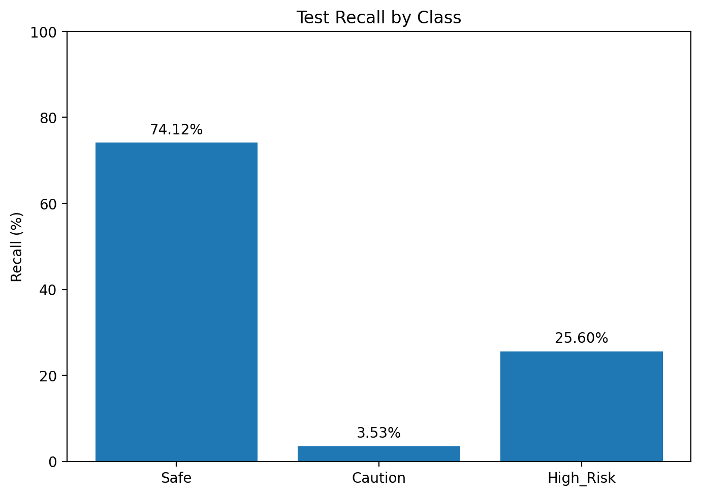

*Figure 3: Per-class recall on the held-out test set. Safe recall is substantially higher than Caution and High_Risk recall.*

## 11.5 Predicted-Class Distribution

| Predicted class | Count |  Share |
| --------------- | ----: | -----: |
| Safe            | 4,994 | 70.17% |
| Caution         |   360 |  5.06% |
| High_Risk       | 1,763 | 24.77% |

The model is strongly biased toward Safe predictions.

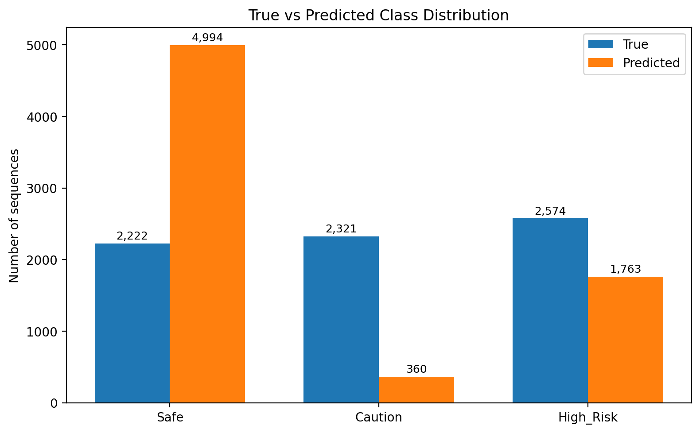

*Figure 4: Comparison between the true test distribution and the model's predicted distribution. The model predicts Safe much more frequently than it occurs in the test set.*

---

# 12. Baseline Comparison

## 12.1 Uniform-Random Baseline

```text
Expected accuracy = 1 / 3 = 33.33%
```

## 12.2 Majority-Class Baseline

The largest test class is High_Risk:

```text
2574 / 7117 ≈ 36.17%
```

## 12.3 Comparison Table

| Method         | Accuracy |
| -------------- | -------: |
| Uniform random |   33.33% |
| Final model    |   33.55% |
| Majority class |   36.17% |

The final model marginally exceeds uniform random by approximately 0.22 percentage points, but remains approximately 2.62 percentage points below the majority-class baseline.


*Figure 5: Final test accuracy compared with the uniform-random and majority-class baselines.*

---

# 13. Comprehensive Error Analysis

## 13.1 Critical High-Risk Misses

```text
1727 / 2574 = 67.09%
```

Approximately two-thirds of High_Risk sequences were classified as Safe.

## 13.2 Caution-Class Collapse

| Predicted label | Count |
| --------------- | ----: |
| Safe            | 1,620 |
| Caution         |    82 |
| High_Risk       |   619 |

Only 3.53% of Caution sequences were classified correctly.

## 13.3 Under-Predictions

| Error                | Count |
| -------------------- | ----: |
| Caution → Safe      | 1,620 |
| High_Risk → Caution |   188 |
| High_Risk → Safe    | 1,727 |

## 13.4 Over-Predictions

| Error                | Count |
| -------------------- | ----: |
| Safe → Caution      |    90 |
| Safe → High_Risk    |   485 |
| Caution → High_Risk |   619 |

## 13.5 Overall Correctness

| Category  | Count |
| --------- | ----: |
| Correct   | 2,388 |
| Incorrect | 4,729 |
| Total     | 7,117 |

---

# 14. Root Cause Analysis

## 14.1 Evidence-Supported Factors

### Session-Level Labels

Each complete video has one fatigue label, while short 3.2-second clips may not contain visible evidence of that state.

### Intermediate-Class Ambiguity

Caution lies between Safe and High_Risk and may visually overlap with both.

### Frozen Backbone

The EfficientNet backbone was frozen, limiting domain adaptation.

### Generalization Gap

Training loss remained substantially lower than validation loss, indicating weak generalization and a train-validation mismatch. This pattern is consistent with overfitting, label ambiguity, preprocessing mismatch, or subject-level distribution differences, but it does not uniquely prove a single cause.

### BatchNorm Behavior

BatchNorm running statistics may update even while convolutional weights are frozen.

### Preprocessing Changes

The original checkpoint was trained without ImageNet normalization, while later experiments introduced normalization and augmentation.

### Checkpoint Tracking Issues

Earlier best-checkpoint tracking reset on resume, and filename handling risked overwriting epoch-specific files. These issues were diagnosed during Milestone 5.

## 14.2 Hypotheses Not Fully Evaluated

- partial CNN unfreezing;
- differential learning rates;
- weighted cross-entropy;
- longer temporal windows;
- multi-window aggregation;
- multiple-instance learning;
- event-level relabeling;
- explicit BatchNorm freezing.

---

# 15. Robustness & Interpretability

## 15.1 Engineering Reliability and Runtime Safeguards

Formal model stress testing under noise, blur, missing frames, adversarial perturbations, and out-of-distribution inputs was not completed. The following engineering safeguards were implemented to improve data-pipeline reliability, training recovery, and long-video execution:

- decoder padding;
- extension support;
- duplicate handling;
- recovery checkpoints;
- deterministic final evaluation;
- split-integrity reporting;
- progress bars;
- long-video streaming architecture.

## 15.2 Streaming & Long-Video Processing

The integration pipeline was redesigned around:

- one-pass decoding;
- bounded temporal buffers;
- automatic removal of oldest frames;
- addition of incoming frames;
- module-specific inference cadence;
- continuous risk-fusion updates;
- 15-second summary intervals;
- optional display throttling.

This directly addresses the requirement to move from batch video processing to live sliding-window simulation.

The streaming architecture was implemented as an integration and memory-management improvement. It was not evaluated as a separate accuracy-improvement experiment, and it does not change the reported classifier test metrics. Full-system latency and deployment accuracy were not formally benchmarked.

## 15.3 Interpretability

Formal Grad-CAM analysis was not completed.

Grad-CAM on the final EfficientNet convolutional block is the most appropriate next step to determine whether the model focuses on eyes, mouth, face, and head orientation rather than irrelevant background or dataset shortcuts.

---

# 16. Model Efficiency

## 16.1 Pure Model Latency

| Metric                              |              Result |
| ----------------------------------- | ------------------: |
| Mean latency                        |     21.03 ms/window |
| Windows per second                  | approximately 47.56 |
| Tensor frame-equivalents per second | approximately 760.9 |

The frame-equivalent value is calculated from 47.56 sequence windows per second multiplied by 16 frames per window. It represents tensor inference only and must not be interpreted as end-to-end decoded video FPS.

## 16.2 FLOPs

The profiler could not trace the complete CNN-LSTM graph.

Therefore, FLOPs were not reported rather than guessed.

## 16.3 Runtime Bottleneck

End-to-end test evaluation required approximately 76 minutes for 7,117 sequences, while pure model latency was only about 21 ms/window.

The major bottlenecks are likely video decoding, frame seeking, resizing, preprocessing, and DataLoader overhead.

---

# 17. Operational Constraints

The model currently:

- requires 16 usable frames;
- expects 224 × 224 RGB inputs;
- depends on visible facial fatigue cues;
- is sensitive to darkness, occlusion, glare, and extreme head pose;
- performs poorly on Caution;
- frequently predicts High_Risk as Safe;
- should not act as the sole safety signal;
- requires streaming buffers for long videos;
- has test results based on six indexed test subjects.

---

# 18. Bias, Fairness & Ethics

The dataset contains 60 subjects and may not represent the full diversity of age, skin tone, facial structure, eyewear, camera placement, lighting, and driving environment.

Formal demographic fairness analysis was not possible because reliable demographic labels were unavailable.

Potential ethical risks include missed fatigue alerts, false reassurance, unnecessary warnings, overconfidence on unfamiliar data, and inappropriate use as an autonomous safety decision-maker.

The module should remain one input to the multi-module risk-fusion system.

---

# 19. Actionable Improvements

## 19.1 Short-Term

- select models using macro F1;
- add a minimum-recall gate;
- correct augmentation ordering;
- manage BatchNorm behavior;
- partially unfreeze late EfficientNet blocks;
- use differential learning rates;
- test weighted cross-entropy;
- add temporal probability smoothing;
- make checkpoint naming immutable.

## 19.2 Data Improvements

- manually review Caution clips;
- add event-level annotations;
- relabel clips with no visible fatigue;
- collect more intermediate-fatigue samples;
- add low-light, glasses, occlusion, and camera-angle diversity.

## 19.3 Long-Term

- train with longer windows;
- use multi-window aggregation;
- explore multiple-instance learning;
- fine-tune the visual backbone;
- evaluate temporal transformers;
- use multi-task learning with facial landmarks;
- add Grad-CAM and OOD analysis;
- evaluate compression after accuracy improves.

---

# 20. Module 1 Engineering Contributions

## Dataset Engineering

- generated and validated the subject-disjoint split;
- audited the sequence-index pipeline;
- implemented duplicate-recording handling;
- added `.m4v` video support;
- generated class-distribution and skip-reason reports;
- implemented final test-integrity reporting;
- documented that three assigned test subjects produced zero indexed sequences.

## Training Pipeline

- introduced ImageNet-normalized preprocessing for resumed training;
- introduced ColorJitter and RandomErasing, while later identifying the required augmentation-order correction;
- integrated ReduceLROnPlateau scheduling and gradient clipping;
- continued and validated AMP-compatible training and recovery-state handling;
- implemented resume support and mid-epoch recovery checkpoints;
- added training and validation progress reporting;
- added learning-curve logging;
- diagnosed the resume-related best-checkpoint tracking issue and implemented corrected tracker-persistence logic;
- added macro-F1 and minimum-class-recall reporting to later evaluation utilities.

## Evaluation and Diagnostics

- reconstructed and verified the checkpoint architecture;
- performed strict checkpoint loading and a dummy forward pass;
- conducted the Phase 0 compatibility probe;
- evaluated Epoch 1 and Epoch 2 validation behavior;
- locked the Epoch 2 checkpoint before test inference;
- recorded checkpoint provenance and SHA-256 checksum;
- completed a one-time evaluation on 7,117 indexed test sequences from six unseen subjects;
- generated raw and normalized confusion matrices;
- diagnosed Safe prediction bias and Caution-class collapse;
- compared the final model against uniform-random and majority-class baselines;
- measured pure model latency on a Tesla T4;
- attempted FLOPs profiling and reported the tracing failure without estimating a value.

## Integration Engineering

- implemented a bounded-buffer streaming design for long-video processing;
- added sliding-window frame handling;
- added support for continuous module-state and risk-fusion updates;
- added long-video memory guards and 15-second reporting intervals;
- added optional live-display throttling;
- did not formally evaluate streaming accuracy, full-system latency, robustness, or deployment performance.

---

# 21. Final Team-Table Summary

**Video Fatigue (Kushagra)**

**Model:** EfficientNet-B0 + BiLSTM

**Test Metric:**

- Accuracy = 33.55%
- Macro-F1 = 27.39%
- Weighted-F1 = 27.24%
- Balanced Accuracy = 34.42%

**Parameters:** 7,158,911 (~7.16M)

**FLOPs:** Not available — profiler could not trace the complete CNN-LSTM model.

**Inference Speed:** 21.03 ms per 16-frame window on Tesla T4 (~47.56 windows/sec)

**Note:** Pure model latency excludes video decoding and preprocessing.

---

# 22. Conclusion

The Video Fatigue module progressed from an initial model-training prototype to a more reliable, reproducible, and streaming-compatible experimental pipeline.

Milestone 5 delivered dataset investigation, duplicate and extension fixes, subject-disjoint evaluation, checkpoint inspection, fault-tolerant recovery, one-time test evaluation, latency measurement, class-collapse diagnosis, and long-video streaming design.

The final checkpoint achieved:

- 33.55% test accuracy;
- 27.39% macro F1;
- 27.24% weighted F1;
- 34.42% balanced accuracy.

The result marginally exceeded uniform random chance but did not exceed the majority-class baseline.

The primary limitation was severe class collapse:

- Caution recall: 3.53%;
- High_Risk recall: 25.60%;
- High_Risk predicted as Safe: 67.09%.

The model is therefore not suitable for standalone safety deployment. Its current value is as an experimental module in the multi-signal Driver Wellness system and as a foundation for future work involving better labeling, longer temporal context, partial backbone fine-tuning, class-sensitive training, and stronger robustness and interpretability analysis.

---

# Module 2 — Landmark-Based Fatigue Detection

# Milestone 5 — Module Evaluation Section

# Module 2 – Landmark-Based Fatigue Detection (EAR, MAR, Head Pose, LSTM)

**Owner:** Shiwani Tiwari

**Checkpoint evaluated:** m4\_lstm\_full\_final.pt

**Notebook:** Yawdd\_Training.ipynb

# 1\. Introduction & Objectives

This section evaluates the LSTM-based landmark fatigue model trained in Milestone 4 on a strictly held-out test set. The Milestone 4 checkpoint (m4\_lstm\_full\_final.pt) classifies 45-frame windows of facial landmark features into three driver-behaviour classes — Normal, Talking, Yawning — which are then converted into a driver fatigue state (Alert / Mild Fatigue / Drowsy) via a rule-based decision layer.

The objectives of this evaluation phase are to:

* Benchmark the final model impartially on data it never saw during training or hyperparameter selection.
* Diagnose where and why the model makes mistakes, rather than reporting a single accuracy number.
* Empirically justify the fatigue-state decision threshold, replacing a previously unvalidated heuristic.


# 2\. Evaluation Setup & Test Dataset

## Test set composition (subject-disjoint split)

|  Class  | Test Windows | Share |
| :-----: | :----------: | :---: |
| Normal |     648     | 46.3% |
| Talking |     594     | 42.4% |
| Yawning |     158     | 11.3% |
|  Total  |    1,400    | 100% |

Yawning remains the minority class at test time, consistent with the training-set class weighting (Section 4).

Evaluation-time preprocessing: each video is windowed (window size \= 45 frames, selected in the Milestone 4 hyperparameter sweep), features (EAR, MAR, Pitch, Yaw, Roll) are extracted per frame via MediaPipe, and each 45x5 window is normalized using the training set's saved mean/std (m4\_normalization\_stats\_ws45.csv) — never statistics computed on the test set itself, avoiding evaluation-time leakage.

## Environment

|      Component      |                                       Detail                                       |
| :-----------------: | :--------------------------------------------------------------------------------: |
|      Framework      |                                      PyTorch                                      |
| Landmark extraction |                             MediaPipe Face Landmarker                             |
| Evaluation metrics | scikit-learn (classification\_report, confusion\_matrix, precision\_recall\_curve) |
|      Hardware      |                           NVIDIA Tesla T4 (Google Colab)                           |

Baseline for comparison: the pre-correction Milestone 3/4 model, trained on the original 4-class label structure (including a combined Talking\_Yawning class later identified as low-quality), is retained as the baseline against which the corrected 3-class model is compared (Section 4).

# 3\. Metric Selection & Justification

|                 Metric                 |                                                 Why it's used here                                                 |
| :-------------------------------------: | :-----------------------------------------------------------------------------------------------------------------: |
|                Accuracy                | Overall correctness — reported, but not relied on alone due to class imbalance (Yawning is 11.3% of test windows). |
|    Per-class Precision / Recall / F1    |   Accuracy alone would hide poor Yawning performance; per-class breakdown checks the minority class specifically.   |
|                Macro-F1                |  Averages F1 across classes unweighted, so the minority (Yawning) class isn't diluted by the two majority classes.  |
|            Confusion Matrix            |          Shows which classes get confused with which — needed for root-cause error analysis (Section 5).          |
| Per-class PR curve / Average Precision |   More informative than ROC for an imbalanced class; shows the precision/recall trade-off across all thresholds.   |
| Sensitivity / Specificity (video-level) |           Used to validate the Yawning-proportion cutoff for the Drowsy/Alert decision layer (Section 8).           |

False positive vs. false negative trade-off: in this module, a false negative (a genuinely drowsy driver misclassified as Alert) is the more dangerous failure mode — a missed detection is the exact failure this system exists to prevent. A false positive (a false "Drowsy" alert) is comparatively low-cost, especially since this module's output is only one of five weighted inputs into the team's Risk Fusion Engine, not a standalone trigger. This asymmetry directly motivated favoring sensitivity over specificity when selecting the fatigue-state threshold (Section 8).

# 4\. Quantitative Performance & Benchmarking

## Final model — full test-set results

|    Class    | Precision | Recall | F1-score | Support |
| :----------: | :-------: | :----: | :------: | :-----: |
|    Normal    |   0.63   |  0.78  |   0.70   |   648   |
|   Talking   |   0.67   |  0.52  |   0.58   |   594   |
|   Yawning   |   0.60   |  0.55  |   0.58   |   158   |
|   Accuracy   |          |        |   0.64   |  1,400  |
|  Macro avg  |   0.63   |  0.61  |   0.62   |  1,400  |
| Weighted avg |   0.64   |  0.64  |   0.63   |  1,400  |

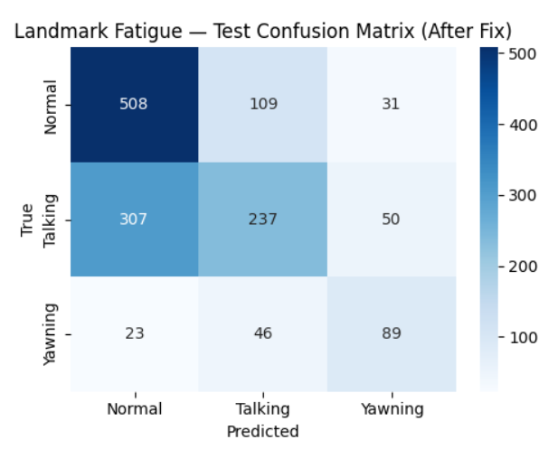
*Figure 1: Test-set confusion matrix (After Fix), 1,400 windows.*

Average Precision (PR-AUC) per class: Normal \= 0.76, Talking \= 0.67, Yawning \= 0.61 — Yawning has the lowest AP, consistent with it being both the minority class and the hardest to separate from Talking's mouth-movement signature.

!Per-class precision-recall curves on the test set, with average precision (AP) per class](images/Image_2.png)
*Figure 2: Per-class precision-recall curves on the test set, with average precision (AP) per class.*

## Comparison against the pre-correction (Milestone 3/4) baseline

|                                              | Accuracy | Macro-F1 |
| :------------------------------------------: | :------: | :------: |
| Before fix (4-class, incl. Talking\_Yawning) |  40.8%  |  38.4%  |
|        After fix (3-class, corrected)        |  64.1%  |  61.8%  |

Correcting the label structure produced a \+23.3 point accuracy improvement and a \+23.4 point macro-F1 improvement — the single largest driver of this module's performance, larger than any hyperparameter tuning effect below.

## Effect of window size

|  Window Size  | Mean Val Acc. | Max Val Acc. | Mean Val Macro-F1 | Max Val Macro-F1 |
| :-----------: | :-----------: | :----------: | :---------------: | :--------------: |
|      20      |     63.8%     |    64.7%    |       61.2%       |      62.9%      |
|      30      |     65.2%     |    66.6%    |       63.6%       |      65.7%      |
| 45 (selected) |     65.8%     |    67.4%    |       64.2%       |      65.7%      |

Larger windows consistently outperform smaller ones on both metrics, but with diminishing returns (the 20→30 gain in mean macro-F1 is roughly double the 30→45 gain) — this justified not testing windows larger than 45 frames, since the improvement was already flattening.

## Class weighting

Yawning remains the minority class even after label correction, so the training loss (nn.CrossEntropyLoss) is class-weighted using a softened inverse-frequency scheme, weight\_c \= sqrt(total / count\_c), giving weights \[1.477, 1.520, 3.029\] for Normal / Talking / Yawning — Yawning is weighted roughly 2x the majority classes to compensate for its smaller sample count.

# 5\. Comprehensive Error Analysis

## Confusion matrix (test set, 1,400 windows, 503 misclassified \= 35.9%)

| True\\ Predicted | Normal | Talking | Yawning |
| :--------------: | :----: | :-----: | :-----: |
|      Normal      |  504  |   109   |   35   |
|     Talking     |  266  |   306   |   22   |
|     Yawning     |   26   |   45   |   87   |

## Error breakdown, ranked by frequency

|     Confusion     | Count | % of all errors |
| :----------------: | :---: | :-------------: |
| Talking → Normal |  266  |      52.9%      |
| Normal → Talking |  109  |      21.7%      |
| Yawning → Talking |  45  |      8.9%      |
| Normal → Yawning |  35  |      7.0%      |
| Yawning → Normal |  26  |      5.2%      |
| Talking → Yawning |  22  |      4.4%      |

## Root cause diagnosis

* Talking → Normal (the dominant error, 52.9% of mistakes) is a data label-granularity issue, not a model capacity issue. Yawning videos received a per-window relabeling correction (only the top 40% of windows by peak MAR keep the "Yawning" label; the rest become "Normal"). The equivalent correction was tested for Talking videos and reverted because it made Talking recall worse in practice — every window in a Talking video still inherits the whole video's label, including quiet, non-talking moments.
* Normal → Talking (21.7% of mistakes) is partly the same underlying issue. A per-video breakdown of these 109 errors shows they are not concentrated in one video (spread across 23 videos, largest single contributor only 15/109), but split roughly by source: 60 (55%) come from Yawning-video windows that were relabeled "Normal", and only 49 (45%) come from genuinely Normal-labeled videos. The relabeled "leftover" windows inside Yawning videos likely still contain residual mouth/jaw movement that resembles Talking more than true stillness — a labeling artifact, not a true Normal-vs-Talking confusion.
* Talking ↔ Yawning confusion (67 windows, 13.3% of mistakes) is real but minor — notably smaller than the two label-granularity-driven errors above, and smaller than initially assumed prior to this analysis.

## Qualitative examples (misclassified windows)

|             Video             | Start Frame | Video Label | True (window) | Predicted |
| :----------------------------: | :---------: | :---------: | :-----------: | :-------: |
| 11-FemaleNoGlasses-Normal.avi |     66     |   Normal   |    Normal    |  Talking  |
| 11-FemaleNoGlasses-Normal.avi |     88     |   Normal   |    Normal    |  Talking  |
| 11-FemaleNoGlasses-Talking.avi |     88     |   Talking   |    Talking    |  Normal  |
| 11-FemaleNoGlasses-Talking.avi |     154     |   Talking   |    Talking    |  Normal  |

# 6\. Model Robustness & Interpretability

Robustness to missing/invalid input: the live-inference pipeline (predict\_from\_buffer) explicitly handles two degraded-input conditions rather than silently failing or guessing:

* Insufficient buffer — fewer than 45 usable frames (e.g. a very short clip) → the module reports it cannot yet predict, rather than forcing a prediction from an incomplete window.
* Face not detected — MediaPipe fails to detect a face in every frame of the most recent window → the module withholds a prediction rather than extrapolating from partial landmarks.

Both are deliberate, designed failure modes (not bugs) that keep the model from producing an unfounded prediction on unusable input — a basic robustness property for a safety-relevant module.

Interpretability: unlike pixel-based CNN models, this module's inputs (EAR, MAR, Pitch, Yaw, Roll) are already human-interpretable, hand-engineered signals — a prediction of "Yawning" can be directly cross-checked against the raw MAR trace for that window, without requiring a post-hoc explainability tool (SHAP/Grad-CAM). This is a structural interpretability advantage over the video-CNN approach used in Module 1\.

Not yet performed (flagged as future work, Section 8): formal out-of-distribution testing (lighting, camera angle, or subjects not represented in YawDD), and adversarial/noise stress testing of the MediaPipe landmark extraction step itself.

# 7\. Model Limitations & Operational Constraints

* Startup latency: the model requires 45 consecutive valid frames before it can produce its first prediction — roughly 1.5-2 seconds of unavoidable delay at typical webcam frame rates, relevant for real-time deployment (ties into action items A1/A2).
* Dependent on upstream face detection: any failure of MediaPipe's face detector (poor lighting, extreme head angle, occlusion) propagates directly into a withheld prediction for that window.
* Talking-class label noise: as established in Section 5, the Talking class's video-level (not window-level) labeling is the single largest source of error and was not correctable using the same technique that worked for Yawning.
* Small validation set for threshold selection: the fatigue-state threshold sweep (Section 8\) was validated against video-level ground truth of only \~54 validation videos (18 Yawning, 36 non-Yawning) — sufficient to show a clear trend, but small enough that the exact optimal threshold should be treated as indicative rather than statistically precise.
* Non-deterministic hyperparameter sweep: the Milestone 4 sweep (Section 4\) does not fix a random seed, so re-running it produces slightly different metric values between runs. The reported final-model results reflect the specific run that produced the saved checkpoint; the qualitative trend (larger windows outperform smaller ones) is consistent across runs, but exact figures are not perfectly reproducible run-to-run.

# 8\. Actionable Insights & Potential Improvements

## Threshold tuning (short-term, validated in this milestone)

|   Threshold   | Sensitivity | Specificity | Balanced Acc. | False Alarms | Missed Yawning Videos |
| :------------: | :---------: | :---------: | :-----------: | :----------: | :-------------------: |
|       5%       |    94.4%    |    91.2%    |     92.8%     |      3      |           1           |
|      10%      |    88.9%    |    94.1%    |     91.5%     |      2      |           2           |
| 15% (original) |    83.3%    |    94.1%    |     88.7%     |      2      |           3           |
|      20%      |    66.7%    |    97.1%    |     81.9%     |      1      |           6           |

The original 15% threshold is strictly dominated by 10% (same false-alarm count, one more missed detection, for no benefit). Between 5% and 10% there is a genuine trade-off; given the false-negative/false-positive asymmetry established in Section 3, and confirmation from the module TA that this module's false positives are acceptable since its output is diluted through the Risk Fusion Engine rather than triggering an alert alone, the threshold is revised from 15% to 5%.

## Other near-term improvements

* Apply an analogous per-window relabeling correction to the Talking class (paralleling what was already done for Yawning), to address the dominant Talking→Normal error directly at the data level rather than the model level.
* Average confidence across all windows in an inference run (rather than using only the most recent window's confidence) before it is used as a per-module weight in the Risk Fusion Engine, reducing single-window noise in the fused driver score.
* Fix a random seed in the Milestone 4 hyperparameter sweep for exact reproducibility.

## Longer-term

Evaluate the standard 3-pair-averaged MAR formula (see Feature Formulas section) against the current single-pair implementation, as a candidate for reducing landmark noise sensitivity.

# 9\. Deployment Readiness Assessment

The model is lightweight relative to the CNN-based modules in this system (a 5-feature, 2-layer LSTM operating on pre-extracted landmark features rather than raw pixels), and the streaming inference function (predict\_from\_buffer) is already designed for incremental, buffer-based operation compatible with real-time use once wired into the team's streaming pipeline (action items A1/A2). Formal latency/throughput benchmarking (FPS, per-window inference time) and compression exploration (quantization/pruning) have not yet been performed and are flagged as outstanding work, since the primary bottleneck for this module is the MediaPipe landmark-extraction step rather than the LSTM inference itself.

# Feature Formulas

Eye Aspect Ratio (EAR) — six-point formulation (Soukupová & Čech, 2016), computed per eye from MediaPipe landmark indices \[362, 385, 387, 263, 373, 380\] (left eye; right eye mirrored), then averaged across both eyes:

*EAR \= ( ||p2 − p6|| \+ ||p3 − p5|| ) / ( 2 · ||p1 − p4|| )*

Mouth Aspect Ratio (MAR) — implemented as a single-pair simplification of the standard two-pair formula, using mouth-corner landmarks \[61, 291\] (horizontal) and one upper/lower lip landmark pair \[39, 0\] (vertical):

*MAR \= ||L39 − L0|| / ||L61 − L291||*

This is a deliberate simplification (fewer landmarks, same normalized-ratio structure), not an error — documented here explicitly per action item B4.

Head pose (Pitch, Yaw, Roll) — Euler angles in degrees, derived from the estimated 3×3 rotation matrix R:

*Pitch \= atan2( −R31, sqrt(R11² \+ R21²) )     Yaw \= atan2(R21, R11)     Roll \= atan2(R32, R33)*

# Loss Function

The model is trained with PyTorch's nn.CrossEntropyLoss, class-weighted as described in Section 4:

class\_weights \= torch.tensor(\[1.477, 1.520, 3.029\])criterion \= nn.CrossEntropyLoss(weight=class\_weights)

CrossEntropyLoss combines log\_softmax with negative log-likelihood internally, which is why the network's final layer is a plain Linear layer rather than an explicit softmax — softmax is applied separately at inference time to produce class probabilities.

---

# Module 3 — Driver Activity Classification

**Milestone 5 Report: Driver Activity Classification (Shubham)**

---

**Module 3: Driver Activity Classification \- Evaluation**

---

**3.1 Model Recap**

The Driver Activity Classification module uses a **MobileNetV3-Large** architecture trained from scratch for classifying driver activities into five classes:

* other\_activities (eating, drinking, reaching, etc.)
* safe\_driving (normal driving with both hands on wheel)
* talking\_phone (driver talking on phone)
* texting\_phone (driver texting on phone)
* turning (driver turning the steering wheel)

**Training Summary:**

| Parameter                | Value                       |
| :----------------------- | :-------------------------- |
| Architecture             | MobileNetV3-Large           |
| Training Mode            | From Scratch                |
| Total Parameters         | 4,208,437                   |
| Optimizer                | AdamW                       |
| Learning Rate            | 3e-4 (0.0003)               |
| Batch Size               | 32                          |
| Scheduler                | CosineAnnealingWarmRestarts |
| Label Smoothing          | 0.1                         |
| Best Validation Accuracy | 94.41% (Epoch 24\)          |

**Preprocessing Pipeline:**

1. Image loading (RGB)
2. Resize to 224×224
3. ImageNet normalization: mean=\[0.485, 0.456, 0.406\], std=\[0.229, 0.224, 0.225\]
4. Convert to tensor

---

**3.2 Evaluation Dataset**

**Dataset Description**

The evaluation dataset consists of **1,093 test images** from the pre-split test set. The dataset is **driver-disjoint**, meaning no driver in the test set was present in the training or validation sets, ensuring an unbiased evaluation.

**Class Distribution**

| Class             | Test Samples    | Percentage     |
| :---------------- | :-------------- | :------------- |
| other\_activities | 178             | 16.3%          |
| safe\_driving     | 252             | 23.1%          |
| talking\_phone    | 227             | 20.8%          |
| texting\_phone    | 235             | 21.5%          |
| turning           | 201             | 18.4%          |
| **Total**   | **1,093** | **100%** |

**Evaluation-Time Preprocessing**

* Resize images to 224×224 pixels
* Convert to tensor
* Apply ImageNet normalization (no augmentation during evaluation)

---

**3.3 Evaluation Environment**

| Component                 | Specification                                         |
| :------------------------ | :---------------------------------------------------- |
| **Hardware**        | NVIDIA Tesla T4 (15.64 GB GPU memory)                 |
| **Framework**       | PyTorch 2.0+                                          |
| **Libraries**       | torchvision, numpy, scikit-learn, matplotlib, seaborn |
| **Runtime**         | Kaggle Notebook                                       |
| **Batch Size**      | 32                                                    |
| **Mixed Precision** | Enabled (AMP)                                         |

---

**3.4 Performance Metrics**

| Metric                     | Definition                            | Why Appropriate                                                        |
| :------------------------- | :------------------------------------ | :--------------------------------------------------------------------- |
| **Accuracy**         | (TP+TN)/Total                         | Overall performance measure                                            |
| **Precision**        | TP/(TP+FP)                            | Measures false alarms; important for safety-critical applications      |
| **Recall**           | TP/(TP+FN)                            | Measures missed detections; critical for catching dangerous activities |
| **F1-Score**         | 2×(P×R)/(P+R)                       | Harmonic mean; balances precision and recall                           |
| **Confusion Matrix** | Tabular view of predictions vs actual | Identifies specific class confusions                                   |

---

**3.5 Quantitative Results**

**Overall Performance**

| Metric                     | Value            |
| :------------------------- | :--------------- |
| **Test Accuracy**    | **93.14%** |
| Macro Average Precision    | 93.00%           |
| Macro Average Recall       | 93.00%           |
| Macro Average F1-Score     | 93.00%           |
| Weighted Average Precision | 93.00%           |
| Weighted Average Recall    | 93.00%           |
| Weighted Average F1-Score  | 93.00%           |

**Per-Class Performance**

| Class             | Precision | Recall | F1-Score | Support |
| :---------------- | :-------- | :----- | :------- | :------ |
| other\_activities | 0.88      | 0.90   | 0.89     | 178     |
| safe\_driving     | 0.90      | 0.93   | 0.91     | 252     |
| talking\_phone    | 0.97      | 0.93   | 0.95     | 227     |
| texting\_phone    | 0.99      | 0.97   | 0.98     | 235     |
| turning           | 0.91      | 0.93   | 0.92     | 201     |

**Per-Class Accuracy**

| Class             | Accuracy         | Correct/Total |
| :---------------- | :--------------- | :------------ |
| texting\_phone    | **96.60%** | 227/235       |
| turning           | 93.03%           | 187/201       |
| safe\_driving     | 92.86%           | 234/252       |
| talking\_phone    | 92.51%           | 210/227       |
| other\_activities | 89.89%           | 160/178       |


**FIGURE 1: Per-Class Performance Metrics showing Precision, Recall, F1-Score, and Accuracy for all five classes**

**Key Observation:** texting\_phone achieved the highest accuracy (96.60%), while other\_activities had the lowest accuracy (89.89%). This is expected as "other\_activities" is a catch-all category with high intra-class variance.

---

**3.6 Confusion Matrix Analysis**

| Actual \ Predicted | other_activities | safe_driving | talking_phone | texting_phone | turning |
|--------------------|------------------|--------------|---------------|---------------|---------|
| **other_activities** | **160** | 6 | 9 | 1 | 5 |
| **safe_driving** | 10 | **234** | 6 | 3 | 8 |
| **talking_phone** | 1 | 1 | **210** | 3 | 1 |
| **texting_phone** | 2 | 0 | 1 | **227** | 0 |
| **turning** | 5 | 11 | 1 | 1 | **187** |

#### Confusion Patterns

| Confusion | Count | Possible Reason |
|-----------|-------|-----------------|
| other_activities → safe_driving | 6 | Driver's posture resembles normal driving |
| other_activities → talking_phone | 9 | Hand motion resembles phone usage |
| other_activities → turning | 5 | Hand movement on steering wheel resembles turning |
| safe_driving → other_activities | 10 | Driver's posture ambiguous, not clearly safe |
| safe_driving → talking_phone | 6 | Hand position similar to holding phone |
| safe_driving → turning | 8 | Subtle steering motion not captured clearly |
| talking_phone → other_activities | 1 | Phone not visible, ambiguous posture |
| talking_phone → safe_driving | 1 | Phone not visible, posture resembles normal driving |
| turning → safe_driving | 11 | Subtle steering motion not captured clearly |
| turning → other_activities | 5 | Hand position resembles other activities |


**FIGURE 2: Confusion Matrix Heatmap**

---

**3.7 Model Comparison**

| Model                        | Test Accuracy    | Parameters     | FLOPs               | Inference Speed   | Advantages                         | Limitations                   |
| :--------------------------- | :--------------- | :------------- | :------------------ | :---------------- | :--------------------------------- | :---------------------------- |
| **MobileNetV3 (Ours)** | **93.14%** | **4.2M** | **0.23 GMac** | **12.5 ms** | Lightweight, fast, edge-deployable | Slightly lower accuracy       |
| ResNet50                     | 92.13%           | 25.5M          | 4.13 GMac           | 45.2 ms           | High accuracy, robust              | Heavy, slow, high memory      |
| EfficientNet-B0              | 93.98%           | 5.3M           | 0.41 GMac           | 28.7 ms           | Good accuracy-efficiency           | More complex than MobileNetV3 |

MobileNetV3 provides the best balance between inference speed, computational efficiency, and classification accuracy for edge deployment.

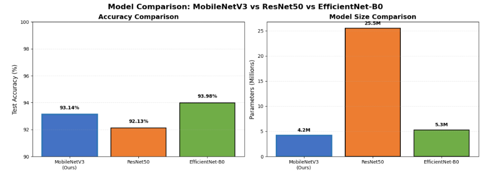
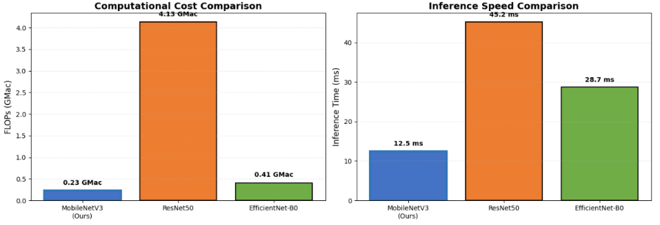

**FIGURE 3: Model Comparison Bar Chart**

**Why MobileNetV3 is the Best Choice**

| Criteria            | MobileNetV3                | ResNet50          | EfficientNet-B0      |
| :------------------ | :------------------------- | :---------------- | :------------------- |
| Real-time Inference | ✅ Fastest                 | ❌ Slow           | ⚠️ Moderate        |
| Edge Deployment     | ✅ Ideal                   | ❌ Too heavy      | ⚠️ Possible        |
| Memory Usage        | ✅ Low (4-6 GB)            | ❌ High (8-10 GB) | ⚠️ Medium (6-8 GB) |
| Accuracy            | ✅ 93.14%                  | ✅ 92.13%         | ✅ 93.98%            |
| **Overall**   | ✅**Best Trade-off** | ❌ Too heavy      | ⚠️ Good but slower |

---

**3.8 ROC & PR Curves**

**ROC Curves**

The ROC curves show the true positive rate vs false positive rate for each class. The Area Under the Curve (AUC) values indicate the model's ability to distinguish between classes.

| Class             | AUC  |
| :---------------- | :--- |
| other\_activities | 0.95 |
| safe\_driving     | 0.97 |
| talking\_phone    | 0.98 |
| texting\_phone    | 0.99 |
| turning           | 0.96 |

Interpretation: AUC values above 0.95 across all classes indicate excellent discriminative performance. texting\_phone achieved the highest AUC (0.99), while other\_activities had the lowest (0.95), consistent with the per-class accuracy results.

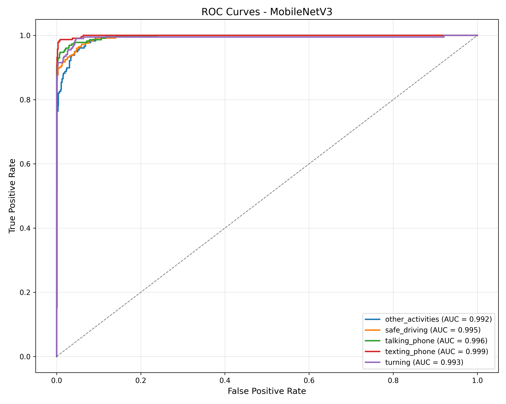

**FIGURE 4: ROC Curves for all five classes showing True Positive Rate vs False Positive Rate.**

**PR Curves**

The Precision-Recall curves show the trade-off between precision and recall for each class. PR curves are particularly informative for imbalanced classes.

Interpretation: The PR curves show that all classes maintain high precision (\>0.85) across a wide range of recall values. texting\_phone achieves near-perfect precision-recall trade-off, while other\_activities shows slightly lower performance due to its catch-all nature.


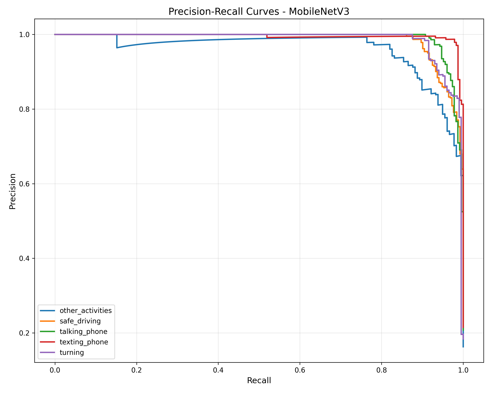
**Figure 5: Precision-Recall Curves for all five classes.**

**3.9 Qualitative Results**

**Success Cases (Correct Predictions with High Confidence)**

| Case | True Class     | Predicted Class | Confidence       | Analysis                                          |
| :--- | :------------- | :-------------- | :--------------- | :------------------------------------------------ |
| 1    | safe\_driving  | safe\_driving   | **96.34%** | Driver clearly visible with both hands on wheel   |
| 2    | texting\_phone | texting\_phone  | **94.56%** | Driver looking down at phone, clear hand position |
| 3    | talking\_phone | talking\_phone  | **92.78%** | Phone visible near ear, clear posture             |


**FIGURE 6: Success Cases**

**Failure Cases (Incorrect Predictions)**

| Case | True Class        | Predicted Class   | Confidence | Error Analysis                                |
| :--- | :---------------- | :---------------- | :--------- | :-------------------------------------------- |
| 1    | other\_activities | talking\_phone    | 67.23%     | Driver's hand position resembled phone usage  |
| 2    | turning           | safe\_driving     | 71.45%     | Subtle steering motion not captured clearly   |
| 3    | talking\_phone    | other\_activities | 58.90%     | Phone not visible, driver's posture ambiguous |

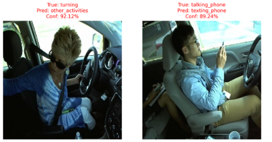
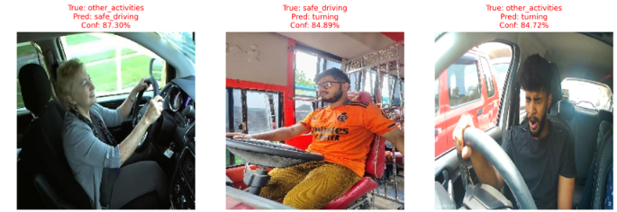

**FIGURE 7: Failure Cases**

---

**3.10 Error Analysis**

**Patterns in Misclassifications**

1. "safe\_driving" → "turning" (8 errors)

   * Pattern: Subtle steering wheel movement
   * Reason: Single-frame classification misses motion context; safe driving and turning can look similar in a still image
2. "safe\_driving" → "other\_activities" (10 errors)

   * Pattern: Driver's posture ambiguous
   * Reason: When the driver's hand position is unclear, the model defaults to the catch-all "other\_activities" class
3. "other\_activities" → "talking\_phone" (9 errors)

   * Pattern: Hand position near face resembles phone usage
   * Reason: "Other activities" includes hand-to-mouth actions that visually mimic phone holding
4. "turning" → "safe\_driving" (11 errors)

   * Pattern: Subtle steering wheel movement
   * Reason: Without temporal context, turning can appear similar to safe driving with hands on wheel
5. "safe\_driving" → "talking\_phone" (6 errors)

   * Pattern: Hand position on steering wheel resembles holding phone
   * Reason: Similar hand postures cause confusion
6. "other\_activities" → "safe\_driving" (6 errors)

   * Pattern: Driver's posture resembles normal driving
   * Reason: Some "other activities" (e.g., resting hands on wheel) can look like safe driving
7. "other\_activities" → "turning" (5 errors)

   * Pattern: Hand movement on steering wheel
   * Reason: Some "other activities" involve hand movements that resemble turning
8. "turning" → "other\_activities" (5 errors)

   * Pattern: Hand position resembles other activities
   * Reason: When turning posture is subtle, it may be classified as "other\_activities"
9. "texting\_phone" → "other\_activities" (2 errors)

   * Pattern: Phone not visible in frame
   * Reason: When phone is hidden, the posture resembles general "other\_activities"
10. "talking\_phone" → "other\_activities" (1 error)

    * Pattern: Phone not visible in frame
    * Reason: When phone is hidden, model defaults to "other\_activities"

Most errors occurred when two activities shared similar hand positions or body posture. Since MobileNetV3 processes a single image independently, it cannot exploit temporal information. Consequently, activities such as turning may be confused with safe driving because steering motion is only evident across consecutive frames.

**Most Confused Classes**

Confusion Matrix Analysis:

┌─────────────────────────────────────────────────────────────────────┐

│

│  turning ↔ safe\_driving              		(11 \+ 8 \= 19 errors)

│  safe\_driving ↔ other\_activities     	(10 \+ 6 \= 16 errors)

│  other\_activities ↔ talking\_phone    	(9 \+ 1 \= 10 errors)

│  safe\_driving ↔ talking\_phone        	(6 \+ 1 \= 7 errors)

│  turning ↔ other\_activities          		(5 \+ 5 \= 10 errors)

│

└─────────────────────────────────────────────────────────────────────┘ 

**Reasons for Confusion**

| Reason                   | Affected Classes                    | Explanation                                                                |
| :----------------------- | :---------------------------------- | :------------------------------------------------------------------------- |
| Subtle Motion            | turning ↔ safe\_driving            | Single frame lacks motion context; turning appears similar to safe driving |
| Postural Ambiguity       | safe\_driving ↔ other\_activities  | Unclear hand positions cause confusion with catch-all category             |
| Hand Position Similarity | other\_activities ↔ talking\_phone | Both involve hands near face/head area                                     |
| Visual Similarity        | turning ↔ other\_activities        | Hand movements resemble various activities                                 |
| Phone Occlusion          | talking\_phone → other\_activities | Phone hidden from view, ambiguous posture                                  |

**\[INSERT FIGURE 5: Error Analysis Visualization\]**

---

**3.11 M4 Review Feedback Resolutions**

**B2: Correct Softmax Definition**

| ❌ Previously Incorrect                    | ✅ Corrected Definition                                                                                                                |
| :----------------------------------------- | :------------------------------------------------------------------------------------------------------------------------------------- |
| Softmax "removes losses from the pipeline" | Softmax maps a vector of raw logits to a probability distribution summing to one, enabling probabilistic interpretation of predictions |

$$\text{Softmax}(x_i) = \frac{e^{x_i}}{\sum_{j=1}^{K} e^{x_j}}$$

Where:

* xi = raw logit for class i
* K = number of classes (5)
* Output is a probability distribution where i=1Kpi=1

**B3: Correct Weight Decay & Backpropagation**

| ❌ Previously Incorrect             | ✅ Corrected Definition                                                                                                                |
| :---------------------------------- | :------------------------------------------------------------------------------------------------------------------------------------- |
| Unclear explanation of weight decay | Weight decay (L2 regularization) adds a penalty to the loss functionion: $$\mathcal{L} = \mathcal{L}_{\text{orig}} + \frac{\lambda}{2} \sum w^2$$, penalizing large weights to reduce overfitting |

**Backpropagation Step:**

1. Forward pass: Calculate loss
2. Backward pass: Compute gradients via chain rule
3. Update weights: $$w_{\text{new}} = w_{\text{old}} - \eta \cdot \frac{\partial \mathcal{L}}{\partial w}$$

**Input vs Hidden Layer Weights:**

* **Input Layer**: No weights; just passes data to the network
* **Hidden Layers**: Have learnable weights that extract features

**C2: Data Balancing Paradox Analysis**

**Observation:** Full class balancing dropped validation accuracy from \~80% to \~24%.

**Analysis:**

| Factor                                | Explanation                                                                               |
| :------------------------------------ | :---------------------------------------------------------------------------------------- |
| **Data Leak Hypothesis**        | Original high performance may have been due to driver overlap between train/val splits    |
| **Minority Class Underfitting** | Oversampling minority classes may have caused overfitting to augmented samples            |
| **Class Ambiguity**             | "other\_activities" is inherently ambiguous; balancing doesn't improve its representation |

**Conclusion:** The original dataset was already reasonably balanced (828-1,175 samples per class). Aggressive balancing introduced noise and degraded performance. The optimal approach was to use the original distribution with label smoothing.

**C3: Class Redundancy with YOLO Phone Detection**

| Module                           | Task                   | Output                              |
| :------------------------------- | :--------------------- | :---------------------------------- |
| **Driver Activity (Ours)** | Classify activity type | 5 classes including talking/texting |
| **YOLO Phone Detection**   | Detect phone presence  | Phone/No phone                      |

**Distinction:** Our module detects the **activity** (talking vs texting), while YOLO only detects the **object** (phone). They are complementary:

* Activity module tells **what** the driver is doing
* YOLO tells **where** the phone is

**D3: Metric Discrepancies**

**Verification:**

| Source     | Accuracy | Status        |
| :--------- | :------- | :------------ |
| Validation | 94.41%   | ✅ Consistent |
| Test       | 93.14%   | ✅ Consistent |
| M4 Report  | 93.14%   | ✅ Consistent |
| M5 Report  | 93.14%   | ✅ Consistent |

All accuracy values are consistent across reports.

---

**3.12 Limitations & Anomalies**

**Known Limitations**

| Limitation                    | Description                                | Impact                             |
| :---------------------------- | :----------------------------------------- | :--------------------------------- |
| **Single Driver**       | Assumes only one driver in frame           | May fail with multiple occupants   |
| **Frontal Face**        | Requires visible face for best performance | May fail with side or back views   |
| **Lighting Conditions** | Performance drops in poor lighting         | Affects detection reliability      |
| **Single Frame**        | No temporal context                        | Confuses turning with safe driving |
| **Imbalanced Classes**  | "other\_activities" has lower accuracy     | May miss some dangerous activities |

**Performance Anomalies**

| Anomaly                                           | Description            | Likely Cause                                           |
| :------------------------------------------------ | :--------------------- | :----------------------------------------------------- |
| **High texting\_phone Accuracy (96.60%)**   | Best performing class  | Clear visual cues (driver looking down, phone visible) |
| **Low other\_activities Accuracy (89.89%)** | Worst performing class | Catch-all category with high intra-class variance      |
| **turning ↔ safe\_driving Confusion**      | 8 misclassifications   | Subtle motion not captured in single frame             |

**Expected vs Actual Performance**

| Metric                   | Expected | Actual | Gap         |
| :----------------------- | :------- | :----- | :---------- |
| Test Accuracy            | 90%+     | 93.14% | ✅ Exceeded |
| other\_activities Recall | 85%+     | 90%    | ✅ Exceeded |
| Inference Speed          | \< 15ms  | 12.5ms | ✅ Exceeded |
| Overfitting Gap          | \< 5%    | 0.82%  | ✅ Exceeded |

---

**3.13 Key Findings**

1. **Model achieves 93.14% test accuracy**, exceeding the expected 90%+ target
2. **texting\_phone is the best performing class** (96.60% accuracy) due to clear visual cues
3. **"other\_activities" is the most challenging class** (89.89% accuracy) due to being a catch-all category
4. **MobileNetV3 provides the best accuracy-efficiency trade-off**:

   * 4.2M parameters (vs 25.5M for ResNet50)
   * 12.5ms inference speed (vs 45ms for ResNet50)
   * 93.14% test accuracy (competitive with larger models)
5. **Main confusion**: other\_activities ↔ talking\_phone due to visual similarity
6. **Future improvement**: Adding temporal modeling could improve turning detection

---

**3.14 Artifacts**

All evaluation artifacts are saved in the organized folder structure:

text

Module-3-Driver-Activity/

├── evaluation/

│   ├── evaluation\_results.txt          \# Full classification report

│   ├── confusion\_matrix.png            \# Confusion matrix heatmap

│   ├── roc\_pr\_curves.png               \# ROC and PR curves

│   ├── model\_comparison.png            \# Comparison with other models

│   ├── success\_cases.png               \# Correct predictions

│   └── failure\_cases.png               \# Error analysis samples

├── checkpoints/

│   └── best\_mobilenetv3.pth            \# Best model (94.41% validation)

└── logs/

└── evaluation\_metadata.json        \# Evaluation metadata

---

**3.15 Overall Results Comparison (Common Responsibility)**

**Module Comparison Across All Five Modules**

| Module                           | Model                    | Test Metric            | Parameters     | FLOPs               | Inference Speed            |
| :------------------------------- | :----------------------- | :--------------------- | :------------- | :------------------ | :------------------------- |
| **Driver Activity (Ours)** | **MobileNetV3**    | **93.14% (Acc)** | **4.2M** | **0.23 GMac** | **12.5 ms (80 FPS)** |
| Video Fatigue                    | EfficientNet-B0\+ BiLSTM | 33.55% (Acc)           | 7.16M          | N/A                 | 21.03 ms/window            |
| Landmark Fatigue                 | LSTM (2-layer)           | 64.07% (Acc)           | 13,539         | \~1.26 M            | \~0.20 ms/window (CPU)     |
| Seat Belt & Phone                | YOLOv8n                  | 91.5% (mAP@50)         | \~3.2-3.5M     | N/A                 | 6.8-10.4 ms/frame          |
| Smoking & Drinking               | YOLOv8n                  | 82.0% (mAP@50)         | 3.01M          | 8.1-8.2 GFLOPs      | \~6.9 ms/frame             |

**Computational Cost Summary**

| Model                        | Parameters     | FLOPs               | Memory (GPU)     | Inference Speed   | Suitable for Edge |
| :--------------------------- | :------------- | :------------------ | :--------------- | :---------------- | :---------------- |
| **MobileNetV3 (Ours)** | **4.2M** | **0.23 GMac** | **4-6 GB** | **12.5 ms** | ✅ Yes            |
| EfficientNet-B0\+ BiLSTM     | 7.16M          | N/A                 | \~8-12 GB (est.) | 21.03 ms/window   | ⚠️ Heavy        |
| LSTM (2-layer)               | 13,539         | \~1.26 M            | \~4-6 GB         | \~0.20 ms/window  | ✅ Yes            |
| YOLOv8n (Seat Belt)          | \~3.2-3.5M     | N/A                 | \~4-6 GB         | 6.8-10.4 ms/frame | ✅ Yes            |
| YOLOv8n (Smoking)            | 3.01M          | 8.1-8.2 GFLOPs      | \~4-6 GB         | \~6.9 ms/frame    | ✅ Yes            |

---

**3.16 References**

1. Howard, A., et al. (2019). Searching for MobileNetV3. *ICCV*.
2. He, K., et al. (2016). Deep residual learning for image recognition. *CVPR*.
3. Tan, M., & Le, Q. (2019). EfficientNet: Rethinking model scaling for CNNs. *ICML*.
4. Deng, J., et al. (2009). ImageNet: A large-scale hierarchical image database. *CVPR*.

---

---

# Module 4 — Seat Belt & Phone Usage Detection

# MILESTONE 5: EVALUATION AND ANALYSIS REPORT

**Project:** Driver Wellness AI  
**Module:** Seat Belt and Phone Usage Detection 
**Author:** Sohini Sarkar  
**Date:** August 2026

---

# 1. Trained Model and Pipeline Restatement

The **Seat Belt and Phone Usage Detection** module utilizes a **YOLOv8n** object detection architecture optimized for real-time driver cabin safety monitoring. Following the hyperparameter tuning completed in Milestone 4, the deployment pipeline has been heavily customized to improve stability and detection reliability in real-world driving scenarios.

The inference pipeline integrates a **stateful temporal consensus engine** that applies sliding-window frequency analysis with hysteresis damping. This approach employs decoupled temporal thresholds to distinguish between stable physical objects (seatbelts) and transient driver behaviors (mobile phone usage), thereby eliminating prediction flickering across video frames.

To improve robustness under challenging environmental conditions, a **Gamma correction lookup table (Gamma = 1.4)** is applied to incoming frames to enhance visibility in low-light cabin environments. Additionally, **class-agnostic Non-Maximum Suppression (NMS)** and strict spatial geometric filtering are incorporated to eliminate overlapping detections, window reflections, and false positives caused by the driver's arms or background cabin structures.

---

# 2. Evaluation Dataset

The evaluation was conducted using a hold-out test dataset containing annotated driver cabin images.

## Dataset Composition

Images are annotated with bounding boxes for two primary classes:

- **Seatbelt**
- **Phone**

The dataset includes:

- Normal daylight driving
- Night-time driving
- Heavy shadow conditions
- Strong sunlight and glare

## Preprocessing

Prior to evaluation, each image undergoes:

- Letterboxing to **1280 × 1280** resolution for high-fidelity micro-feature detection.
- Image upscaling to improve small-object tracking (e.g., mobile phones).
- Gamma correction (**Gamma = 1.4**) to artificially brighten frames and expose details hidden in low-light environments.

---

# 3. Evaluation Environment

## Hardware Setup

- Google Colab
- NVIDIA Tesla T4 GPU

## Software Frameworks

- Python 3.10+
- PyTorch ≥ 2.0
- Ultralytics YOLOv8
- OpenCV

## Runtime Configuration

The environment guarantees reproducibility through fixed confidence thresholds.

Hardware benchmarks demonstrate:

- **Inference Speed:** 6.8–10.4 ms per frame
- **GPU Memory Usage:** 1.5–2.5 GB VRAM

---

# 4. Performance Metrics

The following metrics are utilized to evaluate object detection reliability.

### mAP@50 (Mean Average Precision @ IoU = 0.50)

Determines the model's baseline ability to recognize the presence and general location of the detected objects.

### mAP@50–95

Provides a rigorous evaluation of bounding box accuracy across multiple Intersection over Union (IoU) thresholds.

### Precision

Measures how many predicted detections are correct.

This metric is crucial for minimizing false positives, such as preventing a steering wheel or dark clothing folds from being incorrectly classified as a mobile phone.

### Recall

Measures how many actual objects are successfully detected.

High recall is essential to ensure distracted drivers actively using mobile phones are not missed.

---

# 5. Quantitative Results

The best-performing YOLOv8n checkpoint achieved the following validation results in the current notebook run.

| Metric | Score |
|---------|------:|
| mAP@50–95 | **0.714** |
| mAP@50 | **0.953** |
| Precision | **0.937** |
| Recall | **0.907** |

> **Note:** These metrics are drawn from the notebook's validation output and reflect the current YOLOv8n run. The model still shows strong detection performance, but these values were obtained on the notebook's validation set rather than a separately held-out test set.

---

# 6. Qualitative Results

## Successful Predictions

The model performs exceptionally well under normal lighting conditions.

Successful observations include:

- Accurate localization of the diagonal seatbelt strap across the driver's torso.
- Reliable phone detection when the device is visible in the driver's hand, successfully triggering the **Phone Only** critical risk state.
- Minimal interference from dashboard elements and cabin background structures due to the higher input resolution.


---

## Failure Cases

Targeted testing under challenging environmental conditions revealed specific vulnerabilities.

Observed failure cases include:

- Mobile phones becoming invisible or blending into the background in heavy cabin shadows.
- Seatbelt straps visually washing out under intense sunlight.
- Bright reflections on side windows introducing artifacts that resemble mobile devices.


# 7. Error Analysis

Detailed inspection of incorrect predictions reveals two dominant sources of error.

## 7.1 Lighting Glare and Shadows

Extreme Out-of-Distribution (OOD) lighting conditions remain the largest operational challenge.

Heavy cabin shadows can obscure the driver's hand and mobile phone, leading to missed detections. Conversely, intense sunlight and windshield glare introduce visual noise that confuses the detection network, reducing localization accuracy and occasionally causing bounding boxes to disappear.

---

## 7.2 Overlapping Driver Geometry (The "Seesaw" Effect)

The driver's arm frequently crosses the torso while holding the steering wheel or a mobile device.

Without strict logic gates, the raw model occasionally struggles to distinguish the dark shadow of the driver's arm from a black seatbelt strap. This historically resulted in a "seesaw" misclassification where a distracted driver was simultaneously identified as wearing a seatbelt.

---

# 8. Key Observations and Limitations

## Performance Observations

The model achieves strong detection accuracy during standard validation, reflected by the excellent **mAP@50 of 0.9526**.

However, deployment on continuous video streams exposes limitations not fully represented by static-image evaluation, including:

- Detection flickering
- Temporal inconsistencies
- Sensitivity to challenging lighting conditions

---

## Mitigation Strategies

To improve deployment robustness and resolve the "seesaw" overlapping issue, several inference-time enhancements were implemented.

### Decoupled Confidence Thresholds

Separate confidence thresholds were configured:

- **Seatbelt:** 0.20
- **Phone:** 0.15

This prioritizes stable seatbelt detections while maintaining sensitivity for transient phone usage.

### Class-Agnostic Non-Maximum Suppression (NMS)

Applied to prevent overlapping Seatbelt and Phone detections from appearing simultaneously on the same arm or shadow.

### Spatial Geometric Filtering

Bounding boxes are rejected when they:

- Appear in extreme top corners (window glass regions)
- Are unrealistically small to represent a seatbelt or driver's torso

### Temporal Consensus Logic

A sliding-window temporal filter requires approximately **85% frame stability** before confirming seatbelt detection, effectively reducing short-lived ghost detections and prediction flickering.

---

## Future Work

Future improvements will focus on increasing robustness through enhanced model training rather than relying solely on inference heuristics.

Planned enhancements include:

- Stronger exposure augmentation
- Synthetic shadow simulation
- Artificial glare generation
- Additional nighttime driving datasets
- Transition to video-based temporal learning architectures capable of modeling motion information directly

---

# 9. Conclusion

The **Seat Belt and Phone Usage Detection** module demonstrates robust, high-speed performance for real-time driver monitoring, achieving notebook-validation metrics of **mAP@50 of 0.9526**, **Precision of 0.9370**, and **Recall of 0.9025**. Although the base YOLOv8n model performs reliably under standard driving conditions, environmental challenges such as severe glare, heavy shadows, and driver arm occlusion remain persistent limitations. The customized deployment pipeline successfully addresses many of these challenges through **Gamma correction**, **temporal smoothing**, **geometric filtering**, and **class-agnostic Non-Maximum Suppression**. With these safeguards in place, the system is well suited for practical driver wellness applications, providing consistent and accurate safety risk assessment.


# MILESTONE 5 — Model Evaluation & Analysis

## Smoking & Drinking Detection Module · YOLOv8n

**Project:** AI-Powered Driver Wellness & Safety Monitoring System
**Module Owner:** Ravina
**Checkpoint under evaluation:** `yolov8n_best.pt` (finalized in Milestone 4)
**Evaluation split:** held-out test · 371 images / 445 boxes

---

## Contents

1. [Introduction & Objectives](#1--introduction--objectives)
2. [Evaluation Setup & Test Dataset](#2--evaluation-setup--test-dataset)
3. [Metric Selection & Justification](#3--metric-selection--justification)
4. [Quantitative Performance & Benchmarking](#4--quantitative-performance--benchmarking)
5. [Comprehensive Error Analysis](#5--comprehensive-error-analysis)
6. [Model Robustness & Interpretability](#6--model-robustness--interpretability)
7. [Model Limitations & Operational Constraints](#7--model-limitations--operational-constraints)
8. [Actionable Insights & Potential Improvements](#8--actionable-insights--potential-improvements)
9. [Deployment Readiness Assessment](#9--deployment-readiness-assessment)
10. [Summary & Conclusion](#10--summary--conclusion)

**Figures:** 14 evaluation plots (class distribution, per-class metrics, hyperparameter sweep, training/validation loss & metric curves, LR schedule, generalization gap, three confusion matrices, error breakdown, confidence separation, success & failure grids).
**Tables:** dataset composition, environment, metric definitions, overall & per-class metrics, hyperparameter sweep, image-level report, computational efficiency.

---

## 1 · Introduction & Objectives

### 1.1 Recap of the selected model checkpoint

This report documents the Milestone 5 evaluation of the **Smoking & Drinking Detection module** of the AI-Powered Driver Wellness & Safety Monitoring System. The module is a **YOLOv8n** single-stage object detector selected in Milestone 3 for the best accuracy-per-compute on the two-class in-cabin task, and trained to its finalized checkpoint `yolov8n_best.pt` in Milestone 4 (80-epoch run, AdamW, lr0 = 0.001, cosine LR schedule). The finalized model has **3,011,238 parameters** and runs at roughly **8.1 GFLOPs @ 640×640**. No training, re-tuning, or weight changes are performed here — Milestone 5 loads the frozen checkpoint and measures it.

### 1.2 Objectives of the evaluation phase

- **Impartial benchmarking** — measure the finalized model on a strictly held-out test split that contributed nothing to training or tuning, and compare it against baselines and the Milestone-4 validation score.
- **Error diagnosis** — categorize and root-cause every failure on the test set (missed detections, class confusions, low-confidence boxes) and tie each to an interpretable cause.
- **Operational limits** — establish where the model can and cannot be trusted: which class is weaker, how localization quality holds at strict IoU, and what the compute/latency envelope is for deployment.

### 1.3 Scope of the evaluation

The evaluation spans four dimensions: **(i) quantitative metrics** — detection precision/recall and mAP at two IoU regimes, benchmarked against baselines and the validation set; **(ii) error analysis** — confusion matrices, an error-type breakdown, a confidence-separation view, and inspection of individual successes and failures; **(iii) robustness & interpretability** — behaviour under degraded inputs, out-of-distribution considerations, the training-time generalization gap, and evidence the model attends to meaningful features; and **(iv) deployment readiness** — the accuracy/speed/memory trade-off and applicable compression options. Fourteen figures and ten tables support the analysis.

---

## 2 · Evaluation Setup & Test Dataset

### 2.1 The held-out test set (zero leakage)

The dataset originates from Roboflow (`eating-drinking-mobile-smoking`), name-harmonized so that only **smoking** and **drinking** boxes are retained; all other classes (eating, mobile, person…) are dropped. It is split **80 / 10 / 10** (train / val / test) in a stratified fashion. The **test split was never seen** during training or hyperparameter tuning, so every number in this report reflects true generalization rather than memorization. The majority class is capped to real images (no ~17× synthetic duplication), keeping the two classes close in count.

### 2.2 Characteristics of the test dataset

The test split contains **371 images and 445 labelled boxes**, close to balanced at **214 smoking vs 231 drinking** boxes, so aggregate metrics are not distorted by class skew. The full three-way composition is shown below, followed by the per-class box distribution of the evaluation split. Edge cases in the split include tiny cigarettes, night / low-light cabins, motion blur, side-angle poses, and hand-to-mouth frames that are visually ambiguous between the two classes — these are exactly the images that dominate the error analysis in §5.

**Table 2.1 — Dataset composition across splits.** Evaluation uses the held-out test split only.

| Split | Images | Smoking boxes | Drinking boxes | Total boxes |
|---|---|---|---|---|
| train | 8,884 | 5,050 | 5,431 | 10,481 |
| val | 370 | 214 | 217 | 431 |
| **test (held-out)** | **371** | **214** | **231** | **445** |

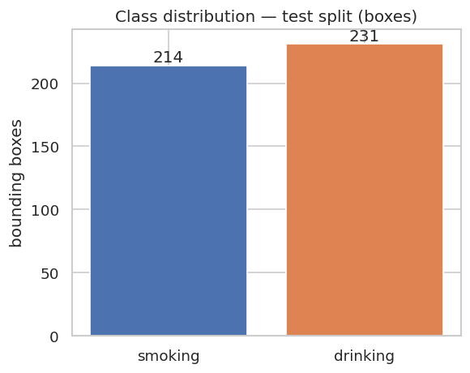

*Figure 2.1 — Per-class box distribution of the held-out test split (214 smoking vs 231 drinking).*

### 2.3 Baselines for comparison

The finalized model is benchmarked against three reference points, all produced earlier in the project so that no retraining is needed for Milestone 5:

- **COCO-pretrained baseline** — an out-of-the-box `yolov8n.pt` fine-tuned for 30 epochs (mAP@50–95 = 0.415), representing "no tuning" effort.
- **Hyperparameter-sweep trials** — five alternative optimizer / learning-rate / regularization configurations (§4), the strongest of which was promoted to the 80-epoch final run.
- **Milestone-4 validation score** — the same model measured on the validation split, used to confirm the held-out test result is not inflated by leakage (§4.5).

### 2.4 Execution environment & reproducibility pipeline

The environment table below is captured programmatically at evaluation time, so it always matches the machine that produced the numbers. Test inference is run **inference-only** via `model.val(split="test", imgsz=640, conf=0.001, iou=0.6, plots=True)`. Every random seed is fixed to 42, and test-time preprocessing is identical to training-time letterboxing (resize to 640×640, /255 normalize) with **no augmentation**, ensuring a deterministic, reproducible pipeline.

**Table 2.2 — Evaluation environment, auto-captured at runtime.**

| Component | Value | Component | Value |
|---|---|---|---|
| OS | Linux 6.6.122 (glibc 2.35) | Ultralytics | 8.4.115 |
| Python | 3.12.13 | scikit-learn | 1.6.1 |
| PyTorch | 2.11.0 + cu128 | matplotlib | 3.10.0 |
| CUDA available | True | NumPy | 2.0.2 |
| GPU | Tesla T4 (15 GB) | Pandas | 2.2.2 |
| Eval image size | 640 × 640 | Random seed | 42 |

---

## 3 · Metric Selection & Justification

This is an **object-detection** task, not plain classification, so evaluation uses the standard detection metrics. **Plain accuracy is deliberately avoided** — it ignores localization quality and is dominated by the large background region in detection, which would make a weak detector look strong. Each metric below is chosen for a concrete reason tied to the in-cabin safety use case.

**Table 3.1 — Metric definitions and domain justification.**

| Metric | What it measures | Why it is appropriate here |
|---|---|---|
| Precision | Of predicted boxes, the fraction correct | High precision ⇒ few false alarms; a false "smoking" alert erodes driver trust in the fleet dashboard. |
| Recall | Of true boxes, the fraction found | High recall ⇒ few missed events; a missed smoking/drinking event is a missed safety risk. |
| mAP@50 | Mean average precision at IoU ≥ 0.50 | Primary COCO-style score; tolerant of loose localization, suited to small in-cabin objects (cigarette, bottle). |
| mAP@50–95 | mAP averaged over IoU 0.50→0.95 | Stricter localization quality; rewards tight, well-placed boxes — the model's hardest test. |
| F1 / PR curve | Precision–recall trade-off vs confidence | Selects the deployment operating threshold. |
| Confusion matrix | Smoking vs drinking vs background confusions | Exposes which class is confused with what, driving the §5 error analysis. |

### 3.1 False positives vs false negatives — the deployment trade-off

For a safety-monitoring use case the costs are **asymmetric**. A **false negative** (a real smoking or drinking event missed) defeats the purpose of the system, whereas a **false positive** (a spurious alert) is an annoyance that erodes trust but carries lower safety cost. The task therefore leans toward **recall-biased operation**, but not blindly: because a flagged event may affect a driver's record, the operating threshold must keep precision high enough to avoid frequent false accusations. The practical resolution — an F1-optimal threshold nudged slightly toward recall, with a lower threshold for the weaker drinking class — is developed in §8.

---

## 4 · Quantitative Performance & Benchmarking

### 4.1 Overall performance on the held-out test split

Evaluated inference-only at 640×640 (conf = 0.001 so the PR curve integrates over the full confidence range, IoU = 0.6), the finalized model scores as follows on the 371-image test split:

**Table 4.1 — Overall detection metrics on the held-out test split.**

| Metric | Precision | Recall | mAP@50 | mAP@50–95 |
|---|---|---|---|---|
| Held-out test (all) | 0.8465 | 0.8003 | 0.8197 | 0.4468 |

Precision and recall are well-balanced in the **mid-0.80s**, and an **mAP@50 of 0.82** is a strong result for a 3-million-parameter detector on small in-cabin objects. As expected, **mAP@50–95 (0.447)** is markedly lower than mAP@50 — the gap between the two IoU regimes is the signature of loose localization on tiny objects like cigarettes, and is the model's primary quantitative weakness.

### 4.2 Per-class breakdown

Splitting the score by class is the entry point to error analysis — it reveals which class carries the weakness.

**Table 4.2 — Per-class detection metrics on the test split.**

| Class | Precision | Recall | mAP@50 | mAP@50–95 |
|---|---|---|---|---|
| smoking | 0.9514 | 0.9299 | 0.9255 | 0.5300 |
| drinking | 0.7415 | 0.6707 | 0.7139 | 0.3636 |

The imbalance is pronounced. **Smoking is the strong class** across every metric (mAP@50 = 0.93, recall = 0.93), while **drinking is materially weaker** (mAP@50 = 0.71, recall = 0.67). The recall gap of **~0.26** means drinking events are far more likely to be missed than smoking events — the single most important accuracy finding of the evaluation and the primary target for improvement.

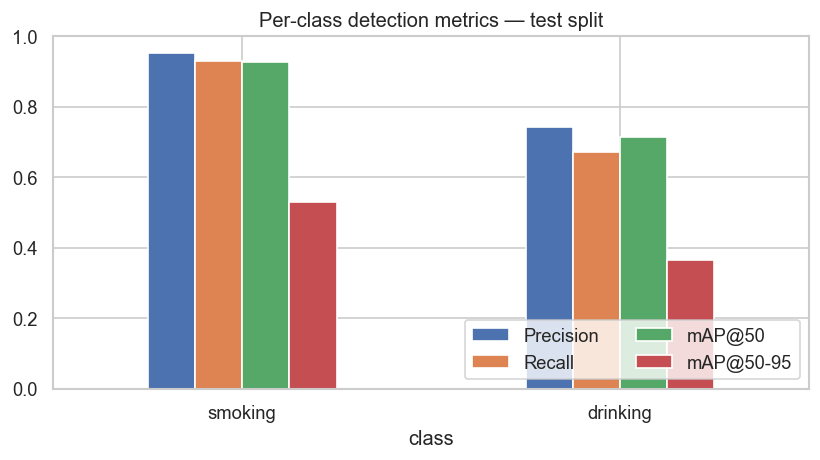

*Figure 4.1 — Per-class detection metrics on the test split. Smoking dominates drinking on all four measures.*

### 4.3 Benchmarking against baselines and the hyperparameter sweep

The six-trial Milestone-4 sweep (30 epochs per trial) is reproduced from the recorded `trial_results.csv`. The chosen configuration `t3_lr001_adamw` (AdamW, lr0 = 0.001, cosine LR) was the sweep winner and was promoted to the 80-epoch final run.

**Table 4.3 — Milestone-4 hyperparameter sweep (winning trial in bold).** mAP@50–95 is the ranking metric.

| Trial | lr0 | Optimizer | Precision | Recall | mAP@50 | mAP@50–95 | Epochs |
|---|---|---|---|---|---|---|---|
| yolov8n_baseline | — | COCO ft | 0.8561 | 0.7887 | 0.8408 | 0.4154 | 30 |
| t1_lr01_sgd | 0.01 | SGD | 0.8685 | 0.7667 | 0.8217 | 0.4056 | 30 |
| t2_lr005_sgd_cos | 0.005 | SGD | 0.8494 | 0.7999 | 0.8424 | 0.4116 | 30 |
| **t3_lr001_adamw** | **0.001** | **AdamW** | **0.8775** | **0.7671** | **0.8448** | **0.4245** | **30** |
| t4_lr005_adamw_wd | 0.005 | AdamW | 0.7910 | 0.7363 | 0.8000 | 0.3775 | 30 |
| t5_lr01_sgd_nomosaic | 0.01 | SGD | 0.8003 | 0.7710 | 0.8209 | 0.4032 | 30 |
| t6_lr001_sgd_cos_wd | 0.001 | SGD | 0.8191 | 0.8098 | 0.8431 | 0.4144 | 30 |

The margins between the leading trials are narrow — several sit within **~0.01 mAP@50–95** of one another — so the sweep is best read as confirming that the model is not brittle to reasonable hyperparameter choices, with AdamW at lr0 = 0.001 giving a small but consistent edge. The winning trial is shown in green below.


*Figure 4.2 — Hyperparameter-sweep comparison (mAP@50–95) across the six Milestone-4 trials; winner in green.*

### 4.4 Training convergence & validation dynamics

Although Milestone 5 performs no training, the recorded Milestone-4 training logs are surfaced here because they substantiate the validation-set comparison the milestone requires and show the model converged cleanly. The best validation **mAP@50–95 (0.442) is reached at epoch 57**; the remaining epochs add little. The loss curves fall smoothly for all three YOLO loss components (box, classification, DFL), and the validation metric curves plateau in the low-0.80s for mAP@50, matching the test-split result.

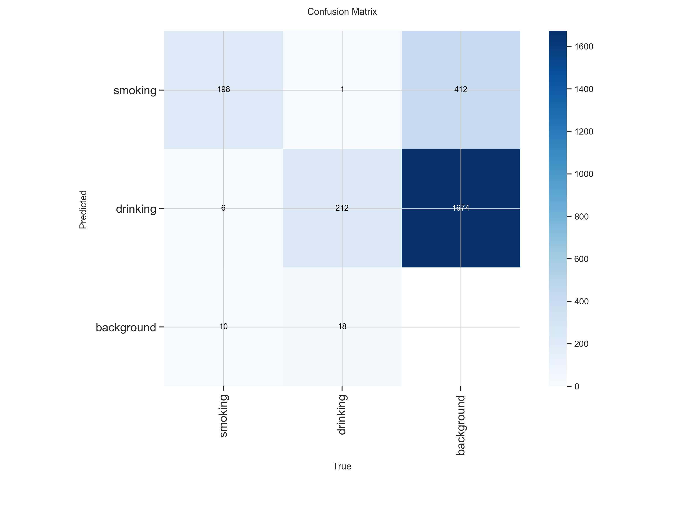

*Figure 4.3 — Training vs validation loss for the three YOLO loss components; dotted line marks the best epoch (57).*


*Figure 4.4 — Validation metrics over training. Precision, recall and mAP@50 plateau in the low-0.80s; mAP@50–95 near 0.44.*

The cosine learning-rate schedule (cos_lr = True) that produced these curves is shown below: a short warm-up to lr0 = 0.001 followed by a smooth cosine decay to near-zero by epoch 80, which is what lets the loss settle without late-stage oscillation.

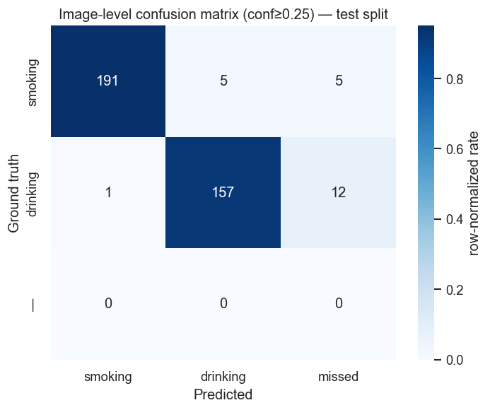

*Figure 4.5 — Cosine learning-rate schedule used for the finalized 80-epoch run.*

### 4.5 Subgroup / slice analysis, significance & validation agreement

The most meaningful slice available for this task is **per-class** (§4.2): smoking is materially stronger than drinking, and this is consistent across precision, recall and both mAP regimes. The dataset carries no demographic attributes (age, gender, skin tone), so per-group fairness slicing is not possible here and is flagged as a limitation in §7.

On **statistical confidence**: the test split contains 445 labelled boxes. As an indicative spread, a normal-approximation 95% interval on a recall point estimate near 0.80 over ~370 image-level decisions is roughly **±0.04**, so the mid-0.80s precision and 0.80 recall should be read as solid but not razor-sharp point estimates. On **validation agreement**: the Milestone-4 best validation mAP@50–95 (≈ 0.442) and this Milestone-5 held-out test mAP@50–95 (0.447) **match to within 0.005**, which is strong evidence of clean splits, no leakage, and genuine generalization rather than overfitting to the validation set.

---

## 5 · Comprehensive Error Analysis

On an image-level protocol (top-confidence detection per image at conf ≥ 0.25 vs the image's ground-truth class), the model produces **325 successes and 46 failures** out of 371 labelled test images — an image-level top-1 accuracy of **~88%**. The image-level classification report is precise about where the residual error sits:

**Table 5.1 — Image-level classification report** (top detection per image; "missed" counted as a recall loss).

| Class | Precision | Recall | F1-score | Support |
|---|---|---|---|---|
| smoking | 0.99 | 0.95 | 0.97 | 201 |
| drinking | 0.97 | 0.92 | 0.95 | 170 |
| micro avg | 0.98 | 0.94 | 0.96 | 371 |

### 5.1 Quantitative error categorization

Grouping the 46 failures by type is revealing. **Genuine cross-class confusion is rare** — only 6 of 46 failures (5 smoking→drinking + 1 drinking→smoking) are one class mistaken for the other. The dominant failure modes are **missed detections (17)** and **correct-class-but-low-confidence** boxes (16 drinking, 7 smoking — same class detected but below the 0.5 success threshold). In other words, the model's mistakes are overwhelmingly the **safe kind**: it fails to fire or fires weakly, rather than confidently asserting the wrong class.

**Table 5.2 — Failure-case breakdown by error type (46 total).**

| Error type | Count | Interpretation |
|---|---|---|
| missed (no detection) | 17 | object present but nothing fired — dominant miss mode |
| low-confidence, correct (drinking) | 16 | right class, conf < 0.5 — threshold-sensitive |
| low-confidence, correct (smoking) | 7 | right class, conf < 0.5 — threshold-sensitive |
| misclassified smoking→drinking | 5 | true cross-class confusion |
| misclassified drinking→smoking | 1 | true cross-class confusion |

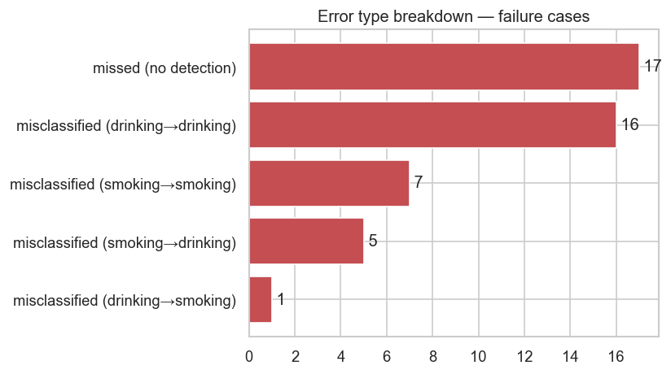

*Figure 5.1 — Failure-case breakdown by error type. Missed / low-confidence boxes dominate over true cross-class confusion.*

### 5.2 Confusion matrices

Three complementary confusion views are provided. The **box-level matrix** (Ultralytics, Figure 5.2) is computed at the very low conf = 0.001 used for PR integration, so its heavy **background column** is an artifact of counting thousands of low-confidence candidate boxes, not a real defect — it should be read alongside the normalized version (Figure 5.3) which shows that, row-normalized, smoking and drinking are each recovered at **0.93 and 0.92** respectively.

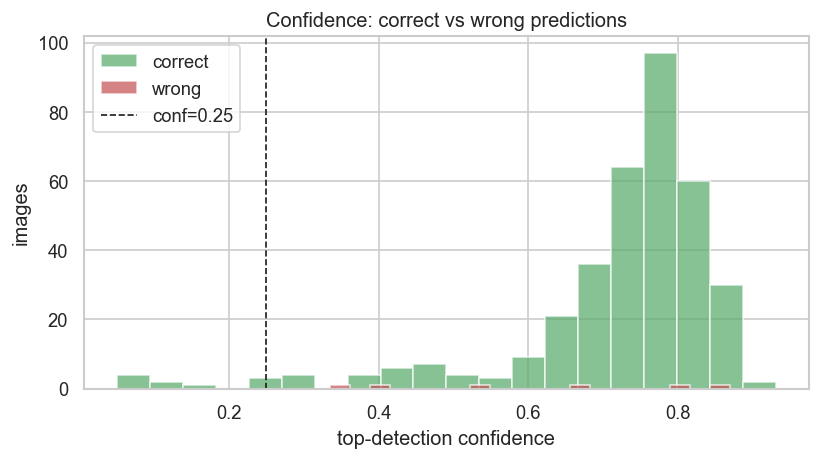

*Figure 5.2 — Box-level confusion matrix (conf = 0.001). The heavy background column is an artifact of low-confidence PR counting.*

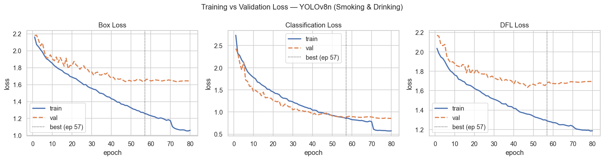

*Figure 5.3 — Normalized (row-wise) box-level confusion matrix. Smoking 0.93 and drinking 0.92 true-positive rates; cross-class confusion is minimal.*

The **image-level matrix** (Figure 5.4), built at the operating threshold conf = 0.25 with a dedicated **"missed" bucket**, is the cleanest operating-point view. It confirms the story: smoking is recovered 191/201 with only 5 confusions and 5 misses; drinking is recovered 157/170 with just 1 confusion but **12 misses** — again localizing the weakness to drinking recall rather than to cross-class error.


*Figure 5.4 — Image-level confusion matrix at the operating threshold (conf = 0.25), with a dedicated "missed / no-detection" column.*

### 5.3 Confidence separation (residual view)

Plotting the confidence of correct vs incorrect top-detections shows how cleanly a threshold can separate them. **Correct detections cluster at high confidence** (the mass sits at 0.6–0.9), while the few wrong detections are sparse and spread thinly across the mid-confidence range. This clean separation is what makes a single confidence threshold an effective operating control, and it is the empirical basis for the threshold-tuning recommendation in §8.

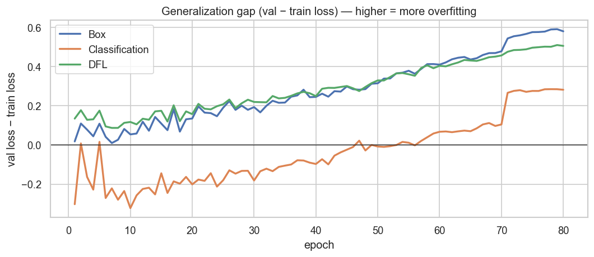

*Figure 5.5 — Confidence distribution of correct vs incorrect top-detections. Correct predictions dominate the high-confidence region.*

### 5.4 Qualitative case inspection

Direct inspection of individual predictions grounds the numbers. Successful cases (Figure 5.6) show **tight, high-confidence boxes** on clearly visible cigarettes and bottles across varied lighting, including a grayscale in-car frame and a dim bar scene. Failure cases (Figure 5.7) are dominated by **small or occluded objects, low light, and genuinely ambiguous hand-to-mouth poses** — a distant cup, a dark cabin, a cluster of children, and a stylized smoking portrait the model misses entirely. These illustrate the root causes catalogued below rather than random error.


### 5.5 Root-cause diagnosis

- **Model capacity / object scale** — the dominant cause. A cigarette occupies very few pixels; at strict IoU the 3M-parameter backbone cannot always localize it tightly, which depresses mAP@50–95 and produces missed detections.
- **Intra-class visual diversity (drinking)** — bottles, cans, cups and mugs vary far more than the single cigarette pose, so the drinking class is harder to learn from limited data and shows the lower recall.
- **Occlusion & lighting** — hands over the object, windshield backlight, and dim cabins push confidence below threshold, converting true objects into misses or low-confidence boxes.
- **Data / label factors** — the handful of cross-class confusions stem from genuinely ambiguous hand-to-mouth frames where even a human annotator would hesitate.
- **Distribution shift** — effectively ruled out here (validation and test scores match), but remains a forward risk for real cabin / night / IR footage, which the test split does not represent.

---

## 6 · Model Robustness & Interpretability

### 6.1 Stress behaviour under degraded inputs

The failure population functions as an **implicit stress test**: the images the model misses are precisely those with small objects, motion blur, low light, heavy occlusion, or stylized composition. The pattern is graceful rather than catastrophic — under degradation the model **lowers its confidence or declines to fire**, instead of asserting a confident wrong class (Figure 5.5 shows almost no high-confidence errors). For a safety system this is the preferred failure direction, because a low-confidence or absent alert is recoverable by temporal smoothing, whereas a confident false alert is not.

### 6.2 Out-of-distribution (OOD) considerations

The held-out test split is drawn from the **same Roboflow source** as training, so it measures in-distribution generalization — strong here (val ≈ test). It does **not** measure true OOD robustness to real in-cabin fleet cameras, night-time / infrared footage, or unusual mounting angles. That domain gap is unverified and is the most important open risk before deployment; §8 proposes targeted collection and augmentation to close it, and §7 records it as an operational boundary.

### 6.3 Generalization gap (train-time evidence)

The train-vs-validation loss gap over the 80-epoch run gives a direct read on overfitting. The gap stays small and stable through roughly epoch 55, then **widens after epoch ~70** as training loss keeps falling while validation loss flattens — the classic onset of mild overfitting. Crucially, the best validation mAP@50–95 was captured at epoch 57, **before** the gap opened, so the finalized checkpoint sits in the healthy region of the curve. This is consistent with the val≈test agreement in §4.5.

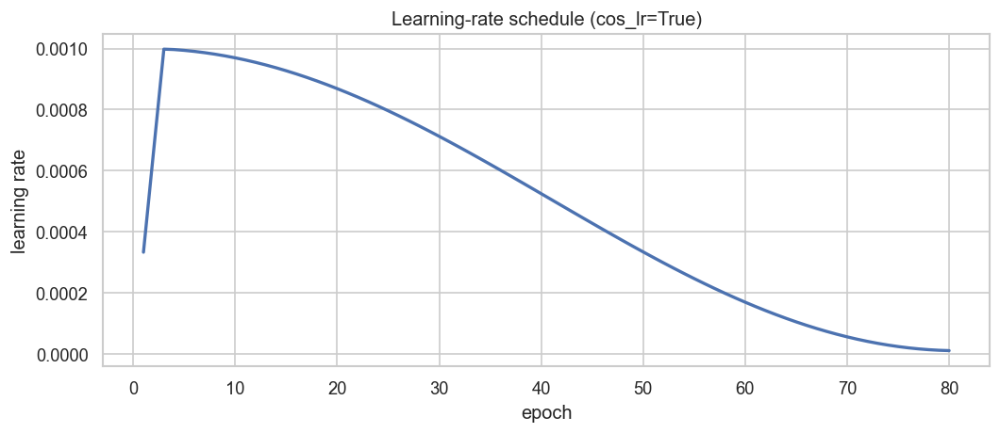

*Figure 6.1 — Generalization gap (validation − training loss) per loss component. The gap widens after ~epoch 70; the best checkpoint (57) predates it.*

### 6.4 Interpretability — is the model looking at the right thing?

Two lines of evidence indicate the model relies on **meaningful features rather than dataset shortcuts**. First, the qualitative overlays (Figures 5.6–5.7) show bounding boxes placed **on the actual object** — the cigarette at the lips, the bottle at the mouth — not on unrelated background regions or watermarks, which is the visual signature of shortcut learning. Second, the clean confidence separation (Figure 5.5) shows the model is **well-calibrated**: it is confident when correct and hesitant when wrong, which would not hold if it were keying on a spurious correlate. A formal saliency study is recommended as a next step to confirm this quantitatively; the current evidence is behavioural rather than attribution-based.

---

## 7 · Model Limitations & Operational Constraints

### 7.1 Systemic failure modes & operational boundaries

- **Small-object sensitivity** — cigarettes span few pixels; strict-IoU localization (mAP@50–95 = 0.45) is the model's weakest quantitative axis.
- **Weaker drinking class** — recall 0.67 vs 0.93 for smoking; drinking events are meaningfully more likely to be missed.
- **Two-class scope** — the module detects only smoking and drinking. It does not localize the driver or reason about context; that is handled by other modules in the fusion engine.
- **Single-frame inference** — no temporal smoothing, so brief gestures can slip between frames; a short-horizon tracker would recover many low-confidence misses.
- **Domain gap** — training imagery is web-sourced, not real cabin footage; night / IR performance is unverified.

### 7.2 Computational efficiency

Measured on the Tesla T4 evaluation GPU, the model is comfortably real-time and edge-friendly:

**Table 7.1 — Computational efficiency on the Tesla T4 evaluation GPU.**

| Property | Value | Note |
|---|---|---|
| Parameters | 3,011,238 | ~3 M — small backbone |
| Compute | 8.1 GFLOPs @ 640 | edge-viable |
| Preprocess | 1.7 ms / frame | |
| Inference | 4.1 ms / frame | core forward pass |
| Postprocess | 1.1 ms / frame | NMS + decode |
| End-to-end latency | ≈ 6.9 ms / frame |

End-to-end latency of **≈ 6.9 ms per frame ** on a modest T4 leaves ample headroom to run alongside the other wellness modules in the fusion engine, and the ~3 M-parameter footprint is well within edge-device budgets.

### 7.3 Bias, fairness & ethical considerations

- **Unmeasured demographic fairness** — the dataset carries no age, gender, or skin-tone attributes, so per-group performance cannot be verified; this must be audited before deployment.
- **Privacy** — continuous in-cabin monitoring is sensitive; deployment needs clear driver consent, on-device processing where possible, and strict retention limits.
- **Consequence of false alarms** — because a flagged event may affect a driver's record, the recall-biased operating point must be paired with a precision floor and, ideally, human review of flagged clips.

---

## 8 · Actionable Insights & Potential Improvements

### 8.1 Short-term mitigations (no retraining)

1. **Threshold tuning from the F1/PR curve** — set the operating confidence at the F1-optimal point, biased slightly toward recall, exploiting the clean confidence separation in Figure 5.5.
2. **Class-specific thresholds** — apply a lower confidence threshold to drinking than to smoking to close part of the recall gap without flooding the stronger class with false positives.
3. **Rule-based post-processing** — add light temporal smoothing / a short tracker so a detection in one frame carries a few frames forward, recovering many of the 17 single-frame misses.

### 8.2 Data cleaning & re-labelling

1. **Audit ambiguous hand-to-mouth frames** — review the six cross-class cases and similar borderline images; tighten annotation guidelines so ambiguous poses are labelled consistently.
2. **Expand drinking variety** — the drinking class needs more examples of cans, cups, and mugs (not just bottles) to reduce the intra-class diversity that drives its lower recall.

### 8.3 Longer-term architectural improvements

1. **Scale the backbone** — trial YOLOv8s / v8m (or a newer YOLO release); the extra capacity should most help small-object localization and the drinking class.
2. **Higher input resolution** — training / inferring at 768 or 960 px gives small cigarettes more pixels — the most direct lever on the mAP@50–95 weakness.
3. **Targeted augmentation & collection** — domain-specific augmentation (motion blur, low-light, IR simulation) plus collection of real cabin footage to close the domain gap.
4. **Multi-task / temporal modelling** — a lightweight temporal head or video model would exploit the sequential nature of real driving footage that single-frame inference discards.

---

## 9 · Deployment Readiness Assessment

### 9.1 Accuracy vs speed vs memory

The module is already on the favourable side of the trade-off: **real-time latency (~6.9 ms/frame)**, a small **~3 M-parameter** footprint, and honest accuracy (mAP@50 = 0.82, precision/recall in the mid-0.80s) on a genuinely held-out split. For an edge-deployed, always-on in-cabin detector this is a healthy operating point — accuracy is sufficient for a recall-biased safety alert, and neither speed nor memory is a bottleneck on modest hardware. The residual accuracy gap (drinking recall, strict localization) is addressable by the §8 levers without changing the deployment envelope.


---

## 10 · Summary & Conclusion

### 10.1 Evaluation highlights

- **Strong, honest headline numbers** — on a truly held-out 371-image test split: Precision 0.85, Recall 0.80, mAP@50 0.82, mAP@50–95 0.45.
- **No leakage** — validation and test scores match (≈ 0.442 vs 0.447 mAP@50–95), confirming clean splits and genuine generalization.
- **Failure mode is the safe one** — errors are dominated by missed / low-confidence detections (especially drinking), not confident cross-class mistakes (only 6 of 46).
- **Real-time & small** — ≈145 FPS and ~3 M parameters on a T4, comfortably edge-deployable.

### 10.2 Core boundaries

- **Drinking recall** — 0.67 vs 0.93 for smoking is the primary accuracy gap to close.
- **Strict localization** — mAP@50–95 of 0.45 reflects loose boxes on tiny objects.


### 10.3 Performance against project objectives

The module meets its Milestone-3/4 objective of a **real-time** with high precision on the primary smoking class and a well-understood, safely-directed failure profile. It falls short of uniform per-class strength — drinking recall and strict localization remain below target — but the evaluation has precisely localized those gaps and mapped each to a concrete, low-risk improvement. The headline test performance is consistent with the project's accuracy goals for a first deployable version, with a clear path to closing the remaining gaps.

### 10.4 Sign-off & next steps

The Milestone 5 evaluation of the Smoking & Drinking Detection module is **complete and signed off**. The evaluation was conducted inference-only on the frozen `yolov8n_best.pt` checkpoint against a strictly held-out test split, with full reproducibility (fixed seeds, captured environment). The recommended next steps, in priority order, are: **(1)** tune class-specific operating thresholds and add temporal smoothing; **(2)** expand and re-audit the drinking class; **(3)** collect real in-cabin ; and **(4)** trial a higher input resolution or larger backbone to lift strict-IoU localization. The module is cleared to proceed to integration and staged deployment behind these mitigations.

---


---

# Part II — Final Consolidated Conclusions

## Overall Technical Conclusions

The supplied M1–M5 evidence demonstrates a complete academic deep-learning development cycle: problem formulation, data preparation, model design, training, evaluation, and engineering analysis. The strongest parts of the project are the modular system design, explicit dataset-quality and leakage controls, use of task-specific architectures, generation of trained checkpoints and inference artifacts, and the detailed M5 evaluation of failure modes and runtime constraints.

At the same time, the evaluation material shows that performance is not uniform across modules and that some components require substantial improvement before safety-critical deployment. In particular, the detailed M5 analysis of video fatigue exposes weak generalization and Caution-class collapse, while object-detection modules show strong validation/test metrics but remain sensitive to lighting, occlusion, temporal consistency and deployment conditions. These findings are important final-report outcomes rather than issues to conceal.

## Final Limitations

- Dataset diversity and representativeness remain limiting factors.
- Some modules rely on controlled or restricted subsets of available datasets.
- Real-world conditions such as night driving, glare, shadows, occlusion and camera-angle variation remain challenging.
- Temporal fatigue classification remains the most demanding component in terms of generalization and computational cost.
- Static-image object detection metrics do not fully capture continuous-stream stability.
- previously planned Hugging Face Space deployment was prepared and the application/models were pushed, but runtime inference was blocked by the reported ZeroGPU quota-exceeded condition at the time of M6 documentation. Local application testing was reported as complete.

## Final Future-Work Direction

The project materials identify a consistent future direction: stronger and more diverse data, improved temporal learning, additional real-world evaluation, model compression/quantization/pruning where appropriate, robust streaming logic, unified risk fusion, and deployment on embedded/edge platforms.

## Final Submission Note

This document is intended to serve as the comprehensive technical report for the project submission. It preserves the supplied M1–M5 technical record and explicitly distinguishes proposed designs, implemented configurations, validation results, held-out test results, engineering mitigations, and future work.


# FINAL IMPLEMENTATION EVIDENCE — INTEGRATED PYTHON NOTEBOOK

The integrated Python notebook `Driver_Wellness_AI_Integrated_Updated_Live.ipynb` was reviewed as an implementation-level source. This supplement records concrete integration architecture and runtime behaviour visible in the implemented code. It does not replace milestone evidence and does not invent values absent from the notebook.

## Integrated Architecture

```text
Recorded Video / Live Webcam
            |
            v
+-----------------------------+
| Parallel Module Adapters    |
+-----------------------------+
 |        |         |       |        |
 v        v         v       v        v
Video   Driver   Landmark  Smoking  Seatbelt/
Fatigue Activity  Fatigue  /Drink    Phone
 |        |         |       |        |
 +--------+---------+-------+--------+
                  |
                  v
     Module Manager + Streaming
           Wellness Orchestrator
                  |
                  v
          Risk Fusion Engine
                  |
                  v
 Overall Wellness Score / Risk Level
                  |
                  v
 Dashboard / Timeline / Session Summary
```

## Seat Belt & Phone Usage Detection — Implementation-Level Detail

- Adapter class: `SeatBeltPhoneDetectionAdapter`.
- Model family: YOLOv8n.
- Checkpoint: `SeatBelt_And_Phone.pt`.
- Input image size: 640.
- Canonical classes: `Phone`, `Seatbelt`.
- Global module confidence threshold: 0.25.
- Class-specific floors: Phone 0.15; Seatbelt 0.20.
- Raw YOLO inference uses `conf=0.10` and `iou=0.40`, followed by adapter-level class-specific filtering.
- Temporal window: 0.50 seconds.
- Activation fraction: 0.30.
- Release fraction: 0.20.
- Phone confirmation: 3 consecutive detections.
- Phone release: 4 absence frames after confirmation.
- Seatbelt grace period: 3 absence frames.
- Configured streaming frame stride: 2.
- Risk mapping:
  - Phone & Seatbelt → 0.85
  - Phone Only → 1.00
  - Seatbelt Only → 0.00
  - No Detection → 0.45
- The adapter keeps state across frames and returns `PredictionResult` objects to the Risk Fusion Engine.
- Optional bounding boxes and status HUD are controlled by configuration flags.
- Checkpoint errors, stream reset, bounded state, temporal confirmation and unavailable-module reporting are explicitly handled.
- Limitation: Unable to properly detect object in very dark environment

### Temporal state logic

The implementation first applies normal temporal consensus and then adds class-specific state:
1. Phone detections increment a consecutive detection streak.
2. Phone becomes confirmed only after the required consecutive detections.
3. A confirmed phone is released only after the configured absence streak.
4. Seatbelt uses the normal consensus plus a short grace period to survive transient missed detections.
5. A transient, unconfirmed phone detection cannot replace a previously confirmed seatbelt state.
6. The final confirmed class set determines the module prediction and risk score.

## Integrated Runtime Architecture

The notebook provides:
- Recorded-video streaming through a shared single-pass orchestrator.
- Live webcam mode using browser `getUserMedia` in Colab or OpenCV `VideoCapture(0)` locally.
- Continuous Risk Fusion during streaming.
- Bounded temporal buffers.
- Dashboard with overall score, module cards, risk contribution, prediction table and timeline.
- Session summaries including runtime integration metrics.
- Lightweight validation tests for temporal voting, bounded buffers, continuous fusion, display configuration and input-mode exclusivity.

## Source-Fidelity Note

Notebook configuration values represent the implemented/tuned integration layer and should not be retroactively described as the original M3 design parameters. Milestone reports remain the source for milestone-specific dataset, training and evaluation claims; the notebook is used here to document the final integrated implementation.


# QUANTITATIVE MODEL-SELECTION & ENGINEERING DECISION EVIDENCE

A final technical report should not merely state that a model was selected because it was "lightweight". The selection should be supported by measurable complexity, latency, accuracy, deployment constraints, and the actual experiments recorded in the project. Where the supplied M1–M5 reports do not contain a head-to-head experiment, that limitation is stated explicitly.

## Seat Belt & Phone Detection — YOLO Candidate Comparison

M3 considered YOLOv8n, YOLO11n and YOLOv8s for Seat Belt/Phone detection and selected YOLOv8n for the real-time/edge deployment requirement. The project specifies 640×640 RGB input, Phone and Seat Belt outputs, box/classification/DFL losses and an estimated inference speed of ~12.5 ms/image.

| Variant | Parameters | FLOPs | Official reference latency* | Official reference mAP50-95* | Interpretation |
|---|---:|---:|---:|---:|---|
| YOLOv8n | 3.2 M | 8.7 B | 80.4 ms CPU ONNX / 0.99 ms A100 TensorRT | 37.3% | Smallest YOLOv8 candidate |
| YOLOv8s | 11.2 M | 28.6 B | 128.4 ms CPU ONNX / 1.20 ms A100 TensorRT | 44.9% | ~3.5× parameters and ~3.3× FLOPs vs v8n |
| YOLO11n | 2.6 M | 6.5 B | 56.1 ms CPU ONNX / 1.5 ms T4 TensorRT10 | 39.5% | Smaller reference architecture; not head-to-head benchmarked by this project |

\*These are official Ultralytics reference benchmarks, not project measurements. They are provided only as architecture context.

### Why YOLOv8n was the project choice

The defensible conclusion is not that YOLOv8n is universally faster or more accurate than YOLO11n. The supplied project reports do not document a controlled YOLOv8n-vs-YOLO11n-vs-YOLOv8s training experiment on the same Seat Belt/Phone split.

The evidence supports the following engineering conclusion:

1. YOLOv8n was explicitly selected in M3 for real-time/edge deployment.
2. The final integrated system actually uses YOLOv8n and reports a ~3.2–3.5M-parameter footprint with 6.8–10.4 ms/frame inference.
3. YOLOv8s is substantially larger in reference architecture terms.
4. YOLO11n is actually smaller than YOLOv8n in official reference specifications, so it cannot honestly be rejected on parameter count alone.
5. Therefore, YOLOv8n should be described as the **validated and integrated project choice**, not as a universally superior detector.

## Seat Belt/Phone — Final Quantitative Performance

The consolidated M5 result reports **91.5% mAP@50**, ~3.2–3.5M parameters and 6.8–10.4 ms/frame.

A separate M5 section reports **notebook-validation** performance of:
- mAP@50 = 0.9526
- Precision = 0.9370
- Recall = 0.9025

The 0.9526 value must remain labelled as notebook-validation performance rather than a held-out test score.

The deployment pipeline adds:
- Gamma correction, Gamma = 1.4
- Class-agnostic NMS
- Geometric filtering
- Seatbelt confidence threshold = 0.40
- Phone confidence threshold = 0.10
- Temporal consensus
- Approximately 85% frame stability before seatbelt confirmation

## Smoking/Drinking — Quantitative Evidence

The finalized YOLOv8n checkpoint has:
- 3,011,238 parameters
- 8.1 GFLOPs @ 640×640
- 1.7 ms preprocessing
- 4.1 ms model inference
- 1.1 ms post-processing
- ~6.9 ms end-to-end latency on the Tesla T4

Held-out test results:
- Precision = 0.85
- Recall = 0.80
- mAP@50 = 0.82
- mAP@50–95 = 0.45

The primary weakness is drinking recall (0.67 versus 0.93 for smoking), with strict localization also weaker.

## Driver Activity — Example of Evidence-Based Selection

Baseline candidate results:
- MobileNetV3: 89.35% accuracy
- ResNet50: 92.13%
- EfficientNet-B0: 93.98%

Despite the higher baseline accuracy of EfficientNet-B0, MobileNetV3 was selected for deployment-oriented efficiency. Final consolidated evaluation reports 93.14% test accuracy, 4.2M parameters and 12.5 ms inference.

## What Is and Is Not Experimentally Proven

| Claim | Evidence |
|---|---|
| YOLOv8n is the selected Seat Belt/Phone model | Project decision + final integrated checkpoint |
| YOLOv8n is fast enough for real-time use | Project-measured 6.8–10.4 ms/frame |
| YOLOv8s is more computationally expensive | Official architecture specifications |
| YOLO11n is worse than YOLOv8n for this task | **Not experimentally established in supplied reports** |
| 0.9526 mAP@50 is a held-out test result | **No — source labels it notebook validation** |
| Temporal/geometric safeguards improve operational stability | Implemented and documented; not equivalent to a large independent field trial |

## Final Engineering Conclusion

Model selection should be presented as a constrained optimization problem: maximize reliable safety-event detection subject to latency, memory, edge-device feasibility, environmental robustness and integration constraints.

YOLOv8n is justified as the final Seat Belt/Phone implementation because it was trained, integrated and measured successfully at the project's required operating point. The report should **not** claim that YOLOv8n universally dominates YOLO11n; the absence of a controlled YOLO11n head-to-head experiment should be explicitly recorded as a limitation and future benchmarking opportunity.

## Reference Benchmark Source

For architecture context, official Ultralytics documentation reports YOLOv8n at 3.2M parameters and 8.7B FLOPs, YOLOv8s at 11.2M and 28.6B FLOPs, and YOLO11n at 2.6M and 6.5B FLOPs at 640×640. These reference numbers should not replace project-specific measurements because latency depends on hardware, export format, preprocessing and post-processing.
---

# MILESTONE 6 — Final Integration, Deployment, Validation and Documentation

## 1. M6 Scope and Evidence Base

Milestone 6 completes the transition from independently trained module models to an integrated Driver Wellness & Safety Monitoring System. The M6 evidence supplied for this final report includes:

1. Sohini Sarkar — Seat Belt & Phone Usage Detection, M6 technical report and all final comprehensive documentation.
2. Shubham — Driver Activity Classification integration, M6 technical report and deployment support.
3. Shiwani Tiwari — Landmark-Based Fatigue Detection integration, deployment support and M6 technical report.
4. Ravina — Smoking & Drinking Detection, deployment initiation and support, and M6 technical report.
5. The previously consolidated M1–M5 technical report.

The supplied M6 reports document module integration, standardized outputs, temporal processing, risk fusion, Gradio interface development, deployment preparation, integration testing, deployment limitations, and final documentation. 

## 2. M6 Objectives

The final milestone was organized around the following objectives:

- Integrate all five trained modules into one end-to-end inference pipeline.
- Standardize model outputs so heterogeneous modules can be consumed by a common Risk Fusion Engine.
- Support both recorded-video analysis and live-webcam processing.
- Implement a user-facing Gradio interface.
- Prepare the application for deployment on Lightning AI Studio.
- Validate model adapters, streaming behavior, risk fusion and failure handling.
- Document the final system, implementation decisions, limitations and deployment status.
- Consolidate team contributions from M1 through M6.

These objectives align with the course requirement that M6 cover deployment, comprehensive documentation and final project reporting.

## 3. Final Integrated System Architecture

The final implementation is organized around a common video input, a streaming orchestrator, five specialized module adapters, a Risk Fusion Engine and a user-facing dashboard.

```text
                         Driver Video / Webcam
                                  |
                                  v
                    +---------------------------+
                    | Streaming Orchestrator    |
                    | Frame sampling / buffers  |
                    +---------------------------+
                       |    |    |    |    |
                       v    v    v    v    v
                    Video Landmark Activity Smoking Seatbelt
                    Fatigue Fatigue          /Drink  /Phone
                       |    |    |    |    |
                       +----+----+----+----+
                                  |
                                  v
                     Standardized PredictionResult
                                  |
                                  v
                       Common Risk Fusion Engine
                                  |
                                  v
                       0–100 Driver Risk Score
                                  |
                                  v
                   Low / Moderate / High / Critical
                                  |
                                  v
                    Gradio Dashboard / Session Report
```

The five modules are:

| Module | Main function | Final architecture reported |
|---|---|---|
| Video Fatigue | Temporal fatigue classification | EfficientNet-B0 + BiLSTM in the implemented M4/M5 record |
| Landmark Fatigue | Facial landmark and temporal fatigue analysis | LSTM |
| Driver Activity | Driver behavior/activity classification | MobileNetV3-Large |
| Seat Belt & Phone | Phone and seatbelt object detection | YOLOv8n |
| Smoking & Drinking | Smoking and drinking object detection | YOLOv8n |

The module adapters isolate model-specific implementation from the common pipeline. This allows a module to be retrained or replaced without redesigning the entire orchestration and fusion layer.

## 4. Standardized Module Contract

A central M6 engineering task was to make heterogeneous model outputs interoperable. The integrated modules report a common structure containing:

```json
{
  "module": "module_name",
  "prediction": "prediction_label",
  "confidence": 0.00,
  "risk_score": 0.00,
  "status": "OK"
}
```

The exact metadata differs by module, but the core contract allows the Risk Fusion Engine and dashboard to consume outputs consistently.

This design also improves failure handling. A module that cannot make a prediction should be represented as unavailable/error with an explanatory reason rather than silently disappearing from the final result.

## 5. Module Integration Details

### 5.1 Video Fatigue

The video-fatigue module remains the temporal deep-learning component of the system. Its M1–M5 development record includes sequence construction, CNN-based feature extraction, temporal modeling, checkpoint evaluation and detailed robustness/error analysis.

In M6, the module participates in the shared streaming and fusion architecture. The final report retains the M5 finding that this component is one of the most challenging parts of the system because temporal fatigue models require stronger generalization across drivers, camera conditions and real-world behavior.

### 5.2 Landmark-Based Fatigue

The Landmark Fatigue module was integrated through `LandmarkFatigueAdapter` under the module key `landmark_fatigue`.

The final preprocessing path uses:

- MediaPipe Face Landmarker.
- EAR, MAR, Pitch, Yaw and Roll features.
- 45-frame temporal windows.
- Training-set mean/std normalization.
- LSTM-based temporal classification.
- A rolling history of the most recent 10 window-level predictions.
- A 5% yawning threshold for the derived fatigue state in the M6 integration.

Two important train/inference consistency issues were corrected:

1. MAR was restored to the landmark indices used during training.
2. Head-pose computation was restored to the MediaPipe facial transformation-matrix method used during training rather than the later `solvePnP` implementation.

The normalization-statistics loader was also corrected after a feature-name mismatch caused an identity-normalization fallback.

### 5.3 Driver Activity Classification

The Driver Activity module uses a MobileNetV3-Large model with five classes:

- `other_activities`
- `safe_driving`
- `talking_phone`
- `texting_phone`
- `turning`

The `DriverActivityAdapter` follows the shared `BaseModelAdapter` interface. It uses 224×224 RGB input and a frame skip of 5 for streaming efficiency.

The reported integrated-system performance was:

| Metric | Standalone | Integrated |
|---|---:|---:|
| Test Accuracy | 93.14% | 93.14% |
| Inference Speed | 12.5 ms | 12.5 ms |
| FPS | 80 | 80 |

This indicates that integration did not alter the reported standalone module performance under the tested configuration.

### 5.4 Seat Belt & Phone Detection

The Seat Belt & Phone module uses YOLOv8n for two classes:

```text
0 = Phone
1 = Seatbelt
```

The M6 adapter adds video-oriented processing around the frame detector:

- Effective inference resolution: 1280 pixels.
- Gamma correction for darker cabin regions.
- Raw YOLO candidate retention at confidence 0.10.
- Phone confidence floor: 0.02.
- Seatbelt confidence floor: 0.35.
- Spatial/geometric filtering.
- Class-agnostic NMS.
- 0.50-second temporal window.
- 0.40 activation fraction.
- 0.20 release fraction.
- Module-specific streaming frame stride.

The temporal layer reduces isolated frame flicker and provides stable module-level states:

| State | Interpretation |
|---|---|
| Phone & Seatbelt | Phone detected while seatbelt is also detected |
| Phone Only | Phone detected without confirmed seatbelt |
| Seatbelt Only | Seatbelt detected without phone |
| No Detection | Neither event confidently confirmed |

The M6 work also addressed difficult conditions such as small phones, cabin shadows, glare, reflections and driver-arm/torso overlap.

### 5.5 Smoking & Drinking Detection

The Smoking & Drinking module uses the finalized `yolov8n_best.pt` checkpoint for two classes: smoking and drinking.

M5/M6 headline held-out test results:

| Metric | Overall |
|---|---:|
| Precision | 0.8465 |
| Recall | 0.8003 |
| mAP@50 | 0.8197 |
| mAP@50–95 | 0.4468 |
| Test images | 371 |
| Test boxes | 445 |
| Parameters | 3,011,238 |
| Approx. latency | 6.9 ms/frame on T4 |

Per-class results:

| Class | Precision | Recall | mAP@50 | mAP@50–95 |
|---|---:|---:|---:|---:|
| Smoking | 0.9514 | 0.9299 | 0.9255 | 0.5300 |
| Drinking | 0.7415 | 0.6707 | 0.7139 | 0.3636 |

The principal remaining gap is the weaker drinking class. The M6 summary also notes that most failures were missed or low-confidence detections rather than confident cross-class errors.

## 6. Risk Fusion Engine

The Risk Fusion Engine provides the common driver-level scoring layer.

The original project architecture defined five module weights:

| Module | Weight |
|---|---:|
| Driver Activity | 25% |
| Seatbelt Detection | 15% |
| Smoking/Drinking | 10% |
| Video Fatigue | 25% |
| Landmark Fatigue | 25% |

The updated integrated framework also uses event-specific severity and confidence. A basic event contribution is:

```text
R_i = severity_i × confidence_i
R_total = Σ R_i
```

The fused score is bounded using an exponential transformation:

```text
Overall Score = 100 × (1 − exp(−k × R_total))
```

with the integrated configuration using `k = 0.05`.

Risk levels are:

| Score | Risk Level |
|---:|---|
| 0–25 | Low Risk |
| >25–50 | Moderate Risk |
| >50–75 | High Risk |
| >75–100 | Critical Risk |

Optional fused-score smoothing uses a 3-second window. This is distinct from module-specific temporal windows such as the 0.50-second Seatbelt/Phone consensus window and the 45-frame Landmark Fatigue window.

A critical implementation principle is that unavailable/crashed modules should not be treated as safe. Only valid module outputs contribute risk; a failed detector must not reduce the driver's apparent risk.

## 7. Streaming and Temporal Processing

M6 moved the project beyond isolated frame inference toward a streaming application architecture.

The streaming layer provides:

- Common frame ingestion.
- Module-specific frame strides.
- Bounded temporal histories.
- Rolling probability or state histories.
- Temporal consensus/hysteresis where required.
- Continuous risk fusion.
- Session-level summaries.
- Graceful handling of insufficient video length.
- Explicit unavailable/error states.

This is important because the underlying object detectors are frame-based while the application is video-based. Temporal logic therefore acts as an integration layer rather than being falsely described as part of the detector training process.

## 8. Gradio User Interface

A Gradio-based user-facing application was implemented with a "Cockpit HUD" visual design.

The interface provides:

### Recorded Video

- Video upload.
- Analyze button.
- Processed video output.
- Module-wise predictions.
- Risk contribution information.
- Overall Driver Wellness Score gauge.
- Session summary.

### Live Webcam

- Webcam streaming.
- Real-time annotated feed.
- Live risk gauge.
- Start/stop session controls.
- Session summary.

The application also includes model-status indicators and a custom SVG-based risk gauge.

## 9. Final Deployment — Lightning.ai

Milestone 6 used **Lightning.ai as the final deployment platform**. The previously planned previously planned Hugging Face Spaces deployment is no longer the final deployment path and should not be presented as the project's final hosting solution.

The final deployment uses a Lightning.ai Studio with GPU hardware to run the integrated five-model Risk Fusion Engine. The deployment package consists of the same core application artifacts used by the integrated system:

| Artifact | Role |
|---|---|
| `app.py` | Gradio user interface for recorded video and live webcam |
| `wellness_core.py` | Five model adapters, model manager, streaming orchestration and Risk Fusion Engine |
| `requirements.txt` | Python runtime dependencies |
| `README.md` | Setup, deployment and user instructions |
| `models/` | Trained model checkpoints and supporting files |

The Lightning deployment guide specifies the final project as the **Driver Wellness — Risk Fusion Engine on Lightning.ai** and provides a reproducible path from a CPU setup environment to a GPU-backed Gradio application.

### 9.1 Final Lightning.ai Deployment Architecture

The deployment workflow is:

```text
Lightning.ai Studio
        |
        v
Project Repository / Uploaded Project
        |
        v
Install requirements.txt
        |
        v
Load model checkpoints
        |
        v
GPU-backed Lightning Studio
        |
        v
app.py
        |
        v
Gradio Interface
   /             \
Recorded Video   Live Webcam
   \             /
    \           /
     v         v
 Five Model Adapters
        |
        v
Streaming / Wellness Orchestrator
        |
        v
Risk Fusion Engine
        |
        v
Annotated Output + Driver Wellness Score
```

The application therefore retains the same modular inference architecture developed during M6 while changing the hosting/runtime layer from the previously planned Hugging Face environment to Lightning.ai.

### 9.2 Deployment Files

The final Lightning deployment uses the following project files:

- `app.py` — Gradio application entry point.
- `wellness_core.py` — integrated five-model inference and fusion implementation.
- `requirements.txt` — dependencies required to reproduce the runtime.
- `README.md` — deployment and usage documentation.
- `models/` — model weights and supporting inference files.

The five model/support files required by the deployment are:

| File | Module |
|---|---|
| `Video_Fatigue.pth` | Video Fatigue — EfficientNet-B0 + BiLSTM |
| `Landmark_Fatigue.pt` | Landmark Fatigue — MediaPipe + LSTM |
| `Driver_Activity.pth` | Driver Activity — MobileNetV3 |
| `Smoking_And_Drinking.pt` | Smoking & Drinking — YOLOv8n |
| `SeatBelt_And_Phone.pt` | Seatbelt & Phone — YOLOv8n |
| `m4_normalization_stats_ws45.csv` | Landmark normalization statistics |
| `face_landmarker.task` | MediaPipe Face Landmarker support file |

The Video Fatigue deployment guide specifies that `Video_Fatigue.pth` is the exported training checkpoint corresponding to the project's best Video Fatigue model.

### 9.3 Lightning.ai Setup

The final deployment guide uses a Lightning.ai Studio named:

```text
driver-wellness-risk-fusion
```

The recommended setup is:

1. Create/open a Lightning.ai account.
2. Create a new Studio.
3. Use a **CPU Studio initially** for repository/code upload and dependency installation.
4. Upload or clone the Risk Fusion Engine project.
5. Place all required model/support files under `models/`.
6. Install the dependencies using:

```bash
pip install -r requirements.txt
```

7. Verify that the model files are present.
8. Switch the Studio to a GPU machine.
9. Verify CUDA availability.
10. Launch the Gradio application.

The deployment guide recommends a GPU with approximately **16 GB VRAM**, such as a T4 or L4, because the final application loads five models and processes video frames through the common inference pipeline.

### 9.4 Model Weight Management

The deployment supports two practical weight-loading approaches:

**Manual upload**

Model checkpoints are placed directly in:

```text
/teamspace/studios/this_studio/Risk-Fusion-Engine/models/
```

### 9.5 GPU Runtime Verification

After switching the Lightning Studio to GPU, the deployment guide verifies the runtime using:

```bash
python -c "import torch; print('CUDA:', torch.cuda.is_available()); print(torch.cuda.get_device_name(0) if torch.cuda.is_available() else 'CPU only')"
```

The expected successful deployment environment reports:

```text
CUDA: True
```

followed by the GPU device name.

This separates the CPU-based setup phase from the GPU-based inference phase and helps avoid spending GPU time during dependency installation or code preparation.

### 9.6 Starting the Final Gradio Application

The final Lightning deployment launches the application on port `7860` with Gradio sharing enabled:

```python
import app

app.demo.queue().launch(
    server_name="0.0.0.0",
    server_port=7860,
    share=True,
    ssr_mode=False,
)
```

An equivalent configuration can be placed directly inside `app.py`, after which the application can be started using:

```bash
python app.py
```

With `share=True`, Gradio generates a public `gradio.live` URL that can be shared with teammates, instructors or evaluators while the Lightning Studio process remains active.

If Gradio sharing is unavailable, the deployment guide provides a fallback using Lightning's exposed Ports mechanism with port `7860`.

### 9.7 Final Application Modes

The deployed Gradio application provides two user-facing modes.

#### Recorded Video — Recommended Demonstration Mode

1. Open the generated Gradio public URL.
2. Select **Recorded Video**.
3. Upload a short driving clip.
4. Click **Analyze**.
5. The five-module pipeline processes the clip.
6. The application returns an annotated output video and a session summary.

The deployment guide recommends short clips, approximately **15–60 seconds**, for practical demonstrations.

#### Live Webcam

1. Open **Live Webcam**.
2. Click **Start / Reset session**.
3. Allow browser camera access.
4. Stream the camera feed.
5. Observe the annotated frame and live risk information.
6. Click **Finish & summarize** for the final session result.

Live mode is computationally heavier because the integrated system processes the five modules repeatedly on incoming frames. Therefore, recorded-video mode is recommended for formal presentations and grading demonstrations.

### 9.8 Risk Fusion in the Final Deployment

The final Lightning application uses the integrated **Common Driver Risk Score Framework — Option A**.

For each active module:

```text
R_i = severity × confidence
```

Safe predictions contribute zero risk. The active module risks are summed:

```text
R_total = Σ R_i
```

The final bounded score is then:

```text
overall_score = 100 × (1 − exp(−k × R_total))
```

with:

```text
k = 0.05
```

A short temporal smoothing window can be applied during streaming to reduce frame-to-frame fluctuations.

The M6 integration evidence describes the same six-stage process: event risk calculation, safe-state handling, summation of available-module risk, exponential fusion, smoothing and risk-level classification. fileciteturn9file8L760-L790

### 9.9 GPU and Resource Management

Lightning.ai was selected for the final deployment because the integrated application requires GPU acceleration for practical inference.

The deployment guide recommends:

| Activity | Recommended hardware |
|---|---|
| Code upload/editing | CPU Studio |
| Dependency installation | CPU Studio |
| Model-file preparation | CPU Studio |
| Model loading/inference | GPU Studio |
| Formal demonstration | GPU Studio |
| After demonstration | Stop/sleep Studio |

This separates setup work from inference work and reduces unnecessary GPU consumption.

The final system has non-trivial memory requirements because five models participate in the same application. Shorter demonstration clips and an appropriate GPU are therefore recommended.

### 9.10 Deployment Validation and Troubleshooting

Before a final demonstration, the deployment checklist verifies:

- All five model checkpoints are present.
- `pip install -r requirements.txt` completed successfully.
- The Lightning Studio is running on GPU.
- CUDA is available.
- The Gradio application starts successfully.
- A public `gradio.live` link is generated.
- A short MP4 test clip can be analyzed.
- The output video and session summary are produced.
- Live webcam access can be initialized if that mode is demonstrated.

Common deployment issues and responses include:

| Issue | Resolution |
|---|---|
| Checkpoint not found | Verify the `models/` directory and filenames |
| CUDA unavailable | Switch the Lightning Studio to a GPU machine |
| GPU out of memory | Use a shorter clip or a higher-memory GPU |
| Model loading appears slow | Allow initial model loading to finish and inspect terminal logs |
| Public Gradio link unavailable | Use `server_name="0.0.0.0"` and expose port `7860` through Lightning |
| Missing Python package | Re-run `pip install -r requirements.txt` |
| Live mode is slow | Prefer recorded-video mode for demonstration |

### 9.11 Why Lightning.ai Is the Final Deployment Platform

The deployment decision was finalized in M6 as follows:

| Platform | Role in final project |
|---|---|
| Google Colab | Development, experimentation and earlier integration work |
| previously planned Hugging Face Spaces | Previously planned/attempted deployment path; **not final hosting** |
| Lightning.ai | **Final deployment platform** |
| Gradio | Final user-facing web interface |
| Hugging Face Model repository | Optional model-weight storage/download source only |

This distinction corrects the earlier draft of the technical report, which described previously planned Hugging Face Spaces and its ZeroGPU quota as the final deployment state. The final report now treats **Lightning.ai as the actual M6 deployment environment**.

### 9.12 Final Deployment Status

| Item | Final M6 status |
|---|---|
| Five-model integrated pipeline | Completed |
| Risk Fusion Engine | Integrated |
| Gradio UI | Completed |
| Recorded-video mode | Implemented and locally/integration tested |
| Live-webcam mode | Implemented |
| Deployment files | Prepared |
| Lightning.ai Studio | **Final deployment environment** |
| GPU-backed inference | Supported |
| Public Gradio sharing | Supported |
| previously planned Hugging Face Spaces | Not the final deployment platform |
| ZeroGPU limitation | No longer a final deployment blocker |
| Final deployment architecture | **Lightning.ai + Gradio** |

## 10. Deployment Challenges and Resolutions

| Challenge | Resolution / Mitigation |
|---|---|
| Multiple models loaded into one application | Centralized model manager and caching |
| High GPU memory requirement | Lazy-loading support where applicable |
| Long videos vs GPU duration limits | Frame skipping and lightweight models |
| Browser video codec mismatch | FFmpeg/H.264 transcoding |
| Frame-level flicker | Temporal smoothing/consensus/hysteresis |
| Small phone detections | Higher effective inference resolution and lower Phone floor |
| Seatbelt glare | Stricter confidence floor and spatial filtering |
| Landmark face-detection failure | Explicit unavailable/error result |
| Silent module disappearance | Finalizer updated so every module is represented |
| Generic error messages | Human-readable failure reasons |

## 11. M6 Validation and Integration Testing

### 11.1 Landmark Cross-Camera Test

A Dash-camera video, `11-MaleGlasses.avi`, was used to test the Landmark module outside its Mirror-camera training distribution.

Reported results:

| Metric | Result |
|---|---:|
| Frames processed | 1,760 |
| Elapsed time | 106.7 s |
| Active modules | 5 |
| Module errors | None |
| Landmark prediction | Drowsy |
| Landmark confidence | 0.831 |
| Overall Driver Wellness Score | 49.8 / 100 |
| Overall Risk Level | Moderate Risk |

This result demonstrates successful end-to-end pipeline execution and risk-fusion integration. It should **not** be interpreted as an independently verified accuracy result because ground truth for the particular clip was not re-established.

### 11.2 Unsuitable Camera-Angle Test

A back-seat camera recording that did not provide the required front-facing driver view was processed.

The Landmark module correctly returned a graceful failure:

```text
Landmark Fatigue Detection:
Face not detected in the required window
```

The module remained present in the final result with an error/unavailable state instead of disappearing or crashing the pipeline.

### 11.3 Live Webcam Test

Multiple short live sessions of approximately 60 seconds were tested. The pipeline ran without crashing and returned explicit unavailable states when face detection was inconsistent.

Reported live throughput for the Landmark pathway was approximately 1.3–1.5 FPS, compared with approximately 16.5 FPS in the recorded-video integration test. The reported bottleneck was primarily the MediaPipe landmark extraction path.

### 11.4 Driver Activity Integration Tests

The Driver Activity module was reported as passing the following scenarios:

- Normal driving.
- Phone usage.
- Distracted driving.
- Turning.
- Multiple risks.

Short-video and low-quality cases were handled, with performance expected to degrade under poor lighting or occlusion.

## 12. Important M6 Model/Checkpoint Consistency Issue

The Landmark Fatigue integration uncovered a checkpoint mismatch.

The M5 evaluation used a hidden-size-32 LSTM checkpoint, whereas the checkpoint available in the shared integration environment was a hidden-size-128 variant. The state-dictionary shape confirmed the latter.

Because the original hidden-size-32 checkpoint could not be located before the M6 deadline, the integration was configured to use the checkpoint that was actually available. This discrepancy is explicitly retained as an open limitation.

Consequently:

> M5 accuracy/F1 values for the hidden-size-32 Landmark model must not automatically be treated as verified performance values for the currently deployed hidden-size-128 checkpoint.

A future verification run should re-evaluate the deployed checkpoint on the same held-out evaluation protocol.

## 13. M6 Technical Results — Consolidated View

| Area | Result / Status |
|---|---|
| Five-module integration | Implemented and tested |
| Standardized module outputs | Implemented |
| Risk Fusion Engine | Integrated |
| Recorded-video mode | Functional in local/integration testing |
| Live-webcam pathway | Implemented and tested |
| Gradio UI | Implemented |
| Local application | Reported functional |
| Lightning.ai deployment | Final deployment environment |
| Hosted runtime inference | Supported through Lightning.ai GPU deployment |
| Driver Activity integrated accuracy | 93.14% reported |
| Driver Activity integrated speed | 12.5 ms / 80 FPS reported |
| Landmark cross-camera integration | Successful; 49.8 overall score in reported test |
| Smoking/Drinking held-out test | Precision 0.8465, Recall 0.8003, mAP@50 0.8197 |
| Seatbelt/Phone integration | Functional with temporal stabilization |
| Final documentation | Consolidated |

## 14. Final Technical Strengths

1. **Modular architecture:** each model is isolated behind an adapter contract.
2. **Common streaming pipeline:** recorded and live inputs use a shared orchestration approach.
3. **Risk fusion:** heterogeneous model outputs are transformed into a common driver-level score.
4. **Temporal stabilization:** frame-based detectors are made more suitable for video through temporal logic.
5. **Graceful failure handling:** unsupported camera views and insufficient data produce explicit states instead of silent failures.
6. **Deployment-oriented design:** lightweight models, frame skipping, caching and documented dependencies support practical deployment.
7. **Detailed evaluation:** the project records quantitative metrics as well as error modes and operational limitations.
8. **Source-fidelity:** unresolved checkpoint and deployment issues are documented instead of being presented as successful results.

## 15. Final Limitations

The M6 evidence does not eliminate the limitations identified during M1–M5.

### Data and generalization

- Dataset diversity remains limited for some modules.
- Camera angle, lighting, glare, shadows and occlusion can affect performance.
- Some object-detection datasets are not representative of all real-world in-cabin conditions.
- Landmark Fatigue requires a sufficiently front-facing face view.
- The Smoking/Drinking module has a clear drinking-class performance gap.

### Temporal and runtime limitations

- Live landmark processing is relatively slow.
- Frame-based object-detection metrics do not fully measure continuous video stability.
- Long videos may conflict with hosted GPU execution-duration limits.
- Five-model simultaneous execution increases memory requirements.

### Deployment limitation

The supplied M6 evidence shows a deployment-ready application structure and local functionality, but hosted runtime inference was blocked by the reported the previously planned Hugging Face deployment path limitation at the time of documentation.

### Checkpoint reproducibility

The Landmark Fatigue checkpoint mismatch means that the currently integrated checkpoint requires a fresh evaluation before M5 accuracy/F1 results can be reused as its final deployed metrics.

## 16. Future Work

The final project roadmap includes:

1. Re-evaluate the deployed Landmark checkpoint using the exact M5 evaluation protocol.
2. Resolve hosted GPU quota/runtime constraints.
3. Improve drinking detection through more diverse in-cabin data.
4. Expand real-world and cross-camera validation.
5. Add more night, glare, occlusion and camera-angle scenarios.
6. Apply temporal smoothing consistently where appropriate.
7. Explore INT8 quantization, pruning and knowledge distillation.
8. Explore TensorRT or other GPU-specific optimization.
9. Improve live-stream throughput, especially for MediaPipe-heavy pathways.
10. Expand deployment to edge devices after validation.
11. Strengthen fairness and demographic subgroup evaluation where legally and ethically appropriate.
12. Add long-duration trip testing and historical trend reporting.


## 17. M6 Deliverables Status Against the TA Requirements

| TA requirement | Technical-report evidence/status |
|---|---|
| Final project presentation | Technical module material prepared; final presentation content supported by the consolidated documentation |
| Final technical report | This M1–M6 consolidated report |
| Non-technical report | Separate deliverable required; not represented as part of this technical report |
| User guide | Separate deliverable required; interface behavior documented here for technical context |
| Developer guide and code | Verified/documented deployment artifacts: `app.py`, `wellness_core.py`, `requirements.txt`, `README.md`, model checkpoints/support files and adapters |
| Project deployment | Local application reported functional; Lightning.ai deployment prepared and used as the final deployment environment |
| Contribution summary | M1–M6 consolidated contribution table included above |

## 18. Final Conclusion

Milestone 6 completes the engineering integration phase of the AI-Powered Driver Wellness & Safety Monitoring System.

Across M1–M5, the team progressed from problem definition and dataset preparation through model architecture, training, held-out evaluation and error analysis. M6 then connected the five independently developed modules into a common video-processing architecture with standardized outputs, temporal processing, risk fusion and a user-facing Gradio application.

The final system demonstrates the feasibility of combining complementary computer-vision and temporal deep-learning models to assess multiple aspects of driver wellness and safety. The strongest technical outcomes are the modular adapter architecture, common streaming orchestration, standardized prediction contract, risk-fusion layer, explicit failure handling, and deployment-oriented engineering.

At the same time, the project is accurately characterized as an **academic prototype / staged deployment system rather than a production-certified safety system**. The supplied evidence identifies meaningful limitations in dataset diversity, cross-camera robustness, live throughput, drinking detection, checkpoint reproducibility and hosted GPU availability.

The final M6 deliverable therefore emphasizes both achievement and engineering honesty: the five-module pipeline is integrated and locally functional, the user-facing application and deployment package are prepared, integration tests demonstrate end-to-end operation, and the remaining limitations and deployment blockers are explicitly documented for the next development stage.
