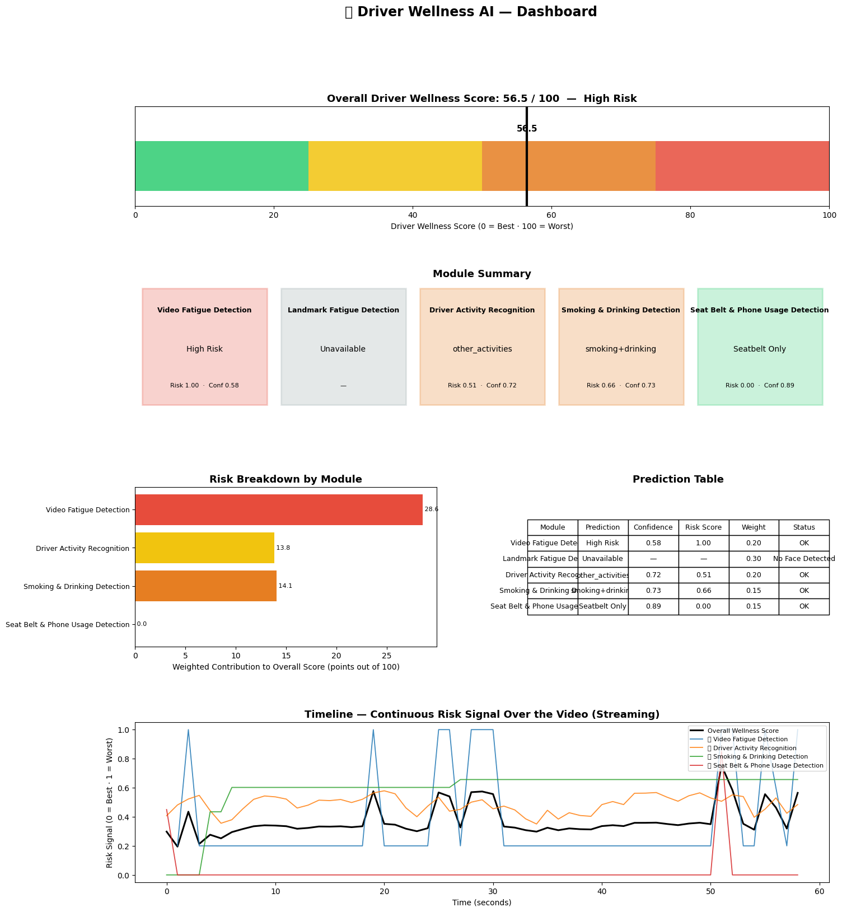

# AI-Powered Driver Wellness and Safety Monitoring System
## User Guide — Pre-M6 Application Version

**Application artifact:** `Driver_Wellness_AI_Integrated_Updated_Live.ipynb`  
**Scope:** Current pre-M6 integrated inference workflow.

> This guide is based directly on the supplied integrated notebook and milestone documentation. It does not claim a separate production web deployment that is not present in the supplied materials.

## 1. Purpose

This guide explains how to operate the current Driver Wellness AI prototype, select an input source, run integrated inference, understand the dashboard, interpret the wellness score and troubleshoot common problems.

The notebook provides **Recorded Video** and **Live Webcam** modes, a shared streaming orchestrator, five model adapters, risk fusion and a Matplotlib dashboard.

## 2. What the Application Does

The application combines:

| Module | User-facing result |
|---|---|
| Video Fatigue Detection | Fatigue-risk prediction |
| Landmark Fatigue Detection | Facial-behaviour / fatigue signal |
| Driver Activity Recognition | Safe driving, texting, talking, turning, other activity |
| Smoking & Drinking Detection | Smoking/drinking detections |
| Seat Belt & Phone Usage Detection | Seat-belt/phone status and combined safety state |

The module outputs are fused into an overall Driver Wellness Score.

## 3. Workflow

1. Open the notebook.
2. Install dependencies.
3. Mount Google Drive.
4. Verify checkpoints.
5. Select `video` or `live`.
6. Select and load/warm up models.
7. Run the shared streaming pipeline.
8. Review annotated output.
9. Review the dashboard.
10. Review the session summary.

## 4. Requirements

### Software

The supplied notebook expects the Colab environment and explicitly installs:

```text
ultralytics>=8.3.0
mediapipe>=0.10.14
psutil
```

The notebook also uses PyTorch, torchvision, OpenCV, NumPy, Pillow, Pandas and Matplotlib.

### Model Checkpoints

```text
Video_Fatigue.pth
Landmark_Fatigue.pt
Driver_Activity.pth
Smoking_And_Drinking.pt
SeatBelt_And_Phone.pt
```

The Model Registry reports each module as **Available** or **Missing**.

### Video Formats

Recorded mode accepts:

```text
.mp4
.avi
.mov
.mkv
.m4v
```

## 5. Starting the Notebook

### Step 1 — Open the notebook

Open `Driver_Wellness_AI_Integrated_Updated_Live.ipynb` in Google Colab or a compatible Jupyter environment.

### Step 2 — Install dependencies

Run the dependency cell near the beginning of the notebook.

### Step 3 — Mount Google Drive

Run the Drive mounting cell and authorize access if prompted.

### Step 4 — Configure the application

The important setting is:

```python
INPUT_MODE = "video"
```

or

```python
INPUT_MODE = "live"
```

The device is automatically selected as CUDA when available, otherwise CPU.

## 6. Verify the Models

Run the Model Registry section.

Confirm:

- Video Fatigue — Available
- Landmark Fatigue — Available
- Driver Activity — Available
- Smoking & Drinking — Available
- Seat Belt & Phone — Available

For a complete integrated run, aim for **5/5 available models**.

## 7. Recorded Video Mode

Set:

```python
INPUT_MODE = "video"
```

Then provide a full video path, for example:

```text
/content/drive/MyDrive/DriverWellness/test_drive.mp4
```

The notebook validates the path and file extension before processing.

Recorded mode uses the same streaming orchestrator as live mode.

## 8. Live Webcam Mode

Set:

```python
INPUT_MODE = "live"
```

### Local machine

The notebook uses:

```python
cv2.VideoCapture(0)
```

Make sure the camera is connected and available.

### Google Colab

The supplied notebook includes browser-camera capture using JavaScript `getUserMedia`.

When prompted:

1. Allow camera access.
2. Start the live session.
3. Use the Stop Live Session button to stop early when available.
4. Otherwise interrupt the running cell or wait for the configured time limit.

## 9. Running Inference

The application uses a shared streaming orchestrator with bounded temporal buffers and continuous risk fusion.

The five modules run through their respective adapters and return standardized results.

## 10. Driver Wellness Score

The current integrated notebook treats the score as a **risk score**:

**0 = best / lowest risk**  
**100 = worst / highest risk**

| Score | Level |
|---:|---|
| 0–25 | Low Risk |
| >25–50 | Moderate Risk |
| >50–75 | High Risk |
| >75–100 | Critical Risk |

Current integrated-notebook fusion weights:

| Module | Weight |
|---|---:|
| Video Fatigue | 0.20 |
| Landmark Fatigue | 0.30 |
| Driver Activity | 0.20 |
| Smoking/Drinking | 0.15 |
| Seatbelt/Phone | 0.15 |

These are the **current runtime settings** and should be treated as the source of truth for this application version.

## 11. Dashboard

The dashboard contains:

1. Overall Wellness Score gauge
2. Module Summary Cards
3. Risk Breakdown
4. Prediction Table
5. Continuous Timeline



**Figure 1. Actual dashboard output captured from the supplied integrated notebook.**

### Overall Score

Shows the 0–100 risk score and risk level.

The supplied example shows:

**56.5 / 100 — High Risk**

### Module Cards

Each card displays prediction, risk score and confidence.

Unavailable modules are explicitly marked as unavailable.

### Risk Breakdown

Shows each module's weighted contribution to the overall score.

### Prediction Table

Contains:

- Module
- Prediction
- Confidence
- Risk Score
- Weight
- Status

### Timeline

Shows overall wellness and module-level risk signals over time.

## 12. Module Output Examples

| Module | Example |
|---|---|
| Video Fatigue | Low Risk / Medium Risk / High Risk |
| Landmark Fatigue | Normal / Talking / Yawning |
| Driver Activity | safe_driving / texting_phone / talking_phone / turning / other_activities |
| Smoking & Drinking | smoking / drinking / combined |
| Seat Belt & Phone | Seatbelt Only / Phone Only / Phone & Seatbelt / No Detection |

## 13. Temporal Behaviour

The application uses temporal logic to reduce unstable frame-level predictions.

Current settings include:

- Video fatigue: 16-frame window
- Landmark fatigue: 45-frame window
- Seatbelt/phone temporal confirmation
- Smoking/drinking temporal consistency
- Driver activity rolling probability history
- Fusion update every 1 second

## 14. Seat-Belt and Phone Usage

The integrated notebook uses separate confidence thresholds and temporal confirmation.

The M5 analysis identified:

- Cabin shadows can hide phones.
- Strong sunlight can wash out seat belts.
- Window reflections can resemble phones.
- Arm/seatbelt geometry can create ambiguous detections.

Inference-time mitigations include:

- Class-specific thresholds
- Non-Maximum Suppression
- Spatial filtering
- Temporal consensus

For demonstrations, use a stable camera, good lighting and a clear view of the driver's torso and hands.

## 15. Recommended Test Examples

| Test | Main capability |
|---|---|
| Normal driving | Baseline |
| Phone use | Activity + Phone detector |
| Phone + no seat belt | Combined safety risk |
| Yawning/fatigue-like clip | Fatigue modules |
| Talking | Activity/landmark distinction |
| Smoking | Smoking detector |
| Drinking | Drinking detector |
| Shadow/glare | Robustness testing |

## 16. Example Scenario

### Recorded trip with a phone-use event

1. Select Recorded Video.
2. Provide an MP4.
3. Run the integrated pipeline.
4. Observe the annotated stream.
5. Check Seat Belt & Phone output.
6. Check Driver Activity output.
7. Check overall wellness score.
8. Inspect the risk breakdown.
9. Inspect the timeline.
10. Review the session summary.

## 17. Session Summary

The notebook automatically prints a session summary after recorded-video or live-webcam processing.

The notebook explicitly distinguishes these runtime/integration metrics from classifier accuracy.

## 18. Troubleshooting

| Problem | Action |
|---|---|
| Model Missing | Check checkpoint path/name and rerun registry |
| Video not found | Verify full path |
| Unsupported format | Use MP4/AVI/MOV/MKV/M4V |
| No Face Detected | Improve face visibility and lighting |
| Video Too Short | Use a longer clip |
| Detection flickers | Improve lighting/camera position and allow temporal logic |
| Webcam unavailable | Check camera permissions and device availability |
| Colab camera fails | Allow browser camera access |
| GPU memory issue | Use GPU / shorter input / lower workload |
| Some modules unavailable | Wait for temporal buffers or fix checkpoint/input issue |

## 19. Important Interpretation Rule

An unavailable module does **not** mean the driver is safe.

The fusion engine excludes unavailable module results and normalizes the remaining available weights. Therefore, always check module status before interpreting the final score.

## 20. Reliability Notes

The system is an academic prototype.

The M5 evaluation found that the video-fatigue module is not suitable as a standalone safety detector at its current performance level. The seat-belt/phone module also remains sensitive to lighting, reflections and continuous-video flicker.

Therefore, the dashboard should be demonstrated as a research/development output, not as a certified safety system.

## 21. Privacy and Responsible Use

- Obtain appropriate consent for driver video.
- Do not use the score as a medical diagnosis.
- Do not substitute the system for attentive driving.
- Do not connect it to vehicle control without a separate safety-certification process.
- Store driver video securely.
- Explain that AI predictions can be wrong.

## 22. Quick Reference

1. Open notebook.
2. Install dependencies.
3. Mount Drive.
4. Verify 5/5 model checkpoints.
5. Set `INPUT_MODE`.
6. Provide video path or allow webcam.
7. Run inference.
8. Review annotated output.
9. Review dashboard.
10. Check module availability.
11. Review session summary.

## 23. Application Architecture — User View

The user interacts with the integrated workflow rather than each model separately.

Each model adapter returns a standardized result containing:

- module
- prediction
- confidence
- risk score
- metadata

The Risk Fusion Engine consumes these results and produces the overall score and risk level.

## 24. Screenshot Note

This guide includes an actual dashboard screenshot extracted from the supplied integrated notebook.

No fake production-web screenshots have been created.

If a dedicated M6 web deployment is created later, add screenshots for:

- Landing page
- Upload control
- Preset examples
- Live camera interface
- Results dashboard
- Error state
- Download/report area

## 25. Current Prototype vs M6 Deployment

| Current pre-M6 | M6 direction |
|---|---|
| Integrated Jupyter/Colab notebook | Dedicated deployed application |
| Video path input | User-friendly upload |
| Live webcam | Stable deployed live/demo interface |
| Matplotlib dashboard | Web/dashboard interface |
| Notebook checkpoint validation | Deployment-ready model packaging |
| Notebook troubleshooting | Dedicated instruction page |
| Academic prototype | Stable user-facing deployment |

## 26. Conclusion

The current Driver Wellness AI application provides one integrated workflow over five trained driver-monitoring modules. It supports recorded video and live webcam input, shared streaming inference, continuous risk fusion and a dashboard exposing overall and module-level risk.

For a pre-M6 demonstration, the recommended workflow is to use a short recorded driver video, verify all five checkpoints, run the integrated pipeline and walk through the dashboard from the overall score to module cards, risk breakdown, prediction table and timeline.

The application should be demonstrated as an academic prototype, with its documented limitations explained alongside the live demonstration.

## Appendix A — Runtime Configuration Summary

| Setting | Value |
|---|---|
| Input modes | `video` / `live` |
| Video fatigue window | 16 frames |
| Landmark window | 45 frames |
| Driver activity input | 224×224 |
| Smoking/drinking input | 640 |
| Seatbelt/phone input | 640 |
| Streaming mode | True |
| Fusion interval | 1.0 s |
| Segment summary interval | 15 s |
| Live duration default | 1 min |
| Fusion weights | 0.20 / 0.30 / 0.20 / 0.15 / 0.15 |
| Risk bands | 0–25 Low; >25–50 Moderate; >50–75 High; >75–100 Critical |


---

# M6 — Final Deployment and User Operation Addendum

> **M6 update:** The existing M1–M5 user guide above is retained. This section adds only the final M6 deployment and operation information supplied for the Lightning.ai deployment.

## M6.1 Final Deployment Platform

The final M6 deployment uses **Lightning.ai** as the deployment platform and **Gradio** as the user-facing web interface.

The earlier pre-M6 workflow used the integrated Jupyter/Colab notebook described above. For M6, the integrated five-model system was packaged as a deployable application.

**Final deployment:**

```text
Lightning.ai Studio
        ↓
Gradio Web Application
        ↓
Recorded Video / Live Webcam
        ↓
Five Model Modules
        ↓
Risk Fusion Engine
        ↓
Annotated Output + Risk/Wellness Results
```

Hugging Face Spaces is **not** the final application hosting platform.

## M6.2 Final Application Files

The final deployment package contains:

| File / Folder | Purpose |
|---|---|
| `app.py` | Gradio user interface and application entry point |
| `wellness_core.py` | Five-model inference, orchestration and Risk Fusion Engine |
| `requirements.txt` | Python runtime dependencies |
| `README.md` | Setup, deployment and usage instructions |
| `models/` | Trained checkpoints and supporting files |

The documented model/support files are:

| File | Module |
|---|---|
| `Video_Fatigue.pth` | Video fatigue |
| `Landmark_Fatigue.pt` | Landmark fatigue |
| `Driver_Activity.pth` | Driver activity |
| `Smoking_And_Drinking.pt` | Smoking/drinking |
| `SeatBelt_And_Phone.pt` | Seat-belt/phone |
| `m4_normalization_stats_ws45.csv` | Landmark normalization statistics |
| `face_landmarker.task` | MediaPipe face model/support file |

## M6.3 Lightning.ai Setup

### Step 1 — Create a Lightning.ai Studio

Create a Lightning.ai Studio for the project.

A CPU Studio can be used for initial package installation and file preparation.

### Step 2 — Add the Project

Clone or upload the project into the Studio.

Example:

```bash
cd /teamspace/studios/this_studio
git clone <project-repository>
cd Risk-Fusion-Engine
```

### Step 3 — Add the Model Files

Place the required model checkpoints and support files in:

```text
Risk-Fusion-Engine/models/
```

Verify:

```bash
ls -lh models/
```

The final application should have the required model files available before starting inference.

### Step 4 — Install Dependencies

```bash
pip install -r requirements.txt
```

### Step 5 — Switch to GPU

The integrated five-model application is intended to run on a GPU-backed Lightning.ai Studio.

Verify CUDA:

```bash
python -c "import torch; print('CUDA:', torch.cuda.is_available())"
```

### Step 6 — Start the Gradio Application

The documented launch configuration is:

```python
app.demo.queue().launch(
    server_name="0.0.0.0",
    server_port=7860,
    share=True,
    ssr_mode=False,
)
```

If `app.py` already contains the launch configuration, it can be started with:

```bash
python app.py
```

### Step 7 — Open the Public Application

When the application starts successfully, the terminal provides a public Gradio URL.

Use that URL for teammate, professor or evaluator demonstrations while the deployment is running.

## M6.4 Using the Final Web Application

### Recorded Video

This is the recommended mode for the final demonstration.

1. Open the public Gradio URL.
2. Open **Recorded Video**.
3. Upload a short driver-facing video.
4. Click **Analyze**.
5. Wait for model inference to complete.
6. Review the annotated output video.
7. Review the overall risk/wellness result.
8. Review individual module outputs.
9. Review the session summary.

A short clip is recommended for demonstration and faster processing.

### Live Webcam

1. Open **Live Webcam**.
2. Click **Start / Reset Session**.
3. Allow browser camera access.
4. Keep the driver reasonably visible.
5. Observe the annotated live output and risk information.
6. Click **Finish & Summarize**.
7. Review the final session summary.

Live mode is computationally heavier because all five modules participate in the integrated workflow. Recorded-video mode is therefore preferred for formal demonstrations.

## M6.5 Final Risk Fusion Application Behaviour

The five model outputs are converted into standardised module results and passed to the Risk Fusion Engine.

Conceptually:

```text
Module prediction
       ↓
Confidence
       ↓
Risk contribution
       ↓
Active module risks combined
       ↓
Overall risk score
       ↓
Temporal smoothing
       ↓
Displayed result
```

The final application provides:

- Annotated video
- Overall risk/wellness score
- Risk level
- Individual module results
- Module contributions
- Session summary

The exact runtime fusion settings described earlier in this guide remain the source of truth for the integrated model logic unless the deployed code specifies otherwise.

## M6.6 Deployment Troubleshooting

| Problem | Action |
|---|---|
| Checkpoint not found | Check `models/` and verify the required files are present |
| `ModuleNotFoundError` | Run `pip install -r requirements.txt` again |
| CUDA unavailable | Confirm the Lightning.ai Studio is running on GPU |
| GPU out of memory | Use a shorter video or a higher-memory GPU if available |
| Model loading appears slow | Allow the initial model-loading stage to finish and inspect terminal logs |
| Public Gradio link unavailable | Confirm `server_name="0.0.0.0"`, port `7860` and `share=True` |
| Application is slow | Prefer a short recorded clip and confirm GPU availability |
| Webcam unavailable | Check browser camera permissions and restart the live session |
| Some model is missing | Verify the checkpoint filename and location under `models/` |

## M6.7 Recommended Final Demonstration

For a stable M6 presentation:

1. Start the Lightning.ai deployment.
2. Confirm the application loads successfully.
3. Open the public Gradio URL.
4. Select **Recorded Video**.
5. Upload a short prepared driver clip.
6. Run **Analyze**.
7. Show the annotated output.
8. Explain the five module results.
9. Explain the Risk Fusion result.
10. Show the session summary.
11. If required, demonstrate the Live Webcam tab separately.

## M6.8 Final Deployment Status

| M6 Component | Status |
|---|---|
| Five-model integration | Completed |
| Risk Fusion Engine | Integrated |
| Gradio application | Implemented |
| Recorded-video workflow | Implemented |
| Live-webcam workflow | Implemented |
| Deployment package | Prepared |
| Final deployment platform | **Lightning.ai** |
| GPU-backed inference | Supported |
| Public Gradio sharing | Supported |
| Hugging Face Spaces | **Not the final hosting platform** |

## M6.9 Final User Guide Note

The original M1–M5 instructions, dashboard interpretation, model behaviour, temporal settings, troubleshooting, reliability notes and responsible-use guidance above remain unchanged.

M6 adds the **final deployed application path** so that the same integrated system can be demonstrated through a user-facing Gradio application on Lightning.ai.

